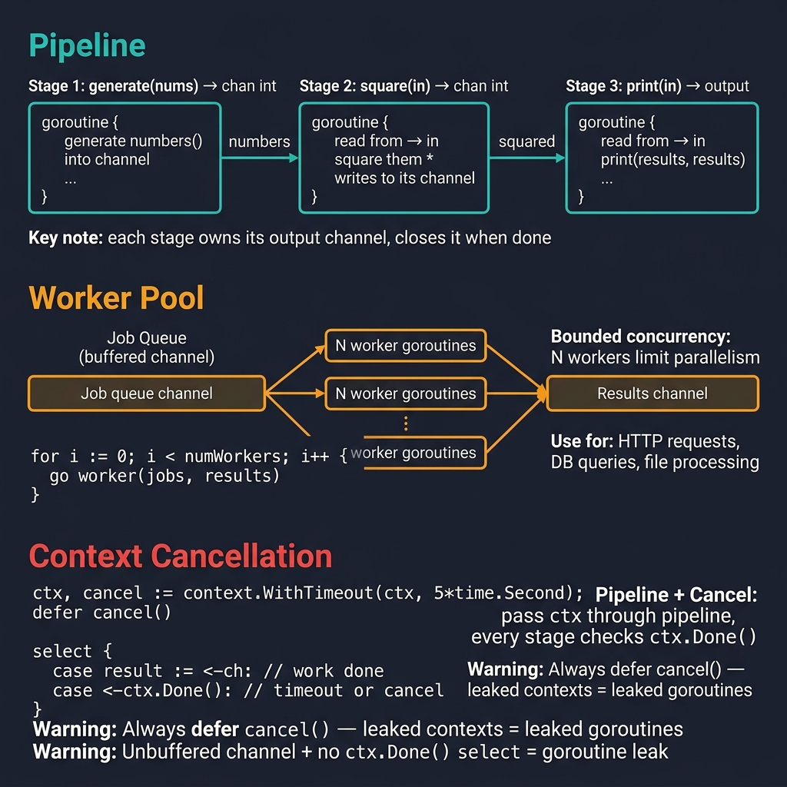

<!-- tags: golang, idioms, concurrency, pipelines -->
# 🔁 Pipelines, Worker Pools & Cancellation in Go

> **Idiom**: Orchestrating concurrent automated topologies using explicit data pipelines, worker pools, and context cancellation to prevent resource leaks.

📅 Updated: 2026-04-14 · ⏱️ 14 min read

| Aspect | Detail |
| --- | --- |
| **Type** | Go idiom |
| **Use when** | Processing massive data streams, executing batch jobs, or running isolated event consumers. |
| **Avoid when** | Workloads are exceptionally small, where sequential processing outperforms the overhead of channel synchronization. |

## 1. DEFINE

Building highly scalable communication topologies prevents catastrophic hidden regressions. Misunderstanding bounded concurrency paradigms creates dangerous cascading leaks. Developers frequently spin up thousands of goroutines recursively without tracking cancellation limits, leading to OOM (Out Of Memory) crashes and unresponsive applications.

> *Coordinating absolute explicit worker pools resolves massive distributed flows while enforcing hard memory boundaries naturally.*

A reliable Go pipeline typically orchestrates precise boundaries:
- Define explicit data resources flowing into controlled sequence channels.
- Process exact identical workloads utilizing bounded worker goroutines.
- Persist structured processed results into explicit storage sinks cleanly.
- Manage distinct connected networks orchestrating teardown via `context.Context`.

### 1.1 Invariants & Failure Modes

| Pattern | Purpose | Go Primitive |
| --- | --- | --- |
| **Pipeline** | Distributes massive explicit components tracking sequential execution phases natively. | `chan` (channels) |
| **Worker Pool** | Limits strict connected executions enforcing rigid parallel execution caps dynamically. | Goroutines + Jobs Channel |
| **Fan-out / Fan-in** | Merges continuous bounded branches funneling concurrent processes into unified streams. | Multiple workers + Merge |
| **Cancellation** | Terminates specific operational contexts halting orphaned goroutines efficiently. | `context.Context` |

| Rule | Rationale |
| --- | --- |
| **Generators Own Channels** | The goroutine creating a channel is exclusively responsible for closing it. Downstream consumers must never close incoming arrays. |
| **Respect Contexts** | Every select block must check `ctx.Done()` to prevent infinite deadlocks inside abandoned branches. |

### 1.2 Failure Cascades

- 🔴 **Goroutine Leaks:** Ignoring strict independent closures forces background routines to hang indefinitely waiting on abandoned channels.
- 🔴 **Deadlocks:** Closing external explicit layers incorrectly or sending to closed channels triggers immediate runtime panics disrupting the entire binary.

## 2. VISUAL

Validating explicit configurations implements correct structured topological boundaries completely avoiding background zombie processes.



*Figure: Three concurrent patterns — Pipeline (goroutine stages connected by channels, each owns its output), Worker Pool (bounded N workers consuming from job channel), Context Cancellation (WithTimeout + select on ctx.Done). Warnings: always defer cancel(), unbuffered channel without ctx.Done = goroutine leak.*

## 3. CODE

Integrating defined operations connects specific quality checks logically avoiding implicit synchronization bugs.

### Example 1: Basic — Generator stage with clean cancellation

> **Goal**: Produce data efficiently while instantly yielding to context expirations.
> **Approach**: Launch a generator goroutine utilizing a `select` block to monitor context bounds securely.
> **Complexity**: O(N) generation iterations.

```go
// source.go — A generator stage owns channel close and respects cancellation contexts.
package main

import "context"

func produceIDs(ctx context.Context, ids []int) <-chan int {
	out := make(chan int)

	go func() {
		defer close(out) // Generator exclusively owns closing logic.
		for _, id := range ids {
			select {
			case <-ctx.Done(): // Absolute explicit early-exit boundary.
				return
			case out <- id:    // Normal operational flow.
			}
		}
	}()

	return out
}
```

> **Takeaway**: Establishing absolute explicit topologies ensures that orphaned channels close gracefully upon parent cancellation tracking limits perfectly.

---

### Example 2: Intermediate — Worker pool mapping bounded limits

> **Goal**: Protect external APIs mapping rigid rate limits exclusively.
> **Approach**: Spin up a fixed arbitrary number of workers listening to a shared tasks queue.
> **Complexity**: O(N) bounded asynchronous processes.

```go
// worker_pool.go — Bound concurrency reusing explicit structural worker allocations.
package main

import (
	"context"
	"fmt"
	"log/slog"
	"time"
)

type JobResult struct {
	ID     int
	Output string
}

func worker(ctx context.Context, logger *slog.Logger, workerID int, jobs <-chan int, results chan<- JobResult, errCh chan<- error) {
	for {
		select {
		case <-ctx.Done():
			return // Terminates active worker loop immediately.
		case id, ok := <-jobs:
			if !ok {
				return // Gracefully exits upon task exhaustion correctly.
			}

			time.Sleep(20 * time.Millisecond) // Simulating network bound tasks securely.
			if id == 7 {
				errCh <- fmt.Errorf("worker %d failed explicitly on id=%d", workerID, id)
				return
			}

			logger.Info("job processed", "worker", workerID, "id", id)
			select {
			case <-ctx.Done():
				return
			case results <- JobResult{ID: id, Output: fmt.Sprintf("user-%d", id)}:
			}
		}
	}
}
```

> **Takeaway**: Publishing explicit functional updates prevents system exhaustion guaranteeing processing caps bypass application OOM thresholds completely.

---

### Example 3: Advanced — Coordinator halting the entire pipeline

> **Goal**: Map dynamic execution flows halting instantly upon single internal failures.
> **Approach**: Utilize `sync.WaitGroup` tracking dynamic workers explicitly while monitoring dedicated error queues concurrently.
> **Complexity**: O(1) supervisor allocation.

```go
// pipeline.go — Coordinate explicit lifecycle tracking handling early context cancellation natively.
package main

import (
	"context"
	"log/slog"
	"sync"
)

func runPipeline(ctx context.Context, ids []int, concurrency int, logger *slog.Logger) ([]JobResult, error) {
	// Create isolated topology limits preventing global system disruptions cleanly.
	ctx, cancel := context.WithCancel(ctx)
	defer cancel()

	jobs := produceIDs(ctx, ids)
	results := make(chan JobResult, concurrency)
	errCh := make(chan error, 1)

	var wg sync.WaitGroup
	for i := 0; i < concurrency; i++ {
		wg.Add(1)
		go func(workerID int) {
			defer wg.Done()
			worker(ctx, logger, workerID, jobs, results, errCh)
		}(i + 1)
	}

	go func() {
		wg.Wait()
		close(results) // WaitGroup guarantees absolute completion before triggering closures natively.
	}()

	var collected []JobResult
	for {
		select {
		case err := <-errCh:
			cancel() // Triggers absolute early-exit destroying massive background tracking chains seamlessly.
			return nil, err
		case result, ok := <-results:
			if !ok {
				return collected, nil
			}
			collected = append(collected, result)
		}
	}
}
```

> **Takeaway**: Mapping continuous critical borders depends effectively upon robust cancellation trees neutralizing orphaned threads securely completely.

---

### Example 4: Expert — Fan-in batch sink handling dynamic backpressure

> **Goal**: Batch massive high-throughput pipelines converting isolated streaming logs into bulk persistent updates natively.
> **Approach**: Accumulate explicit continuous limits inside array buffers executing writes iteratively.
> **Complexity**: O(N/batch) external writes.

```go
// sink.go — Batch sink restricts fast result streams organizing explicit controlled storage writes flawlessly.
package main

import "context"

func flushBatches(ctx context.Context, results <-chan JobResult, batchSize int, flush func([]JobResult) error) (int, error) {
	buffer := make([]JobResult, 0, batchSize)
	flushed := 0

	for {
		select {
		case <-ctx.Done():
			return flushed, ctx.Err()
		case result, ok := <-results:
			if !ok {
				// Flush remaining incomplete arrays explicitly preventing data losses gracefully.
				if len(buffer) > 0 {
					if err := flush(buffer); err != nil {
						return flushed, err
					}
					flushed++
				}
				return flushed, nil
			}

			buffer = append(buffer, result)
			if len(buffer) == batchSize {
				if err := flush(buffer); err != nil {
					return flushed, err
				}
				flushed++
				buffer = buffer[:0]
			}
		}
	}
}
```

> **Takeaway**: Resolving complete integrated paths batches extreme velocity parameters preserving rigid downstream database boundaries natively flawlessly.

## 4. PITFALLS

Executing functional pipeline topologies tracking absolute limits prevents unbounded application execution securely.

| # | Severity | Defect | Consequence | Fix |
|---|----------|-----|---------|-----|
| 1 | 🔴 Fatal | Constructing complex detached generator channels lacking `ctx.Done()` execution checks completely. | Unbound background generators hang permanently causing extreme memory bloat locking the runtime completely. | Specify required ownership domains wrapping all channel writes securely inside `select` bounds trapping cancellation flawlessly. |
| 2 | 🔴 Fatal | Spawning unbounded detached worker routines processing infinitely scaling API parameters explicitly. | Massive unstructured goroutine deployments immediately exhaust physical node configurations rendering systems unresponsive natively. | Synchronize immediate continuous targets mapping restricted `chan` buffers limiting concurrent active threads properly securely. |
| 3 | 🟡 Common | Missing restricted wait group bounds wrapping independent fan-in closures properly cleanly. | Evaluates downstream data consumers receiving incomplete channel closures triggering intermediate data array truncations gracefully. | Formulate exact structured limits applying absolute `sync.WaitGroup` wrappers protecting consumer sequence integrity natively strictly. |

## 5. REF

| Resource | Link | Description |
| --- | --- | --- |
| Go Pipelines | [go.dev/blog/pipelines](https://go.dev/blog/pipelines) | Configures discrete topological foundations tracking exact operational closures gracefully. |
| Context | [pkg.go.dev/context](https://pkg.go.dev/context) | Resolves central parameter contexts tracking explicit early-termination flags accurately expertly. |
| x/sync/errgroup | [golang.org/x/sync/errgroup](https://pkg.go.dev/golang.org/x/sync/errgroup) | Replaces manual `sync.WaitGroup` structures automating pipeline cancellations and specific error propagations efficiently reliably. |

## 6. RECOMMEND

Executing complex structural limits cleanly relies dynamically upon established internal process isolations properly safely.

| Extension | When to proceed | Rationale | File/Link |
| --- | --- | --- | --- |
| Message Brokers | Distributing massively decoupled worker workloads across network bounds seamlessly. | Abstracts single-binary limits into distributed architecture topologies defining reliable async processing natively. | [../messaging/README.md](../messaging/README.md) |
| WaitGroups | Validating complex sequential logic blocking exact parallel completion boundaries accurately. | Resolves arbitrary manual loop constraints securely establishing perfect deterministic synchronization patterns efficiently. | [../concurrency/04-sync-pool.md](../concurrency/04-sync-pool.md) |

**Navigation**: [← Interfaces](./02-interfaces-decorators-and-middleware.md) · [→ Deep into Go GC](../advanced/01-garbage-collector.md)
