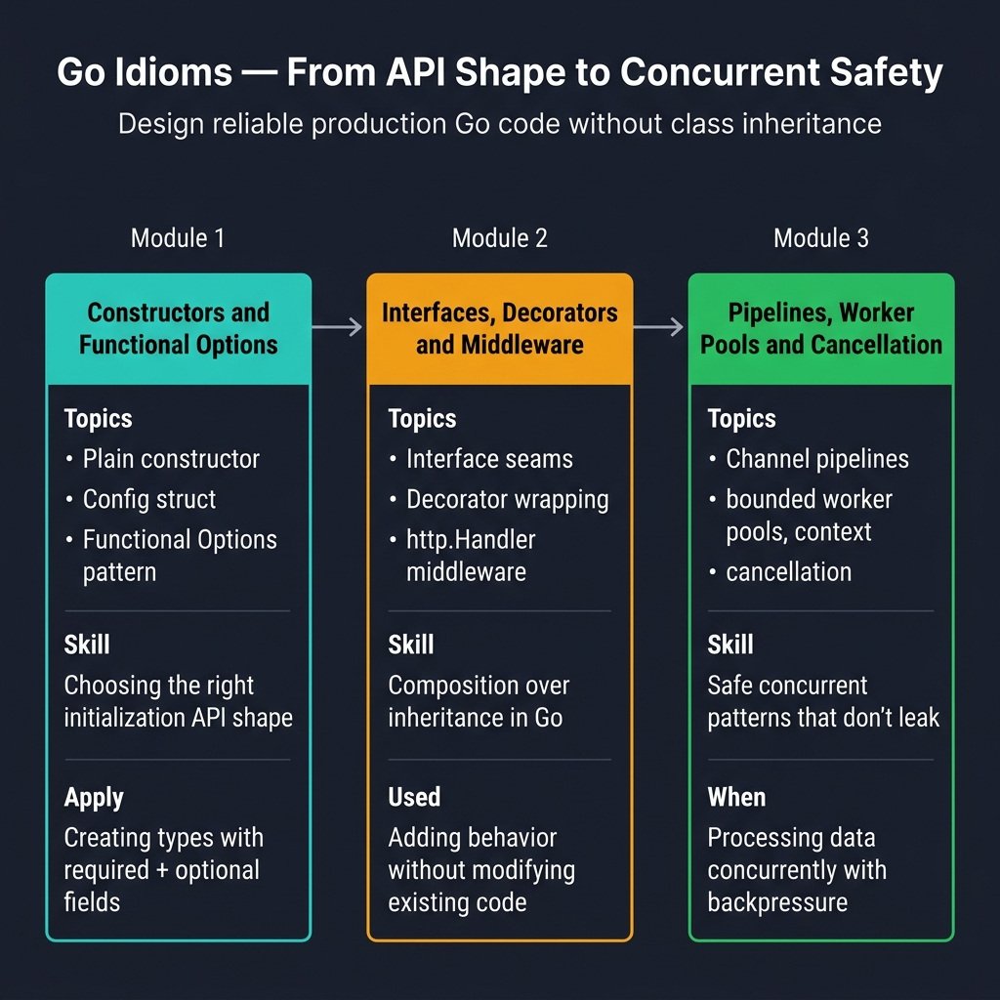

<!-- tags: golang, overview, idioms -->
# Go Idioms & Production Patterns

> Designing reliable architectural frameworks requires resolving complex configurations into explicit readable abstractions.

📅 Updated: 2026-04-14 · ⏱️ 6 min read

## 1. DEFINE

Building complex idiomatic Go components mandates organizing massive independent routines into bounded deterministic boundaries. Resolving detached operational pipelines effectively prevents dangerous system unreliability stemming from unbounded concurrent execution states. 

### 1.1 Signals & Boundaries

- Access specific idiomatic frameworks implementing strict object boundary definitions resolving complex system dependencies.
- Return explicit continuous routines utilizing functional option patterns mapping flexible operational limits.
- Navigate strict exact topologies separating pipeline logic away from global package execution contexts.

### 1.2 Learning Lanes

- Explore specific fundamental boundaries determining optimal interface segregations.
- Evaluate exact interface pipelines mapping behavioral design patterns natively.
- Configure distinct concurrent states executing robust cancellation limits accurately.

## 2. VISUAL

Validating explicit configurations implements correct structured topological boundaries effortlessly across disparate data sources.



*Figure: 3-module learning path — Constructors & Functional Options (API shape) → Interfaces, Decorators & Middleware (composition over inheritance) → Pipelines, Worker Pools & Cancellation (concurrent safety). Design production Go without class inheritance.*

## 3. CODE

Integrating defined operations connects specific components intuitively capturing raw dependency injection constraints gracefully.

### Example 1: Router artifact — select idiom by design pressure

Routing unmanaged interfaces properly requires mapping explicit design problems toward structural Go idiomatic solutions exclusively.

```go
func chooseIdiom(problem string) string {
	switch problem {
	case "constructor", "defaults", "optional-config":
		return "./01-constructors-and-functional-options.md"
	case "interface-seam", "decorator", "middleware", "wrapping":
		return "./02-interfaces-decorators-and-middleware.md"
	case "worker-pool", "pipeline", "cancellation":
		return "./03-pipelines-worker-pools-and-cancellation.md"
	default:
		return "./README.md"
	}
}
```

Establishing complex targeted workflows mapping functional boundaries ensures transparent system stability exclusively.

## 4. PITFALLS

Evaluating fundamental property limits requires identifying architectural leaks preceding severe structural degradation limits.

| # | Severity | Defect | Consequence | Fix |
|---|----------|-----|---------|-----|
| 1 | 🔴 Fatal | Constructing complex initializations lacking specific functional options. | Inflates rigid object structures causing extreme constructor bloat completely. | Specify required ownership domains utilizing flexible functional closures exclusively. |
| 2 | 🟡 Common | Missing restricted structural interface dependencies. | Couples distinct layers cementing massive unmaintainable architecture constraints rigidly. | Formulate exact structured limits applying minimal interface extraction directly. |
| 3 | 🟡 Common | Implementing unbounded continuous looping pipelines indiscriminately. | Leaks background resources draining available hardware capacities entirely. | Restrict detached isolated domains passing explicit context cancellation boundaries. |

## 5. REF

| Resource | Link | Description |
| --- | --- | --- |
| Effective Go | [go.dev/doc/effective_go](https://go.dev/doc/effective_go) | Analyzes specific idiomatic components reliably detailing native formatting expectations definitively. |
| CodeReviewComments | [go.dev/wiki/CodeReviewComments](https://go.dev/wiki/CodeReviewComments) | Reviews complex parameter sets effectively evaluating standard language conventions strictly. |
| Package Names | [go.dev/blog/package-names](https://go.dev/blog/package-names) | Explains distinct module behaviors assigning explicit namespace limits elegantly. |

## 6. RECOMMEND

Executing specific parameters dynamically requires parsing explicit module tracking constraints intelligently.

| Extension | When to read next | Rationale | File/Link |
| --- | --- | --- | --- |
| Constructors | Configuring comprehensive structured setups scaling rigid parameter sets. | Locks the required endpoints configuring optional internal struct tracking limits precisely. | [01-constructors-and-functional-options.md](./01-constructors-and-functional-options.md) |
| Interfaces | Securing explicitly defined protocols separating domain constraints. | Executes strict functional boundaries enforcing modular testing layers natively. | [02-interfaces-decorators-and-middleware.md](./02-interfaces-decorators-and-middleware.md) |
| Pipelines | Formulating strict concurrent topologies executing vast asynchronous workflows. | Distributes massive independent queries tracking explicit parallel boundaries safely. | [03-pipelines-worker-pools-and-cancellation.md](./03-pipelines-worker-pools-and-cancellation.md) |

**Navigation**: [← Fundamental Built-ins](../fundamental/built-in/README.md) · [→ Constructors](./01-constructors-and-functional-options.md)
