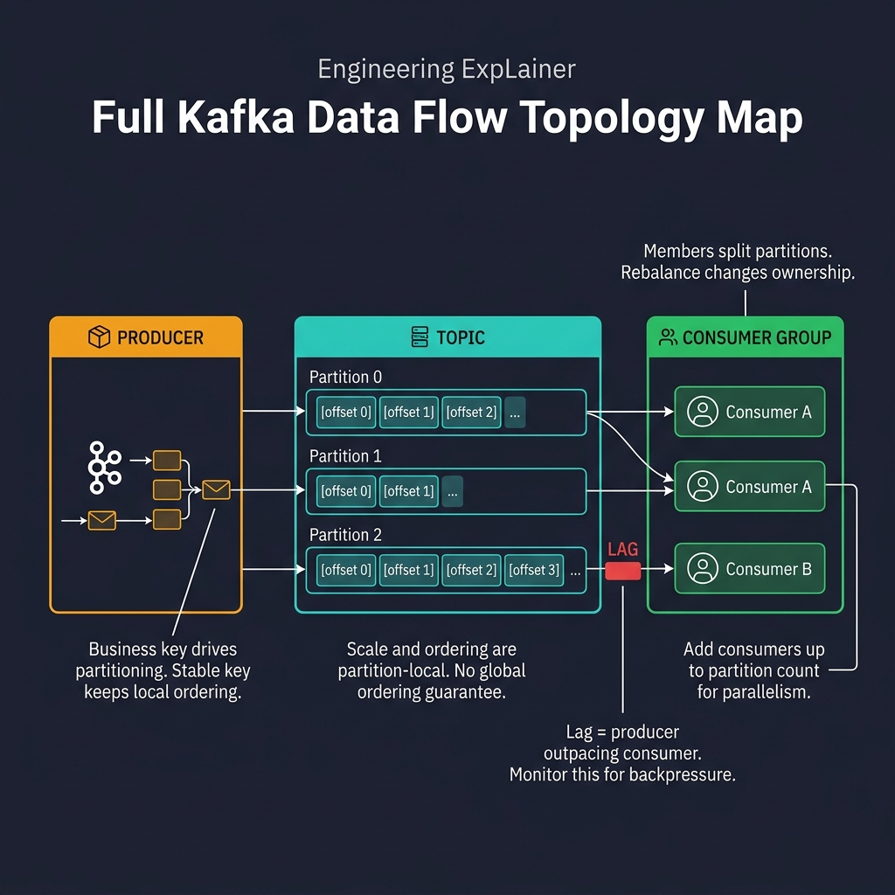
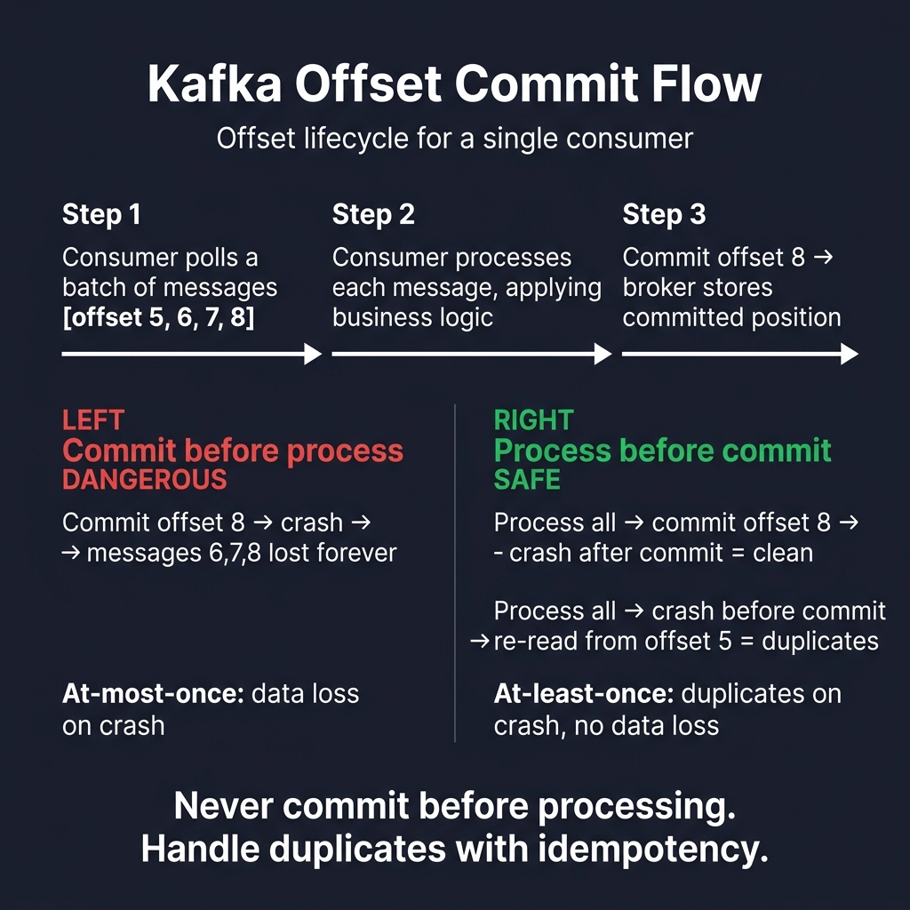

<!-- tags: golang -->
# 📬 Apache Kafka — Producer, Consumer Groups & Offset Control

📅 Created: 2026-03-23 · 🔄 Updated: 2026-04-09 · ⏱️ 17 min read

| Aspect | Detail |
| --- | --- |
| **Complexity** | Advanced |
| **Use case** | Core event bus routing, architectural integration events, and massive async processing flows requiring hard replays |
| **Go libs** | `github.com/segmentio/kafka-go`, `context`, `log/slog` |
| **Prerequisites** | Native Go concurrency patterns, context propagations, strict idempotency mindset |

## 1. DEFINE

> *Picture a monolithic e-commerce system: 10,000 order events broadcast to 5 downstream services every second. Sequential HTTP calls cost 5 × 200ms = 1 full second per order. A message queue fires and forgets, but lacks replay. Kafka solves the high-throughput event streaming gap — it persists every event as an offset-addressable log.*

Kafka appeals because of raw throughput and replay. But it deceives where it hurts most: offset commits do not mean "I read it." They mean "my side effects persisted, and the stream can advance."

### When does Kafka align correctly?

Kafka excels in dominating scenarios demanding:

- High-throughput event streams (>10k/s)
- Multiple consumer groups tailing the same topic independently
- Replay requirements — reprocess historical events from any offset
- Partition-local ordering (not global ordering)

### Actors

| Actor | Role |
| --- | --- |
| Topic | Logical event stream |
| Partition | Unit of scale and local ordering |
| Offset | Position pointer marking a message within a partition |
| Consumer group | Set of consumers splitting partition workload |
| Producer key | Determines partition assignment for ordering |

### Invariants

| Rule | Meaning |
| --- | --- |
| Ordering holds within a single partition only | Do not expect global ordering across partitions |
| Consumer restarts reprocess messages from last committed offset | Handlers must be idempotent |
| Committing offsets before processing loses messages | Commit only after side effects are durable |

## 2. VISUAL

Kafka needs two diagrams: the topology (how data flows from producer through partitions to consumer groups) and the offset commit flow (where data loss or duplication happens).



*Figure: Producers hash a business key to choose a partition. Each partition is an ordered, append-only log. Consumer group members split partitions — adding consumers beyond the partition count yields idle workers. Lag measures how far the consumer trails the producer.*



*Figure: Committing before processing causes at-most-once (data loss on crash). Processing before committing causes at-least-once (duplicates on crash, no data loss). Never commit before your side effects are durable.*

## 3. CODE

### Example 1: Basic — Producer with key and headers

> **Goal**: Publish integration events to Kafka clusters using stable partition keys and descriptive headers.
> **Approach**: Use `kafka.Writer` with a `Hash` balancer.
> **Example**: Publishing `UserCreatedEvent` with `UserID` as the key ensures all events for a specific user land in the same partition.
> **Complexity**: O(\|payload\|) for network transmission.

```go
// kafka_producer.go — Publish integration events with key-based partitioning
package messaging

import (
	"context"
	"encoding/json"
	"time"

	"github.com/segmentio/kafka-go"
)

type UserCreatedEvent struct {
	UserID string `json:"user_id"`
	Email  string `json:"email"`
}

func PublishUserCreated(ctx context.Context, broker string, event UserCreatedEvent) error {
	writer := &kafka.Writer{
		Addr:         kafka.TCP(broker),
		Topic:        "user-events",
		// ✅ Hash balancer + stable key guarantees partition-local ordering.
		Balancer:     &kafka.Hash{},
		WriteTimeout: 5 * time.Second,
	}
	defer writer.Close()

	payload, err := json.Marshal(event)
	if err != nil {
		return err
	}

	return writer.WriteMessages(ctx, kafka.Message{
		Key:   []byte(event.UserID),
		Value: payload,
		Headers: []kafka.Header{
			// ✅ Event-type header lets consumers route without deserializing the payload.
			{Key: "event-type", Value: []byte("user.created")},
			{Key: "content-type", Value: []byte("application/json")},
		},
	})
}
```

> **Why initialize Hash Balancers strictly?**
> If missing, Kafka rounds-robin messages across all partitions. Two events for the same `UserID` could process out of order. Hash guarantees key locality.

### Example 2: Intermediate — Consumer group with explicit commit

> **Goal**: Process each message and commit the offset only after the handler succeeds.
> **Approach**: Use `FetchMessage` + `CommitMessages` instead of auto-commit.
> **Example**: Consumer reads offset 1024, runs the handler, and commits only if the handler returns nil.
> **Complexity**: O(1) per message.

```go
// kafka_consumer_group.go — Process then commit to avoid losing messages
package messaging

import (
	"context"
	"log/slog"
	"time"

	"github.com/segmentio/kafka-go"
)

func ConsumeUserEvents(ctx context.Context, broker string, handle func(context.Context, kafka.Message) error) error {
	reader := kafka.NewReader(kafka.ReaderConfig{
		Brokers:        []string{broker},
		GroupID:        "user-projection-service",
		Topic:          "user-events",
		CommitInterval: 0,
		MinBytes:       1,
		MaxBytes:       10e6,
		MaxWait:        500 * time.Millisecond,
	})
	defer reader.Close()

	for {
		msg, err := reader.FetchMessage(ctx)
		if err != nil {
			return err
		}

		if err := handle(ctx, msg); err != nil {
			slog.Error("kafka handler failed", "topic", msg.Topic, "offset", msg.Offset, "error", err)
			// ⚠️ Do not commit the offset here — the handler failed.
			continue
		}

		if err := reader.CommitMessages(ctx, msg); err != nil {
			return err
		}
	}
}
```

> **Why use explicit commits instead of auto-commit?**
> Committing is a decision about side-effect durability, not just "I have read the message." If the handler crashes, explicit commit ensures redelivery.

### Example 3: Advanced — Routing by event type with idempotent handler contract

> **Goal**: Route messages to different handlers based on the `event-type` header.
> **Approach**: Separate routing (header inspection) from handling (payload deserialization).
> **Example**: A `user-events` topic carries `user.created`, `user.updated`, etc. The dispatcher looks up the handler by header value.
> **Complexity**: O(h) where h is the header count.

```go
// kafka_router.go — Route event type to handler and preserve idempotent processing
package messaging

import (
	"context"
	"encoding/json"
	"errors"

	"github.com/segmentio/kafka-go"
)

type EventHandler interface {
	Handle(ctx context.Context, key string, payload []byte) error
}

func DispatchKafkaMessage(ctx context.Context, msg kafka.Message, handlers map[string]EventHandler) error {
	eventType := headerValue(msg.Headers, "event-type")
	handler, ok := handlers[eventType]
	if !ok {
		return errors.New("no handler for event type")
	}

	// ✅ Idempotency is the handler's responsibility, not the router's.
	return handler.Handle(ctx, string(msg.Key), msg.Value)
}

func headerValue(headers []kafka.Header, key string) string {
	for _, header := range headers {
		if header.Key == key {
			return string(header.Value)
		}
	}
	return ""
}

type UserProjectionHandler struct{}

func (h *UserProjectionHandler) Handle(ctx context.Context, key string, payload []byte) error {
	var event UserCreatedEvent
	if err := json.Unmarshal(payload, &event); err != nil {
		return err
	}
	_ = ctx
	_ = key
	return nil
}
```

> **Why decouple headers from payloads explicitly?**
> You avoid deserializing the entire payload just to determine the event type. The `event-type` header dictates the routing structure.

### Example 4: Expert — Publish exhausted message to retry or DLQ topic

> **Goal**: Move failed messages out of the main consumer loop into a retry or DLQ topic.
> **Approach**: Copy the original key and payload, then append retry metadata headers.

```go
// kafka_retry_publish.go — Republish failed messages with retry metadata outside the hot consumer loop
package messaging

import (
	"context"
	"strconv"

	"github.com/segmentio/kafka-go"
)

func PublishKafkaRetry(
	ctx context.Context,
	writer *kafka.Writer,
	original kafka.Message,
	targetTopic string,
	attempt int,
	reason string,
) error {
	retryMessage := kafka.Message{
		Topic: targetTopic,
		Key:   original.Key,
		Value: original.Value,
		Headers: append(original.Headers,
			kafka.Header{Key: "retry-count", Value: []byte(strconv.Itoa(attempt))},
			kafka.Header{Key: "failure-reason", Value: []byte(reason)},
			kafka.Header{Key: "source-topic", Value: []byte(original.Topic)},
		),
	}

	return writer.WriteMessages(ctx, retryMessage)
}
```

> **Why publish to a separate topic for retries?**
> Retrying inside the main consumer loop blocks all other messages behind the failing one. A separate retry topic preserves main-topic throughput.

## 4. PITFALLS

| # | Severity | Defect | Impact | Fix |
|---|----------|--------|--------|-----|
| 1 | 🔴 Fatal | Committing offsets before business logic completes | Message loss on crash | Commit only after side effects are persisted |
| 2 | 🔴 Fatal | Assuming Kafka provides exactly-once delivery | Double-billing or data corruption | Add idempotency keys on the consumer side |
| 3 | 🟡 Common | Using random or timestamp-based partition keys | Loss of ordering for the same entity | Use the aggregate business ID (e.g., UserID) as the key |
| 4 | 🔵 Minor | Handler runs long-blocking operations | Consumer rebalance triggered by session timeout | Offload heavy work to a goroutine pool and measure lag |

## 5. REF

| Resource | Link |
| --- | --- |
| kafka-go | https://github.com/segmentio/kafka-go |
| Kafka Consumer Design | https://kafka.apache.org/documentation/ |
| Confluent consumer docs | https://docs.confluent.io/platform/current/clients/consumer.html |

## 6. RECOMMEND

| Extension | When to proceed | Rationale |
| --- | --- | --- |
| [Dead Letter Queue](./04-dead-letter-queue.md) | Handler hits poison messages or exhausts retry budget | Isolates bad messages from the main consumer loop |
| [Idempotency & Consumers](./05-idempotency-retry-consumers.md) | At-least-once delivery causes duplicate processing | Dedupe keys prevent repeated side effects |
| [Saga & Outbox](../microservices/05-saga-outbox-microservices.md) | Cross-service transactions need coordination | Transactional outbox guarantees publish-after-commit |

**Navigation**: [← Previous](./README.md) · [→ Next](./02-rabbitmq-nats.md)
