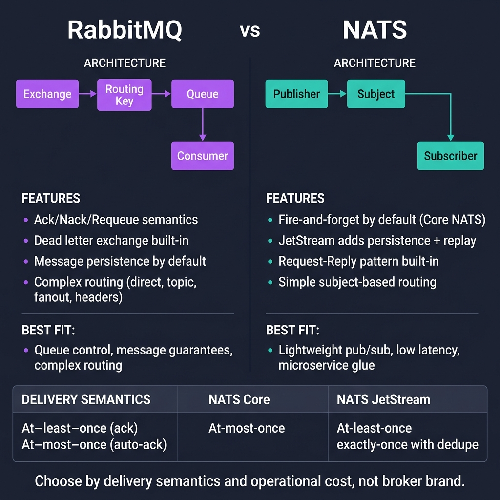
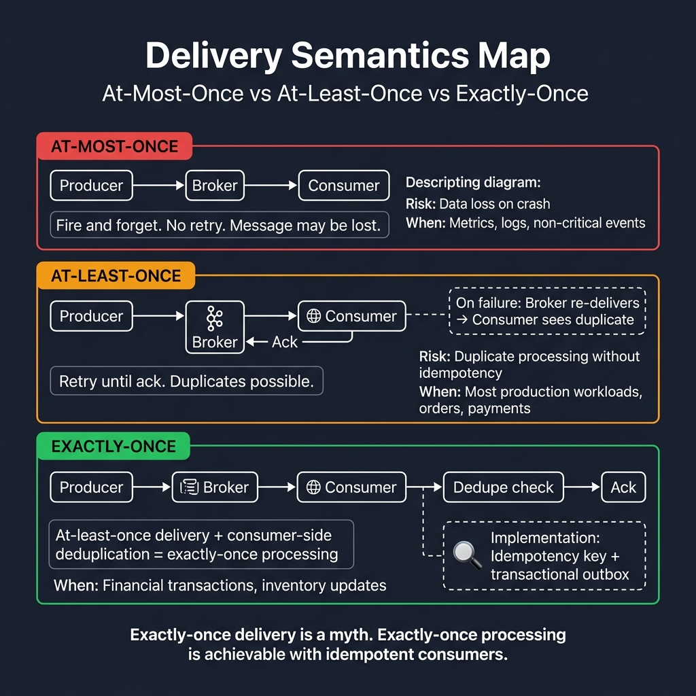

<!-- tags: golang -->
# 🐰 RabbitMQ & NATS — Ack, Nack, Requeue & Broker Trade-offs

📅 Created: 2026-03-23 · 🔄 Updated: 2026-04-09 · ⏱️ 17 min read

| Aspect | Detail |
| --- | --- |
| **Complexity** | Advanced |
| **Use case** | Reliable work queue processing, explicit exchange routing, and strict delivery control |
| **Go libs** | `github.com/rabbitmq/amqp091-go`, `github.com/nats-io/nats.go` |
| **Prerequisites** | Native Go context mechanics, at-least-once executing paradigms |

## 1. DEFINE

> *Picture a task queue: 100 workers process emails. Each email requires exactly-once processing. If one fails, it retries 3 times, then routes to a DLQ. Kafka is overkill for this job. RabbitMQ provides fine-grained routing and queue-level control. NATS, on the other hand, offers lightweight pub/sub for real-time pipelines.*

The real vulnerability is picking a broker by brand instead of delivery contract. The engineering priority is matching your queue semantics to your processing tolerance. 

### When does RabbitMQ fit?

RabbitMQ excels when you need:

- Independent work item queues with per-message ack/nack control
- Exchange-based routing (direct, topic, fanout, headers)
- Bounded retry loops with dead letter exchange support
- Fine-grained delivery control per consumer

### RabbitMQ vs NATS

| Aspect | RabbitMQ | NATS |
| --- | --- | --- |
| Delivery control | Strong, explicit ack/nack | Lighter, topology dependent |
| Routing | Exchange, binding, routing key | Subject-based |
| Use case | Reliable work queue | Fast pub/sub, service messaging |
| Mental model | Broker-centric queueing | Lightweight messaging fabric |

## 2. VISUAL

This module separates two teaching jobs: comparing broker mental models and mapping delivery control flows when a message enters a live consumer.



*Figure: RabbitMQ routes through exchanges, bindings, and queues with strong ack/nack semantics. NATS uses simple subject-based addressing with fire-and-forget by default (JetStream adds persistence).*



*Figure: At-most-once risks data loss, at-least-once risks duplicates, exactly-once processing requires at-least-once delivery plus consumer-side idempotency. Pick the guarantee that matches your business tolerance.*

## 3. CODE

### Example 1: Basic — Publish via topic exchange

> **Goal**: Publish events into a RabbitMQ topic exchange utilizing distinct routing keys.
> **Approach**: Provision an `events` exchange utilizing the `topic` type, consequently publishing JSON payloads specifying routing keys such as `user.created`.
> **Example**: Publishers emit `user.created` events toward the `events` exchange; any queue bound with an overlapping pattern successfully retrieves the message.
> **Complexity**: O(\|payload\|) for network transmission; O(1) app configuration overhead.

```go
// rabbitmq_publish.go — Publish event through topic exchange
package messaging

import (
	"context"

	amqp "github.com/rabbitmq/amqp091-go"
)

func PublishRabbitEvent(ctx context.Context, conn *amqp.Connection, routingKey string, body []byte) error {
	ch, err := conn.Channel()
	if err != nil {
		return err
	}
	defer ch.Close()

	if err := ch.ExchangeDeclare("events", "topic", true, false, false, false, nil); err != nil {
		return err
	}

	return ch.PublishWithContext(ctx, "events", routingKey, false, false, amqp.Publishing{
		// ✅ ContentType helps consumers parse the payload correctly.
		ContentType: "application/json",
		Body:        body,
	})
}
```

> **Why publish to Exchanges, not Queues?**
> RabbitMQ's publish mental model relies on exchanges. Producers never send data directly to queues. They dispatch to an exchange, and the broker routes data via bindings.

### Example 2: Intermediate — Consumer with explicit ack/nack

> **Goal**: Emit an `Ack` exclusively after business logic successfully completes; emit a `Nack` if errors demand retries or policy-based requeues.
> **Approach**: Leverage `Consume(..., autoAck=false)` while controlling `Ack/Nack` manually within the primary consumer loop.
> **Example**: If a handler fails due to a DB timeout, execute `Nack(requeue=true)`; if the handler succeeds, execute `Ack`.
> **Complexity**: O(1) tracking logic for each delivery event.

```go
// rabbitmq_consume.go — Acknowledge only after business logic succeeds
package messaging

import (
	"context"
	"log/slog"

	amqp "github.com/rabbitmq/amqp091-go"
)

func ConsumeRabbitQueue(ctx context.Context, conn *amqp.Connection, queue string, handle func(context.Context, []byte) error) error {
	ch, err := conn.Channel()
	if err != nil {
		return err
	}
	defer ch.Close()

	msgs, err := ch.Consume(queue, "", false, false, false, false, nil)
	if err != nil {
		return err
	}

	for {
		select {
		case <-ctx.Done():
			return ctx.Err()
		case msg, ok := <-msgs:
			if !ok {
				return nil
			}
			if err := handle(ctx, msg.Body); err != nil {
				slog.Error("rabbitmq handler failed", "routing_key", msg.RoutingKey, "error", err)
				// ⚠️ Requeue is safe only when the error is temporary (e.g., DB timeout).
				_ = msg.Nack(false, true)
				continue
			}
			if err := msg.Ack(false); err != nil {
				return err
			}
		}
	}
}
```

> **Why disable autoAck?**
> The core delivery semantic of RabbitMQ: the broker dispatches messages, and the application dictates when to acknowledge them. Using autoAck risks data loss if the handler crashes.

### Example 3: Advanced — Compare with NATS subject subscription

> **Goal**: Demonstrate the mental model divergence between RabbitMQ queueing architectures and NATS subject-based pub/sub.
> **Approach**: Deploy a minimal NATS subscription for direct comparison, bypassing complex exchanges and bindings.
> **Example**: Messages arriving on the `events.user.created` subject trigger a callback directly processed by the NATS subscriber.
> **Complexity**: O(1) subscription initialization.

```go
// nats_subscribe.go — Lightweight subject-based subscription for comparison
package messaging

import (
	"log/slog"

	"github.com/nats-io/nats.go"
)

func SubscribeNATS(url string) error {
	nc, err := nats.Connect(url)
	if err != nil {
		return err
	}
	defer nc.Close()

	_, err = nc.Subscribe("events.user.created", func(msg *nats.Msg) {
		// ✅ NATS shines for lightweight pub/sub where deep queue control is not needed.
		slog.Info("nats message", "subject", msg.Subject, "payload", string(msg.Data))
	})
	if err != nil {
		return err
	}

	return nc.Flush()
}
```

> **Why choose NATS over RabbitMQ?**
> NATS prioritizes speed and simplicity over delivery guarantees. If you need ack/nack and DLQ, use RabbitMQ. If you need fast fan-out with minimal infrastructure, use NATS.

### Example 4: Expert — RabbitMQ consumer with prefetch guardrail

> **Goal**: Preserve stable throughput and ensure fairness when consumers process intensive workloads.
> **Approach**: Execute `Qos(prefetchCount, ...)` to cap the number of inflight messages assigned to every consumer channel.
> **Example**: Workers processing heavy notifications set `prefetch=16`; the consumer strictly receives a maximum of 16 inflight unacknowledged records.
> **Complexity**: O(1) configuration hook yields immense operational safety under uneven workloads.

```go
// rabbitmq_qos.go — Limit in-flight deliveries per consumer to avoid runaway buffering
package messaging

import amqp "github.com/rabbitmq/amqp091-go"

func ConfigureConsumerQoS(ch *amqp.Channel, prefetch int) error {
	// ✅ Lower prefetch = better fairness; higher prefetch = more throughput, more inflight risk.
	return ch.Qos(prefetch, 0, false)
}
```

> **Why configure prefetch?**
> It prevents brokers from overwhelming a single consumer with unacknowledged messages. Tuning prefetch based on handler latency is a critical operational lever.

## 4. PITFALLS

| # | Severity | Defect | Impact | Fix |
|---|----------|--------|--------|-----|
| 1 | 🔴 Fatal | Acking before business logic completes | Data loss on crash | Commit `Ack` only after side effects succeed |
| 2 | 🔴 Fatal | Infinite `Nack(requeue=true)` loops | Consumer stalls on poison messages | Enforce retry caps and route to DLQ |
| 3 | 🟡 Common | No observability in consumers | Latency issues are invisible | Log routing keys, retry counts, and queue depths |
| 4 | 🔵 Minor | Choosing a broker by popularity | Infrastructure mismatch | Match the broker to your delivery semantics |

## 5. REF

| Resource | Link |
| --- | --- |
| amqp091-go | https://github.com/rabbitmq/amqp091-go |
| RabbitMQ Tutorials | https://www.rabbitmq.com/tutorials |
| nats.go | https://github.com/nats-io/nats.go |

## 6. RECOMMEND

| Extension | When to proceed | Rationale |
| --- | --- | --- |
| [Dead Letter Queue](./04-dead-letter-queue.md) | Poison messages risk stalling consumers | Isolate failed messages from the primary queue |
| [Idempotency & Consumers](./05-idempotency-retry-consumers.md) | At-least-once delivery causes duplicate processing | Dedupe keys prevent repeated side effects |
| Prefetch tuning | Consumer throughput is unstable | Balance fairness against throughput |

## 7. QUIZ

### Quick Check

1. Specifically when should a RabbitMQ message receive an `Ack`?
2. Why does executing `Nack(..., requeue=true)` pose terminal operational dangers?
3. What is the fundamental difference between RabbitMQ and NATS?

### Answer Key

1. After the business logic (side effects) completes.
2. Poison messages cause infinite re-delivery loops, stalling the consumer.
3. RabbitMQ centers on queue control and delivery guarantees; NATS centers on lightweight, low-latency pub/sub.

**Navigation**: [← Kafka](./01-kafka.md) · [→ Event Sourcing](./03-event-sourcing.md)
