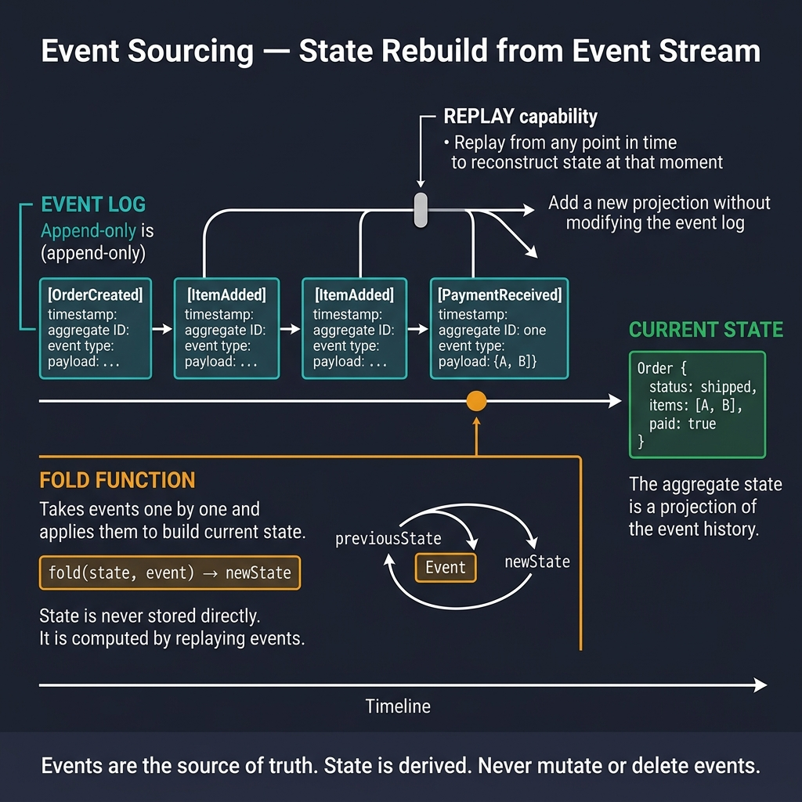

<!-- tags: golang -->
# 📜 Event Sourcing — Storing Events Instead of State

> Event sourcing: append-only event store, rebuilding state from events, and CQRS integration boundaries.

📅 Created: 2026-03-23 · 🔄 Updated: 2026-04-14 · ⏱️ 14 min read

## 1. DEFINE

Event sourcing replaces mutable state with an append-only log of domain events. Current state is never stored directly — it is computed by replaying the event history through a fold function.

---

The four code segments below escalate from a bare event envelope to a transactional outbox pattern. Two traps dominate: deploying an event store without optimistic concurrency leads to silent aggregate corruption, and publishing events outside the database transaction creates dual-write anomalies.

### 1.1 Signals & Boundaries

- This module matters when your domain needs an audit trail, replay, or temporal queries.
- The focus is on structural boundaries, not theoretical definitions.
- Copying the code without evaluating your aggregate boundaries will cause production issues.

### 1.2 Invariants & Failure Modes

- Treat code segments as architectural reference, not copy-paste snippets.
- The most common failure: correct implementation applied to the wrong aggregate boundary.

## 2. VISUAL

The central teaching job is the event lifecycle: events append to a log, a fold function replays them into current state, and an outbox ensures safe publication without dual writes.



*Figure: Events append to an immutable log. A fold function replays the log into aggregate state. The outbox pattern wraps event persistence and message publication in a single transaction to prevent dual-write anomalies.*

## 3. CODE

### Example 1: Basic — Event store interface and minimal event envelope

> **Goal**: Define the event envelope shape and store interface before introducing aggregates.
> **Approach**: An immutable `Event` struct paired with an `EventStore` interface limited to `Append` and `Load`.
> **Complexity**: Basic

```go
type Event struct {
	ID            string    `json:"id"`
	AggregateID   string    `json:"aggregate_id"`
	AggregateType string    `json:"aggregate_type"`
	EventType     string    `json:"event_type"`
	Version       int       `json:"version"`
	Data          []byte    `json:"data"`
	CreatedAt     time.Time `json:"created_at"`
}

type EventStore interface {
	Append(ctx context.Context, events []Event) error
	Load(ctx context.Context, aggregateID string) ([]Event, error)
	LoadFrom(ctx context.Context, aggregateID string, fromVersion int) ([]Event, error)
}
```

> **Takeaway**: This restricted interface separates your domain from the storage adapter. Without a consistent envelope from day one, every consumer will parse events differently.

### Example 2: Intermediate — Rebuilding aggregate state from event streams

> **Goal**: Replace mutable state updates with "state = fold(events)".
> **Approach**: The `Apply` method projects each event into state. Commands produce uncommitted events, which are applied immediately and persisted later.
> **Complexity**: Intermediate

```go
type Order struct {
	ID       string
	Status   string
	Items    []OrderItem
	Total    float64
	Version  int
	changes  []Event // uncommitted events
}

func (o *Order) Apply(event Event) {
	switch event.EventType {
	case "order.created":
		var data OrderCreatedData
		json.Unmarshal(event.Data, &data)
		o.ID = data.OrderID
		o.Status = "pending"
		o.Items = data.Items
	case "order.paid":
		o.Status = "paid"
	case "order.shipped":
		o.Status = "shipped"
	}
	o.Version = event.Version
}

// Rebuild state from events
func LoadOrder(events []Event) *Order {
	order := &Order{}
	for _, e := range events {
		order.Apply(e)
	}
	return order
}

// Create new event
func (o *Order) Place(items []OrderItem) {
	data, _ := json.Marshal(OrderCreatedData{OrderID: o.ID, Items: items})
	o.changes = append(o.changes, Event{
		AggregateID: o.ID, EventType: "order.created",
		Version: o.Version + 1, Data: data,
	})
	o.Apply(o.changes[len(o.changes)-1])
}
```

> **Takeaway**: Every state change flows through an event. The `Apply` method must be idempotent — replaying the same events twice must produce the same state.

### Example 3: Advanced — PostgreSQL event store deploying optimistic concurrency

> **Goal**: Persist events to PostgreSQL with optimistic concurrency control.
> **Approach**: Append events ordered by version. The `UNIQUE(aggregate_id, version)` constraint rejects concurrent writes to the same version.
> **Complexity**: Advanced

```go
type PgEventStore struct{ db *gorm.DB }

func (s *PgEventStore) Append(ctx context.Context, events []Event) error {
	return s.db.WithContext(ctx).Create(&events).Error
}

func (s *PgEventStore) Load(ctx context.Context, aggregateID string) ([]Event, error) {
	var events []Event
	err := s.db.WithContext(ctx).
		Where("aggregate_id = ?", aggregateID).
		Order("version ASC").
		Find(&events).Error
	return events, err
}

// SQL migration:
// CREATE TABLE events (
//   id UUID PRIMARY KEY DEFAULT gen_random_uuid(),
//   aggregate_id UUID NOT NULL,
//   aggregate_type VARCHAR(100),
//   event_type VARCHAR(100) NOT NULL,
//   version INT NOT NULL,
//   data JSONB NOT NULL,
//   created_at TIMESTAMPTZ DEFAULT NOW(),
//   UNIQUE(aggregate_id, version)
// );
```

> **Takeaway**: PostgreSQL establishes rigid event sourcing boundaries when robust reliable audit trails remain paramount. The crucial understanding confirms that the unique composite constraint `(aggregate_id, version)` forms the primary concurrent locking mechanism securing execution.

### Example 4: Expert — Saving events + outbox records in a single transaction

> **Goal**: Persist events and queue outgoing messages in one atomic transaction to avoid dual writes.
> **Approach**: Wrap event append and outbox insert in a single SQL transaction. A separate relay worker publishes outbox messages.
> **Complexity**: Expert

```go
type OutboxMessage struct {
    ID          string    `gorm:"primaryKey"`
    Topic       string
    EventType   string
    Payload     []byte
    CreatedAt   time.Time
    PublishedAt *time.Time
}

func SaveAndEnqueue(ctx context.Context, db *gorm.DB, store *PgEventStore, events []Event) error {
    return db.WithContext(ctx).Transaction(func(tx *gorm.DB) error {
        eventStore := &PgEventStore{db: tx}

        // 1. Append events to the event store first.
        if err := eventStore.Append(ctx, events); err != nil {
            return err
        }

        // 2. Record outbox messages in the same transaction to avoid dual writes.
        outboxRows := make([]OutboxMessage, 0, len(events))
        for _, event := range events {
            outboxRows = append(outboxRows, OutboxMessage{
                ID:        uuid.NewString(),
                Topic:     "orders.events",
                EventType: event.EventType,
                Payload:   event.Data,
                CreatedAt: time.Now(),
            })
        }

        return tx.Create(&outboxRows).Error
    })
}
```

> **Takeaway**: The outbox pattern eliminates dual writes by keeping event storage and message queuing in a single transaction. The relay worker polls the outbox table and publishes unpublished messages.

## 4. PITFALLS

Event sourcing pitfalls come from structural decisions, not theoretical gaps.

| # | Severity | Defect | Impact | Fix |
| --- | --- | --- | --- | --- |
| 1 | 🔴 Fatal | Blindly trusting the broker to resolve business semantics | Duplication causing corrupted state | Design idempotency and robust replay strategies |
| 2 | 🟡 Common | Testing exclusively against the happy path | Retry storms and poison messages appear | Execute failure paths and force duplicates |
| 3 | 🔵 Minor | Failing to document explicit event contracts | Producer and consumer environments drift | Document the event schema exactly like a public API |

## 5. REF

| Resource | Link |
| --- | --- |
| Event Sourcing in Go | https://threedots.tech/post/event-sourcing-in-go/ |
| NestJS CQRS/Events | https://docs.nestjs.com/recipes/cqrs |

## 6. RECOMMEND

Once event sourcing is in place, the next concern is consumer safety.

| Extension | When to proceed | Rationale |
| --- | --- | --- |
| [Dead Letter Queue](./04-dead-letter-queue.md) | Poison messages stall consumers | Isolates failed messages from the main processing loop |
| [Idempotency & Retry](./05-idempotency-retry-consumers.md) | Replay or redelivery causes duplicates | Dedupe keys prevent repeated side effects |

---
