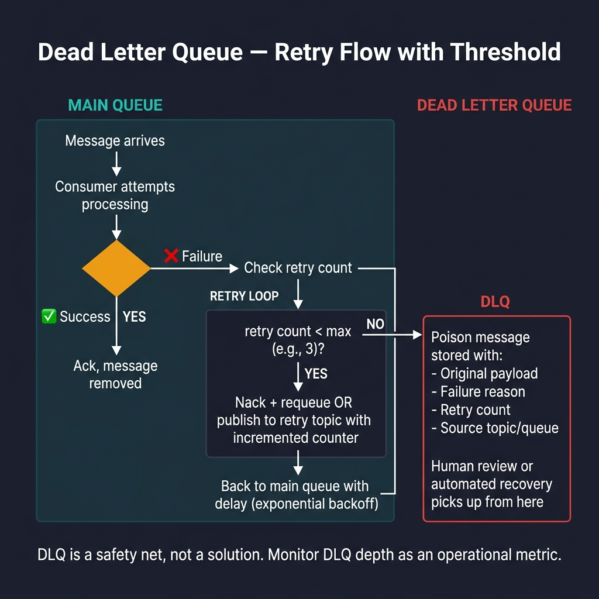

<!-- tags: golang -->
# ☠️ Dead Letter Queue — Poison Messages, Retry Boundaries & Recovery

📅 Created: 2026-03-28 · 🔄 Updated: 2026-04-09 · ⏱️ 16 min read

| Aspect | Detail |
| --- | --- |
| **Complexity** | Expert |
| **Use case** | Poison messages, exhausted retry budgets, operator-driven recovery |
| **Go libs** | `amqp091-go`, `segmentio/kafka-go`, `context`, `log/slog` |
| **Prerequisites** | Core Kafka mechanics, RabbitMQ ack/nack controls, idempotency principles |

## 1. DEFINE

> *Imagine a consumer intercepts a message, fails to parse the JSON, and immediately rejects it. The broker retries it 5 times, failing instantly each time. The message gridlocks the queue, blocking valid processing. A Dead Letter Queue (DLQ) acts as a parking lot for these poison messages. It extracts them from the primary hot-path flow, demanding human review without choking the main processing loop.*

### What exact purpose do DLQs serve?

DLQs exclusively capture message variants that cannot execute safely across primary logical flows. This includes:

- Hard schema payload validation failures.
- Intractable business rule violations.
- Messages that exhausted their retry budget.
- Out-of-bounds dependency failures triggering sustained halts.

### RabbitMQ vs Kafka DLQ

| Aspect | RabbitMQ | Kafka |
| --- | --- | --- |
| Mechanism | Native dead-letter-exchanges/queues | Secondary retry/DLQ topics |
| Trigger | Explicit reject/nack/TTL/max-length limits | Producer-driven routing to a retry or DLQ topic |
| Core Concept | Isolate failed traffic from primary queues | Isolate failed traffic from primary topics |

## 2. VISUAL

The key decision is error classification: transient errors deserve a retry, permanent errors go to the DLQ. If you skip classification, the DLQ becomes a dumping ground for everything.



*Figure: Messages that fail processing hit a retry count check. Below the threshold, the consumer retries with exponential backoff. Above the threshold, the message routes to a DLQ with metadata (failure reason, retry count, source queue) for human review.*

## 3. CODE

### Example 1: Basic — RabbitMQ DLX + DLQ declaration

> **Goal**: Establish a main queue fortified with an explicit dead-letter exchange, ensuring unresolved messages break free from the primary path.
> **Approach**: Provision `DLX` and `DLQ` architectures securely, map dead-letter routing keys, and configure the primary queue utilizing `x-dead-letter-exchange` definitions.
> **Example**: When `orders.main` rejects a poison message, the broker routes it to `orders.dlq` via the `orders.failed` routing key.
> **Complexity**: O(1) broker provisioning setup; the operational complexity resides uniquely within monitoring policy enforcement.

```go
// rabbitmq_dlq_setup.go — Configure main queue to dead-letter failed messages
package messaging

import amqp "github.com/rabbitmq/amqp091-go"

func DeclareRabbitDLQ(ch *amqp.Channel) error {
	if err := ch.ExchangeDeclare("orders.dlx", "direct", true, false, false, false, nil); err != nil {
		return err
	}
	if _, err := ch.QueueDeclare("orders.dlq", true, false, false, false, nil); err != nil {
		return err
	}
	if err := ch.QueueBind("orders.dlq", "orders.failed", "orders.dlx", false, nil); err != nil {
		return err
	}

	args := amqp.Table{
		"x-dead-letter-exchange":    "orders.dlx",
		"x-dead-letter-routing-key": "orders.failed",
	}
	_, err := ch.QueueDeclare("orders.main", true, false, false, false, args)
	return err
}
```

> **Why configure explicit DLX Exchanges targeting jobs?** (Why)
> A dedicated Dead Letter Exchange ensures failed messages bypass standard routing policies. If you route failures back into the main exchange, unbounded routing loops emerge.

### Example 2: Intermediate — Reject poison message securely toward the DLQ

> **Goal**: Classify errors and route poison messages to the DLQ instead of retrying forever.
> **Approach**: Define an explicit baseline sentinel `ErrPermanent` boundary; when confronting permanent terminal states, emit `Reject(false)`. During recoverable temporary events, emit `Nack(..., requeue=true)`.
> **Example**: A corrupted payload layout triggers explicit safe tracking `Reject` bounds. Temporary database timeout fluctuations trigger standard requeue commands.
> **Complexity**: O(1) per execution iteration independently.

```go
// rabbitmq_dlq_consumer.go — Send permanent failures to DLQ instead of infinite requeue
package messaging

import (
	"context"
	"errors"

	amqp "github.com/rabbitmq/amqp091-go"
)

var ErrPermanent = errors.New("permanent message failure")

func HandleRabbitDelivery(ctx context.Context, msg amqp.Delivery, handle func(context.Context, []byte) error) error {
	err := handle(ctx, msg.Body)
	switch {
	case err == nil:
		return msg.Ack(false)
	case errors.Is(err, ErrPermanent):
		// ✅ Reject(false) tells the broker to route this message to the DLQ, not requeue it.
		return msg.Reject(false)
	default:
		return msg.Nack(false, true)
	}
}
```

> **Why leveraging Reject(false) directs records correctly?** (Why)
> When you issue `Reject` with `requeue=false`, RabbitMQ checks if the queue has an `x-dead-letter-exchange` configured. If it does, RabbitMQ forwards the message there instead of dropping it.

### Example 3: Advanced — Deploying Kafka retry topics preceding dedicated DLQ environments

> **Goal**: Successfully traversing native Kafka infrastructure demands routing exhausted messages into specific DLQ topics containing transparent metadata.
> **Approach**: Clone original key-value structures alongside gracefully appending deep analytical headers mapping `"dlq-reason"` and `"source-topic"`.
> **Complexity**: O(h) execution proportional to appended headers + explicit O(\|payload\|) network publication constraint.

```go
// kafka_dlq_publish.go — Publish exhausted messages reliably toward distinct dead-letter topics.
package messaging

import (
	"context"

	"github.com/segmentio/kafka-go"
)

func PublishKafkaDLQ(ctx context.Context, writer *kafka.Writer, original kafka.Message, reason string) error {
	dlqMessage := kafka.Message{
		Key:   original.Key,
		Value: original.Value,
		Headers: append(original.Headers,
			kafka.Header{Key: "dlq-reason", Value: []byte(reason)},
			kafka.Header{Key: "source-topic", Value: []byte(original.Topic)},
		),
	}
	return writer.WriteMessages(ctx, dlqMessage)
}
```

> **Why Kafka demands explicit publishing circumventing auto-rejects?** (Why)
> Kafka brokers do not understand business failure semantics. They only track offsets. You must manually orchestrate DLQ routing using secondary topic publications.

### Example 4: Expert — Establishing explicit manual operational re-drive guardrails alongside targeted retry budgets

> **Goal**: Protect production by requiring idempotency checks before manual re-drives.
> **Approach**: Parse deep metadata headers smoothly to check retry budgets against bounds, ensuring idempotency constraints remain enforced prior to allowing execution logic.
> **Complexity**: O(h) per target header processing precisely, guaranteeing safety cleanly against unchecked infinite retry cycles.

```go
// dlq_redrive_guard.go — Guard manual re-drives with strict attempt thresholds and mandatory idempotency tracking.
package messaging

import (
	"strconv"

	"github.com/segmentio/kafka-go"
)

func CanRedriveKafkaMessage(msg kafka.Message, maxAttempts int) bool {
	var attempts int
	var hasMessageID bool

	for _, header := range msg.Headers {
		if header.Key == "attempt_count" {
			if parsed, err := strconv.Atoi(string(header.Value)); err == nil {
				attempts = parsed
			}
		}
		if header.Key == "message-id" && len(header.Value) > 0 {
			hasMessageID = true
		}
	}

	// ✅ Ensure re-drive loops do not cascade infinitely and that messages carry unique identifiers for idempotent tracking.
	return hasMessageID && attempts < maxAttempts
}
```

> **Why track Message IDs evaluating re-drive flows?** (Why)
> When operators manually replay DLQ messages, duplicate processing risks soar. A unique ID anchors idempotent handlers, blocking repeated mutations of identical records.

## 4. PITFALLS

Executing properly requires understanding where Dead Letter Queues typically fail. The most expensive mistakes stem from false assumptions that monitoring dashboards or simple code demonstrations omit completely.

| # | Severity | Defect | Impact | Fix |
|---|----------|--------|--------|-----|
| 1 | 🔴 Fatal | No distinction between transient and permanent errors | Infinite retry loops | Classify errors before routing to DLQ or retry |
| 2 | 🟡 Common | DLQ entries lack metadata | Hard to diagnose root cause | Append headers: failure reason, attempt count, source queue |
| 3 | 🔴 Fatal | Manual re-drives without idempotency checks | Corrupted state from double processing | Require idempotency keys and batch replay policies |
| 4 | 🔵 Minor | DLQ treated as a silent garbage bin | Hidden bugs accumulate | Monitor DLQ depth and trigger alerts |

## 5. REF

| Resource | Link |
| --- | --- |
| RabbitMQ Dead Letter Exchanges | https://www.rabbitmq.com/docs/dlx |
| Kafka error handling patterns | https://www.confluent.io/blog/error-handling-patterns-in-kafka/ |
| Enterprise Integration Patterns | https://www.enterpriseintegrationpatterns.com/DeadLetterChannel.html |

## 6. RECOMMEND

After DLQ patterns are in place, extend into adjacent retry and monitoring mechanics.

| Extension | When to proceed | Rationale |
| --- | --- | --- |
| Retry topic ladder | Temporary latency errors need sustained backoff | Reduces pressure on the primary consumer |
| DLQ dashboard monitoring | DLQ depth is growing unexpectedly | Enables operator diagnosis before blind bulk replays |
| [Idempotency store](./05-idempotency-retry-consumers.md) | Replays risk destructive side effects | Prevents data inconsistency during forced re-drives |

## 7. QUIZ

### Quick Check

1. Formally, why should a deployed DLQ never degenerate into an unmonitored black hole?
2. What defines the foundational architectural divergence between RabbitMQ DLQs and Kafka target deployments?
3. Why do operational re-drives require idempotent consumers?

### Answer Key

1. Without monitoring, critical production failures remain silently hidden in the DLQ.
2. RabbitMQ provides native DLX/DLQ broker mechanics; Kafka requires application-level retry/DLQ topic implementations.
3. Replays without idempotency cause duplicate processing and data corruption.

**Navigation**: [← Messaging Root](./README.md) · [→ Idempotency & Retry](./05-idempotency-retry-consumers.md)
