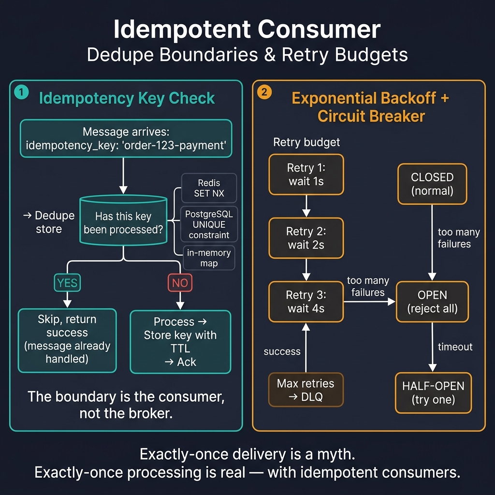

<!-- tags: golang -->
# ♻️ Idempotency, Retry & Consumer Safety

> Brokers guarantee at-least-once delivery, but they cannot guarantee business side effects occur exactly once. Implementing retries without idempotency turns temporary failures into duplicate execution bugs.

📅 Created: 2026-03-28 · 🔄 Updated: 2026-04-09 · ⏱️ 16 min read

| Aspect | Detail |
| --- | --- |
| **Complexity** | Expert |
| **Use case** | Message processing with retries, duplicate delivery, and external side effects |
| **Go libs** | `context`, `database/sql`, `time` |
| **Prerequisites** | Kafka/RabbitMQ basics, DB transaction mindset |

## 1. DEFINE

> *Imagine a payment consumer receives a "charge user 100 USD" message. The charge succeeds, but the consumer crashes before acknowledging the broker. The broker resends the message, and the consumer charges the user again. Idempotency guarantees that processing a message N times yields the exact same outcome as processing it 1 time. Proper implementation requires a deduplication key and an atomic check.*

This is a scenario where teams understand the transport layer but fail at the business outcome. A broker delivers messages efficiently, but it remains unaware when a side effect becomes irreversible.

### What is consumer idempotency?

An idempotent consumer produces the same business outcome even if the same message is delivered multiple times.

### Retryable vs permanent errors

| Error Class | Example | Action |
| --- | --- | --- |
| Retryable | Network timeout, DB pool temporary exhaustion | Backoff and retry |
| Permanent | Schema validation failure, entity does not exist | Reject or route to DLQ |

### Failure Modes

| Failure | Root Cause | Fix |
| --- | --- | --- |
| Duplicate order creation | Retrying without deduplication | Store processed keys or use unique constraints |
| Retry storms overloading downstreams | Lack of backoff and budget | Exponential backoff and maximum attempt limits |
| "Already handled" messages cause errors | Ambiguous idempotency store semantics | Separate duplicate-success states from real errors |

Relying on the broker alone to prevent duplication provides false safety. Retrying all errors without classification wastes resources. These traps are addressed in the PITFALLS section.

## 2. VISUAL

The diagram below maps both halves: the idempotency key check (dedupe boundary) and the exponential backoff with circuit breaker (retry budget).



*Figure: LEFT — Messages hit a dedupe store (Redis SET NX, PostgreSQL UNIQUE, or in-memory map). Already-processed keys skip; new keys process then store with TTL. RIGHT — Exponential backoff (1s → 2s → 4s) with a circuit breaker (CLOSED → OPEN → HALF-OPEN). Max retries route to DLQ. Exactly-once delivery is a myth; exactly-once processing is real with idempotent consumers.*

## 3. CODE

This section demonstrates how to build proper idempotent retry mechanisms using explicit code constraints.

### Example 1: Basic — Processed-message repository

> **Goal**: Query a repository to check if a message is already processed, preventing the consumer from duplicating side effects.
> **Approach**: Use a `processed_messages` DB table as the idempotency store. Check the `message_id` before executing business logic.
> **Example**: Message `msg-123` arrives again, `IsProcessed` returns `true`, consumer safely skips.
> **Complexity**: O(1) logical lookup with a proper index.

```go
// idempotency_store.go — Minimal store contract for deduping message handling
package messaging

import (
	"context"
	"database/sql"
)

type ProcessedMessageStore struct {
	DB *sql.DB
}

func (s *ProcessedMessageStore) IsProcessed(ctx context.Context, messageID string) (bool, error) {
	var exists bool
	// ✅ exists() is sufficient for dedup validation; no need to load the full record.
	err := s.DB.QueryRowContext(ctx, `
		select exists(select 1 from processed_messages where message_id = $1)
	`, messageID).Scan(&exists)
	return exists, err
}
```

> **Takeaway**: This is the first step toward consumer idempotency. It answers if execution has occurred. The harder part is ordering this check with the side effect.

### Example 2: Intermediate — Idempotent handler flow

> **Goal**: Execute side effects only if the message is unprocessed, then mark it processed after completion.
> **Approach**: Read-check, execute business logic, and use `insert ... on conflict do nothing` to mark as processed.
> **Example**: First delivery of `order-paid` projects the read model and inserts the key; second delivery skips.
> **Complexity**: O(1) query count but requires two DB round-trips.

```go
// idempotent_consumer.go — Skip already-processed message before side effect
package messaging

import "context"

type OrderProjector interface {
	ProjectOrderPaid(ctx context.Context, orderID string) error
}

func HandleOrderPaid(ctx context.Context, store *ProcessedMessageStore, projector OrderProjector, messageID, orderID string) error {
	processed, err := store.IsProcessed(ctx, messageID)
	if err != nil {
		return err
	}
	if processed {
		// ✅ Duplicate delivery is a successful outcome, not an error.
		return nil
	}

	if err := projector.ProjectOrderPaid(ctx, orderID); err != nil {
		return err
	}

	_, err = store.DB.ExecContext(ctx, `
		insert into processed_messages(message_id)
		values ($1)
		on conflict do nothing
	`, messageID)
	return err
}
```

> **Takeaway**: Mark the message processed only after the side effect becomes durable.

### Example 3: Advanced — Retry classification with budget

> **Goal**: Distinguish between retryable and permanent errors while applying a retry budget.
> **Approach**: Use `ErrPermanent` for clear boundaries. Retryable faults use backoff; permanent faults abort immediately.
> **Example**: A timeout retries after 4s; an `ErrPermanent` exits and routes to the DLQ.
> **Complexity**: O(1) time and space.

```go
// retry_classifier.go — Separate retryable from permanent failures
package messaging

import (
	"errors"
	"time"
)

var ErrPermanent = errors.New("permanent")

func NextRetryDelay(err error, attempts int) (time.Duration, bool) {
	if errors.Is(err, ErrPermanent) {
		return 0, false
	}
	if attempts >= 5 {
		return 0, false
	}
	// ✅ Progressive backoff prevents hot-looping downstream dependencies.
	return time.Duration(attempts*attempts) * time.Second, true
}
```

> **Takeaway**: Retries require strict budgets and classification to prevent temporary faults from causing widespread outages.

### Example 4: Expert — Atomic transaction with idempotency mark

> **Goal**: Combine the business side effect and the idempotency mark into a single atomic transaction.
> **Approach**: Open a transaction, update business state, log to `processed_messages`, and commit.
> **Example**: Projection updates `orders_read_model` and `processed_messages` atomically.
> **Complexity**: O(1) statements, requiring robust transaction discipline.

```go
// idempotent_tx.go — Apply side effect and processed marker in one transaction
package messaging

import (
	"context"
	"database/sql"
	"fmt"
)

func HandleOrderPaidTx(ctx context.Context, db *sql.DB, messageID string, orderID string) error {
	tx, err := db.BeginTx(ctx, nil)
	if err != nil {
		return err
	}
	defer tx.Rollback()

	if _, err := tx.ExecContext(ctx, `
		insert into orders_read_model(order_id, status)
		values ($1, 'paid')
		on conflict (order_id) do update set status = excluded.status
	`, orderID); err != nil {
		return fmt.Errorf("update read model: %w", err)
	}

	if _, err := tx.ExecContext(ctx, `
		insert into processed_messages(message_id)
		values ($1)
		on conflict do nothing
	`, messageID); err != nil {
		return fmt.Errorf("mark processed: %w", err)
	}

	return tx.Commit()
}
```

> **Takeaway**: Use atomic transactions when side effects reside within the same database boundary. 

## 4. PITFALLS

Understanding idempotency patterns is crucial, but failing to address underlying assumptions is what causes production incidents.

| # | Defect | Fix |
| --- | --- | --- |
| 1 | Assuming the broker mitigates duplicate delivery | Implement explicit idempotency at the business layer |
| 2 | Retrying all errors uniformly | Classify faults as retryable or permanent |
| 3 | Marking execution as processed before side effect completion | Always mark records processed after side effects become durable |
| 4 | Executing limitless retries | Enforce fixed retry budgets combined with DLQ routing |

## 5. REF

| Resource | Link |
| --- | --- |
| Idempotent Consumer pattern | https://microservices.io/post/microservices/patterns/2020/10/16/idempotent-consumer.html |
| Go database/sql | https://pkg.go.dev/database/sql |
| Retry pattern overview | https://learn.microsoft.com/en-us/azure/architecture/patterns/retry |

## 6. RECOMMEND

After implementing proper idempotency, explore related architectural improvements.

| Extension | When to proceed | Rationale |
| --- | --- | --- |
| Unique business constraints | Natural functional keys exist | Adds essential redundant protection beyond transport IDs |
| Retry topic / delay queue | Temporary faults trigger frequently | Prevents local consumer hot-loops and main thread blocking |
| [Outbox + inbox pattern](../microservices/05-saga-outbox-microservices.md) | Distributed services span multiple domains | Ensures strict cross-boundary consistency |

## 7. QUIZ

### Quick Check

1. Why does at-least-once delivery mandate business idempotency?
2. At what exact moment must a message be marked as processed?
3. What fundamental risk does a structural retry budget mitigate?

### Answer Key

1. Transport brokers routinely duplicate deliveries during network partitions or cluster rebalancing.
2. Only after all required business side effects are confirmed completely durable.
3. It prevents endless retry storms from crippling degraded downstream systems.

## 8. NEXT STEPS

- Proceed to [Go Scenario Quiz — Broker & Dead Letter Incidents](../quiz/scenario/07-broker-dead-letter-incidents.md)
- Return to [Dead Letter Queue](./04-dead-letter-queue.md)

**Next**: [→ Quiz](../quiz/module/05-messaging-foundations.md)
