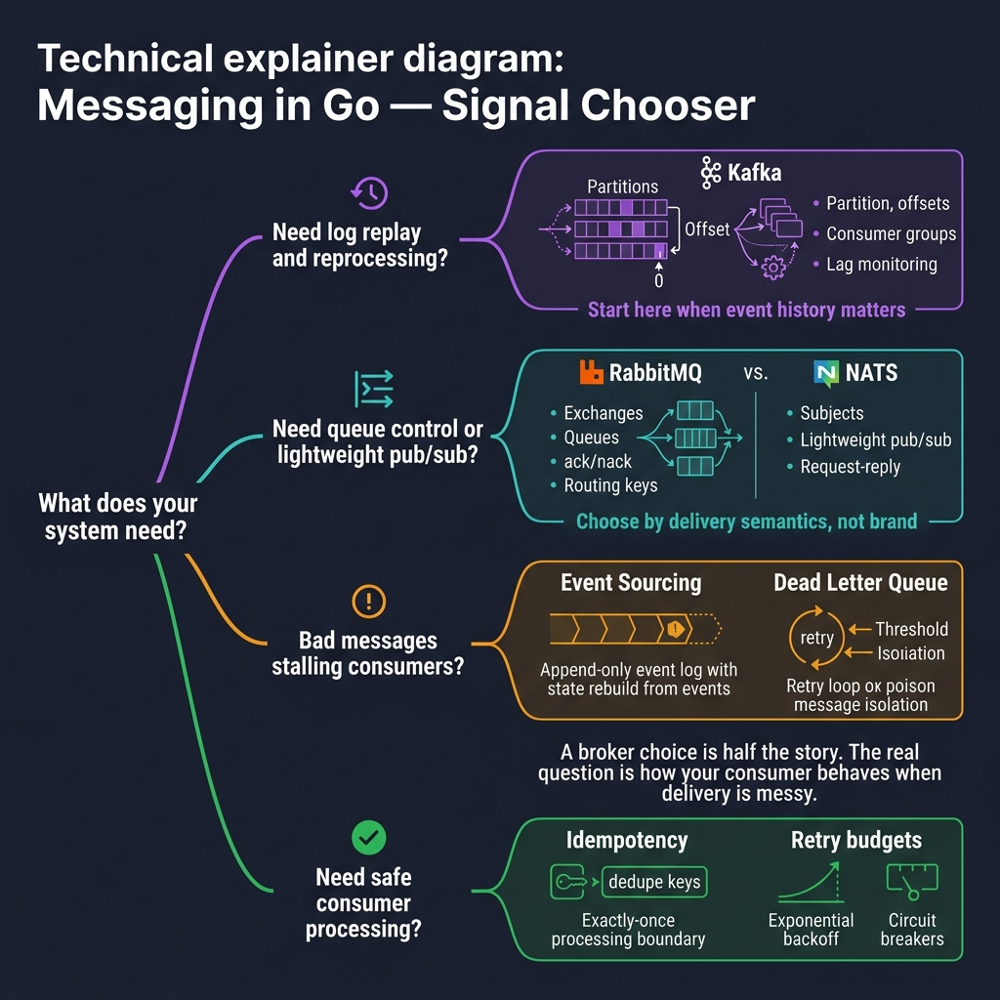

<!-- tags: golang, overview -->
# Messaging in Go

> Kafka, RabbitMQ, NATS, dead-letter queues, and idempotent consumers — the building blocks of reliable async communication between Go services.

📅 Updated: 2026-04-14 · ⏱️ 7 min read

## 1. DEFINE

A broker choice is only half the story. The real question is how your consumer behaves when delivery goes wrong — when a message arrives twice, when a poison payload crashes the handler, when lag grows faster than you can process.

This hub routes you to the right doc based on the problem you face right now.

### 1.1 Signals & Boundaries

- Open this hub when you need to choose a broker or debug a consumer-side failure.
- Each doc is self-contained. Start with the one that matches your current pain point.
- For HTTP-level patterns, see the [Fiber](../fiber/README.md) or [Gin](../gin/README.md) hubs instead.

### 1.2 Learning Lanes

- `01-kafka` — Partitions, offsets, consumer groups, lag monitoring. Start here when event replay matters.
- `02-rabbitmq-nats` — Exchange/queue routing (RabbitMQ) vs subject-based pub/sub (NATS). Choose by delivery semantics.
- `03-event-sourcing` — Append-only event logs that rebuild aggregate state. For when the event history IS the source of truth.
- `04-dead-letter-queue` — Retry loops with thresholds. Isolate poison messages before they stall the entire consumer group.
- `05-idempotency-retry-consumers` — Dedupe keys, exponential backoff, and exactly-once processing boundaries.

## 2. VISUAL

The decision starts with your investigation question — not with the broker brand.



*Figure: Four branches — replay needs lead to Kafka, queue control to RabbitMQ/NATS, poison messages to event sourcing and DLQ, consumer safety to idempotency and retry budgets. The broker is the pipe; the consumer is the contract.*

## 3. CODE

### Example 1: Router — select the doc that matches your goal

> **Goal**: Route to the correct messaging doc by problem type.
> **Approach**: A switch on the pain point returns the file path.
> **Complexity**: O(1).

```go
func chooseLane(goal string) string {
    switch goal {
    case "kafka": return "./01-kafka.md"
    case "rabbitmq nats": return "./02-rabbitmq-nats.md"
    case "event sourcing": return "./03-event-sourcing.md"
    case "dead letter queue": return "./04-dead-letter-queue.md"
    case "idempotency retry consumers": return "./05-idempotency-retry-consumers.md"
    default: return "./README.md"
    }
}
```

> **Takeaway**: Pick the doc by the problem, not the technology. Kafka solves replay; RabbitMQ solves queue control; idempotency solves duplicate processing.

## 4. PITFALLS

| # | Severity | Defect | Impact | Fix |
| --- | --- | --- | --- | --- |
| 1 | 🔴 Fatal | Treating the hub as a scrollable link list | Reader picks a random doc without context | Start from the investigation question, not the table of contents |
| 2 | 🟡 Common | Jumping into Kafka before understanding delivery semantics | Misconfigured offset commits cause data loss | Read the offset commit flow in `01-kafka.md` first |
| 3 | 🔵 Minor | Reading one doc and never returning to the hub | Misses cross-cutting concerns like idempotency | After each doc, check whether DLQ or retry patterns also apply |

## 5. REF

| Resource | Type | Link |
| --- | --- | --- |
| Apache Kafka docs | Official docs | https://kafka.apache.org/documentation/ |
| RabbitMQ tutorials | Official docs | https://www.rabbitmq.com/tutorials |
| NATS docs | Official docs | https://docs.nats.io/ |
| Microservices.io patterns | Reference | https://microservices.io/patterns/index.html |

## 6. RECOMMEND

| Extension | When to proceed | Rationale |
| --- | --- | --- |
| [Apache Kafka](./01-kafka.md) | Need replay, partitions, or consumer group scaling | Kafka treats messages as a persistent log with offset-based consumption |
| [RabbitMQ & NATS](./02-rabbitmq-nats.md) | Need queue discipline or lightweight pub/sub | Choose by ack semantics, not marketing material |
| [Idempotency & Retry](./05-idempotency-retry-consumers.md) | Consumer processes may run twice | Dedupe keys and exponential backoff prevent duplicate side effects |

---
