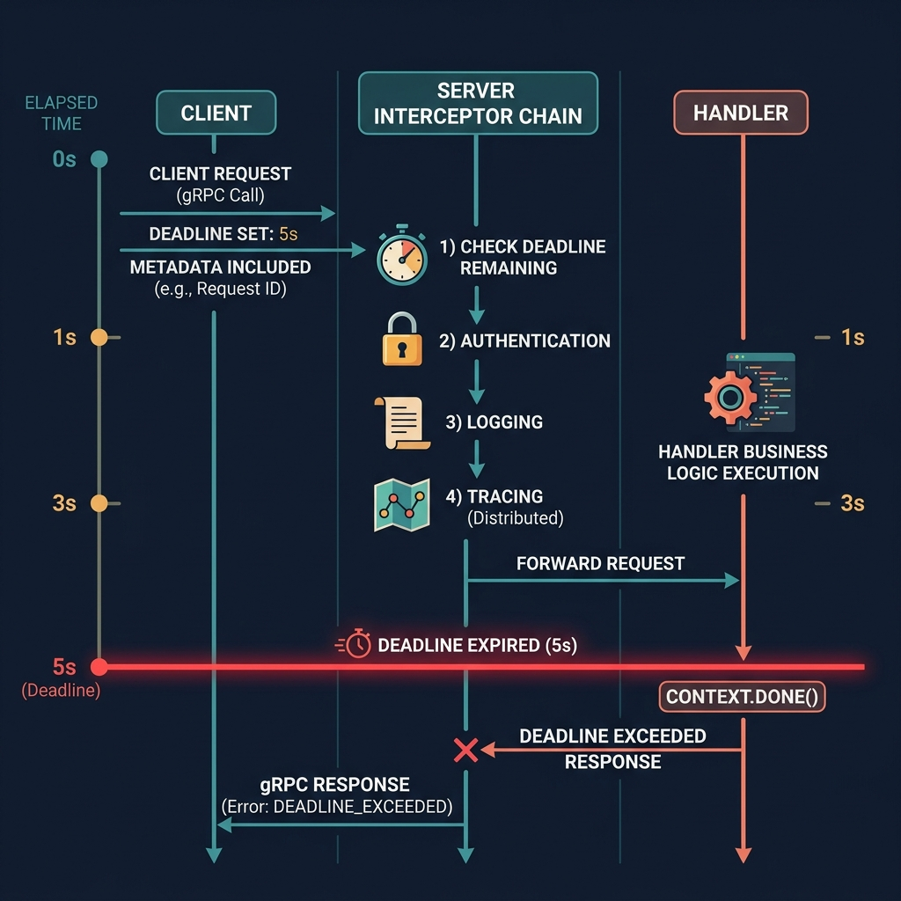

<!-- tags: golang, microservices, grpc -->
# 📡 gRPC & Protocol Buffers — Contracts, Interceptors & Streaming

> REST APIs fail from ambiguous JSON parsing and silent breaking changes. gRPC enforces typed contracts over HTTP/2 streams.

📅 Created: 2026-03-23 · 🔄 Updated: 2026-04-14 · ⏱️ 18 min read

## 1. DEFINE

Inside distributed microservices, relying on JSON payloads parsed across distinct languages breeds chaos. An upstream service drops a JSON key, and downstream parsers suddenly panic silently.

**gRPC** solves runtime ambiguity by cementing payload structures into immutable `.proto` contracts. It replaces human-written HTTP wrappers with generated, highly optimized Go stubs.

### 1.1 Invariants & Failure Modes

| Rule | Rationale |
| --- | --- |
| **Strict Contracts:** Code originates from `.proto` definitions. | Manual HTTP wrappers fracture across deployments. |
| **Deadlines:** Every outgoing remote call requires a timeout. | Unbounded network calls cause cascading exhaustion. |
| **Status Codes:** Map Go errors to gRPC status codes. | Clients need machine-readable codes to decide retry behavior. |

### 1.2 Failure Cascades

- **Timeout Storms:** A developer calls gRPC without `context.WithTimeout`. The downstream database locks. The calling goroutine hangs, crashing the pod.
- **Protocol Bleed:** Returning `errors.New("db failed")` over gRPC maps to `Unknown` status code. Upstream clients cannot distinguish retryable from fatal errors.

## 2. VISUAL

This visual maps how data flows through the interceptor chain. A production RPC starts at the time budget and interceptor layer, not inside the handler.



*Figure: Interceptors capture the network lifecycle before the handler runs. Telemetry belongs in the interceptor chain, not scattered inside domain logic.*

## 3. CODE

This section maps `.proto` interfaces into resilient Go services.

### Example 1: Basic — Protobuf contracts

> **Goal**: Define typed RPC boundaries that generate client stubs.
> **Approach**: Use `.proto` definitions for all cross-service communication.
> **Complexity**: O(1) definition footprint.

```protobuf
// proto/user/v1/user.proto
syntax = "proto3";

package user.v1;
option go_package = "myapp/gen/user/v1;userv1";

service UserService {
  rpc GetUser(GetUserRequest) returns (GetUserResponse);
  rpc WatchUsers(WatchUsersRequest) returns (stream UserEvent);
}

message User {
  string id = 1;
  string email = 2;
}

message GetUserRequest { string id = 1; }
message GetUserResponse { User user = 1; }
message WatchUsersRequest {}
message UserEvent {
  string type = 1;
  User user = 2;
}
```

> **Takeaway**: Protobuf establishes a language-agnostic contract. Both Go backends and typed clients share the same generated schema.

---

### Example 2: Intermediate — Unary handlers & statuses

> **Goal**: Translate internal domain errors into gRPC status codes.
> **Approach**: Use `errors.Is` to map errors, then return `status.Error` with the correct code.
> **Complexity**: O(1) per error classification.

```go
// grpc_server.go
package usersvc

import (
	"context"
	"errors"

	"google.golang.org/grpc/codes"
	"google.golang.org/grpc/status"
	userv1 "myapp/gen/user/v1"
)

var ErrUserNotFound = errors.New("user not found")

type UserRepository interface {
	FindByID(ctx context.Context, id string) (userv1.User, error)
}

type Server struct {
	userv1.UnimplementedUserServiceServer
	repo UserRepository
}

func (s *Server) GetUser(ctx context.Context, req *userv1.GetUserRequest) (*userv1.GetUserResponse, error) {
	user, err := s.repo.FindByID(ctx, req.GetId())
	switch {
	case errors.Is(err, ErrUserNotFound):
		// ✅ Clients interpret NotFound to skip retries.
		return nil, status.Error(codes.NotFound, "user not found")
	case err != nil:
		return nil, status.Error(codes.Internal, "database lookup failed")
	}

	return &userv1.GetUserResponse{
		User: &user,
	}, nil
}
```

> **Takeaway**: Never return raw strings. Clients cannot parse untyped errors to decide whether to retry.

---

### Example 3: Advanced — Deadlines & explicit interceptors

> **Goal**: Wrap outgoing calls with short time budgets and centralized logging.
> **Approach**: Configure a `loggingInterceptor` and enforce `context.WithTimeout` on every call.
> **Complexity**: O(1) per RPC.

```go
// grpc_client.go
package usersvc

import (
	"context"
	"log/slog"
	"time"

	"google.golang.org/grpc"
	"google.golang.org/grpc/credentials/insecure"
	userv1 "myapp/gen/user/v1"
)

func loggingInterceptor(
	ctx context.Context,
	method string,
	req any,
	reply any,
	cc *grpc.ClientConn,
	invoker grpc.UnaryInvoker,
	opts ...grpc.CallOption,
) error {
	start := time.Now()
	err := invoker(ctx, method, req, reply, cc, opts...)
	
	// ✅ Centralize telemetry in the interceptor.
	slog.Info("grpc downstream", "method", method, "latency", time.Since(start), "err", err)
	return err
}

func FetchUser(target, id string) (*userv1.GetUserResponse, error) {
	conn, err := grpc.Dial(
		target,
		grpc.WithTransportCredentials(insecure.NewCredentials()),
		grpc.WithUnaryInterceptor(loggingInterceptor),
	)
	if err != nil {
		return nil, err
	}
	defer conn.Close()

	client := userv1.NewUserServiceClient(conn)

	// ✅ Prevent distributed hangs — the goroutine terminates after 2s.
	ctx, cancel := context.WithTimeout(context.Background(), 2*time.Second)
	defer cancel()

	return client.GetUser(ctx, &userv1.GetUserRequest{Id: id})
}
```

> **Takeaway**: Interceptors track network latency. Handlers cannot see TCP handshakes, so degradation stays invisible without interceptor metrics.

---

### Example 4: Expert — Stream cancellation checks

> **Goal**: Stream events and halt the loop when downstream clients disconnect.
> **Approach**: Check `stream.Context().Done()` inside each loop iteration.
> **Complexity**: O(1) per stream message.

```go
// grpc_streaming.go
package usersvc

import "context"
import userv1 "myapp/gen/user/v1"

func (s *Server) WatchUsers(_ *userv1.WatchUsersRequest, stream userv1.UserService_WatchUsersServer) error {
	events := []userv1.UserEvent{
		{Type: "created", User: &userv1.User{Id: "1"}},
	}

	for _, event := range events {
		select {
		case <-stream.Context().Done():
			// ✅ Stop sending once the client disconnects to prevent goroutine leaks.
			return context.Cause(stream.Context())
		default:
		}

		if err := stream.Send(&event); err != nil {
			return err
		}
	}
	return nil
}
```

> **Takeaway**: Unbounded loops against disconnected streams leak goroutines and crash pods.

## 4. PITFALLS

| # | Defect | Fix |
|---|--------|-----|
| 1 | Using default contexts without timeouts | Enforce `context.WithTimeout` on every outgoing RPC |
| 2 | Returning raw error strings instead of status codes | Map domain errors to `codes.NotFound`, `codes.Internal`, etc. |
| 3 | Scattering telemetry inside handlers | Extract logging/metrics into interceptor chains |

## 5. REF

| Resource | Link |
| --- | --- |
| gRPC Go | [grpc.io/docs/languages/go/](https://grpc.io/docs/languages/go/) |
| Protobuf | [protobuf.dev/best-practices/](https://protobuf.dev/best-practices/dos-donts/) |

## 6. RECOMMEND

| Extension | When to proceed | Rationale |
| --- | --- | --- |
| [Service Discovery](./02-service-discovery.md) | IP addresses rotate frequently | Resolves endpoints dynamically instead of hardcoding IPs |
| [Circuit Breakers](./03-circuit-breaker-resilience.md) | Upstream callers hang on slow dependencies | Isolates degraded services to prevent cascading failures |

**Navigation**: [← Microservices Hub](./README.md) · [→ Service Discovery](./02-service-discovery.md)
