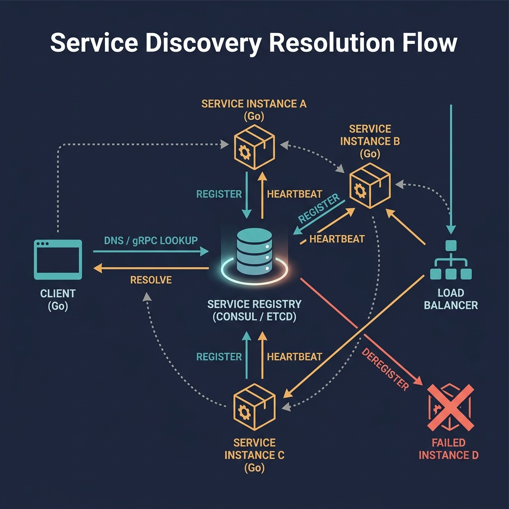

<!-- tags: golang, microservices, service-discovery -->
# 🔍 Service Discovery — Consul, DNS & Client-side Load Balancing

> Microservices decouple only when they locate each other without hardcoded IPs. Use Kubernetes DNS or decentralized registries to route cluster traffic.

📅 Created: 2026-03-23 · 🔄 Updated: 2026-04-14 · ⏱️ 16 min read

## 1. DEFINE

When your platform scales dynamically, a database connection hardcoded to `10.0.0.4` guarantees an eventual production outage. Pods die, nodes rotate, and IP addresses shift constantly. 

**Service Discovery** bridges this gap. It determines how a Go client finds the physical address of a downstream dependency without maintaining static configuration.

### 1.1 Invariants & Failure Modes

| Rule | Rationale |
| --- | --- |
| **Health Awareness:** Registries work only when health checks are reliable. | Routing traffic to dead instances crashes upstream callers. |
| **Resilience Boundaries:** Discovery locates targets; it does not retry failures. | Finding an IP does not guarantee the connection stays alive. |
| **Native Simplicity:** Kubernetes DNS is sufficient for most environments. | Deploying Consul clusters adds operational overhead when DNS already works. |

### 1.2 Failure Cascades

- **Stale Registries:** A service instance crashes but the registry misses the health probe failure. Clients retrieve the dead IP and drop requests into a TCP timeout sink.
- **Client Hotspots:** Clients resolve five targets but always connect to the first element. One pod burns out while the rest idle.

## 2. VISUAL

Discovery handles locating a healthy target. Timeouts and circuit breaking remain the caller's responsibility.



*Figure: Discovery finds the door; resilience ensures you survive knocking on it. Route configuration does not replace retry limits.*

## 3. CODE

This section implements service registration and lookup patterns.

### Example 1: Basic — Consul registration

> **Goal**: Register a service instance with an active health check.
> **Approach**: Create an `AgentServiceRegistration` with an HTTP readiness probe.
> **Complexity**: O(1) registration call.

```go
// consul_register.go
package discovery

import (
	"fmt"
	"github.com/hashicorp/consul/api"
)

func RegisterConsulService(name, host string, port int) error {
	client, err := api.NewClient(api.DefaultConfig())
	if err != nil {
		return err
	}

	return client.Agent().ServiceRegister(&api.AgentServiceRegistration{
		ID:      fmt.Sprintf("%s-%s-%d", name, host, port),
		Name:    name,
		Address: host,
		Port:    port,
		Check: &api.AgentServiceCheck{
			// ✅ Readiness checks confirm the service can handle traffic.
			HTTP:     fmt.Sprintf("http://%s:%d/health/ready", host, port),
			Interval: "10s",
			Timeout:  "3s",
		},
	})
}
```

> **Takeaway**: Never register without health checks. The registry must know when an instance is dead to prevent traffic blackholes.

---

### Example 2: Intermediate — Discovering healthy instances

> **Goal**: Query only healthy instances, rejecting degraded targets.
> **Approach**: Call `Health().Service(..., passingOnly=true)` to filter out failing nodes.
> **Complexity**: O(N) bounded by registered node count.

```go
// consul_discover.go
package discovery

import (
	"fmt"
	"github.com/hashicorp/consul/api"
)

func DiscoverTarget(name string) (string, error) {
	client, err := api.NewClient(api.DefaultConfig())
	if err != nil {
		return "", err
	}

	entries, _, err := client.Health().Service(name, "", true, nil)
	if err != nil {
		return "", err
	}
	if len(entries) == 0 {
		return "", fmt.Errorf("no healthy instances found for %s", name)
	}

	// ✅ Always select from passing entries. See Example 4 for round-robin.
	entry := entries[0] 
	return fmt.Sprintf("%s:%d", entry.Service.Address, entry.Service.Port), nil
}
```

> **Takeaway**: Always reading index `0` creates a hot-spot. Add round-robin or random selection (see Example 4).

---

### Example 3: Advanced — gRPC DNS load balancing

> **Goal**: Use Kubernetes DNS for round-robin load balancing without external registries.
> **Approach**: Dial a headless service domain with gRPC's built-in round-robin policy.
> **Complexity**: O(1) DNS resolution.

```go
// grpc_dns.go
package discovery

import (
	"google.golang.org/grpc"
	"google.golang.org/grpc/credentials/insecure"
)

func DialUserService() (*grpc.ClientConn, error) {
	return grpc.Dial(
		"dns:///user-service.default.svc.cluster.local:50051",
		grpc.WithTransportCredentials(insecure.NewCredentials()),
		// ✅ Round-robin distributes requests across all resolved pod IPs.
		grpc.WithDefaultServiceConfig(`{"loadBalancingConfig": [{"round_robin":{}}]}`),
	)
}
```

> **Takeaway**: If your services run inside Kubernetes, DNS-based discovery replaces standalone registries. Do not add Consul when `svc.cluster.local` already works.

---

### Example 4: Expert — Atomic round-robin selection

> **Goal**: Distribute requests evenly across discovered instances.
> **Approach**: Use `atomic.Uint64` with modulo to rotate targets without locks.
> **Complexity**: O(1) lock-free index selection.

```go
// rr_selector.go
package discovery

import "sync/atomic"

type RoundRobinSelector struct {
	next atomic.Uint64
}

func (s *RoundRobinSelector) Pick(targets []string) (string, bool) {
	if len(targets) == 0 {
		return "", false
	}

	// ✅ Lock-free rotation prevents hot-spotting a single pod.
	index := s.next.Add(1)
	return targets[int(index-1)%len(targets)], true
}
```

> **Takeaway**: Atomic round-robin eliminates hot-spots without mutex contention.

## 4. PITFALLS

Discovery patterns fail when confused with resilience patterns.

| # | Defect | Fix |
| --- | --- | --- |
| 1 | Always reading the first instance from the array | Enforce round-robin or random selection |
| 2 | Trusting cached endpoints without health validation | Reject dead nodes by querying only passing targets |
| 3 | Assuming discovery provides retry semantics | Discovery finds targets; circuit breakers handle failures |

## 5. REF

| Resource | Link |
| --- | --- |
| Consul API | [github.com/hashicorp/consul/api](https://github.com/hashicorp/consul/api) |
| gRPC Load Balancing | [grpc.io/docs/guides/](https://grpc.io/docs/guides/custom-load-balancing/) |

## 6. RECOMMEND

Extend discovery with health validation and failure isolation.

| Extension | When to proceed | Rationale |
| --- | --- | --- |
| [Health endpoints](../cloud-infra/01-health-checks-readiness-liveness.md) | Registry returns stale entries | Health checks keep the registry accurate |
| [Circuit Breakers](./03-circuit-breaker-resilience.md) | Discovery succeeds but calls still fail | Isolates degraded targets from callers |

**Navigation**: [← gRPC & Protobuf](./01-grpc-protobuf.md) · [→ Circuit Breaker](./03-circuit-breaker-resilience.md)
