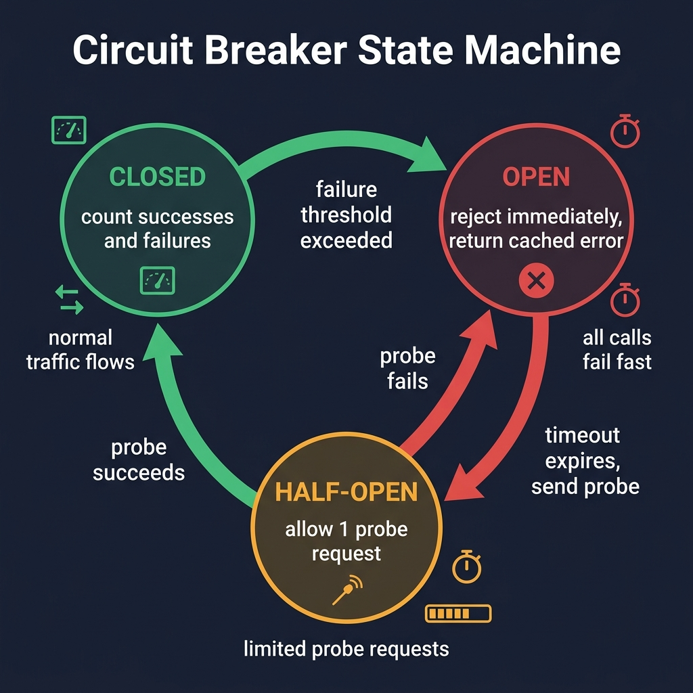

<!-- tags: golang, microservices, resilience -->
# 🔌 Circuit Breaker & Resilience — Timeout, Retry, Bulkhead

> Microservices fail predictably. Without strict timeouts, retry budgets, and circuit breakers, a single degraded dependency quickly crashes the entire upstream system.

📅 Created: 2026-03-23 · 🔄 Updated: 2026-04-14 · ⏱️ 17 min read

## 1. DEFINE

A flapping dependency is dangerous. It accepts TCP connections but drops HTTP responses. If upstream callers retry without timeouts, thread pools exhaust within seconds.

**Resilience Patterns** dictate exactly where a network call requires a timeout, which transient error justifies a limited retry budget, and when an overwhelmed system must immediately reject incoming traffic.

### 1.1 Invariants & Failure Modes

| Rule | Rationale |
| --- | --- |
| **Timeouts First:** Define absolute wait limits. | Without timeouts, retries hang indefinitely. |
| **Retry Budgets:** Cap retry attempts. | Infinite retries act as self-inflicted DDoS attacks. |
| **Circuit Metrics:** Breakers require accurate error states. | Do not trip circuits based upon ambiguous signals. |

### 1.2 Failure Cascades

- **Retry Storms:** A downstream database degrades. Fifty upstream instances retry requests simultaneously. The database melts completely under the amplified load.
- **Bulkhead Collapse:** An external API hangs. The pod consumes all 500 available goroutines waiting for responses. Independent internal endpoints on the same pod begin returning `503 Service Unavailable`.

## 2. VISUAL

A circuit breaker is a state machine protecting ailing downstream services from catastrophic upstream load.



*Figure: The `closed -> open -> half-open` sequence grants dependencies explicit recovery windows. Timeouts represent defensive shields; breakers represent structural load-shedding.*

## 3. CODE

This section maps resilience primitives into standard Go execution paths safely.

### Example 1: Basic — Circuit breakers

> **Goal**: Cut calls hitting a failing downstream service avoiding retry storms.
> **Approach**: Wrap calls with `gobreaker`, which tracks consecutive failures and trips the circuit.
> **Complexity**: O(1) state check per request.

```go
// circuit_breaker.go
package resilience

import (
	"io"
	"log/slog"
	"net/http"
	"time"

	"github.com/sony/gobreaker/v2"
)

var UserServiceBreaker = gobreaker.NewCircuitBreaker[[]byte](gobreaker.Settings{
	Name:        "user-service",
	MaxRequests: 3,
	Interval:    10 * time.Second,
	Timeout:     30 * time.Second,
	ReadyToTrip: func(counts gobreaker.Counts) bool {
		// Trip the breaker explicitly after five consecutive failures.
		return counts.ConsecutiveFailures >= 5
	},
	OnStateChange: func(name string, from, to gobreaker.State) {
		slog.Warn("circuit boundary shifted", "name", name, "from", from, "to", to)
	},
})

func FetchUserRaw(url string) ([]byte, error) {
	return UserServiceBreaker.Execute(func() ([]byte, error) {
		resp, err := http.Get(url)
		if err != nil {
			return nil, err
		}
		defer resp.Body.Close()
		return io.ReadAll(resp.Body)
	})
}
```

> **Takeaway**: Breakers prevent downstream destruction. However, a breaker cannot substitute standard timeout boundaries wrapping the inner HTTP client.

---

### Example 2: Intermediate — Retry budgets

> **Goal**: Retry transient errors using backoff delays averting immediate server saturation.
> **Approach**: Use `retry-go` with attempt caps and exponential backoff.
> **Complexity**: O(K) where K equals the retry limit.

```go
// retry_budget.go
package resilience

import (
	"time"
	"github.com/avast/retry-go/v4"
)

func RetryTransient(call func() error) error {
	return retry.Do(
		call,
		retry.Attempts(3),
		retry.Delay(150*time.Millisecond),
		// Backoff prevents aggressive retries slamming recovering dependencies simultaneously.
		retry.DelayType(retry.BackOffDelay),
		retry.MaxDelay(2*time.Second),
	)
}
```

> **Takeaway**: Stop utilizing generic `for` loops. Bounded retries protect the infrastructure stack cleanly.

---

### Example 3: Advanced — Timeout & bulkheads

> **Goal**: Limit wait durations and cap absolute concurrency pushing against external APIs.
> **Approach**: Wrap execution utilizing `context.WithTimeout` and a rigid semaphore channel.
> **Complexity**: O(1) allocation overhead per request.

```go
// timeout_bulkhead.go
package resilience

import (
	"context"
	"time"
)

var extSem = make(chan struct{}, 20)

func CallExternal(ctx context.Context, fn func(context.Context) error) error {
	ctx, cancel := context.WithTimeout(ctx, 2*time.Second)
	defer cancel()

	select {
	case <-ctx.Done():
		return ctx.Err()
	case extSem <- struct{}{}:
	}
	defer func() { <-extSem }()

	return fn(ctx)
}
```

> **Takeaway**: Implementing breakers without bulkheads allows bad downstreams to consume complete concurrency limits. Semaphores isolate resource exhaustion securely.

---

### Example 4: Expert — Degraded fallbacks

> **Goal**: Generate degraded responses when breakers open maintaining partial system availability.
> **Approach**: Separate `ErrOpenState` logic returning cached values safely.
> **Complexity**: O(1) control flow routing.

```go
// breaker_fallback.go
package resilience

import (
	"errors"
	"github.com/sony/gobreaker/v2"
)

func FetchUserWithFallback(
	breaker *gobreaker.CircuitBreaker[[]byte],
	call func() ([]byte, error),
	fallback func() ([]byte, error),
) ([]byte, error) {
	payload, err := breaker.Execute(call)
	if err == nil {
		return payload, nil
	}

	if errors.Is(err, gobreaker.ErrOpenState) || errors.Is(err, gobreaker.ErrTooManyRequests) {
		// Fallbacks apply solely to operations tolerating eventual consistency safely.
		return fallback()
	}

	return nil, err
}
```

> **Takeaway**: Never use fallbacks to hide write failures. Degraded responses work only for idempotent read paths.

## 4. PITFALLS

Recognize where teams implement resilience backward causing delayed catastrophic failures.

| # | Defect | Fix |
| --- | --- | --- |
| 1 | Retrying permanent business logic failures | Limit retries targeting transient network timeouts explicitly. |
| 2 | Defining massive outer timeouts spanning missing inner constraints | Define tight deadlines hop-by-hop sequentially. |
| 3 | Operating breakers lacking state tracking telemetry | Emit metric limits during breaker transitions rigidly. |
| 4 | Building bulkheads without concurrency limits | Use semaphores to cap max concurrent calls |

## 5. REF

| Resource | Link |
| --- | --- |
| gobreaker | [github.com/sony/gobreaker](https://github.com/sony/gobreaker) |
| retry-go | [github.com/avast/retry-go](https://github.com/avast/retry-go) |

## 6. RECOMMEND

Extend resilience structures mapping dynamic dependencies securely.

| Extension | When to proceed | Rationale |
| --- | --- | --- |
| Request hedging | Workloads exhibit immense p99 latency spikes | Hedges actively diminish tail latency without tripping circuits. |
| Fallback Cache | Downstream reads fail periodically | Degraded modes sustain UI interfaces rendering properly. |
| [Observability & Tracing](./06-observability-tracing.md) | Debugging isolated retries proves impossible locally | Visualizes exact retry volumes parsing broken boundaries. |

**Navigation**: [← Service Discovery](./02-service-discovery.md) · [→ API Gateway & BFF](./04-api-gateway-bff.md)
