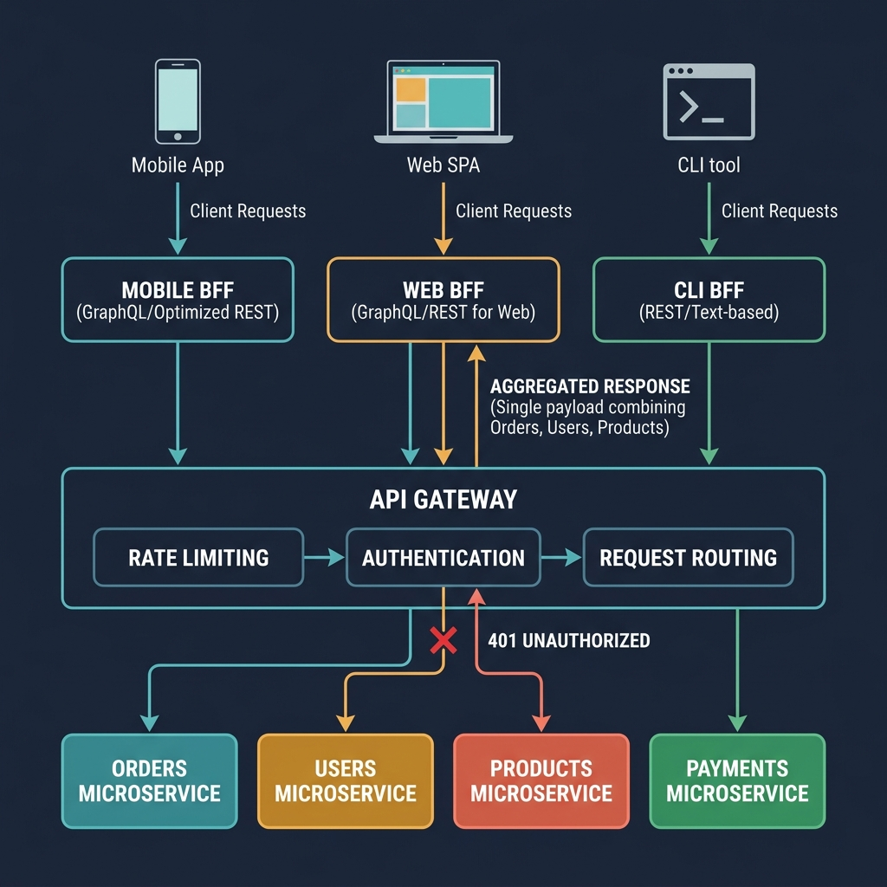

<!-- tags: golang, microservices, gateway -->
# 🚪 API Gateway & BFF — Edge Routing, Aggregation & Auth Boundaries

> Frontends should never orchestrate downstream microservices directly. Pass ingress traffic through API Gateways and BFFs to control routing, enforce edge authentication, and aggregate schemas safely.

📅 Created: 2026-03-28 · 🔄 Updated: 2026-04-14 · ⏱️ 16 min read

## 1. DEFINE

When mobile clients execute six sequential REST calls to render a single dashboard, latency multiplies. If those clients also orchestrate database transactions, your architecture collapses.

**API Gateways** and **Backends for Frontends (BFF)** sit at the edge. They intercept public ingress traffic, validate identities, aggregate disparate downstreams, and shield internal topologies.

### 1.1 Invariants & Failure Modes

| Pattern | Target |
| --- | --- |
| **API Gateway** | General edge router serving multiple diverse clients (web, mobile, third-party). |
| **BFF** | Dedicated edge optimizing payloads for one specific client type. |

| Rule | Rationale |
| --- | --- |
| **Thin Edge:** Gateways route traffic; they do not calculate business domain logic. | Fat gateways degrade into impossible monolithic structures rapidly. |
| **Edge Auth:** Gateways validate JWTs and strip identity headers. | Downstream nodes cannot trust raw public headers. |
| **Capped Fan-out:** Aggregation requires global timeouts. | Waiting for three downstream endpoints without limits locks gateway threads. |

### 1.2 Failure Cascades

- **The Monolithic Edge:** Teams inject billing calculations directly into the gateway. The gateway deployment blocks core releases. Scaling routing topologies becomes impossible.
- **DDoS via Aggregation:** A BFF loops over a retrieved array, triggering an N+1 query pattern hitting the underlying product service. A single mobile request translates into fifty backend queries, destroying the internal network.

## 2. VISUAL

This map clarifies the strict boundary distinguishing edge concerns from internal business rules structurally.



*Figure: BFFs reshape data to match client UX dimensions. Gateways route traffic. Neither layer executes domain business logic.*

## 3. CODE

This section translates theoretical edge orchestration into native Go request pipelines safely.

### Example 1: Basic — Reverse proxy routing

> **Goal**: Route external edge requests directly toward internal downstream domains securely.
> **Approach**: Use `httputil.NewSingleHostReverseProxy` to build a standard HTTP pipeline.
> **Complexity**: O(1) configuration routing.

```go
// gateway_proxy.go
package gateway

import (
	"net/http"
	"net/http/httputil"
	"net/url"
)

func NewUserProxy(target string) (http.Handler, error) {
	parsed, err := url.Parse(target)
	if err != nil {
		return nil, err
	}
	
	// This standard proxy hides pure internal network layers efficiently.
	return httputil.NewSingleHostReverseProxy(parsed), nil
}
```

> **Takeaway**: Stop handwriting wrapper handlers forwarding raw HTTP requests. Use native proxies maintaining header structures safely.

---

### Example 2: Intermediate — BFF payload aggregation

> **Goal**: Merge distinct downstream payloads matching isolated dashboard layouts securely.
> **Approach**: Call `users` and `orders` internally, emitting a structured JSON map.
> **Complexity**: O(N) downstream dependency overhead.

```go
// gateway_bff.go
package gateway

import (
	"context"
	"encoding/json"
	"net/http"
)

type UserClient interface {
	GetUser(ctx context.Context, userID string) (map[string]any, error)
}
type OrderClient interface {
	ListOrders(ctx context.Context, userID string) ([]map[string]any, error)
}

func DashboardHandler(users UserClient, orders OrderClient) http.HandlerFunc {
	return func(w http.ResponseWriter, r *http.Request) {
		userID := r.URL.Query().Get("user_id")
		
		user, err := users.GetUser(r.Context(), userID)
		if err != nil {
			http.Error(w, "user lookup failed", http.StatusBadGateway)
			return
		}
		
		userOrders, err := orders.ListOrders(r.Context(), userID)
		if err != nil {
			http.Error(w, "order lookup failed", http.StatusBadGateway)
			return
		}

		// The BFF shapes this response explicitly serving specific frontend view requirements.
		_ = json.NewEncoder(w).Encode(map[string]any{
			"user":   user,
			"orders": userOrders,
		})
	}
}
```

> **Takeaway**: BFFs aggregate endpoints avoiding sequential UI latency penalties safely.

---

### Example 3: Advanced — Edge subject enforcement

> **Goal**: Validate subjects reliably propagating clean context headers internally.
> **Approach**: Establish strict middleware extracting validated identities cleanly.
> **Complexity**: O(1) header parsing execution.

```go
// gateway_auth.go
package gateway

import (
	"context"
	"net/http"
)

type ctxKey string
const subjectKey ctxKey = "subject"

func AuthMiddleware(next http.Handler) http.Handler {
	return http.HandlerFunc(func(w http.ResponseWriter, r *http.Request) {
		// In production, validate JWTs cryptographically before trusting this field.
		subject := r.Header.Get("Authorization")
		if subject == "" {
			http.Error(w, "unauthorized payload", http.StatusUnauthorized)
			return
		}
		
		// Map verified identities propagating downstream contexts cleanly.
		ctx := context.WithValue(r.Context(), subjectKey, subject)
		next.ServeHTTP(w, r.WithContext(ctx))
	})
}
```

> **Takeaway**: If downstream nodes read raw public identity headers, your perimeter fractures insecurely. Gateways authenticate contexts squarely.

---

### Example 4: Expert — Fan-out boundaries

> **Goal**: Query disjoint downstream endpoints extracting structural limits efficiently concurrently.
> **Approach**: Spawn goroutines executing queries parallel securely inside bounded global timeouts.
> **Complexity**: O(1) concurrent request pooling per client invocation.

```go
// gateway_parallel.go
package gateway

import (
	"context"
	"encoding/json"
	"net/http"
	"time"
)

func DashboardParallelHandler(users UserClient, orders OrderClient) http.HandlerFunc {
	return func(w http.ResponseWriter, r *http.Request) {
		ctx, cancel := context.WithTimeout(r.Context(), 800*time.Millisecond)
		defer cancel()

		userID := r.URL.Query().Get("user_id")
		userCh := make(chan map[string]any, 1)
		orderCh := make(chan []map[string]any, 1)

		go func() {
			data, _ := users.GetUser(ctx, userID)
			userCh <- data
		}()
		go func() {
			data, _ := orders.ListOrders(ctx, userID)
			orderCh <- data
		}()

		// Concurrently blocking waits against standard bounded contexts cleanly.
		userData := <-userCh
		orderData := <-orderCh

		_ = json.NewEncoder(w).Encode(map[string]any{
			"user":   userData,
			"orders": orderData,
		})
	}
}
```

> **Takeaway**: Without timeouts, a failed order service stalls the entire dashboard and exhausts proxy connections.

## 4. PITFALLS

Operating edges carelessly traps development workflows and eliminates iteration velocities.

| # | Defect | Fix |
| --- | --- | --- |
| 1 | Computing active business domain rules | Return logic executing centrally within internal microservices explicitly. |
| 2 | Calling Fan-outs missing overall context constraints | Frame goroutines inside bounded `context.WithTimeout` layers squarely. |
| 3 | Using one gateway for unrelated client screens | Build separate BFF instances per client type |

## 5. REF

| Resource | Link |
| --- | --- |
| `httputil.ReverseProxy` | [pkg.go.dev/net/http/httputil](https://pkg.go.dev/net/http/httputil) |
| BFF Pattern | [samnewman.io/patterns/architectural/bff/](https://samnewman.io/patterns/architectural/bff/) |

## 6. RECOMMEND

Expand gateway designs with security and observability.

| Extension | When to proceed | Rationale |
| --- | --- | --- |
| Rate-Limiting | Burst traffic at ingress exceeds capacity | Prevents DDoS attacks from crashing internal services |
| Edge Caching | Dashboard screens read mostly-static data | Reduces downstream fan-out and database load |
| [Tracing](./06-observability-tracing.md) | Gateway requests scatter across many downstreams | Traces fan-out latency and correlates request paths |

**Navigation**: [← Circuit Breaker](./03-circuit-breaker-resilience.md) · [→ Saga & Outbox](./05-saga-outbox-microservices.md)
