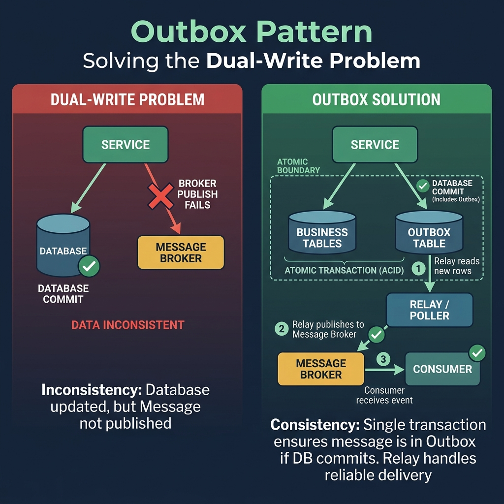
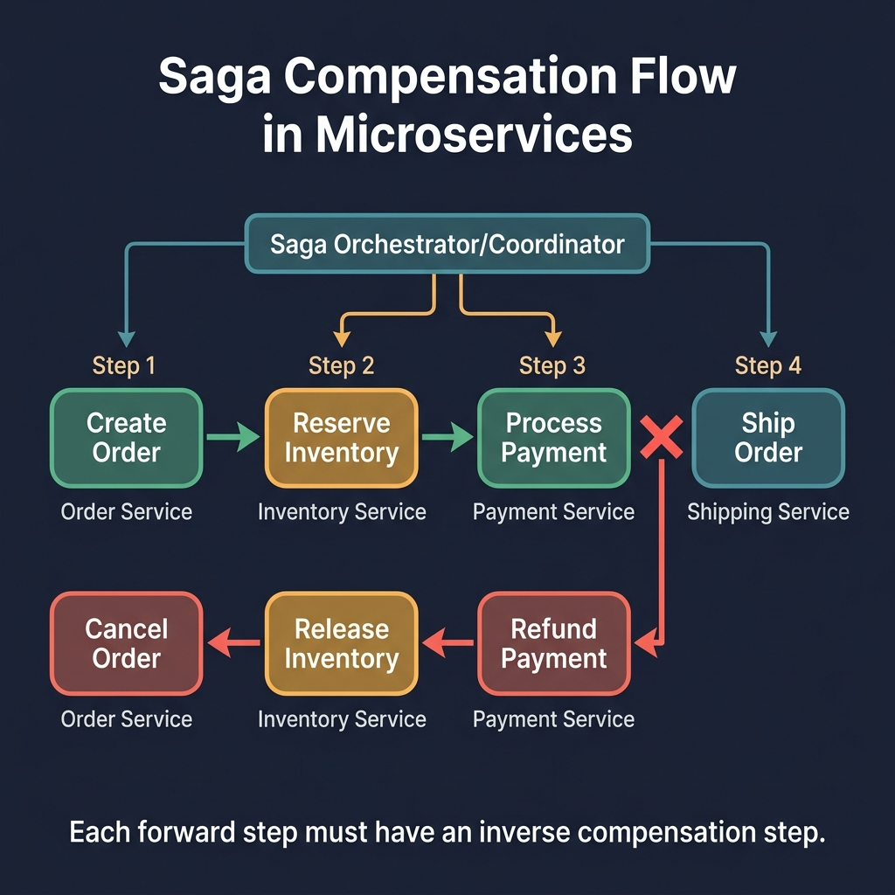

<!-- tags: golang, microservices, distributed-systems -->
# 🔁 Saga, Outbox & Distributed Consistency

> Microservices break ACID constraints permanently. When transactions span multiple independent databases, utilize Saga orchestration and Outbox patterns to enforce eventual consistency.

📅 Created: 2026-03-28 · 🔄 Updated: 2026-04-14 · ⏱️ 17 min read

## 1. DEFINE

A user clicks checkout. The `order` service writes to PostgreSQL. The `payment` service reserves funds in MySQL. Suddenly, the network drops the message intended for the `inventory` service. 

Without distributed consistency patterns, your database state splinters. **Sagas** and **Outboxes** replace monolithic database rollbacks with explicit event-driven compensation workflows.

### 1.1 Invariants & Failure Modes

| Pattern | Rationale |
| --- | --- |
| **Outbox** | Resolves the dual-write gap between database commits and broker publishes. |
| **Saga** | Replaces cross-database locks with sequenced local transactions. |
| **Compensation** | Reverses completed local transactions when a subsequent step fails. |

### 1.2 Failure Cascades

- **Dual-Write Splits:** A handler saves a record to the database but crashes before publishing the Kafka event. Downstream services never provision child resources, corrupting system state.
- **Zombie Sagas:** A `payment` step fails. The `order` service has no compensation step. Customer funds are trapped in a permanent pending state, requiring manual database intervention.

## 2. VISUAL

This visual separates database durability from eventual event delivery.



*Figure: The outbox pattern guarantees delivery. Your transaction commits the event payload locally. A separate relay process reads the outbox table and publishes messages.*



*Figure: Compensation reverses previous successes. It runs as a separate forward-moving transaction that undoes prior domain changes.*

## 3. CODE

This section translates theoretical distributed concepts into explicit Go structural components.

### Example 1: Basic — Transactional outbox write

> **Goal**: Write business state and the event payload inside a single Postgres transaction.
> **Approach**: Open one transaction, insert the entity, append the outbox record, commit.
> **Complexity**: O(1) per transaction.

```go
// outbox_write.go
package microsaga

import (
	"context"
	"database/sql"
)

func CreateOrderWithOutbox(ctx context.Context, db *sql.DB, orderID string, payload []byte) error {
	tx, err := db.BeginTx(ctx, nil)
	if err != nil {
		return err
	}
	defer tx.Rollback()

	if _, err := tx.ExecContext(ctx, `insert into orders(id) values ($1)`, orderID); err != nil {
		return err
	}
	
	// ✅ Persist the event in the same transaction to close the dual-write gap.
	if _, err := tx.ExecContext(ctx, `insert into outbox(order_id, payload) values ($1, $2)`, orderID, payload); err != nil {
		return err
	}
	return tx.Commit()
}
```

> **Takeaway**: Do not write to the database and then call `kafka.Publish()`. A network partition between the two calls will split your data.

---

### Example 2: Intermediate — Saga step contracts

> **Goal**: Standardize step interfaces so every forward action has a matching compensation.
> **Approach**: Define a `Step` interface with `Execute` and `Compensate` methods.
> **Complexity**: O(1) interface definition.

```go
// saga_step.go
package microsaga

import "context"

type Step interface {
	Name() string
	Execute(ctx context.Context) error
	
	// Compensate reverses the operation completed by Execute.
	Compensate(ctx context.Context) error
}
```

> **Takeaway**: Sagas require explicit rollback logic. Without compensation, you are running sequential scripts, not a saga.

---

### Example 3: Advanced — Compensating runners

> **Goal**: Execute steps sequentially and reverse completed steps if any step fails.
> **Approach**: Track completed steps in a slice. On failure, iterate backward calling `Compensate`.
> **Complexity**: O(N) linear over the step count.

```go
// saga_runner.go
package microsaga

import "context"

func RunSaga(ctx context.Context, steps []Step) error {
	completed := make([]Step, 0, len(steps))

	for _, step := range steps {
		if err := step.Execute(ctx); err != nil {
			
			// ✅ Reverse completed steps in LIFO order to undo partial state.
			for i := len(completed) - 1; i >= 0; i-- {
				_ = completed[i].Compensate(ctx)
			}
			return err
		}
		completed = append(completed, step)
	}

	return nil
}
```

> **Takeaway**: A local database transaction success does not confirm a global business process success.

## 4. PITFALLS

Distributed consistency patterns break when compensation logic is missing or non-idempotent.

| # | Defect | Fix |
| --- | --- | --- |
| 1 | Compensation operations are not idempotent | Ensure compensations handle duplicate execution |
| 2 | Missing correlation IDs across saga steps | Store trace IDs that link all steps in the workflow |

## 5. REF

| Resource | Link |
| --- | --- |
| Saga Frameworks | [microservices.io/patterns/data/saga.html](https://microservices.io/patterns/data/saga.html) |
| Transactional Outbox | [microservices.io/patterns/data/transactional-outbox.html](https://microservices.io/patterns/data/transactional-outbox.html) |

## 6. RECOMMEND

Extend distributed consistency with observability and orchestration.

| Extension | When to proceed | Rationale |
| --- | --- | --- |
| [Tracing](./06-observability-tracing.md) | Distributed steps fail with no visibility | Traces link saga steps across service boundaries |
| Workflow Engines | Sagas grow into complex multi-branch flows | Workflow engines track state, retries, and timeouts centrally |

**Navigation**: [← API Gateway & BFF](./04-api-gateway-bff.md) · [→ Observability & Tracing](./06-observability-tracing.md)
