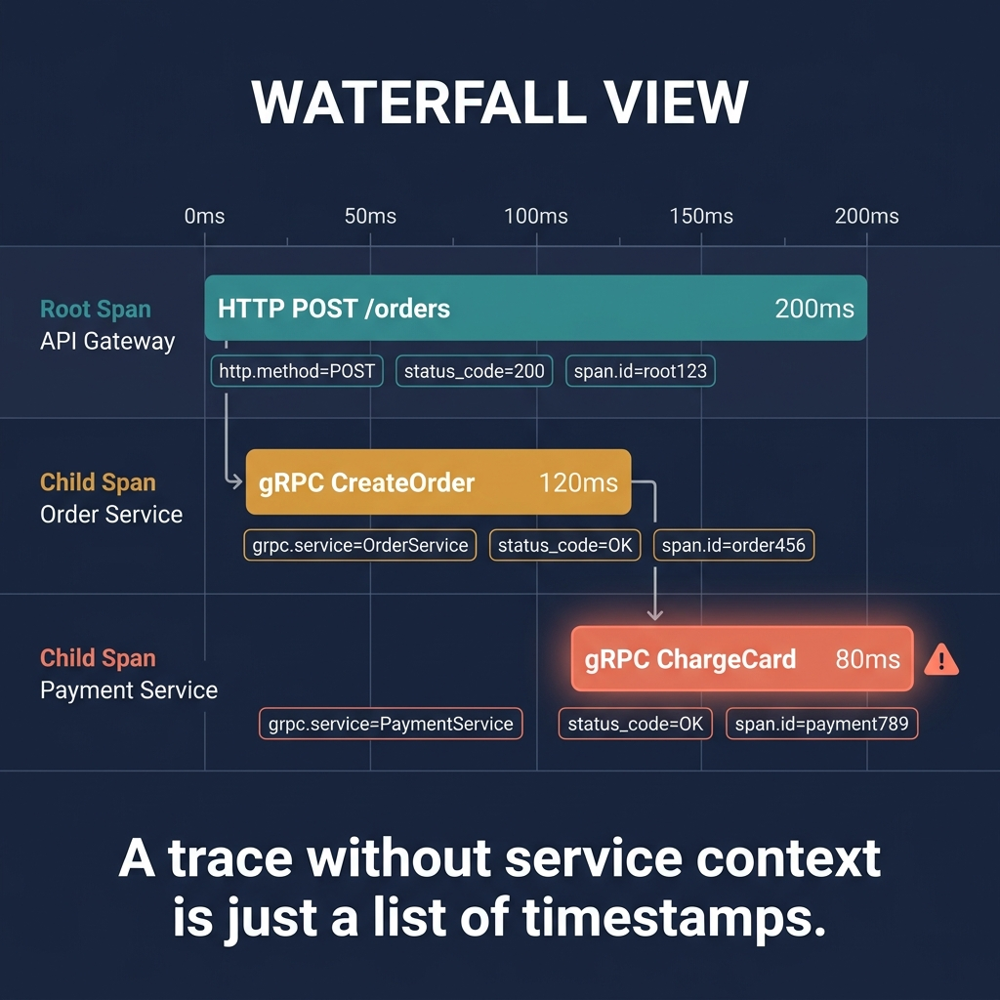

<!-- tags: golang, microservices, observability -->
# 🧭 Observability & Tracing — Logs, Metrics, Correlation IDs

> When microservices crash, debugging across twenty independent binaries without trace IDs is impossible. Inject correlation IDs that span `context`, logs, and HTTP boundaries.

📅 Created: 2026-03-28 · 🔄 Updated: 2026-04-14 · ⏱️ 16 min read

## 1. DEFINE

A request traverses an API gateway, calls an auth service, and finally hits the payment service. The payment service throws a timeout. If each service generates random isolated log lines, you cannot reconstruct the event sequence. 

**Observability** dictates that services must share distributed identities. Correlation IDs thread the needle across disparate microservices.

### 1.1 Invariants & Failure Modes

| Signal | Role |
| --- | --- |
| **Logs** | High-fidelity recording explaining exactly why an isolated function crashed. |
| **Metrics** | Aggregated counters tracking error rate spikes that trigger pager alerts. |
| **Traces** | Call trees bridging multiple distinct boundaries. |

### 1.2 Failure Cascades

- **The Broken Trace:** Service A generates trace `id-1`. Service A calls Service B. Service B ignores the incoming header and generates `id-2`. When debugging, the request vanishes completely between A and B safely.
- **Unstructured Noise:** Using `fmt.Printf` emitting unstructured text prevents parsing. When incidents occur, searching for specific customer IDs inside a billion fragmented lines crashes the log aggregator cleanly.

## 2. VISUAL

Observability relies on boundaries. An identity must originate at the edge and persist through every subsequent network hop.



*Figure: Tracing succeeds only when the request identity remains continuous from ingress straight to the final database query.*

## 3. CODE

This section integrates distributed structural parity cleanly using Go contexts securely.

### Example 1: Basic — Correlation ID injection

> **Goal**: Seed correlation IDs from incoming HTTP headers.
> **Approach**: Middleware extracts `X-Correlation-ID` and embeds it in the request context.
> **Complexity**: O(1) header extraction per HTTP request.

```go
// correlation_id.go
package observability

import (
	"context"
	"net/http"
	"github.com/google/uuid"
)

type ctxKey string
const correlationIDKey ctxKey = "correlation_id"

func CorrelationID(next http.Handler) http.Handler {
	return http.HandlerFunc(func(w http.ResponseWriter, r *http.Request) {
		id := r.Header.Get("X-Correlation-ID")
		if id == "" {
			// ✅ Gateways generate trace roots when no ID exists.
			id = uuid.NewString()
		}
		
		w.Header().Set("X-Correlation-ID", id)
		
		// Map the boundary firmly against internal contexts safely.
		ctx := context.WithValue(r.Context(), correlationIDKey, id)
		next.ServeHTTP(w, r.WithContext(ctx))
	})
}

func CorrelationIDFromContext(ctx context.Context) string {
	v, _ := ctx.Value(correlationIDKey).(string)
	return v
}
```

> **Takeaway**: If your HTTP router lacks correlation middleware, distributed debugging terminates directly routing blindly.

---

### Example 2: Intermediate — Structured contextual logs

> **Goal**: Ensure the shared ID populates physical log outputs consistently reliably.
> **Approach**: Build a helper appending contexts squarely onto standard `slog` structures.
> **Complexity**: O(1) log attribute append.

```go
// logger.go
package observability

import (
	"context"
	"log/slog"
)

func LoggerWithContext(ctx context.Context, logger *slog.Logger) *slog.Logger {
	// ✅ Attach correlation ID to every log entry from this point.
	return logger.With(
		"correlation_id", CorrelationIDFromContext(ctx),
		"service", "order-service",
	)
}
```

> **Takeaway**: Structured logging transitions tracing IDs from invisible context variables into highly searchable data assets.

---

### Example 3: Advanced — Network boundary propagation

> **Goal**: Eject internal correlation IDs mapping directly onto outbound HTTP calls cleanly.
> **Approach**: Extract the string embedding it securely within `req.Header.Set`.
> **Complexity**: O(1) header injection.

```go
// downstream_headers.go
package observability

import (
	"context"
	"net/http"
)

func NewRequestWithCorrelation(ctx context.Context, method, url string) (*http.Request, error) {
	req, err := http.NewRequestWithContext(ctx, method, url, nil)
	if err != nil {
		return nil, err
	}
	
	// Force outbound clients to pass tracing evidence forward securely.
	if id := CorrelationIDFromContext(ctx); id != "" {
		req.Header.Set("X-Correlation-ID", id)
	}
	return req, nil
}
```

> **Takeaway**: Failing to inject IDs into outbound calls severs the trace chain across service boundaries.

## 4. PITFALLS

Trace fragmentation stems from inconsistent ID handling.

| # | Defect | Fix |
| --- | --- | --- |
| 1 | Each service generates its own request ID | Propagate the ingress correlation ID from the edge |
| 2 | Logging unstructured freeform text | Use structured logging with nested key-value pairs |

## 5. REF

| Resource | Link |
| --- | --- |
| Go slog | [pkg.go.dev/log/slog](https://pkg.go.dev/log/slog) |
| OpenTelemetry Go | [opentelemetry.io/docs/languages/go/](https://opentelemetry.io/docs/languages/go/) |

## 6. RECOMMEND

Extend tracing into deeper observability and resilience.

| Extension | When to proceed | Rationale |
| --- | --- | --- |
| OpenTelemetry SDK | Latency gaps span multiple services | Injects spans with timing data across call trees |
| [Circuit Breakers](./03-circuit-breaker-resilience.md) | Network paths hang frequently | Correlates breaker trips with trace data for root-cause analysis |

**Navigation**: [← Saga & Outbox](./05-saga-outbox-microservices.md) · [→ Config & Secrets](./07-config-secrets-feature-flags.md)
