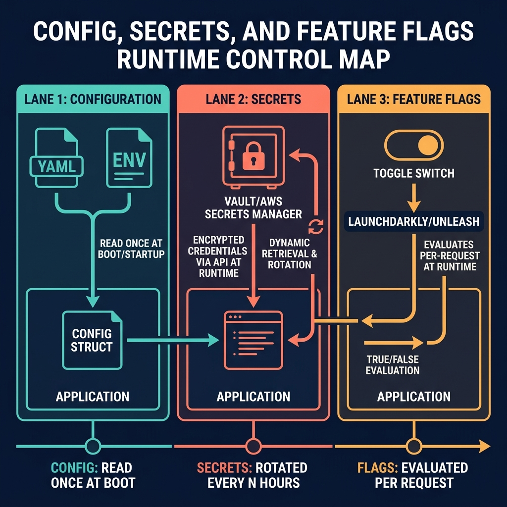

<!-- tags: golang, microservices, config -->
# ⚙️ Config, Secrets & Feature Flags — Runtime Control for Go Services

> Hardcoded variables break deployments. Feature flags lacking cleanup policies create zombie code. Manage configuration, secrets, and dynamic rollouts securely without leaking credentials into logs.

📅 Created: 2026-03-28 · 🔄 Updated: 2026-04-14 · ⏱️ 16 min read

## 1. DEFINE

When a database password rotates, code should never require a recompile. When a new feature breaks production, rollback must occur instantly without triggering Kubernetes pod restarts. 

**Runtime Control** governs how Go binaries separate immutable code from mutable environment constraints. It splits parameters into configs (URLs), secrets (keys), and flags (rollouts).

### 1.1 Invariants & Failure Modes

| Type | Handling Strategy |
| --- | --- |
| **Configuration** | Passed via environment variables. Must validate exclusively on boot. |
| **Secrets** | Injected via secure memory mounts. Must never print to standard output. |
| **Feature Flags** | Evaluated per request. Must include aggressive expiration dates. |

### 1.2 Failure Cascades

- **Silent Boot Failure:** A deployment misses the `PAYMENT_URL` environment variable. The Go binary boots without error. Two hours later, a customer triggers the missing route and the transaction crashes.
- **Zombie Flags:** An experimental billing flag remains active for three years. A junior engineer refactors the flag evaluation logic. The system accidentally defaults to the experimental path, charging random users incorrectly.

## 2. VISUAL

This visual separates the three control boundaries. Configurations boot the app. Secrets authenticate the app. Flags steer the traffic.



*Figure: Mixing lifecycles causes incidents. Never store database credentials inside A/B testing flag software.*

## 3. CODE

This section demonstrates how Go code handles untrusted environmental inputs.

### Example 1: Basic — Boot validation

> **Goal**: Parse required configurations during startup ensuring the service fails fast initially.
> **Approach**: Read `os.Getenv` into typed structs validating required constraints firmly.
> **Complexity**: O(1) boot sequence verification.

```go
// config.go
package runtimecfg

import (
	"fmt"
	"os"
	"time"
)

type Config struct {
	HTTPPort       string
	UserServiceURL string
	RequestTimeout time.Duration
}

func Load() (Config, error) {
	cfg := Config{
		HTTPPort:       os.Getenv("HTTP_PORT"),
		UserServiceURL: os.Getenv("USER_SERVICE_URL"),
		RequestTimeout: 2 * time.Second,
	}

	// ✅ Validate on boot to prevent delayed runtime crashes.
	if cfg.HTTPPort == "" {
		return Config{}, fmt.Errorf("HTTP_PORT remains unconfigured")
	}
	if cfg.UserServiceURL == "" {
		return Config{}, fmt.Errorf("USER_SERVICE_URL remains unconfigured")
	}
	return cfg, nil
}
```

> **Takeaway**: If your service successfully boots without its required downstream URLs, your deployment verification pipeline is structurally broken.

---

### Example 2: Intermediate — Secret masking

> **Goal**: Prevent raw struct dumps from leaking cryptographic credentials into Datadog.
> **Approach**: Build explicit `SafeFields()` methods returning masked subset maps exclusively.
> **Complexity**: O(1) allocation overhead per log structure.

```go
// secret_mask.go
package runtimecfg

type DBConfig struct {
	Host     string
	User     string
	Password string
}

func (c DBConfig) SafeFields() map[string]any {
	// ✅ Strip sensitive fields; replace values with masks.
	return map[string]any{
		"db_host": c.Host,
		"db_user": c.User,
		"db_pass": "***",
	}
}
```

> **Takeaway**: Without safe field projections, `.Printf("%+v", cfg)` debug statements become credential leaks.

---

### Example 3: Advanced — Feature flag evaluation

> **Goal**: Toggle runtime paths securely without deploying fresh container images.
> **Approach**: Inject a `FlagStore` evaluating constraints dynamically.
> **Complexity**: O(1) branch evaluation.

```go
// feature_flags.go
package runtimecfg

import "context"

type FlagStore interface {
	Enabled(ctx context.Context, name string) (bool, error)
}

func UseFastPath(ctx context.Context, flags FlagStore) (bool, error) {
	// ✅ Flags decouple releases from deployments.
	return flags.Enabled(ctx, "fast_export_pipeline")
}
```

> **Takeaway**: External flag systems require network hops. Wrap flag evaluations in local caches avoiding severe latency degradation on hot paths.

---

### Example 4: Expert — Tenant flag fallbacks

> **Goal**: Roll out features per tenant while surviving flag service outages.
> **Approach**: Evaluate `EnabledForTenant`. Return safe baseline values when errors occur.
> **Complexity**: O(1) error handling fallback sequence.

```go
// tenant_flags.go
package runtimecfg

import "context"

type TenantFlagStore interface {
	EnabledForTenant(ctx context.Context, tenantID string, name string) (bool, error)
}

func UseFastPathForTenant(ctx context.Context, flags TenantFlagStore, tenantID string) bool {
	enabled, err := flags.EnabledForTenant(ctx, tenantID, "fast_export_pipeline")
	
	if err != nil {
		// ✅ When the flag service fails, default to the stable path.
		return false
	}
	return enabled
}
```

> **Takeaway**: Network timeouts pulling flags must default to stable, predictable legacy behaviors avoiding massive distributed outages cleanly.

## 4. PITFALLS

Evaluating parameters statically avoids structural system instability.

| # | Defect | Fix |
| --- | --- | --- |
| 1 | Hardcoding URLs into constant string chains | Establish strict boot configuration models. |
| 2 | Dumping complete configurations into log streams | Restrict logging targeting safe projection subsets. |
| 3 | Utilizing feature flags permanently | Enforce flag sunset pipelines deleting old branches. |
| 4 | Storing application secrets within standard maps | Inject credentials utilizing distinct secure Vault engines. |

## 5. REF

| Resource | Link |
| --- | --- |
| 12-Factor Config | [12factor.net/config](https://12factor.net/config) |
| Feature Flags | [martinfowler.com/articles/feature-toggles.html](https://martinfowler.com/articles/feature-toggles.html) |

## 6. RECOMMEND

Operational boundaries define deployment safety.

| Extension | When to proceed | Rationale |
| --- | --- | --- |
| [Runtime Config](../cloud-infra/03-configmaps-secrets-runtime-config.md) | Reloading values without container restarts | Synchronizes config updates without pod recreation |
| Configuration Vaults | Migrating secrets from raw env vars | Centralizes credential rotation and reduces leak risk |

**Navigation**: [← Observability & Tracing](./06-observability-tracing.md) · [↑ Microservices Hub](./README.md)
