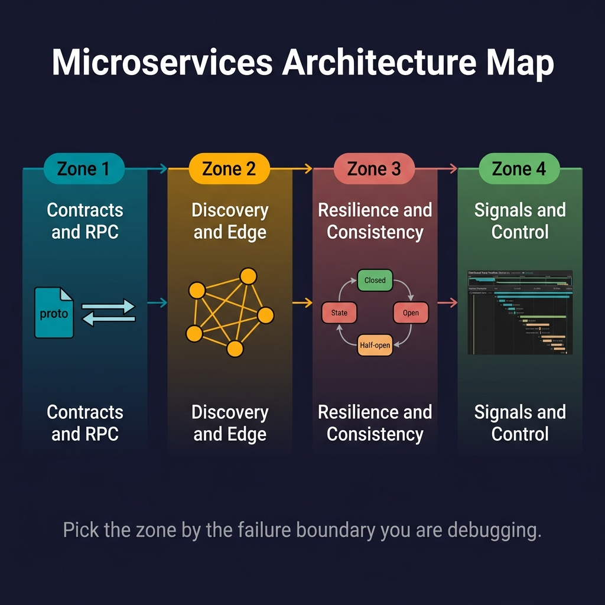

<!-- tags: golang, overview, microservices -->
# Microservices in Go

> Routing, resilience, distributed consistency, and observability for Go services communicating over network boundaries.

📅 Created: 2026-03-24 · 🔄 Updated: 2026-04-14 · ⏱️ 7 min read

## 1. DEFINE

Building a fast Go binary is trivial. Operating ten Go binaries communicating synchronously over network boundaries is inherently unstable. When a request traverses an API gateway, triggers three gRPC downstream calls, and publishes an outbox event, simple procedural logic breaks down. 

This **Microservices** module maps how Go handles failing networks, fluctuating downstream instances, and distributed transaction rollbacks.

### 1.1 Signals & Boundaries

- Open this hub when diagnosing distributed failures: cascading timeouts, split-brain data states, or missing telemetry traces.
- Keep learning lanes focused on network boundaries, not single-binary memory optimizations.
- Stop treating network calls like local function calls. Engineer resilience at every connection point.

### 1.2 Learning Lanes

- `01-grpc-protobuf`: Cross-service contracts replacing REST ambiguity with HTTP/2 streaming.
- `02-service-discovery`: Dynamic client-side load balancing when static IP routing fails at scale.
- `03-circuit-breaker-resilience`: Isolates degraded dependencies from crushing upstream callers.
- `04-api-gateway-bff`: Separates public REST ingress from internal gRPC networks.
- `05-saga-outbox-microservices`: Data consistency across services without distributed ACID transactions.
- `06-observability-tracing`: Correlation IDs that propagate across network boundaries for distributed tracing.

## 2. VISUAL

This router maps distributed symptoms to the architectural pattern that resolves them.



*Figure: Seven learning lanes organized by failure type. Cascading timeouts route to circuit breakers. Data inconsistency routes to saga/outbox. Missing traces route to observability.*

## 3. CODE

The pseudo-router below classifies distributed symptoms into the right doc.

### Example 1: Router artifact — identifying distributed domains

> **Goal**: Map a failure symptom to the corresponding resilience pattern.
> **Approach**: Route symptoms to the right doc by failure signature.
> **Complexity**: O(1) diagnostic mapping.

```go
func diagnoseDistributedSymptom(symptom string) string {
	switch symptom {
	case "JSON structural changes constantly break downstream parsers":
		return "./01-grpc-protobuf.md"
	case "traffic continually hits pods that Kubernetes already terminated":
		return "./02-service-discovery.md"
	case "a slow user database destroys the entire checkout service capacity":
		return "./03-circuit-breaker-resilience.md"
	case "mobile clients require drastically different payloads than desktop interfaces":
		return "./04-api-gateway-bff.md"
	case "orders are placed successfully but inventory fails to deduct properly":
		return "./05-saga-outbox-microservices.md"
	case "impossible to track which service dropped a user request internally":
		return "./06-observability-tracing.md"
	default:
		return "./README.md"
	}
}
```

> **Takeaway**: Stop guessing during a cascading failure. Map the failure signature to the pattern.

## 4. PITFALLS

Distributed systems fail when engineers underestimate network unreliability.

| # | Defect | Fix |
| --- | --- | --- |
| 1 | Treating remote gRPC calls like local method calls | Wrap every network boundary with timeouts and context cancellation |
| 2 | Retrying indefinitely against degraded services | Circuit breakers prevent retry storms from destroying dependencies |
| 3 | Attempting distributed ACID across independent databases | Use Outbox patterns for eventual consistency |

## 5. REF

| Resource | Link |
| --- | --- |
| gRPC Go Documentation | [grpc.io/docs/languages/go/](https://grpc.io/docs/languages/go/) |
| Microservices Patterns | [microservices.io/patterns](https://microservices.io/patterns/index.html) |
| OpenTelemetry Go | [opentelemetry.io/docs/languages/go/](https://opentelemetry.io/docs/languages/go/) |

## 6. RECOMMEND

Choose the next doc based on your distributed failure symptom.

| Extension | When to proceed | Rationale |
| --- | --- | --- |
| [gRPC & Protobuf](./01-grpc-protobuf.md) | JSON schemas break integrations | Locks cross-service contracts with code-generated types |
| [Service Discovery](./02-service-discovery.md) | Static routing fails at scale | Client-side load balancing adapts to pod lifecycle |
| [Circuit Breakers](./03-circuit-breaker-resilience.md) | Single dependency cascades | Isolates degraded services from crushing callers |
| [Cloud Infrastructure](../cloud-infra/README.md) | Pods crash on deployment | Health probes and resource limits at the orchestrator level |
