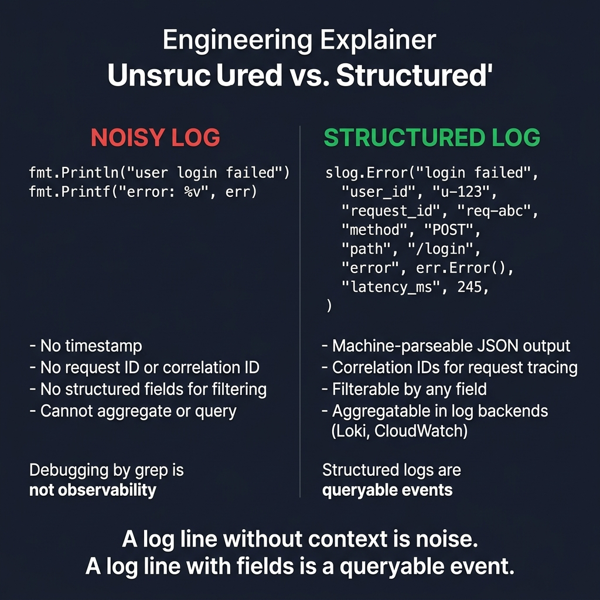

<!-- tags: golang, observability, logging -->
# 🪵 Structured Logging with slog — Stable Fields, Context, Redaction

> Production logging demands stable field taxonomy — queryable keys, correlation IDs, and automated redaction. This section uses `log/slog` to build structured logging for Go services.

📅 Created: 2026-03-28 · 🔄 Updated: 2026-04-09 · ⏱️ 16 min read

| Aspect | Detail |
| --- | --- |
| **Complexity** | Intermediate → Advanced |
| **Use case** | HTTP/gRPC services that need searchable, contextualized log output without leaked secrets |
| **Go libs** | `log/slog`, `context`, `net/http`, `os` |
| **Prerequisites** | HTTP middleware basics, error handling |

## 1. DEFINE

Production incidents start with frustration: log streams are abundant but answer zero diagnostic questions. Structured logging with `slog` turns erratic text clues into queryable evidence with stable field schemas.

> *Grep error 50. slog JSON fields query.*

### What precisely defines structured logging?

Rather than unconditionally dumping fluid generic text:

```text
payment failed for user 42 after 2 retries
```

Rigorous logging actively binds deterministic stable operational fields:

```text
msg="payment failed" user_id=42 retry_attempt=2 gateway=stripe request_id=req-123
```

### Actors

| Actor | Role |
| --- | --- |
| Request middleware | Binds trace IDs and request context fields |
| Application/service layer | Emits significant business events |
| Logger adapter | Standardizes field taxonomy and handles redaction |
| Log backend | Indexes fields for diagnostic queries |

### Invariants

| Rule | Meaning |
| --- | --- |
| Field taxonomy remains absolute | Firmly ensures cohesive searching alongside coherent dashboards |
| Hardened redaction shielding raw secrets | Drastically averts critical token/password leakage disasters |
| Intentional log level separation | Dramatically reduces chaotic profound production noise |

### Failure Modes

| Failure | Cause | Fix |
| --- | --- | --- |
| Diagnostic searches fail | Inconsistent key names across services | Normalize field names in a shared logging convention |
| Secrets leak to log backends | Dumping raw request bodies or configs | Intercept and redact at the logger adapter level |
| Logs are noise | Logging micro-transactions with no diagnostic value | Reserve log entries for events that change investigation direction |

These failures look trivial to prevent. The trap: inconsistent keys make querying impossible, and dumping raw payloads leaks secrets into indexed log backends. Both are addressed in PITFALLS.
## 2. VISUAL

Structured logging fails not because the logger is missing, but because the field taxonomy is unstable. The diagram below contrasts noisy unstructured logs with queryable structured output.



*Figure: LEFT — `fmt.Println` output with no timestamp, no request ID, and no structured fields. RIGHT — `slog.Error` output with machine-parseable JSON, correlation IDs, and filterable fields. A log line without context is noise; a log line with fields is a queryable event.*

## 3. CODE

You observed raw signal cascades, traced requests, and mapped goroutines clearly exploring **Structured Logging with slog — Stable Fields, Context, Redaction**. Now execute direct transitions embedding strict architectural code strongly reinforcing exact structures undeniably shielding your production footprint.

### Example 1: Basic — Create JSON slog logger

> **Goal**: Create a JSON logger with stable default fields (`service`, `runtime`) for all log output.
> **Approach**: Use `slog.NewJSONHandler` instead of `fmt.Println`. JSON output guarantees stable field names.
> **Example**: Setting `service=payment-api` ensures every log line carries `service=payment-api runtime=go`.
> **Complexity**: O(1).

```go
// logger.go — Build a JSON logger with stable defaults for services
package observability

import (
	"log/slog"
	"os"
)

func NewLogger(service string) *slog.Logger {
	handler := slog.NewJSONHandler(os.Stdout, &slog.HandlerOptions{
		// ✅ Info level is the right baseline for production log streams.
		Level: slog.LevelInfo,
	})

	return slog.New(handler).With(
		// ✅ Default fields guarantee consistent index correlation across services.
		"service", service,
		"runtime", "go",
	)
}
```

> **Takeaway**: This establishes the logging foundation: all subsequent log events inherit stable fields. It does not bind request-scoped context — that requires middleware.

Rigid JSON logging securely established. However, robust fundamental request-scoped architectural contexts unequivocally mandate rigid logger binding — securely inject explicit middlewares.

### Example 2: Intermediate — Request context logging

> **Goal**: Bind `request_id`, HTTP method, and route to each request via middleware.
> **Approach**: Inject a `With(...)` logger into `context.Context` so downstream handlers extract it without manual parameter passing.
> **Example**: `GET /orders/42` with `X-Request-ID=req-123` emits `request_id=req-123 method=GET path=/orders/42`.
> **Complexity**: O(1) per request.

```go
// request_logger.go — Attach request metadata to each request-scoped logger
package observability

import (
	"context"
	"log/slog"
	"net/http"
	"time"

"github.com/google/uuid"
)

type ctxKey string

const requestLoggerKey ctxKey = "request_logger"

func RequestLogger(base *slog.Logger) func(http.Handler) http.Handler {
	return func(next http.Handler) http.Handler {
		return http.HandlerFunc(func(w http.ResponseWriter, r *http.Request) {
			// ✅ Prefer upstream request IDs for cross-service correlation.
			requestID := r.Header.Get("X-Request-ID")
			if requestID == "" {
				requestID = uuid.NewString()
			}

logger := base.With(
				"request_id", requestID,
				"method", r.Method,
				"path", r.URL.Path,
			)

start := time.Now()
			ctx := context.WithValue(r.Context(), requestLoggerKey, logger)
			next.ServeHTTP(w, r.WithContext(ctx))

// ✅ Completion logs with duration and request_id enable incident-time queries.
			logger.Info("request completed", "duration_ms", time.Since(start).Milliseconds())
		})
	}
}

func LoggerFromContext(ctx context.Context) *slog.Logger {
	logger, ok := ctx.Value(requestLoggerKey).(*slog.Logger)
	if ok {
		return logger
	}

// ⚠️ Fallback avoids panics when middleware is missing.
	// Production should enforce RequestLogger middleware on all routes.
	return slog.Default()
}
```

> **Takeaway**: Service layers extract loggers from `ctx` — no manual field passing. Use `context.WithValue` only for request-scoped data (loggers, traces, auth claims).

Request contexts are isolated. Next: prevent secrets from reaching log backends.

### Example 3: Advanced — Redact sensitive fields before logging

> **Goal**: Intercept passwords, tokens, and authorization headers before they serialize into logs.
> **Approach**: Centralize redaction in a single adapter instead of trusting callers to remember.
> **Example**: Input `{"password":"123","authorization":"Bearer abc"}` outputs `password=[REDACTED] authorization=[REDACTED]`.
> **Complexity**: O(n × k) where n = field count, k = key length.

```go
// redaction.go — Keep security-sensitive values out of logs
package observability

import "strings"

func RedactSecrets(fields map[string]string) map[string]string {
	redacted := make(map[string]string, len(fields))

for key, value := range fields {
		lowerKey := strings.ToLower(key)
		switch {
		case strings.Contains(lowerKey, "password"),
			strings.Contains(lowerKey, "token"),
			strings.Contains(lowerKey, "s			// ✅ Key-name matching intercepts common log leakage vectors.
			redacted[key] = "[REDACTED]"
		default:
			// ⚠️ Copy non-secret values without mutating the input map.
			redacted[key] = value
		}
	}

	return redacted
}
```

> **Takeaway**: Centralized redaction enforces uniform policies. Key-name heuristics cover common cases, but payloads with PII hidden in non-obvious fields require dedicated security review.

Redaction securely locked. Still, dependency failures absolutely necessitate stable event schemas — rigidly normalize outputs.

### Example 4: Expert — Stable event logger with normalized error codes

> **Goal**: Log isolated dependency errors meticulously mirroring intensely stable event schemas, empowering strict downstream dashboards alongside alerts executing queries targeting `dependency`, `error_code`, and `request_id` overriding brittle full localized error text.
> **Approach**: Encapsulate logging helpers in the service/platform layer, guaranteeing every dependency failure normalizes field names before emission.
> **Example**: Navigating pure Stripe timeout failures during checkout → outputs rigorous `dependency call failed` event capturing tightly `dependency=stripe error_code=payment_gateway_timeout`.
> **Complexity**: Exact O(m) tracking explicitly `m` supplemental fields; strict O(m) space accommodating structured slice attributes.

```go
// event_logger.go — Normalize dependency failure logs into stable searchable fields
package observability

import (
	"context"
	"log/slog"
)

type ctxKey string

const loggerKey ctxKey = "logger"

func LoggerFromContext(ctx context.Context) *slog.Logger {
	if logger, ok := ctx.Value(loggerKey).(*slog.Logger); ok && logger != nil {
		return logger
	}
	return slog.Default()
}

func LogDependencyFailure(
	ctx context.Context,
	logger *slog.Logger,
	dependency string,
	errorCode string,
	err error,
	extraFields ...any,
) {
	fields := []any{
		"dependency", dependency,
		"error_code", errorCode,
	}

	if err != nil {
		// ✅ Keep raw error text for debugging, but index by stable error_code.
		fields = append(fields, "error", err.Error())
	}

	fields = append(fields, extraFields...)

	activeLogger := logger
	if activeLogger == nil {
		activeLogger = LoggerFromContext(ctx)
	}

	activeLogger.With(
		"dependency", dependency,
		"error_code", errorCode,
	).Error("dependency call failed", fields...)
}
```

> **Takeaway**: This shifts logging from "recording what happened" to "designing event schemas for operations." Use this pattern for gateways, brokers, DBs, and external APIs. Skip it for internal logs that don’t need platform-level standardization.

JSON loggers, request contexts, redaction, and event schemas are covered. The danger ahead: inconsistent fields and secret leaks — the traps from DEFINE.

## 4. PITFALLS

Flawless mechanical architectures mapping **Structured Logging with slog — Stable Fields, Context, Redaction** securely operate. Navigating specifically the traps directly beneath reveals scenarios exactly where executing teams totally corrupt tight timing hierarchies, abandon foundational ownership, or irreparably compromise core evidence solely recognizing severe defects exclusively trailing explosive active incident eruptions.

| # | Defect | Fix |
| --- | --- | --- |
| 1 | Using `fmt.Println` in production | Replace with `slog` JSON logger |
| 2 | Dumping raw request bodies containing secrets | Redact at the adapter level, whitelist safe fields |
| 3 | Inconsistent field names across services | Define a shared logging convention |
| 4 | Logging at Info for everything | Use `Info/Warn/Error` tiers based on operational impact |

JSON loggers, contexts, redaction, and event schemas are in place. References for deeper dives:

## 5. REF

| Resource | Link |
| --- | --- |
| Go slog | https://pkg.go.dev/log/slog |
| Go blog: slog | https://go.dev/blog/slog |
| OpenTelemetry semantic conventions | https://opentelemetry.io/docs/specs/semconv/ |

## 6. RECOMMEND

After structured logging is in place, extend into correlated tracing and log management.

| Extension | When to proceed | Rationale |
| --- | --- | --- |
| [Request/trace correlation](./03-open-telemetry-tracing.md) | Cross-service requests need correlated traces | Logs + traces share request_id for end-to-end diagnosis |
| Log sampling | High-throughput services generate too much log volume | Reduces backend ingestion costs without losing error coverage |
| Centralized schema | Multiple teams share a log backend | A shared field convention prevents key drift across services |

## 7. QUIZ

### Quick Check

1. Why does structured logging replace text logging?
2. Which two fields should appear in every service log line?
3. Where must secret redaction happen?

### Answer Key

1. Structured fields enable aggregation, filtering, and correlation queries that plain text cannot support.
2. `request_id` and `service`. Optionally `user_id` or `dependency` when available.
3. Inside the central logging adapter, before string serialization reaches the log backend.

## 8. NEXT STEPS

- Next: [Prometheus RED Metrics](./02-prometheus-red-metrics.md)
- Or intensely deploy [Observability & Tracing in microservices](../microservices/06-observability-tracing.md)
