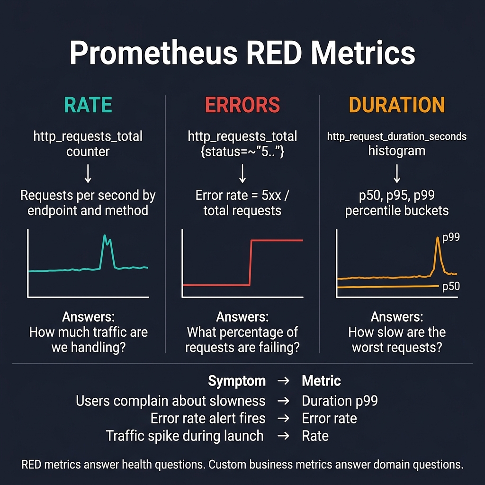
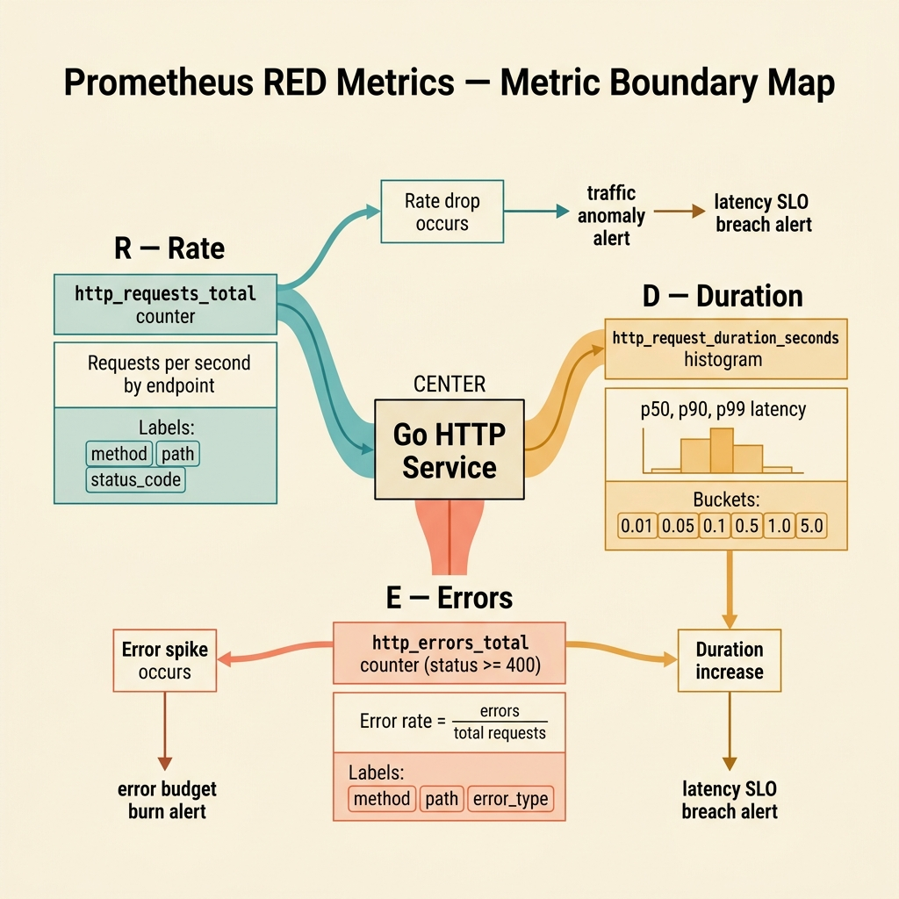

<!-- tags: golang, observability, metrics -->
# 📊 Prometheus RED Metrics — Rate, Errors, Duration

> Monitoring CPU and RAM alone surfaces problems too late. RED metrics — Rate, Errors, Duration — answer user-facing health questions for HTTP Go services, paired with cardinality constraints to keep Prometheus usable.

📅 Created: 2026-03-28 · 🔄 Updated: 2026-04-09 · ⏱️ 17 min read

| Aspect | Detail |
| --- | --- |
| **Complexity** | Advanced |
| **Use case** | API services mandating robust dashboards alongside explicit alerts tracking exact user-facing symptoms |
| **Go libs** | `github.com/prometheus/client_golang/prometheus`, `promhttp`, `net/http` |
| **Prerequisites** | HTTP middleware, latency basics |

## 1. DEFINE

Production incidents start with two questions: how are users suffering, and which service is causing it. RED metrics isolate answers fast enough to preserve investigation bandwidth.

> *Where is the sluggish drop? Prometheus rate p99 error health.*

### What is the RED method?

| Metric | Answered Question |
| --- | --- |
| Rate | How many requests per second are we handling? |
| Errors | What percentage of requests are failing? |
| Duration | How slow are the worst requests (p99)? |

RED aligns with request-driven architectures: HTTP, gRPC, API gateways.

### Invariants

| Rule | Meaning |
| --- | --- |
| Strict low label cardinality | Prevents Prometheus memory bloat from explosive label combinations |
| Metrics mirror logical routes | Stable dashboards; `/orders/:id` not `/orders/42` |
| Histogram buckets tuned to SLOs | Exposes true percentile latency, not misleading averages |

### Failure Modes

| Failure | Cause | Fix |
| --- | --- | --- |
| TSDB bloat / OOM crash | Using dynamic `user_id` or `order_id` as metric labels | Restrict labels to low-cardinality dimensions only |
| Broken dashboards | Recording raw paths like `/users/123` instead of route templates | Normalize to `/users/:id` |
| Alerts miss latency spikes | Tracking averages instead of percentiles | Use histogram percentiles (p95, p99) |

These failures look trivial but are fatal: misaligned histogram buckets distort percentiles, and high-cardinality labels cause Prometheus OOM crashes. Both are addressed in PITFALLS.
## 2. VISUAL

RED metrics serve two teaching jobs: mapping symptoms to the right metric family, and understanding how Rate, Errors, and Duration form three distinct analytical lenses on the same service.



*Figure: Three columns — Rate (`http_requests_total` counter), Errors (5xx ratio), Duration (histogram p50/p95/p99). Bottom row maps user complaints ("slowness" → p99, "errors" → error rate, "traffic spike" → rate) to the right metric.*



*Figure: Rate, Errors, and Duration are complementary — not interchangeable. Each answers a different health question about the same service.*

## 3. CODE

The visual established the diagnostic framework. The code below implements RED metrics step by step.

### Example 1: Basic — Define RED metrics

> **Goal**: Register baseline RED metrics — total request counter and duration histogram — with low-cardinality labels.
> **Approach**: Use `CounterVec` + `HistogramVec` with labels: `service`, `route`, `method`, `status_class`. Never use `user_id` or raw dynamic paths as labels.
> **Example**: `POST /orders/:id` returning 500 increments `http_requests_total{route="/orders/:id",status_class="5xx"}`.
> **Complexity**: O(1) registration, O(1) per metric update.

```go
// red_metrics.go — Register low-cardinality RED metrics for an HTTP service
package observability

import "github.com/prometheus/client_golang/prometheus"

var (
	requestsTotal = prometheus.NewCounterVec(
		prometheus.CounterOpts{
			Name: "http_requests_total",
			Help: "Total number of HTTP requests.",
		},
		// ✅ Restrict labels to low-cardinality dimensions useful for alerting.
		[]string{"service", "route", "method", "status_class"},
	)

requestDuration = prometheus.NewHistogramVec(
		prometheus.HistogramOpts{
			Name:    "http_request_duration_seconds",
			Help:    "Duration of HTTP requests.",
			// ✅ Buckets centered around SLO targets. Ignore extreme upper tiers.
			Buckets: []float64{0.01, 0.05, 0.1, 0.25, 0.5, 1, 2, 5},
		},
		[]string{"service", "route", "method"},
	)
)

func MustRegisterMetrics() {
	prometheus.MustRegister(requestsTotal, requestDuration)
}
```

> **Takeaway**: This foundation locks metric field names. Dashboards and alert rules survive route deployments without breaking. Dynamic request binding happens in the middleware below.

Counters registered. Next: attach duration tracking via HTTP middleware.

### Example 2: Intermediate — Instrument middleware

> **Goal**: Wrap HTTP handlers to update `rate` and `duration` per request, classifying status into `2xx/4xx/5xx`.
> **Approach**: A `statusRecorder` intercepts `WriteHeader` to capture the status code. Metrics are recorded after handler completion.
> **Example**: `GET /checkout` returning `502` in `700ms` increments the `5xx` counter and observes `0.7s` in the duration histogram.
> **Complexity**: O(1) per request.

```go
// metrics_middleware.go — Collect RED metrics around HTTP handlers
package observability

import (
	"net/http"
	"strconv"
	"time"

	"github.com/prometheus/client_golang/prometheus"
)

var (
	requestsTotal = prometheus.NewCounterVec(
		prometheus.CounterOpts{
			Name: "http_requests_total",
			Help: "Total number of HTTP requests.",
		},
		[]string{"service", "route", "method", "status_class"},
	)
	requestDuration = prometheus.NewHistogramVec(
		prometheus.HistogramOpts{
			Name:    "http_request_duration_seconds",
			Help:    "Duration of HTTP requests.",
			Buckets: []float64{0.01, 0.05, 0.1, 0.25, 0.5, 1, 2, 5},
		},
		[]string{"service", "route", "method"},
	)
)

type statusRecorder struct {
	http.ResponseWriter
	status int
}

func (r *statusRecorder) WriteHeader(code int) {
	// ✅ Capture status code for downstream 2xx/4xx/5xx classification.
	r.status = code
	r.ResponseWriter.WriteHeader(code)
}

func MetricsMiddleware(service string, route string, next http.Handler) http.Handler {
	return http.HandlerFunc(func(w http.ResponseWriter, r *http.Request) {
		start := time.Now()
		recorder := &statusRecorder{ResponseWriter: w, status: http.StatusOK}

		next.ServeHTTP(recorder, r)

		// ✅ Coarse status class (2xx/4xx/5xx) enables service-level alerting without per-code cardinality.
		statusClass := strconv.Itoa(recorder.status/100) + "xx"
		requestsTotal.WithLabelValues(service, route, r.Method, statusClass).Inc()
		requestDuration.WithLabelValues(service, route, r.Method).Observe(time.Since(start).Seconds())
	})
}
```

> **Takeaway**: RED metrics are now captured automatically per route. The critical rule: `route` must be a static template (`/orders/:id`), not a raw URL path. Dynamic paths cause TSDB bloat.

Histograms wrapped. Next: expose the `/metrics` endpoint on a separate mux.

### Example 3: Advanced — Expose metrics endpoint and separate app routes

> **Goal**: Serve `/metrics` on a separate mux, not through business middleware, to avoid recursive self-instrumentation.
> **Approach**: Register `promhttp.Handler()` on a dedicated `ServeMux` instead of the application's main mux.
> **Example**: Application routes pass through `MetricsMiddleware`; `/metrics` is served separately for Prometheus scraping.
> **Complexity**: Strict O(1) isolated configuration; perfectly optimal O(1) negligible request handling overheads executing metric endpoints directly.

```go
// metrics_server.go — Keep /metrics explicit and avoid instrumenting it recursively
package observability

import (
	"net/http"

"github.com/prometheus/client_golang/prometheus/promhttp"
)

func RegisterMetricsEndpoint(mux *http.ServeMux) {
	mux.Handle("/metrics", promhttp.Handler())
}
```

> **Takeaway**: Separating `/metrics` from the application mux prevents recursive instrumentation. As services grow, serve debug/metrics endpoints on an admin port.

Metrics endpoint isolated. Next: turn RED metrics into actionable Prometheus alerts.

### Example 4: Expert — Multi-window RED alert for 5xx burn symptoms

> **Goal**: Turn RED metrics into a multi-window Prometheus alert that pages on sustained 5xx burns, not transient spikes.
> **Approach**: A `PrometheusRule` with two windows (5m short, 30m long) fires only when both show elevated 5xx ratios.
> **Example**: If 5xx ratio exceeds 5% over 5 minutes AND exceeds 2% over 30 minutes, page the on-call.
> **Complexity**: O(1) in-app. The real complexity is tuning the thresholds to match your service's error budget.

```yaml
# prometheus-rule.yaml — RED alert tuned for sustained checkout failures
groups:
  - name: checkout-red
    rules:
      - alert: CheckoutServiceHighErrorRate
        expr: |
          (
            sum(rate(http_requests_total{service="checkout-service",status_class="5xx"}[5m]))
            /
            sum(rate(http_requests_total{service="checkout-service"}[5m]))
          ) > 0.05
          and
          (
            sum(rate(http_requests_total{service="checkout-service",status_class="5xx"}[30m]))
            /
            sum(rate(http_requests_total{service="checkout-service"}[30m]))
          ) > 0.02
        for: 10m
        labels:
          severity: page
          service: checkout-service
        annotations:
          summary: "Checkout 5xx ratio is burning error budget"
          runbook: "https://internal.runbooks/checkout-red"
          dashboard: "https://grafana.example.com/d/checkout-overview"
```

> **Takeaway**: Multi-window alerts bridge theoretical RED metrics to real on-call operations. Do not copy thresholds across services — each service needs thresholds tuned to its own business impact.

Counters, histograms, middleware, and alerts are in place. The dangers ahead: misaligned buckets and high-cardinality labels.

## 4. PITFALLS

RED metrics are implemented. The traps below catch engineers who skip cardinality controls or misalign histogram buckets.

| # | Defect | Fix |
| --- | --- | --- |
| 1 | Using raw dynamic paths as labels | Use route templates: `/orders/:id` not `/orders/42` |
| 2 | Only tracking request counts | Combine with error rate and duration for full RED coverage |
| 3 | Default or untuned histogram buckets | Tune buckets to center around your SLO latency targets |
| 4 | Scraping `/metrics` through business middleware | Serve `/metrics` on a separate mux to avoid recursive instrumentation |

RED metrics are covered end-to-end. References below for deeper dives.

## 5. REF

| Resource | Link |
| --- | --- |
| Prometheus instrumentation best practices | https://prometheus.io/docs/practices/instrumentation/ |
| Prometheus Go client | https://pkg.go.dev/github.com/prometheus/client_golang/prometheus |
| RED method | https://grafana.com/blog/2018/08/02/the-red-method-how-to-instrument-your-services/ |

## 6. RECOMMEND

After RED metrics are instrumented, extend into business metrics and trace correlation.

| Extension | When to proceed | Rationale |
| --- | --- | --- |
| Business metrics | Checkout, signup, or billing flows need domain-level visibility | Clarifies user-level impact beyond HTTP status codes |
| Dependency metrics | DB, cache, or broker calls need latency tracking | Pinpoints internal bottlenecks faster than service-level RED |
| [Exemplars + traces](./03-open-telemetry-tracing.md) | Tracing backend is deployed | Connects metric spikes to specific distributed traces |

## 7. QUIZ

### Quick Check

1. What three metrics make up the RED acronym?
2. Why is using `user_id` as a metric label dangerous?
3. Should you track duration with averages or percentile histograms?

### Answer Key

1. Rate, Errors, Duration.
2. High-cardinality labels explode TSDB storage and cripple query performance.
3. Histograms with percentiles (p95, p99). Averages hide tail latency spikes.

## 8. NEXT STEPS

- Next: [OpenTelemetry Tracing](./03-open-telemetry-tracing.md)
- Or back to: [Structured Logging with slog](./01-structured-logging-slog.md)
