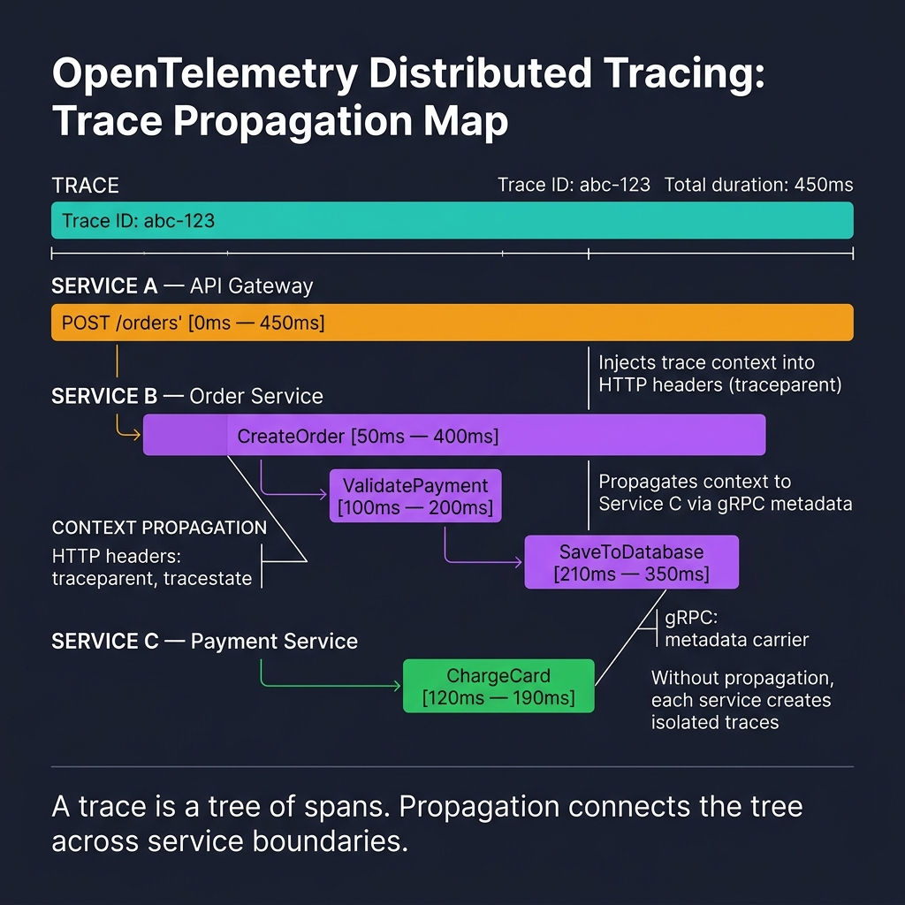
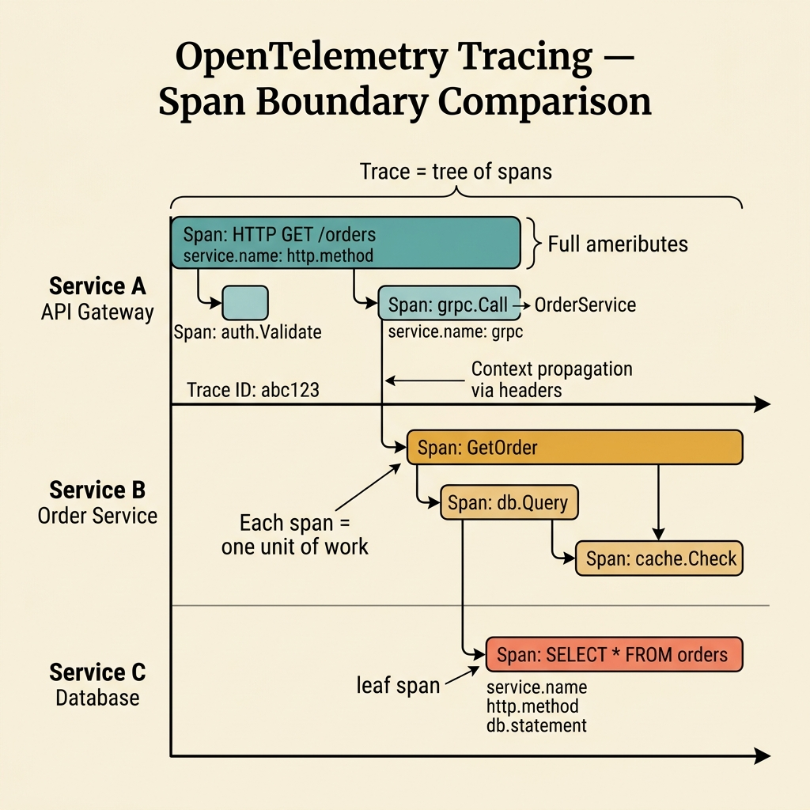

<!-- tags: golang, observability, tracing -->
# 🧵 OpenTelemetry Tracing — Context Propagation, Spans, Boundaries

> Logging and metrics tell you *what* happened. Tracing answers *where did this request travel*. This doc covers trace propagation and span design for Go services using OpenTelemetry.

📅 Created: 2026-03-28 · 🔄 Updated: 2026-04-14 · ⏱️ 18 min read

| Aspect | Detail |
| --- | --- |
| **Complexity** | Advanced |
| **Use case** | HTTP/gRPC services commanding distributed trace propagations exposing hidden critical paths |
| **Go libs** | `context`, `go.opentelemetry.io/otel`, `otel/trace` |
| **Prerequisites** | context propagation, microservices request flow |

## 1. DEFINE

Tracing becomes critical when logs and metrics alone cannot explain latency in a multi-service request path.

### What structurally comprises a Trace?

| Component | Role |
| --- | --- |
| Trace | The complete journey of a request across services |
| Span | A bounded unit of work within a trace |
| Context propagation | Transmits trace metadata (trace ID, span ID) across network boundaries |

### Invariants

| Rule | Meaning |
| --- | --- |
| Every downstream call must pass the active `ctx` | Prevents traces from breaking at service boundaries |
| Span names must be stable (no dynamic IDs) | Keeps trace queries simple and avoids cardinality explosions |
| Attributes serve debugging, not logging | Prevents span bloat from excessive metadata |

### Failure Modes

| Failure | Cause | Fix |
| --- | --- | --- |
| Traces break at service boundaries | Inbound requests ignore incoming trace headers | Instrument inbound context extraction on every service entry point |
| Span names are unsearchable | Appending dynamic IDs (e.g., order-123) to span names | Use stable operation names: `order.create`, not `order.create.order-123` |
| Traces are noise | Creating spans around tiny internal function calls | Reserve spans for meaningful architectural boundaries (HTTP, DB, broker) |

These failures look trivial. The trap: overly granular spans create noise that buries the real bottleneck, and missing context propagation creates irrecoverable tracing gaps.

## 2. VISUAL

Tracing fails in two ways: traces break at service boundaries, or span noise buries the real bottleneck. The diagrams below isolate both.



*Figure: A distributed trace across three services. The API Gateway injects trace context into HTTP headers. The Order Service propagates it via gRPC metadata. Without propagation, each service creates isolated, useless traces.*



*Figure: Good span design creates spans at architectural boundaries (HTTP handlers, DB calls, broker publishes). Bad span design creates spans around internal helper functions, generating noise.*

## 3. CODE

The visual above established the tracing model. The code below implements it step by step.

### Example 1: Basic — Start span from inbound request context

> **Goal**: Start a span from the active request `ctx` so the operation appears inside the distributed trace tree.
> **Approach**: Call `tracer.Start(ctx, "operation.name")` and attach stable attributes.
> **Complexity**: O(1).

```go
// tracing_basic.go — Start a span around a unit of work using request context
package observability

import (
	"context"

	"go.opentelemetry.io/otel"
	"go.opentelemetry.io/otel/attribute"
)

var tracer = otel.Tracer("order-service")

func CreateOrder(ctx context.Context, orderID string) error {
	ctx, span := tracer.Start(ctx, "order.create")
	defer span.End()

	span.SetAttributes(attribute.String("order.id", orderID))
	return nil
}
```

> **Takeaway**: The operation now appears in the trace tree with metadata. It does not yet propagate traces to downstream services.

### Example 2: Intermediate — Propagate trace context across HTTP call

> **Goal**: Unflinchingly preserve sheer continuous trace chains bridging explicitly transitioning external downstream HTTP relays explicitly ensuring structural parent-child relationships survive.
> **Approach**: Explicitly configure native `http.Client` structures utilizing `otelhttp.NewTransport`.
> **Complexity**: O(1) per request.

```go
// tracing_http_client.go — Build downstream request from the existing trace-aware context
package observability

import (
	"context"
	"net/http"

	"go.opentelemetry.io/contrib/instrumentation/net/http/otelhttp"
)

func NewTracingClient() *http.Client {
	return &http.Client{
		Transport: otelhttp.NewTransport(http.DefaultTransport),
	}
}

func DownstreamRequest(ctx context.Context, client *http.Client, url string) (*http.Response, error) {
	req, err := http.NewRequestWithContext(ctx, http.MethodGet, url, nil)
	if err != nil {
		return nil, err
	}
	return client.Do(req)
}
```

> **Takeaway**: Trace context now propagates across HTTP boundaries automatically.

### Example 3: Advanced — Add span events and error status

> **Goal**: Bind critical operational milestones alongside hard failure statuses securely into rigid spans ensuring diagnostic incident reviews instantly visualize explicit operational breaking points exactly.
> **Approach**: Master strict `span.AddEvent`, explicit `span.RecordError`, and definitive `span.SetStatus` bindings squarely executing at hyper-critical boundaries simulating broker publishing limits.

```go
// tracing_errors.go — Capture important milestones and mark failures explicitly
package observability

import (
	"context"
	"fmt"

	"go.opentelemetry.io/otel"
	"go.opentelemetry.io/otel/codes"
)

var tracer = otel.Tracer("order-service")

func PublishInvoice(ctx context.Context, publish func(context.Context) error) error {
	ctx, span := tracer.Start(ctx, "invoice.publish")
	defer span.End()

	span.AddEvent("publishing invoice event")
	if err := publish(ctx); err != nil {
		span.RecordError(err)
		span.SetStatus(codes.Error, "publish_failed")
		return fmt.Errorf("publish invoice: %w", err)
	}

	span.AddEvent("invoice event published")
	return nil
}
```

> **Takeaway**: Explicit traces transcend isolated tracking chains deliberately screaming exact terminal failure boundaries intertwining with strict event timelines accurately. Forcefully deny scattering blind `AddEvent` hooks internally traversing random disparate internal functions.

### Example 4: Expert — Stable route middleware for HTTP tracing

> **Goal**: Normalize span names to stable HTTP route templates (`/orders/:id`) instead of dynamic URL paths, preventing cardinality explosions.
> **Approach**: Leverage strict incoming middlewares actively receiving static route templates resembling `/orders/:id`, mapping immutable constant nomenclatures properly.
> **Complexity**: Strict O(1) tracking hitting distinct requests capturing optimal O(1) space rigidly.

```go
// tracing_middleware.go — Trace HTTP routes with stable names instead of raw URLs
package observability

import (
	"net/http"

	"go.opentelemetry.io/otel"
	"go.opentelemetry.io/otel/attribute"
)

var tracer = otel.Tracer("order-service")

func TraceHTTPRoute(route string, next http.Handler) http.Handler {
	return http.HandlerFunc(func(w http.ResponseWriter, r *http.Request) {
		ctx, span := tracer.Start(r.Context(), "http.route "+route)
		defer span.End()

		span.SetAttributes(
			attribute.String("http.method", r.Method),
			attribute.String("http.route", route),
		)

		next.ServeHTTP(w, r.WithContext(ctx))
	})
}
```

> **Takeaway**: Never use `r.URL.Path` as a span name. Use logical route templates for stable, queryable traces.

## 4. PITFALLS

Evaluating exactly spanning this strict juncture maintains deep focus tracking tracing execution pathways rejecting temporary functional stability completely.

| # | Defect | Fix |
| --- | --- | --- |
| 1 | Background goroutines drop `ctx`, breaking the trace | Propagate context or derive a child context before spawning goroutines |
| 2 | Span names contain dynamic IDs (e.g., `order.create.order-123`) | Use stable operation names: `order.create` |
| 3 | Downstream HTTP calls use `http.NewRequest` instead of `http.NewRequestWithContext` | Always use `NewRequestWithContext(ctx, ...)` to carry trace context |
| 4 | PII data in span attributes | Keep attributes to safe analytical fragments; redact identifiable data |

## 5. REF

| Resource | Link |
| --- | --- |
| OpenTelemetry Go | https://opentelemetry.io/docs/languages/go/ |
| OTel semantic conventions | https://opentelemetry.io/docs/specs/semconv/ |

---
