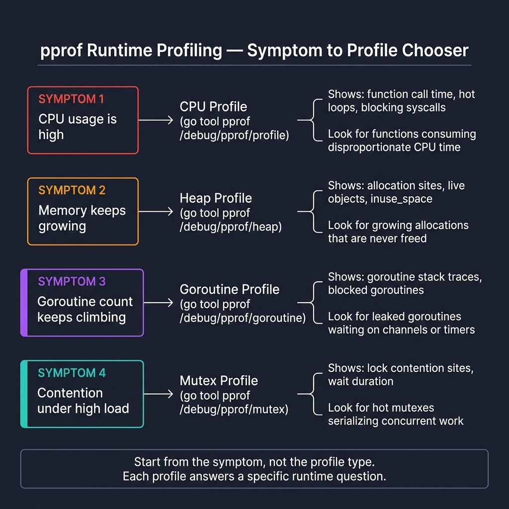

<!-- tags: golang, observability, profiling -->
# 🔬 pprof & Runtime Profiling — CPU, Heap, Goroutine, Mutex

📅 Created: 2026-03-28 · 🔄 Updated: 2026-04-14 · ⏱️ 19 min read

| Aspect | Detail |
| --- | --- |
| **Complexity** | Advanced → Expert |
| **Use case** | Debugging intense CPU hot paths, erratic heap growths, silent goroutine leaks, and severe lock contentions |
| **Go stdlib** | `net/http/pprof`, `runtime`, `runtime/pprof`, `context` |
| **Prerequisites** | Basic benchmarking, latency/memory symptoms |

## 1. DEFINE

> *When a severe memory leak erupts or latency spikes bizarrely, raw logs and traces expose only shallow symptoms. You need `pprof` to hunt physical bottlenecks embedded across Go runtime cores.*

### What does pprof analyze?

| Profile | Question Answered |
| --- | --- |
| CPU | Exactly where CPU compute burns. |
| Heap | Precisely which structures hoard retained memory. |
| Goroutine | Specifically which goroutines hang or explode. |
| Mutex/Block | Where rigid lock contention bottlenecks freeze execution. |

### Invariants

| Rule | Meaning |
| --- | --- |
| Record profiles capturing authentic physical symptoms | Avoids executing blind phantom optimizations. |
| Endpoints demand rigid protection boundaries | Forbids catastrophic exposures to public internet channels. |
| Enforce before/after profile tracking comparisons | Objectively validates efficiency improvements. |

## 2. VISUAL

The biggest mistake in profiling is picking a profile type without a matching symptom. Start with the symptom, choose the profile that answers that question.



*Figure: Four symptoms map to four profiles. High CPU → CPU profile. Growing memory → heap profile. Rising goroutine count → goroutine profile. Lock contention under load → mutex profile. Start from the symptom, not the tool.*

## 3. CODE

### Example 1: Basic — Internal pprof server

> **Goal**: Expose `net/http/pprof` handlers relying completely upon securely contained internal boundaries.
> **Approach**: Launch an isolated `http.Server` structure handling discrete debug internal network traffic.
> **Complexity**: Basic

```go
// pprof_server.go — Expose pprof endpoints on an internal-only debug server
package observability

import (
	"context"
	"fmt"
	"net/http"
	_ "net/http/pprof"
	"time"
)

func StartDebugServer(ctx context.Context, addr string) error {
	server := &http.Server{
		Addr:              addr,
		// ✅ Rigid ReadHeaderTimeout nullifies slow-client attack executions crashing debug ports.
		ReadHeaderTimeout: 2 * time.Second,
	}

	go func() {
		<-ctx.Done()
		shutdownCtx, cancel := context.WithTimeout(context.Background(), 3*time.Second)
		defer cancel()
		_ = server.Shutdown(shutdownCtx)
	}()

	if err := server.ListenAndServe(); err != nil && err != http.ErrServerClosed {
		return fmt.Errorf("debug server: %w", err)
	}
	return nil
}
```

> **Why avoid binding pprof directly to public routing bounds?**
> If you attach `net/http/pprof` to the default `http.DefaultServeMux` underlying your public API, attackers can trigger massive CPU profiles. This initiates an immediate Denial of Service attack via diagnostic endpoints.

### Example 2: Intermediate — Detect goroutine growth during workload

> **Goal**: Monitor tracking goroutine tallies enveloping preceding and following intense workload execution periods.
> **Approach**: Extract `runtime.NumGoroutine()` mimicking lightweight immediate tracking signals.
> **Complexity**: Intermediate

```go
// goroutine_snapshot.go — Capture goroutine count as a lightweight runtime signal
package observability

import "runtime"

func GoroutineCount() int {
	// ✅ This isolated snapshot never substitutes rigorous full goroutine profiles. It serves as an incredibly lightweight trigger for intense diagnostic investigations.
	return runtime.NumGoroutine()
}
```

> **Why use NumGoroutine as a leading indicator?**
> Fetching a full goroutine profile requires halting the world and traversing massive stacks. `NumGoroutine()` executes rapidly, providing a leading indicator for leaks without disturbing standard execution paths.

### Example 3: Advanced — CPU profile around controlled workload

> **Goal**: Extract raw CPU processing profiles securely surrounding highly bounded workloads.
> **Approach**: Isolate writing profile execution captures to local files, engaging `pprof.StartCPUProfile` and concluding with `pprof.StopCPUProfile`.
> **Complexity**: Advanced

```go
// cpu_profile.go — Profile a bounded workload into a file for later analysis
package observability

import (
	"context"
	"fmt"
	"os"
	"runtime/pprof"
)

func CaptureCPUProfile(ctx context.Context, path string, workload func(context.Context) error) error {
	file, err := os.Create(path)
	if err != nil {
		return fmt.Errorf("create cpu profile: %w", err)
	}
	defer file.Close()

	if err := pprof.StartCPUProfile(file); err != nil {
		return fmt.Errorf("start cpu profile: %w", err)
	}
	defer pprof.StopCPUProfile()

	// ✅ The workload must match the real failure scenario to produce actionable profiles.
	if err := workload(ctx); err != nil {
		return fmt.Errorf("run workload: %w", err)
	}

	return nil
}
```

> **Why profile via code instead of curl endpoints?**
> The HTTP endpoint profiles the entire application over a hard 30-second window. Bounding the profiling via code allows you targeting a single isolated batch job, filtering out irrelevant noise gracefully.

### Example 4: Expert — Capture heap profile after a controlled workload

> **Goal**: Capture retained heap allocations after a controlled workload.
> **Approach**: Run `runtime.GC()` before capturing to ensure the profile shows only live objects.
> **Complexity**: Expert

```go
// heap_profile.go — Capture retained heap after a controlled workload
package observability

import (
	"context"
	"fmt"
	"os"
	"runtime"
	"runtime/pprof"
)

func CaptureHeapProfile(ctx context.Context, path string, workload func(context.Context) error) error {
	if err := workload(ctx); err != nil {
		return fmt.Errorf("run workload: %w", err)
	}

	// ✅ GC ensures the heap profile shows only retained objects, not garbage.
	runtime.GC()

	file, err := os.Create(path)
	if err != nil {
		return fmt.Errorf("create heap profile: %w", err)
	}
	defer file.Close()

	if err := pprof.WriteHeapProfile(file); err != nil {
		return fmt.Errorf("write heap profile: %w", err)
	}

	return nil
}
```

> **Why mandate calling runtime.GC() prior to WriteHeapProfile?**
> WriteHeapProfile extracts active allocations. If you avoid triggering garbage collection, the generated profile includes volatile dead objects, heavily skewing analysis toward false positives.

## 4. PITFALLS

| # | Severity | Defect | Impact | Fix |
|---|----------|--------|--------|-----|
| 1 | 🔴 Fatal | Leaving pprof endpoints exposed on public ports | Security breach, DoS via profiling | Serve debug endpoints on an internal-only address |
| 2 | 🟡 Common | Adding `sync.Pool` without profiling first | Phantom optimization that may worsen GC | Profile before and after; compare with benchstat |
| 3 | 🟡 Common | Reading heap profiles when the symptom is latency | Wasted investigation time | Match profile type to the observed symptom |
| 4 | 🔵 Minor | Applying fixes without before/after comparison | Regressions go undetected | Run benchmarks before and after changes |

## 5. REF

| Resource | Link |
| --- | --- |
| Go blog: profiling Go programs | https://go.dev/blog/profiling-go-programs |
| `net/http/pprof` | https://pkg.go.dev/net/http/pprof |
| `runtime/pprof` | https://pkg.go.dev/runtime/pprof |

## 6. RECOMMEND

When you execute basic profiling successfully, structural scaling expands into comprehensive system oversight.

| Extension | When to proceed | Rationale |
| --- | --- | --- |
| [Benchmarks + pprof](../advanced/08-benchmark-strategy-and-benchstat.md) | Optimizing hot paths | Benchmarks + profiles reveal whether changes improved throughput |
| Mutex/block profiles | Lock contention under high concurrency | Pinpoints the exact mutex causing serialization |
| [Goroutine leak alerts](./05-alerting-slos-runbooks.md) | Background goroutines grow unbounded | Alerts on goroutine count detect slow leaks before OOM |

## 7. QUIZ

### Quick Check

1. Which profile shows persistent memory growth?
2. Why must `debug/pprof` stay off public ports?
3. Should you optimize before profiling?

### Answer Key

1. Heap profile — shows retained allocations after GC.
2. Profiling endpoints expose runtime internals and enable DoS attacks via CPU profiling.
3. No. Profile first to identify the bottleneck, then optimize.

**Navigation**: [← Messaging](../messaging/README.md) · [→ Alerts, SLOs & Runbooks](./05-alerting-slos-runbooks.md)
