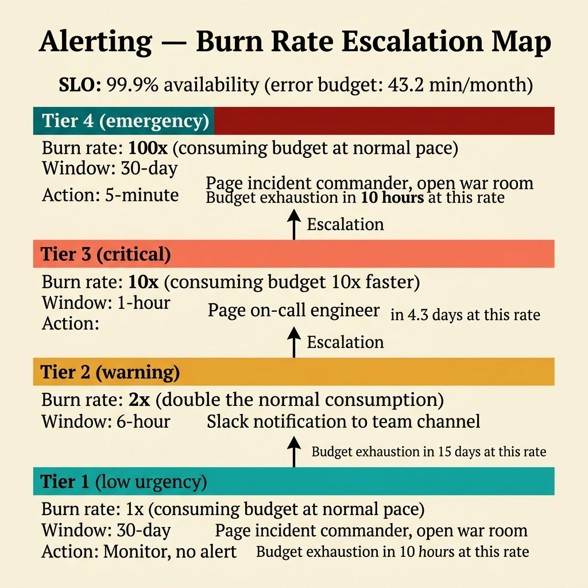
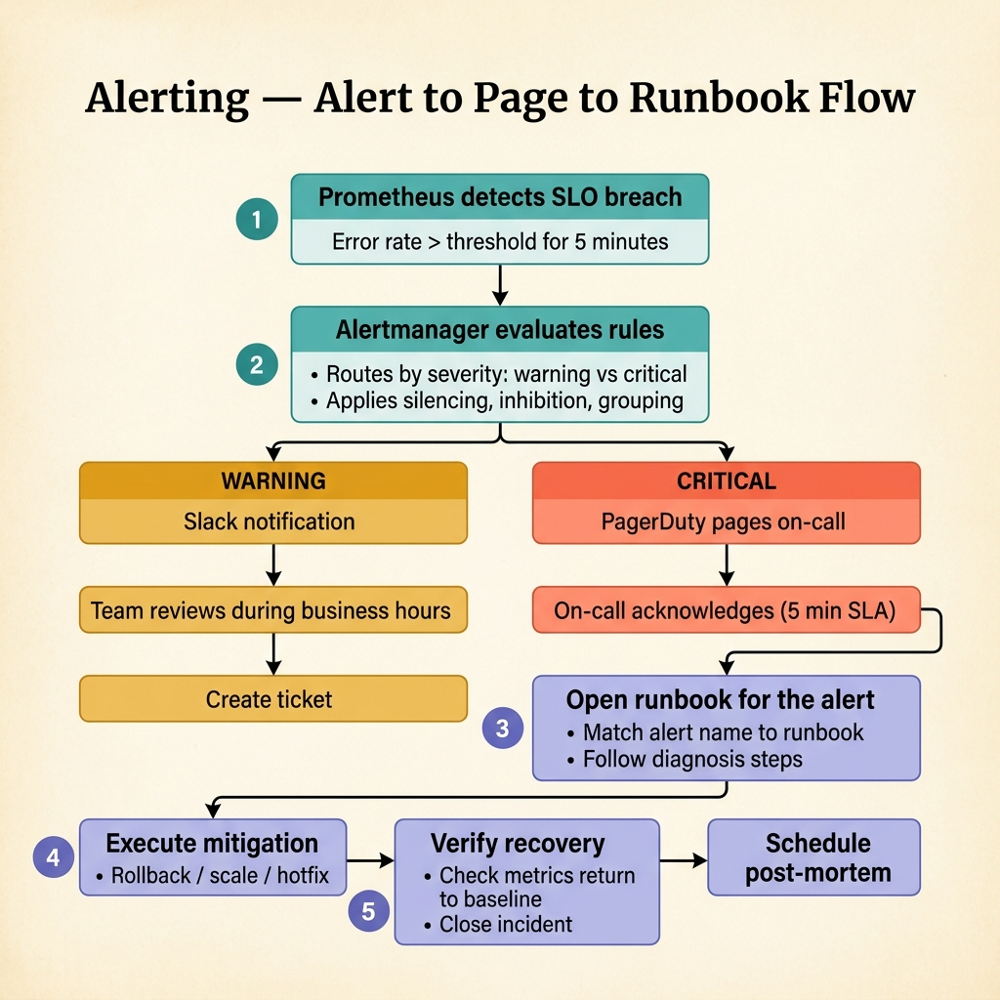

<!-- tags: golang, observability, alerting -->
# 🚨 Alerting, SLOs & Runbooks — Signal Actionable Instead of Noise

> Good alerts page on user-facing impact, not infrastructure noise. This doc covers SLIs, SLOs, burn rate alerting, and runbook linking for Go services.

📅 Created: 2026-03-28 · 🔄 Updated: 2026-04-14 · ⏱️ 17 min read

| Aspect | Detail |
| --- | --- |
| **Complexity** | Advanced |
| **Use case** | Driving strict reductions across volatile noisy diagnostic alert flows |
| **Focus** | SLI, SLO, burn rate, runbook linking |
| **Prerequisites** | RED metrics, basic incident response |

## 1. DEFINE

Consider an on-call night: the pager fires three times, but the alert lacks an owning service, a runbook, or a containment scope. Without SLOs and structured alerting, metrics exist but the response framework is missing.

### How do SLI, SLO, and explicit alerts differ?

| Term | Meaning |
| --- | --- |
| SLI | A measurable indicator of service quality (e.g., request success rate) |
| SLO | A target for the SLI over a time window (e.g., 99.9% over 30 days) |
| Alert | A signal that the SLO is at risk, triggering investigation or paging |

### Invariants

| Rule | Meaning |
| --- | --- | --- |
| Alerts reflect user-facing impact | Avoids paging for internal noise (e.g., CPU spikes without user effect) |
| Every alert has a runbook link | Responders know the next step immediately |
| Severity scales with blast radius | Critical services page; non-critical warn |

### Failure Modes

| Failure | Cause | Fix |
| --- | --- | --- |
| Severe alert fatigue | Paging aggressive minor generic symptoms | Implement active multi-window tracking targeting explicit thresholds |
| Dashboard tracking failing actionable flows | Lacking rigid ownership and runbooks | Embed explicit owners into the alert configuration directly |
| Silent strict SLO tracking violations | Dangerously relying on average generic SLIs | Implement continuous underlying execution tracking identifying pure exact bounds. |

These failures hide a trap: hardcoded thresholds cause alert fatigue. Burn rate alerting against error budgets replaces static thresholds with dynamic detection.

## 2. VISUAL

Alerting has two visual pipelines: burn rate escalation (how fast are we spending the error budget?) and page-to-runbook flow (what happens after the pager fires?).



*Figure: Burn rate windows map error budget consumption to severity levels. A 5-minute window detects acute spikes; a 1-hour window confirms sustained burns. Alerts fire only when both windows agree.*



*Figure: Alert → page → runbook. The pager routes to the owning team with a dashboard link and a runbook URL. The on-call opens the runbook, follows the decision tree, and either mitigates or escalates.*

## 3. CODE

Execution directly observes strict mapping structures dictating raw operational paths structurally within **Alerting, SLOs & Runbooks**. Explicit backend implementations define exactly where alert configurations properly integrate into rigid code-versioned taxonomies stably.

### Example 1: Basic — Define a service SLO policy in Go config

> **Goal**: Define SLO targets (availability, latency) as code-versioned config.
> **Approach**: A Go struct captures thresholds alongside page/warn windows.
> **Example**: `checkout-service` with `availability=99.9%`, `p99Latency=800ms`, page on `>5% error rate for 10m`.
> **Complexity**: O(1) lookup.

```go
// slo_policy.go — Keep alert thresholds explicit and versioned with the service
package observability

import "time"

type SLOPolicy struct {
	ServiceName         string
	AvailabilityTarget  float64
	P99LatencyTarget    time.Duration
	PageErrorRateAbove  float64
	PageWindow          time.Duration
	WarnErrorRateAbove  float64
	WarnWindow          time.Duration
}

func DefaultCheckoutSLO() SLOPolicy {
	return SLOPolicy{
		ServiceName:        "checkout-service",
		AvailabilityTarget: 99.9,
		P99LatencyTarget:   800 * time.Millisecond,
		PageErrorRateAbove: 0.05,
		PageWindow:         10 * time.Minute,
		WarnErrorRateAbove: 0.02,
		WarnWindow:         30 * time.Minute,
	}
}
```

> **Takeaway**: Code-versioned SLO policies replace implicit threshold knowledge scattered across dashboards and Slack channels.

### Example 2: Intermediate — Render a runbook-friendly alert payload

> **Goal**: Build an alert payload with service, severity, symptom, runbook, and owner.
> **Approach**: A structured Go type packages all context the on-call needs.
> **Example**: p99 latency breach triggers a `page` severity alert with a dashboard link and runbook URL.
> **Complexity**: O(1) struct construction.

```go
// alert_payload.go — Build structured alert metadata for paging and dashboards
package observability

type AlertPayload struct {
	Service   string
	Severity  string
	Symptom   string
	Runbook   string
	Dashboard string
	Owner     string
}

func BuildCheckoutLatencyAlert() AlertPayload {
	return AlertPayload{
		Service:   "checkout-service",
		Severity:  "page",
		Symptom:   "p99 latency above SLO for 10m",
		Runbook:   "https://internal.runbooks/checkout-latency",
		Dashboard: "https://grafana.example.com/d/checkout-overview",
		Owner:     "payments-platform",
	}
}
```

> **Takeaway**: Structured explicit alert payloads isolate crucial execution context routing on-call specialists to optimal incident protocols.

### Example 3: Advanced — Classify severity from burn symptoms

> **Goal**: Assess symptom burn rates to classify severity.
> **Approach**: Classify severity based on error-rate tracking metrics.

```go
// burn_rate.go — Classify alert severity from recent error-rate symptoms
package observability

func AlertSeverity(errorRate float64) string {
	switch {
	case errorRate >= 0.05:
		return "page"
	case errorRate >= 0.02:
		return "warn"
	default:
		return "info"
	}
}
```

> **Takeaway**: Explicit execution replaces complex conditional layers with clean logic.

### Example 4: Expert — Multi-window burn-rate Prometheus rule

> **Complexity**: The evaluation logic is O(1). The operational complexity is choosing the right window sizes.

```yaml
# checkout-burn-rate.yaml — Page only when short and long windows both show serious error-budget burn
groups:
  - name: checkout-slo
    rules:
      - alert: CheckoutBurnRateCritical
        expr: |
          (
            1 - (
              sum(rate(http_requests_total{service="checkout-service",status_class!="5xx"}[5m]))
              /
              sum(rate(http_requests_total{service="checkout-service"}[5m]))
            )
          ) > 0.05
          and
          (
            1 - (
              sum(rate(http_requests_total{service="checkout-service",status_class!="5xx"}[1h]))
              /
              sum(rate(http_requests_total{service="checkout-service"}[1h]))
            )
          ) > 0.02
        for: 10m
        labels:
          severity: page
          team: payments-platform
        annotations:
          summary: "Checkout is burning error budget too fast"
          runbook: "https://internal.runbooks/checkout-burn-rate"
          dashboard: "https://grafana.example.com/d/checkout-overview"
```

> **Takeaway**: Advanced alerting rules using multiple windows prevent fatigue by differentiating between transient spikes and sustained failures.

You navigated rigid alert definitions, strict SLO structures, and robust runbooks. Next, avoid the pitfalls that accelerate devastating alert fatigue and technical debt.

## 4. PITFALLS

Evaluating this strict juncture ensures maintaining **Alerting, SLOs & Runbooks** completely avoids sheer operational tech debt.

| # | Defect | Fix |
| --- | --- | --- |
| 1 | Paging for momentary CPU spikes without user impact | Strictly page on user-facing symptoms |
| 2 | Triggering execution alerts without runbooks | Attach explicit tracking dashboard and runbooks to all alerts |
| 3 | Projecting disconnected abstract SLO targets ignoring baselines | Extract baselines tied to pure business impacts directly |
| 4 | Bypassing incident alert reviews | Enforce postmortem protocols repairing alert precision |

Alert definitions, SLO structures, and operational traps are covered. References for deeper dives:

## 5. REF

| Resource | Link |
| --- | --- |
| Google SRE workbook | https://sre.google/workbook/table-of-contents/ |
| SLO concepts | https://sre.google/sre-book/service-level-objectives/ |
| Prometheus alerting docs | https://prometheus.io/docs/alerting/latest/overview/ |

## 6. RECOMMEND

After SLO alerting is in place, extend into advanced burn rates and operational workflows.

| Expansion | Condition | Rationale |
| --- | --- | --- |
| Multi-window burn rate alerts | Critical services need spike vs. sustained distinction | Prevents flapping while preserving fast detection |
| Error budget reviews | Multi-team environments | Enforces reliability trade-offs transparently |
| [Prometheus RED Metrics](./02-prometheus-red-metrics.md) | Alert quality depends on metric quality | Better SLIs produce more precise alerts |
| Incident templates | Large on-call rotations | Enforces consistent incident response structure |

---
