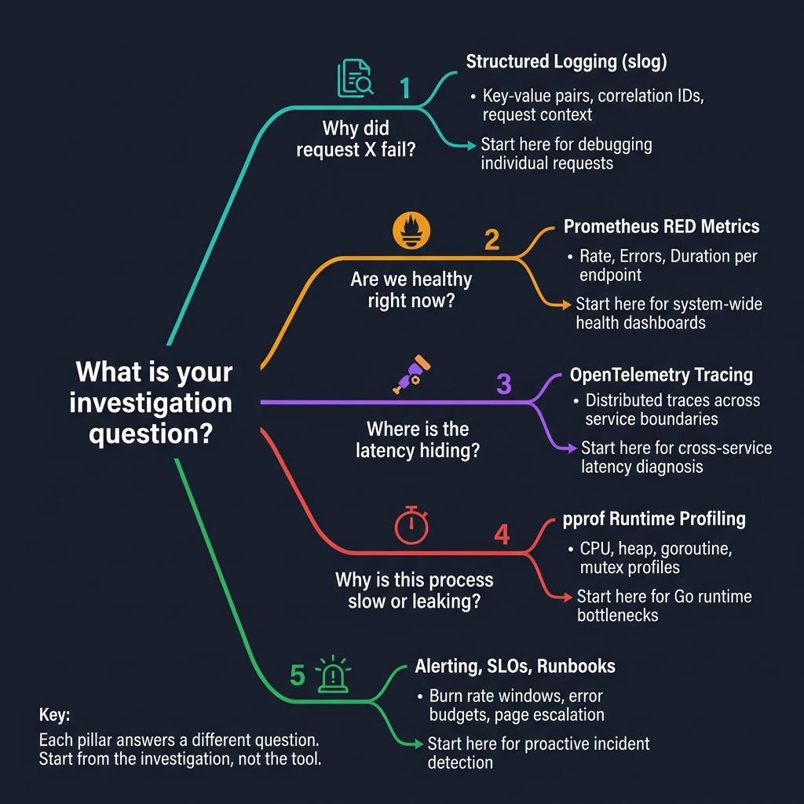

<!-- tags: golang, overview, observability -->
# Observability in Go

> Logging, metrics, tracing, profiling, and alerting for Go services — each pillar answers a different investigation question.

📅 Updated: 2026-04-09 · ⏱️ 7 min read

## 1. DEFINE

Picture an on-call incident: the dashboards look green, but users report failures. The on-call engineer cannot answer three basic questions: where did the request fail, how many users are affected, and what should they investigate next. That gap is what observability fills — not by adding more dashboards, but by making every emitted signal answer one concrete investigation question.

This hub routes you to the right observability doc based on your current pain point.

### 1.1 Signals & Boundaries

- Open this hub when you need to choose an observability pillar or debug a production incident.
- Each doc is self-contained. Start with the one that matches your investigation question.
- For application-level patterns (HTTP, messaging), see the [Fiber](../fiber/README.md), [Gin](../gin/README.md), or [Messaging](../messaging/README.md) hubs.

### 1.2 Learning Lanes

- `01-structured-logging-slog` — Why did request X fail? Stable fields, correlation IDs, context propagation in `log/slog`.
- `02-prometheus-red-metrics` — Are we healthy right now? Rate, Errors, Duration per endpoint with Prometheus.
- `03-open-telemetry-tracing` — Where is the latency hiding? Distributed traces across service boundaries with OpenTelemetry.
- `04-pprof-runtime-profiling` — Why is this process slow or leaking? CPU, heap, goroutine, and mutex profiles.
- `05-alerting-slos-runbooks` — How do we detect problems before users do? Burn rate windows, error budgets, and page escalation.

## 2. VISUAL

The decision starts with your investigation question — not with the tool.



*Figure: Five branches — request-level debugging leads to structured logging, system health to RED metrics, cross-service latency to tracing, runtime bottlenecks to pprof, and proactive detection to SLO alerting. Each pillar answers a different question.*

## 3. CODE

### Example 1: Router — select the doc that matches your investigation

> **Goal**: Route to the correct observability doc by investigation question.
> **Approach**: A switch on the pain point returns the file path.
> **Complexity**: O(1).

```go
func chooseLane(goal string) string {
    switch goal {
    case "structured logging slog": return "./01-structured-logging-slog.md"
    case "prometheus red metrics": return "./02-prometheus-red-metrics.md"
    case "open telemetry tracing": return "./03-open-telemetry-tracing.md"
    case "pprof runtime profiling": return "./04-pprof-runtime-profiling.md"
    case "alerting slos runbooks": return "./05-alerting-slos-runbooks.md"
    default: return "./README.md"
    }
}
```

> **Takeaway**: Pick the doc by the investigation question, not the tool. Logs answer "what happened here," metrics answer "are we healthy," traces answer "where is the bottleneck."

## 4. PITFALLS

| # | Severity | Defect | Impact | Fix |
| --- | --- | --- | --- | --- |
| 1 | 🔴 Fatal | Treating the hub as a scrollable link list | Reader picks a random doc without context | Start from the investigation question, not the table of contents |
| 2 | 🟡 Common | Jumping into tracing before structured logging is in place | Traces lack correlation IDs and request context | Set up structured logging with slog first |
| 3 | 🔵 Minor | Reading one doc and never returning to the hub | Misses cross-cutting concerns (e.g., alerting after metrics) | After each doc, check whether SLO alerting also applies |

## 5. REF

| Resource | Type | Link |
| --- | --- | --- |
| OpenTelemetry Go docs | Official docs | https://opentelemetry.io/docs/languages/go/ |
| Prometheus practices | Official docs | https://prometheus.io/docs/practices/instrumentation/ |
| Go slog docs | Official docs | https://pkg.go.dev/log/slog |
| Google SRE workbook | Reference | https://sre.google/workbook/table-of-contents/ |

## 6. RECOMMEND

| Extension | When to proceed | Rationale |
| --- | --- | --- |
| [Structured Logging](./01-structured-logging-slog.md) | Request-level debugging lacks context | Stable fields and correlation IDs make logs queryable |
| [RED Metrics](./02-prometheus-red-metrics.md) | Need a system health dashboard | Rate, Errors, Duration cover 80% of alerting needs |
| [OTel Tracing](./03-open-telemetry-tracing.md) | Cross-service latency is unexplained | Distributed traces reveal where time is spent |
| [pprof Profiling](./04-pprof-runtime-profiling.md) | Runtime resource usage is abnormal | CPU, heap, and goroutine profiles pinpoint Go-level bottlenecks |
| [Alerting & SLOs](./05-alerting-slos-runbooks.md) | Alerts are noisy or missing | Burn rate windows replace threshold-based alerting |

---
