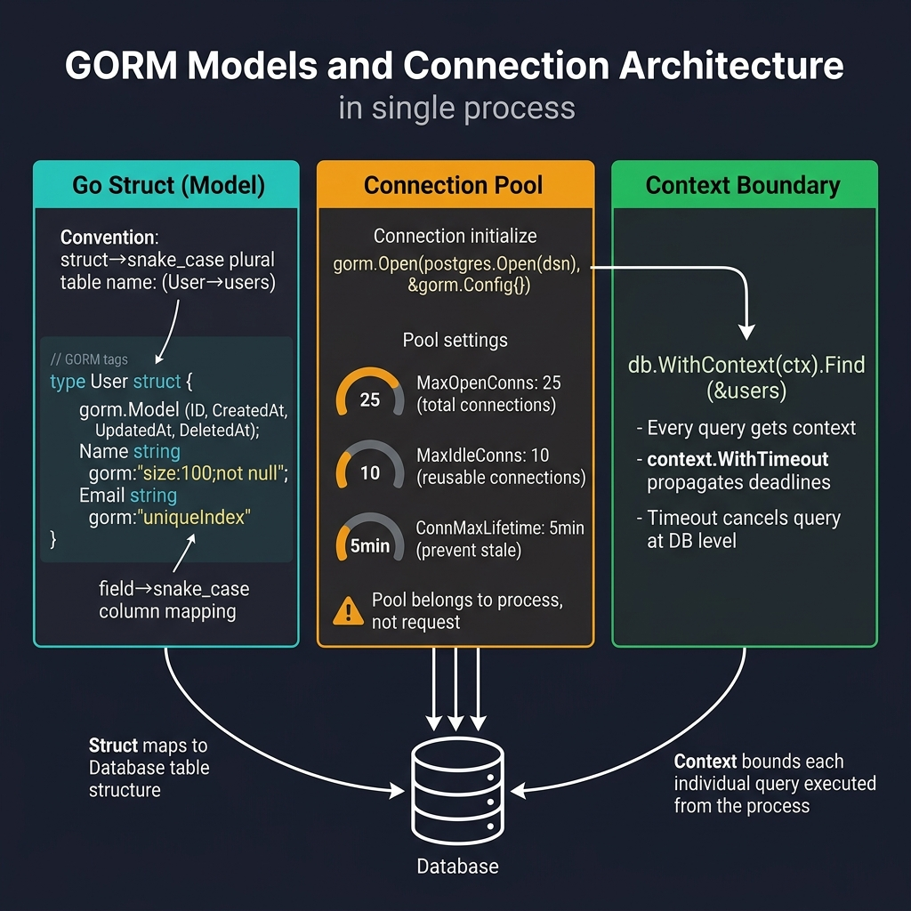

<!-- tags: golang, modules -->
# 01 — Models & Connection

> **Foundation**: Declare core models (mapping structs to tables), configure database connections, and understand core GORM conventions.

📅 Created: 2026-03-20 · 🔄 Updated: 2026-04-19 · ⏱️ 15 min read

---

## 1. DEFINE

Every GORM operation starts from two decisions: how your Go struct maps to a database table, and how your connection pool behaves under load. Get either wrong and the symptoms — silent data corruption, connection exhaustion, slow queries — surface only in production under traffic.

> *Executing raw SQL queries triggers the ORM N+1 struct mapping trap.*

### GORM Model

A **GORM Model** represents a Go struct mapped directly to a database table. GORM implements **conventions** (naming rules) to infer table names, column names, and primary keys automatically.

### Conventions

| Convention | Detail | Example |
| --- | --- | --- |
| **Primary Key** | A field named `ID` acts as the PK by default | `ID uint` |
| **Table Name** | Converts the struct name to snake_case and makes it plural | `User` → `users` |
| **Column Name** | Converts the field name to snake_case | `CreatedAt` → `created_at` |
| **Timestamps** | GORM tracks `CreatedAt` and `UpdatedAt` fields automatically | `time.Time` |
| **Soft Delete** | Including `DeletedAt` (`gorm.DeletedAt`) flags rows as deleted instead of executing hard deletes | `gorm:"index"` |

### gorm.Model

GORM provides the `gorm.Model` struct containing four standard fields:

```go
type Model struct {
    ID        uint           `gorm:"primaryKey"`
    CreatedAt time.Time
    UpdatedAt time.Time
    DeletedAt gorm.DeletedAt `gorm:"index"`
}
```

### Critical GORM Tags

| Tag | Purpose | Example |
| --- | --- | --- |
| `primaryKey` | Marks the field as a primary key | `gorm:"primaryKey"` |
| `column` | Specifies a custom column name | `gorm:"column:user_name"` |
| `type` | Specifies a custom column data type | `gorm:"type:varchar(100)" |
| `size` | Defines the maximum column size | `gorm:"size:256"` |
| `not null` | Enforces the NOT NULL constraint | `gorm:"not null"` |
| `uniqueIndex` | Creates a unique index | `gorm:"uniqueIndex"` |
| `index` | Creates a standard index | `gorm:"index"` |
| `default` | Specifies a default column value | `gorm:"default:0"` |
| `embedded` | Embeds the struct fields into the parent table | `gorm:"embedded"` |
| `embeddedPrefix` | Adds a prefix to embedded field names | `gorm:"embedded;embeddedPrefix:addr_"` |
| `-` | Ignores the field entirely | `gorm:"-"` |
| `<-:create` | Permits write operations only during record creation | `gorm:"<-:create"` |
| `->` | Sets the field to read-only | `gorm:"->"` |

### Failure Modes

| Failure | Root Cause | Fix |
| --- | --- | --- |
| **Connection leak** | Forgetting to configure the connection pool | Configure `SetMaxOpenConns` and `SetMaxIdleConns` |
| **Slow queries** | Missing indexes | Add `gorm:"index"` to frequently queried fields |
| **Silent errors** | GORM does not trigger panics by default | Check `.Error` for every operation |

These failure modes are common. However, a trap exists: connection leaks remain hidden until the system experiences high load, and running AutoMigrate in production drops columns without explicit warnings. This trap manifests inside the PITFALLS section.

## 2. VISUAL



*Figure: Three pillars — Go struct with gorm tags maps to DB table (convention-based naming), connection pool manages MaxOpenConns/MaxIdleConns/ConnMaxLifetime per process, context boundary ensures every query gets timeout/cancellation.*

With **Models & Connection**, the diagram below anchors the mechanism to the execution flow, demonstrating where the scheduler, connection blocking, or infrastructure rollouts dictate the outcome.

### GORM Architecture

```text
  Go Struct (Model)          GORM Engine            Database
  ┌──────────────┐     ┌──────────────────┐    ┌──────────────┐
  │ type User    │     │  gorm.DB         │    │  PostgreSQL  │
  │   ID   uint  │◄───▶│  - Model mapping │◄──▶│  users table │
  │   Name string│     │  - Query builder │    │  id, name,   │
  │   Email      │     │  - Hooks         │    │  email, ...  │
  └──────────────┘     │  - Transactions  │    └──────────────┘
                       │  - Migrations    │
                       └──────────────────┘
```

### Model → Table Mapping

```text
  Go Struct                              Database Table
  ──────────                             ──────────────
  type User struct {                     TABLE users (
      ID        uint                         id BIGINT PK,
      Name      string                      name VARCHAR(255),
      Email     *string                     email VARCHAR(255) NULL,
      Age       uint8                       age SMALLINT,
      CreatedAt time.Time                   created_at TIMESTAMP,
      UpdatedAt time.Time                   updated_at TIMESTAMP,
      DeletedAt gorm.DeletedAt              deleted_at TIMESTAMP NULL INDEX
  }                                      )
```

## 3. CODE

The conceptual flow of **Models & Connection** is visible. We evaluate code now to establish rigid patterns ensuring your architecture scales safely.

### Example 1: Basic — PostgreSQL connection displaying pool limits and standard loggers

> **Goal**: Initialize the `*gorm.DB` variable while retaining connection pool controls.
> **Approach**: Open the connection using `postgres.Open`, extract the underlying `sql.DB` object, and establish the minimum pool parameters.
> **Example**: A standard CRUD application using a single PostgreSQL instance demands connection verification and active SQL logging capabilities.
> **Complexity**: Basic

```go
package main

import (
    "fmt"
    "log"
    "time"

    "gorm.io/driver/postgres"
    "gorm.io/gorm"
    "gorm.io/gorm/logger"
)

func main() {
    // ━━━━━━━━━━━━━━━━━━━━━━━━━━━━━━━━━━━━━━━━━
    // PostgreSQL DSN (Data Source Name)
    // Format: host=... user=... password=... dbname=... port=... sslmode=...
    // ━━━━━━━━━━━━━━━━━━━━━━━━━━━━━━━━━━━━━━━━━
    dsn := "host=localhost user=postgres password=postgres dbname=myapp port=5432 sslmode=disable TimeZone=Asia/Ho_Chi_Minh"

    db, err := gorm.Open(postgres.Open(dsn), &gorm.Config{
        // ━━━ Logger: show generated SQL queries ━━━
        Logger: logger.Default.LogMode(logger.Info), // Info logs all SQL output
        // Switch to logger.Silent for production environments

        // ━━━ Disable default transactions for performance ━━━
        // GORM wraps every write operation within a transaction by default
        // Disable this setting if you manage transactions manually
        // SkipDefaultTransaction: true,

        // ━━━ Disable auto-pluralized table names ━━━
        // NamingStrategy: schema.NamingStrategy{
        //     SingularTable: true, // generates 'user' instead of 'users'
        // },
    })
    if err != nil {
        log.Fatal("Failed to connect database:", err)
    }

    // ━━━━━━━━━━━━━━━━━━━━━━━━━━━━━━━━━━━━━━━━━
    // Connection Pool Configuration
    // CRITICAL for production systems — prevents connection resource leaks
    // ━━━━━━━━━━━━━━━━━━━━━━━━━━━━━━━━━━━━━━━━━
    sqlDB, err := db.DB()
    if err != nil {
        log.Fatal("Failed to get underlying DB:", err)
    }

    sqlDB.SetMaxOpenConns(25)                 // Cap concurrent DB connections to prevent pool exhaustion
    sqlDB.SetMaxIdleConns(10)                 // Keep 10 warm connections ready for burst traffic
    sqlDB.SetConnMaxLifetime(5 * time.Minute) // Recycle connections to avoid stale TCP sessions

    // ━━━ Verify database connection ━━━
    if err := sqlDB.Ping(); err != nil {
        log.Fatal("Failed to ping database:", err)
    }

    fmt.Println("✅ Connected to PostgreSQL!")
}
```

**Results**:

- PostgreSQL connection established with bounded pool (25 open / 10 idle).
- SQL logger active — every generated query visible during development.

**Takeaway**:

- **Connection pools are not optional**: without `SetMaxOpenConns`, GORM opens unlimited connections and exhausts the DB under load.
- Utilize `logger.Info` in development and `logger.Silent` in production.
- Enabling `SkipDefaultTransaction: true` improves write performance by roughly 30%.

### Example 2: Intermediate — Declare models defining tags, specific associations, and embedded structures

> **Goal**: Convert standard Go structs into robust database schema definitions matching necessary fields, index behaviors, and foreign keys.
> **Approach**: Incorporate `gorm.Model`, tag constraints, schema associations, and embedded structs at the core model layer.
> **Example**: Define `User`, `Order`, `Product`, and `Category` featuring primary keys, unique indexes, nullable pointers, and many-to-many associations.
> **Complexity**: Intermediate

```go
package models

import (
    "time"

    "gorm.io/gorm"
)

// ━━━━━━━━━━━━━━━━━━━━━━━━━━━━━━━━━━━━━━━━━
// User: Embed gorm.Model to automatically generate ID, CreatedAt, UpdatedAt, DeletedAt fields
// ━━━━━━━━━━━━━━━━━━━━━━━━━━━━━━━━━━━━━━━━━
type User struct {
    gorm.Model                                     // ID, CreatedAt, UpdatedAt, DeletedAt
    Name     string  `gorm:"size:100;not null"`    // VARCHAR(100) NOT NULL
    Email    string  `gorm:"uniqueIndex;size:255"` // UNIQUE INDEX
    Phone    *string `gorm:"size:15"`              // Pointer establishes a NULLABLE column
    Age      uint8   `gorm:"default:0"`            // DEFAULT 0
    Role     string  `gorm:"type:varchar(20);default:'user'"` // Custom native type featuring a default
    IsActive bool    `gorm:"default:true;index"`   // INDEX for accelerated filter scans

    // ━━━ Associations ━━━
    Profile  Profile   // Has One relationship definition
    Orders   []Order   // Has Many relationship definition
}

// ━━━━━━━━━━━━━━━━━━━━━━━━━━━━━━━━━━━━━━━━━
// Profile: Belongs To relationship connecting User (1:1 constraint)
// ━━━━━━━━━━━━━━━━━━━━━━━━━━━━━━━━━━━━━━━━━
type Profile struct {
    gorm.Model
    UserID   uint   `gorm:"uniqueIndex"` // Foreign Key → users.id mapping, strictly unique (1:1)
    Bio      string `gorm:"type:text"`
    Avatar   string `gorm:"size:500"`
}

// ━━━━━━━━━━━━━━━━━━━━━━━━━━━━━━━━━━━━━━━━━
// Order: Belongs To relationship connecting User (1:N constraint)
// ━━━━━━━━━━━━━━━━━━━━━━━━━━━━━━━━━━━━━━━━━
type Order struct {
    gorm.Model
    UserID      uint           `gorm:"index;not null"`     // Foreign Key → users.id mapping
    OrderNumber string         `gorm:"uniqueIndex;size:50"`
    Status      string         `gorm:"type:varchar(20);default:'pending';index"`
    TotalAmount float64        `gorm:"type:decimal(12,2);not null"`

    // ━━━ Embedded struct: aggregates address sub-fields ━━━
    Address     Address        `gorm:"embedded;embeddedPrefix:shipping_"`

    // ━━━ Many2Many relationship mapping ━━━
    Products    []Product      `gorm:"many2many:order_products;"`

    // ━━━ Custom Timestamp properties ━━━
    PaidAt      *time.Time     // Nullable field establishing status — nil indicates pending transaction
}

// ━━━━━━━━━━━━━━━━━━━━━━━━━━━━━━━━━━━━━━━━━
// Address: Embedded struct logic (prevents generating an isolated database table)
// These fields flatten directly into the primary parent table structure
// ━━━━━━━━━━━━━━━━━━━━━━━━━━━━━━━━━━━━━━━━━
type Address struct {
    Street  string `gorm:"size:255"`
    City    string `gorm:"size:100"`
    Country string `gorm:"size:50"`
    ZipCode string `gorm:"size:10"`
}

// ━━━━━━━━━━━━━━━━━━━━━━━━━━━━━━━━━━━━━━━━━
// Product: Many2Many bridging logic targeting the primary Order struct
// ━━━━━━━━━━━━━━━━━━━━━━━━━━━━━━━━━━━━━━━━━
type Product struct {
    gorm.Model
    Name        string    `gorm:"size:200;not null;index"`
    Description string    `gorm:"type:text"`
    Price       float64   `gorm:"type:decimal(12,2);not null"`
    SKU         string    `gorm:"uniqueIndex;size:50"`
    CategoryID  uint      `gorm:"index"`

    Category    Category
    Orders      []Order   `gorm:"many2many:order_products;"`
}

// Category: BelongsTo relationship targeting the primary Product struct
type Category struct {
    gorm.Model
    Name     string    `gorm:"size:100;uniqueIndex"`
    Slug     string    `gorm:"size:100;uniqueIndex"`
    Products []Product // Has Many relationship mapping
}

// ━━━━━━━━━━━━━━━━━━━━━━━━━━━━━━━━━━━━━━━━━
// Custom Table Name schema override logic
// ━━━━━━━━━━━━━━━━━━━━━━━━━━━━━━━━━━━━━━━━━
func (User) TableName() string {
    return "app_users" // Generate a specific table name replacing the basic inferred "users" convention
}
```

**Results**:

- Models define PKs, FKs, indexes, unique constraints, and defaults declaratively via struct tags.
- Embedded struct (Address) flattens into the parent table — no separate `addresses` table created.
- Associations wired: Has One (Profile), Has Many (Orders), Many2Many (Products ↔ Orders).

**Takeaway**:

- **Pointer fields** (`*string`, `*time.Time`) map to `NULL`-able columns. Non-pointer fields default to Go zero values.
- **`gorm.Model`** provides `ID`, `CreatedAt`, `UpdatedAt`, `DeletedAt` automatically.
- Custom `TableName()` overrides convention — use it when integrating with legacy schemas.
- Go zero values (`0`, `""`, `false`) cause silent update issues. Use `map[string]interface{}` for partial updates.

### Example 3: Advanced — Run AutoMigrate enabling rapid test deployment models

> **Goal**: Generate required target tables and precise indexes quickly when environments remain isolated inside the core development cycle.
> **Approach**: Invoke the literal `AutoMigrate` command sequencing models correctly to signal the engine to append necessary fundamental columns and indices.
> **Example**: The primary local development machine builds schemas targeting `User`, `Profile`, `Order`, `Product`, and `Category` dynamically.
> **Complexity**: Advanced

```go
func main() {
    // ... (database connection block mirrors Example 1 output)

    // ━━━━━━━━━━━━━━━━━━━━━━━━━━━━━━━━━━━━━━━━━
    // AutoMigrate sequence creating omitted tables adding required structural columns/indexes
    //
    // ⚠ AutoMigrate DOES NOT:
    // - Delete established core data columns
    // - Modify specific operational column types
    // - Delete pre-configured table indexes
    // → Utilize explicit external migration tools (golang-migrate) implementing production schemas
    // ━━━━━━━━━━━━━━━━━━━━━━━━━━━━━━━━━━━━━━━━━
    err := db.AutoMigrate(
        &User{},
        &Profile{},
        &Order{},
        &Product{},
        &Category{},
    )
    if err != nil {
        log.Fatal("Migration failed:", err)
    }

    fmt.Println("✅ Migration completed!")

    // ━━━ Verify table target structures generating properly ━━━
    migrator := db.Migrator()
    fmt.Println("users exists:", migrator.HasTable(&User{}))
    fmt.Println("orders exists:", migrator.HasTable(&Order{}))
}
```

**Results**:

- Tables created matching Go struct definitions. Columns, indexes, and FK constraints applied.
- Existing columns are never dropped — AutoMigrate only adds.

**Takeaway**:

- **AutoMigrate is for development only.** In production, use versioned migration tools (golang-migrate, goose) for safe, reversible schema changes.
- AutoMigrate **does not delete columns or indexes** — it only adds missing ones.
- Model order matters: parent tables (Category) must migrate before child tables (Product → Order) to satisfy FK constraints.

### Example 4: Expert — Implement DBResolver logic handling primary operations supporting read-replicas

> **Goal**: Expand primary bootstrap initialization targeting an explicit distributed database production topology separating master write logic and follower read endpoints.
> **Approach**: Apply the integral `dbresolver` plugin processing SQL queries, matching logical route patterns scaling core read traffic against distinct pool properties.
> **Example**: Execute native `Create/Update/Delete` procedures on the primary while mapping standard `Find/First` targets to subsequent read-replica boundaries.
> **Complexity**: Expert

```go
package database

import (
    "fmt"
    "log"
    "time"

    "gorm.io/driver/postgres"
    "gorm.io/gorm"
    "gorm.io/plugin/dbresolver"
)

// ━━━━━━━━━━━━━━━━━━━━━━━━━━━━━━━━━━━━━━━━━
// DBConfig parameters handling distributed database connection infrastructure scaling routines
// ━━━━━━━━━━━━━━━━━━━━━━━━━━━━━━━━━━━━━━━━━
type DBConfig struct {
    PrimaryDSN  string   // Master node — receives all writes
    ReplicaDSNs []string // Follower nodes — serve read queries via round-robin
}

func NewMultiDB(cfg DBConfig) (*gorm.DB, error) {
    // ━━━ Fundamental primary target initialization ━━━
    db, err := gorm.Open(postgres.Open(cfg.PrimaryDSN), &gorm.Config{
        SkipDefaultTransaction: true,
        PrepareStmt:            true,
    })
    if err != nil {
        return nil, fmt.Errorf("primary connection failed: %w", err)
    }

    // ━━━━━━━━━━━━━━━━━━━━━━━━━━━━━━━━━━━━━━━━━
    // DBResolver plugin — automatic read/write splitting
    //
    // Sources  = Primary (write path):  Create, Update, Delete, raw Exec
    // Replicas = Distinct followers (read path):  Find, First, Last, Scan, raw Query
    //
    // Policy configuration block dictating balancing rules mapping the Replica pool
    // ━━━━━━━━━━━━━━━━━━━━━━━━━━━━━━━━━━━━━━━━━
    replicas := make([]gorm.Dialector, len(cfg.ReplicaDSNs))
    for i, dsn := range cfg.ReplicaDSNs {
        replicas[i] = postgres.Open(dsn)
    }

    err = db.Use(dbresolver.Register(dbresolver.DBResolverConfig{
        Sources:  []gorm.Dialector{postgres.Open(cfg.PrimaryDSN)},
        Replicas: replicas,
        Policy:   dbresolver.RandomPolicy{}, // Distribute reads randomly across replicas
    }).
        SetMaxOpenConns(25).
        SetMaxIdleConns(10).
        SetConnMaxLifetime(5 * time.Minute).
        SetConnMaxIdleTime(1 * time.Minute))

    if err != nil {
        return nil, fmt.Errorf("dbresolver setup failed: %w", err)
    }

    log.Printf("✅ Multi-DB connected: 1 primary + %d replicas", len(cfg.ReplicaDSNs))
    return db, nil
}

// ━━━━━━━━━━━━━━━━━━━━━━━━━━━━━━━━━━━━━━━━━
// Usage: read/write routing is transparent — application code stays unchanged
// ━━━━━━━━━━━━━━━━━━━━━━━━━━━━━━━━━━━━━━━━━
func example(db *gorm.DB) {
    // ━━━ Write → routed to primary ━━━
    user := User{Name: "Alice", Email: "alice@example.com"}
    db.Create(&user) // → goes to primary automatically

    // ━━━ Read → routed to a replica ━━━
    var users []User
    db.Find(&users)  // → goes to a random replica

    // ━━━ Force read from primary (read-after-write consistency) ━━━
    db.Clauses(dbresolver.Write).First(&user, 1) // → bypasses replica, reads from primary

    // ━━━ Transactions always use primary ━━━
    db.Transaction(func(tx *gorm.DB) error {
        tx.Create(&Order{UserID: user.ID, TotalAmount: 100})
        tx.First(&user, user.ID) // ← reads inside a transaction stay on primary
        return nil
    })
}

func main() {
    cfg := DBConfig{
        PrimaryDSN: "host=primary.db user=app dbname=myapp port=5432 sslmode=disable",
        ReplicaDSNs: []string{
            "host=replica1.db user=app dbname=myapp port=5432 sslmode=disable",
            "host=replica2.db user=app dbname=myapp port=5432 sslmode=disable",
        },
    }

    db, err := NewMultiDB(cfg)
    if err != nil {
        log.Fatal(err)
    }
    example(db)
}
```

**Results**:

- **Automatic read/write splitting**: Application code uses `db.Find()` and `db.Create()` unchanged — routing is transparent.
- **Load-balanced reads**: `RandomPolicy` distributes `Find`/`First`/`Scan` across replicas.
- **Force primary**: `dbresolver.Write` ensures read-after-write consistency when replication lag matters.
- **Transaction safety**: All queries inside `db.Transaction()` stay on the primary node.

**Takeaway**:

- **Replication lag is real**: After a write, an immediate read from a replica may return stale data. Use `dbresolver.Write` for critical read-after-write paths.
- **Each node gets its own pool**: Primary and replicas have independent `MaxOpenConns` / `MaxIdleConns` settings.
- **DBResolver is not HA**: It does not handle failover. Use PgBouncer or HAProxy for node-level health checks and connection routing.

## 4. PITFALLS

These are the failure modes that survive code review and only surface under production load.

| # | Defect | Impact | Fix |
| --- | --- | --- | --- |
| 1 | **Missing connection limits** | Database failures under system load | Set `SetMaxOpenConns(25)` and `SetMaxIdleConns(10)` limits |
| 2 | **AutoMigrate in production** | Silent schema drift — columns added but never removed | Use versioned migration tools (golang-migrate, goose) for production DDL |
| 3 | **Missing indexes** | Full table scans on frequently queried columns | Add `gorm:"index"` to fields used in WHERE, ORDER BY, or JOIN clauses |
| 4 | **Zero-value update trap** | `db.Save(&user)` writes `0`, `""`, `false` to columns you did not intend to change | Use `db.Model(&user).Updates(map[string]interface{}{...})` for partial updates |
| 5 | **Unintended hard delete** | Forgetting `gorm.Model` removes soft-delete support; rows are physically deleted | Embed `gorm.Model` or add `DeletedAt gorm.DeletedAt` explicitly |

## 5. REF

| Resource | Link |
| --- | --- |
| GORM Docs — Models | https://gorm.io/docs/models.html |
| GORM Docs — Connecting | https://gorm.io/docs/connecting_to_a_database.html |
| GORM Docs — Conventions | https://gorm.io/docs/conventions.html |

## 6. RECOMMEND

With models and connections in place, these are the natural next steps.

| Extension | When to proceed | Rationale |
| --- | --- | --- |
| **02 — CRUD** | After models are defined | Learn Create/Read/Update/Delete patterns and batch operations |
| **03 — Querying** | When you need complex WHERE chains, joins, or subqueries | GORM's chainable query builder has subtle gotchas worth learning early |
| **05 — Transactions** | Before writing any multi-step business logic | Understand GORM's default transaction wrapping and when to manage your own |
| **12 — Performance** | When queries slow down in production | Covers query analysis, N+1 detection, and observability setup |

---
