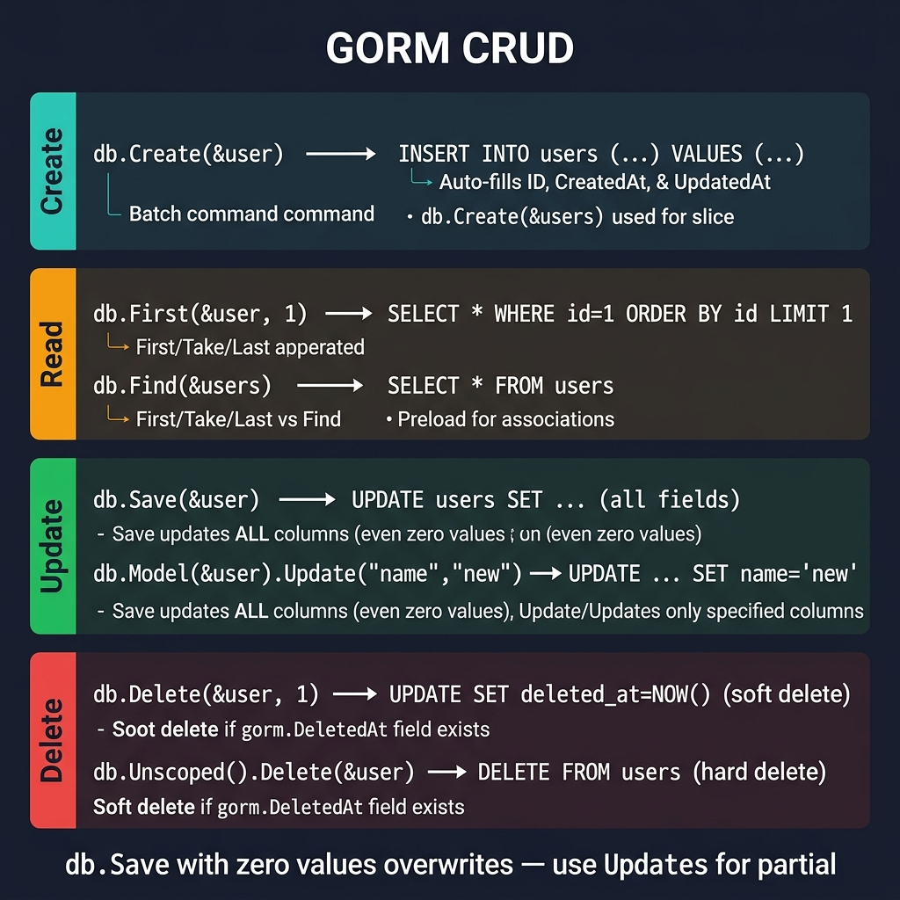

<!-- tags: golang -->
# 02 — CRUD Operations

> **Foundation**: Executing Create, Read, Update, and Delete operations using two distinct API styles: Traditional and Generics (v1.30+).

📅 Created: 2026-03-20 · 🔄 Updated: 2026-04-19 · ⏱️ 15 min read

---

## 1. DEFINE

GORM provides two API styles for database operations: the traditional `db.Create(&user)` interface and the newer generics-based `gorm.G[User](db).Create(ctx, &user)` API (v1.30+). Both map to the same SQL, but the generics API adds compile-time type safety and first-class context support.

> *Dynamically filtering three SQL JOIN constraints without preloading triggers a severe N+1 mapping loop.*

### Traditional API vs Generics API

| Characteristic | Traditional API | Generics API (≥ v1.30) |
| --- | --- | --- |
| **Syntax Format** | `db.Create(&user)` | `gorm.G[User](db).Create(ctx, &user)` |
| **Type-safe Engine** | ❌ (interface{}) | ✅ (generics) |
| **Context Integration** | Optional | Required (first-class support) |
| **Error Handling** | Checking the `.Error` logical field | Returns a standard native `error` |
| **Recommendation** | Maintaining legacy codebases | Architecting new native projects |

### CRUD Overview

| Operation | Traditional Syntax | Generics Syntax |
| --- | --- | --- |
| **Create** | `db.Create(&user)` | `gorm.G[User](db).Create(ctx, &user)` |
| **Read** | `db.First(&user, id)` | `gorm.G[User](db).First(ctx)` |
| **Update** | `db.Save(&user)` | `gorm.G[User](db).Updates(ctx, ...)` |
| **Delete** | `db.Delete(&user, id)` | `gorm.G[User](db).Delete(ctx)` |

### Failure Modes

| Failure | Root Cause | Fix |
| --- | --- | --- |
| **Silent operational error** | Neglecting to evaluate the mapped `.Error` parameter. | Implement check: `if result.Error != nil` |
| **Zero-value omission** | The ORM engine ignores natively defined struct zero-values during updates. | Utilize `map[string]interface{}` or explicitly command `Select` methods. |
| **Unconstrained mass execution** | Omitting struct WHERE constraints causes full table updates. | Define explicit boolean operators before executing global modifications. |

These failure modes sound simple. However, a trap exists: the ORM engine actively skips struct zero-values, preventing databases from overwriting previous integers to zero or booleans to false. Simultaneously, failing to evaluate the resulting `.Error` swallows runtime panics.

## 2. VISUAL



*Figure: Four CRUD lanes — Create (INSERT with auto-fill timestamps), Read (First/Find with Preload), Update (Save=all fields vs Updates=partial), Delete (soft delete via DeletedAt vs Unscoped hard delete). Warning: Save overwrites zero values.*

Regarding CRUD Operations, the visual below demonstrates a runtime perspective outlining operational sequencing delays and precise database state transition paths.

```text
  Application                  GORM                    Database
      │                         │                         │
      │── db.Create(&user) ────▶│                         │
      │                         │── INSERT INTO users ───▶│
      │                         │◀── OK (id=1) ──────────│
      │◀── user.ID = 1 ────────│                         │
      │                         │                         │
      │── db.First(&user, 1) ──▶│                         │
      │                         │── SELECT * ... LIMIT 1 ▶│
      │                         │◀── row data ───────────│
      │◀── user populated ─────│                         │
      │                         │                         │
      │── db.Save(&user) ──────▶│                         │
      │                         │── UPDATE users SET ... ▶│
      │                         │◀── rows affected ──────│
      │                         │                         │
      │── db.Delete(&user) ────▶│                         │
      │                         │── UPDATE deleted_at ... ▶│ (soft delete)
      │                         │◀── OK ─────────────────│
```

## 3. CODE

### Example 1: Basic — Executing single record creation and bulk generation

> **Goal**: Grasp the standard foundational record generation paths before exploring distinct transaction frameworks and complex bulk deployment models.
> **Approach**: Start generating a single record, expand evaluating mass insertion logic, review mapping mechanisms utilizing `Select`, and configure `CreateInBatches`.
> **Complexity**: Basic

```go
package main

import (
    "fmt"
    "log"

    "gorm.io/gorm"
)

type User struct {
    gorm.Model
    Name     string  `gorm:"size:100;not null"`
    Email    string  `gorm:"uniqueIndex;size:255"`
    Age      uint8   `gorm:"default:0"`
    Phone    *string `gorm:"size:15"`
    Role     string  `gorm:"default:'user'"`
}

func demonstrateCreate(db *gorm.DB) {
    // ━━━━━━━━━━━━━━━━━━━━━━━━━━━━━━━━━━━━━━━━━
    // 1. Create a single database record
    // ━━━━━━━━━━━━━━━━━━━━━━━━━━━━━━━━━━━━━━━━━
    user := User{Name: "Alice", Email: "alice@example.com", Age: 25}
    result := db.Create(&user) // ✅ pass the struct pointer reference

    if result.Error != nil {
        log.Println("Create failed:", result.Error)
        return
    }

    // ━━━━━━━━━━━━━━━━━━━━━━━━━━━━━━━━━━━━━━━━━
    // 2. Batch Insert
    // ━━━━━━━━━━━━━━━━━━━━━━━━━━━━━━━━━━━━━━━━━
    users := []User{
        {Name: "Bob",     Email: "bob@example.com",     Age: 30},
        {Name: "Charlie", Email: "charlie@example.com", Age: 22},
    }
    db.Create(&users)

    // ━━━━━━━━━━━━━━━━━━━━━━━━━━━━━━━━━━━━━━━━━
    // 3. Create utilizing explicit Select
    // ━━━━━━━━━━━━━━━━━━━━━━━━━━━━━━━━━━━━━━━━━
    db.Select("Name", "Email").Create(&User{
        Name:  "Eve",
        Email: "eve@example.com",
        Age:   35, // ✅ Ignored — Select limits INSERT to Name and Email only
    })

    // ━━━━━━━━━━━━━━━━━━━━━━━━━━━━━━━━━━━━━━━━━
    // 4. Batch Insert featuring capacity limits
    // ━━━━━━━━━━━━━━━━━━━━━━━━━━━━━━━━━━━━━━━━━
    var manyUsers []User
    for i := range 100 { 
        manyUsers = append(manyUsers, User{
            Name:  fmt.Sprintf("User_%d", i),
            Email: fmt.Sprintf("user%d@example.com", i),
        })
    }
    db.CreateInBatches(manyUsers, 20)
}
```

> **Why is passing a pointer during Create operations mandatory?** (Why)
> You must always pass a precise pointer (`&user`). Omitting the pointer prevents GORM from mapping the newly generated auto-incrementing Primary Key back to your struct.

### Example 2: Intermediate — Read data utilizing standard constraints

> **Goal**: Extract records applying various operational conditions avoiding shallow query pagination limitations and strict zero-value skipping anomalies.
> **Approach**: Contrast complex data parameter operations utilizing native structural constraints. Sequence standard sorting, bounding, group structures, and explicit analytical limits.
> **Complexity**: Intermediate

```go
func demonstrateRead(db *gorm.DB) {
    var user User
    var users []User

    // ━━━━━━━━━━━━━━━━━━━━━━━━━━━━━━━━━━━━━━━━━
    // First: retrieves structural singular targets
    // ━━━━━━━━━━━━━━━━━━━━━━━━━━━━━━━━━━━━━━━━━
    result := db.First(&user)
    if result.Error != nil && result.Error == gorm.ErrRecordNotFound {
        fmt.Println("User not found!")
    }

    // ━━━━━━━━━━━━━━━━━━━━━━━━━━━━━━━━━━━━━━━━━
    // Explicit Where evaluation components
    // ━━━━━━━━━━━━━━━━━━━━━━━━━━━━━━━━━━━━━━━━━
    db.Where("name = ?", "Alice").First(&user)
    db.Where("age >= ?", 25).Find(&users)

    // ━━━ Struct constraint boundaries ━━━
    // ⚠ NATIVE ZERO-VALUE BYPASSED
    db.Where(&User{Name: "Alice", Age: 0}).Find(&users) 
    // SQL: SELECT * FROM users WHERE name = 'Alice'

    // ━━━ Map constraint bounds ━━━
    db.Where(map[string]interface{}{"name": "Alice", "age": 0}).Find(&users)
    // SQL: SELECT * FROM users WHERE name = 'Alice' AND age = 0 ✅

    // ━━━━━━━━━━━━━━━━━━━━━━━━━━━━━━━━━━━━━━━━━
    // Native FindInBatches syntax
    // ━━━━━━━━━━━━━━━━━━━━━━━━━━━━━━━━━━━━━━━━━
    db.Where("age > ?", 18).FindInBatches(&users, 100, func(tx *gorm.DB, batch int) error {
        for _, u := range users {
            fmt.Printf("Batch %d: Processing %s\n", batch, u.Name)
        }
        return nil 
    })
}
```

> **Why does Find bypass ErrRecordNotFound exceptions?** (Why)
> `First` returns `ErrRecordNotFound` when no row matches because it expects exactly one result. `Find` returns an empty slice — no error — because an empty result set is valid for a collection query.

### Example 3: Advanced — Managing constrained updates and native soft deletes

> **Goal**: Modify internal values accurately while configuring precise boundaries for deleted mapping models.
> **Approach**: Execute sequences evaluating specific single elements, and evaluate standard soft element mapping against explicit hard-delete definitions.
> **Complexity**: Advanced

```go
func demonstrateUpdateDelete(db *gorm.DB) {
    var user User
    db.First(&user, 1)

    // ━━━━━━━━━ UPDATE ━━━━━━━━━

    // 1. Specific string mappings
    db.Model(&user).Update("name", "Alice Updated")

    // 2. Struct-based mass-parameter modifications
    // ⚠ Age=0 configuration bypasses updates
    db.Model(&user).Updates(User{Name: "Alice V2", Age: 0})

    // 3. Native explicit Map structures
    db.Model(&user).Updates(map[string]interface{}{
        "name": "Alice V3",
        "age":  0, // ✅ Map actively processes zero configurations
    })

    // ━━━━━━━━━ DELETE ━━━━━━━━━

    // 1. Automatic soft deletion process configurations
    db.Delete(&user) 
    // SQL: UPDATE users SET deleted_at = NOW() WHERE id = 1

    // 2. Hard Deletion configurations
    db.Unscoped().Delete(&user)
    // SQL: DELETE FROM users WHERE id = 1
}
```

> **Why do struct updates skip zero-value parameters?** (Why)
> GORM evaluates structs natively. In Go, an integer `0` or boolean `false` appears identical to an uninitialized generic field. GORM skips these zero values safely to avoid accidentally wiping valid database values unless you use explicit Maps.

## 4. PITFALLS

These traps survive unit tests and only bite in production.

| # | Severity | Defect | Impact | Fix |
|---|----------|--------|--------|-----|
| 1 | 🔴 Fatal | Zero-value fields skipped in struct updates | `Age: 0` silently ignored — DB keeps old value | Use `map[string]interface{}` or `db.Select("Age").Updates(...)` |
| 2 | 🟡 Common | Unchecked `result.Error` | Errors swallowed; corrupted data propagates | Always check: `if result.Error != nil` |
| 3 | 🔴 Fatal | String concatenation in WHERE clauses | SQL injection | Use parameterized queries: `db.Where("name = ?", name)` |
| 4 | 🟡 Common | `db.Delete(&User{})` without WHERE | Soft-deletes entire table | Always pass a condition or primary key |

## 5. REF

| Resource | Link |
| --- | --- |
| GORM — Create | https://gorm.io/docs/create.html |
| GORM — Query | https://gorm.io/docs/query.html |
| GORM — Update | https://gorm.io/docs/update.html |
| GORM — Delete | https://gorm.io/docs/delete.html |

## 6. RECOMMEND

After mastering single-record CRUD, these are the natural next steps.

| Extension | When to proceed | Rationale |
| --- | --- | --- |
| **03 — Querying** | When WHERE chains, scopes, or subqueries get complex | Learn reusable query patterns that avoid raw SQL sprawl |
| **05 — Transactions & Hooks** | Before writing multi-step business logic | Understand GORM’s auto-transaction wrapping and hook lifecycle |

---

## 🃏 Quick Reference

| Operation | GORM Code |
| --- | --- |
| Create record | `db.Create(&user)` |
| Find by primary key | `db.First(&user, id)` |
| Find with condition | `db.Where("email = ?", email).First(&user)` |
| Find all | `db.Find(&users)` |
| Update field | `db.Model(&user).Update("name", "Alice")` |
| Update multiple fields | `db.Model(&user).Updates(User{Name: "Alice", Age: 20})` |
| Delete (soft) | `db.Delete(&user, id)` |
| Hard delete | `db.Unscoped().Delete(&user, id)` |
| Count | `db.Model(&User{}).Count(&count)` |
| Pagination | `db.Offset((page-1)*size).Limit(size).Find(&users)` |
| Raw SQL | `db.Raw("SELECT * FROM users WHERE age > ?", 18).Scan(&users)` |
| Check not found | `errors.Is(err, gorm.ErrRecordNotFound)` |

**Next**: [← Models & Connection](./01-models-and-connection.md) · [→ Querying](./03-querying.md)
