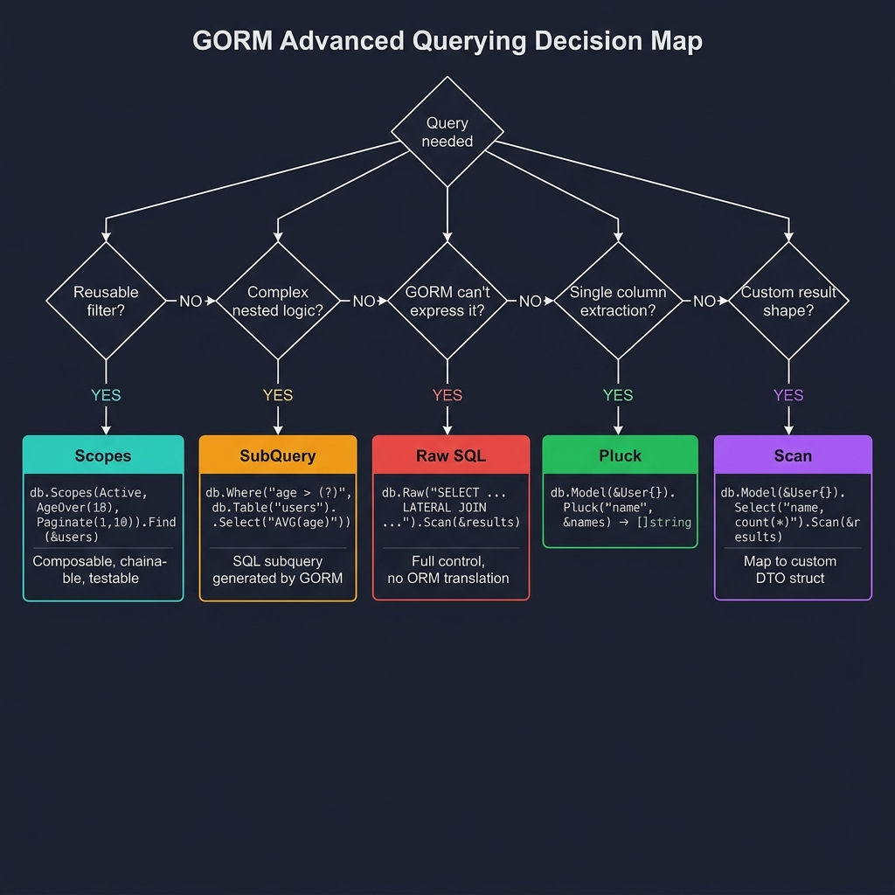

<!-- tags: golang -->
# 03 — Querying (Advanced)

> **Advanced Integration**: Implementing Scopes, SubQueries, Raw SQL structures, Pluck extractions, targeted Scan models, and intelligent cursor pagination routines.

📅 Created: 2026-03-20 · 🔄 Updated: 2026-04-19 · ⏱️ 15 min read

---

## 1. DEFINE

Basic CRUD covers single-table operations. Real applications need scopes (reusable WHERE clauses), subqueries (nested SQL inside a WHERE), raw SQL (when the query builder cannot express what you need), and cursor pagination (when OFFSET becomes O(N) on large tables).

> *Executing a massive OFFSET pagination query scans 100,000 dead rows, instantly starving the connection pool.*

### Advanced Query Features

| Feature | Description |
| --- | --- |
| **Scopes** | Reusable query fragments — composable WHERE/LIMIT/ORDER clauses. |
| **SubQuery** | Nested queries embedded inside WHERE or FROM clauses. |
| **Raw SQL** | Direct SQL execution when the query builder is insufficient. |
| **Pluck** | Extract a single column into a Go slice. |
| **Scan** | Map query results to a custom struct (not your GORM model). |

The fundamental danger emerges when Raw SQL implementations trigger injection vulnerabilities due to unvalidated inputs. This trap manifests deeply inside the PITFALLS section.

## 2. VISUAL



*Figure: Decision tree — reusable filter → Scopes (composable); complex nested → SubQuery; GORM can't express → Raw SQL; single column → Pluck ([]string); custom result shape → Scan (DTO struct).*

### Scope Composition Flow

```text
  db.Scopes(Active, AgeOver(18), Paginate(1, 10)).Find(&users)

Active ──┐
           │
  AgeOver ─┼──▶ Combined WHERE string ──▶ Output SQL bounds
           │
  Paginate ┘

Generated SQL: SELECT * FROM users
               WHERE is_active = true
               AND age > 18
               LIMIT 10 OFFSET 0
```

## 3. CODE

### Example 1: Basic — Implementing Scopes utilizing reusable query components

> **Goal**: Prevent defining repetitive `Where/Limit/Offset` structures across diverse application handlers.
> **Approach**: Build explicit scope functions receiving `*gorm.DB` parameters and returning strict `*gorm.DB` boundaries.
> **Complexity**: Basic

```go
package main

import (
    "fmt"

    "gorm.io/gorm"
)

type User struct {
    ID       uint
    Name     string
    Age      int
    Role     string
    IsActive bool
}

// ━━━━━━━━━━━━━━━━━━━━━━━━━━━━━━━━━━━━━━━━━
// Standard Scope syntax
// ━━━━━━━━━━━━━━━━━━━━━━━━━━━━━━━━━━━━━━━━━
func Active(db *gorm.DB) *gorm.DB {
    return db.Where("is_active = ?", true)
}

func AgeOver(age int) func(db *gorm.DB) *gorm.DB {
    return func(db *gorm.DB) *gorm.DB {
        return db.Where("age > ?", age)
    }
}

func Paginate(page, pageSize int) func(db *gorm.DB) *gorm.DB {
    return func(db *gorm.DB) *gorm.DB {
        if page <= 0 {
            page = 1
        }
        if pageSize <= 0 {
            pageSize = 10
        }
        offset := (page - 1) * pageSize
        return db.Offset(offset).Limit(pageSize)
    }
}

func demonstrateScopes(db *gorm.DB) {
    var users []User

    // Combine boundaries: Active + AgeOver(25) + pagination controls
    db.Scopes(Active, AgeOver(25), Paginate(1, 10)).Find(&users)
    // SQL: SELECT * FROM users WHERE is_active = true AND age > 25 LIMIT 10 OFFSET 0

    fmt.Printf("Found %d users\n", len(users))
}
```

> **Why use closures returning functions for parameterized scopes?** (Why)
> GORM's `db.Scopes()` strictly requires a function signature of `func(*gorm.DB) *gorm.DB`. The closure pattern allows you to inject dynamic variables (like `age` or `page`) while still satisfying the required GORM signature cleanly.

### Example 2: Intermediate — Advanced SubQuery implementation and Raw SQL

> **Goal**: Expand data queries capturing architectures exceeding fundamental native GORM builder capacities.
> **Approach**: Integrate embedded subquery components, perform aggregated structure scanning, and execute raw SQL syntax processing distinct parameter binding operations safely.
> **Complexity**: Intermediate

```go
func demonstrateAdvancedQueries(db *gorm.DB) {
    var users []User

    // ━━━━━━━━━━━━━━━━━━━━━━━━━━━━━━━━━━━━━━━━━
    // SubQuery sequence
    // ━━━━━━━━━━━━━━━━━━━━━━━━━━━━━━━━━━━━━━━━━
    db.Where("id IN (?)",
        db.Table("orders").Select("user_id").Where("total_amount > ?", 500000),
    ).Find(&users)

    // ━━━━━━━━━━━━━━━━━━━━━━━━━━━━━━━━━━━━━━━━━
    // Distinct Pluck mechanics
    // ━━━━━━━━━━━━━━━━━━━━━━━━━━━━━━━━━━━━━━━━━
    var emails []string
    db.Model(&User{}).Where("is_active = ?", true).Pluck("email", &emails)

    // ━━━━━━━━━━━━━━━━━━━━━━━━━━━━━━━━━━━━━━━━━
    // Structural Scan attributes for custom aggregations
    // ━━━━━━━━━━━━━━━━━━━━━━━━━━━━━━━━━━━━━━━━━
    type UserStats struct {
        TotalUsers  int64
        AvgAge      float64
        MaxAge      int
        MinAge      int
    }
    var stats UserStats
    db.Model(&User{}).Select(
        "COUNT(*) as total_users",
        "AVG(age) as avg_age",
        "MAX(age) as max_age",
        "MIN(age) as min_age",
    ).Scan(&stats)

    // ━━━━━━━━━━━━━━━━━━━━━━━━━━━━━━━━━━━━━━━━━
    // Native Raw SQL syntax
    // ━━━━━━━━━━━━━━━━━━━━━━━━━━━━━━━━━━━━━━━━━
    db.Raw("SELECT * FROM users WHERE string_parameter = @val",
        map[string]interface{}{"val": "Alice"},
    ).Scan(&users) // ✅ Safely passing map variables avoids string concatenation injections.
}
```

> **Why should you avoid frequent Raw SQL execution?** (Why)
> Raw SQL sacrifices driver independence and compiler type safety. It forces future database migrations to audit raw text strings for compatibility rather than relying on GORM's agnostic dialect generator. 

### Example 3: Advanced — Cursor pagination with singleflight deduplication

> **Goal**: Elevate query performance managing high-traffic request duplication while scaling complex data subsets via cursor logic.
> **Approach**: Swap internal offset configurations substituting mapped cursor evaluations and adopt `singleflight` logic blocking concurrent repetitive lookup streams.
> **Complexity**: Advanced

```go
package main

import (
    "context"
    "crypto/sha256"
    "encoding/json"
    "fmt"
    "log"

    "golang.org/x/sync/singleflight"
    "gorm.io/driver/postgres"
    "gorm.io/gorm"
)

type Product struct {
    ID        uint      `gorm:"primarykey" json:"id"`
    Category  string    `gorm:"size:100;index" json:"category"`
}

// ━━━━━━━━━━━━━━━━━━━━━━━━━━━━━━━━━━━━━━━━━
// CursorPaginate: Use WHERE id > cursor instead of OFFSET.
// OFFSET scans and discards rows — O(N) cost. Cursor seeks via index — O(1).
// ━━━━━━━━━━━━━━━━━━━━━━━━━━━━━━━━━━━━━━━━━
func CursorPaginate(cursor uint, limit int) func(*gorm.DB) *gorm.DB {
    return func(db *gorm.DB) *gorm.DB {
        if cursor > 0 {
            db = db.Where("id > ?", cursor)
        }
        if limit <= 0 || limit > 100 {
            limit = 20
        }
        return db.Order("id ASC").Limit(limit)
    }
}

type ProductService struct {
    db    *gorm.DB
    group singleflight.Group
}

type ListParams struct {
    Category string
    Cursor   uint
    Limit    int
}

type ListResult struct {
    Products   []Product `json:"products"`
    NextCursor uint      `json:"next_cursor"`
    HasMore    bool      `json:"has_more"`
}

func (s *ProductService) ListProducts(ctx context.Context, params ListParams) (*ListResult, error) {
    // ━━━ Singleflight: deduplicate identical concurrent queries ━━━
    keyData, _ := json.Marshal(params)
    key := fmt.Sprintf("products:%x", sha256.Sum256(keyData))

    val, err, shared := s.group.Do(key, func() (interface{}, error) {
        var products []Product

        result := s.db.WithContext(ctx).
            Where("category = ?", params.Category).
            Scopes(CursorPaginate(params.Cursor, params.Limit+1)). 
            Find(&products)

        if result.Error != nil {
            return nil, result.Error
        }

        hasMore := len(products) > params.Limit
        if hasMore {
            products = products[:params.Limit] // Trim the lookahead row
        }

        var nextCursor uint
        if hasMore && len(products) > 0 {
            nextCursor = products[len(products)-1].ID
        }

        return &ListResult{
            Products:   products,
            NextCursor: nextCursor,
            HasMore:    hasMore,
        }, nil
    })

    if err != nil {
        return nil, err
    }

    if shared {
        log.Printf("[Singleflight] Query deduplicated: %s", key[:16])
    }

    return val.(*ListResult), nil
}
```

> **Why query Limit + 1 for Cursor Pagination?** (Why)
> Requesting exactly `limit + 1` allows the underlying service to trivially detect if there are remaining pages. If the returned subset length strictly exceeds the limit, the handler truncates the final entry and correctly sets `HasMore` to true.

## 4. PITFALLS

Evaluating proper mapping sequences prevents disastrous scale collapse in relational evaluations. 

| # | Severity | Defect | Impact | Fix |
|---|----------|--------|--------|-----|
| 1 | 🔴 Fatal | Constructing Raw SQL via native string concatenation blindly | Security breach | Implement parameter models parsing specific `?` placeholders strictly tracking bounds securely. |
| 2 | 🟡 Common | Utilizing massive database global OFFSET sequences indiscriminately | Deep scaling timeouts | Format dynamic target boundaries utilizing cursor tracking systems managing reliable sequential arrays. |
| 3 | 🔵 Minor | Failing to bind singleflight locks controlling redundant lookup traffic | Cache stampede exhaustion | Integrate sync modules blocking repetitive execution logic caching exact parallel execution boundaries safely. |

## 5. REF

| Resource | Link |
| --- | --- |
| GORM — Advanced Query | https://gorm.io/docs/advanced_query.html |
| GORM — Scopes | https://gorm.io/docs/scopes.html |
| GORM — Raw SQL | https://gorm.io/docs/sql_builder.html |

## 6. RECOMMEND

With query patterns established, scale into relational and transactional territory.

| Extension | When to proceed | Rationale |
| --- | --- | --- |
| **04 — Associations** | When queries span multiple related tables | Learn Preload vs Joins and avoid N+1 traps |
| **05 — Transactions & Hooks** | When multi-table writes need atomicity | Understand rollback, hook lifecycle, and nested transactions |

---
