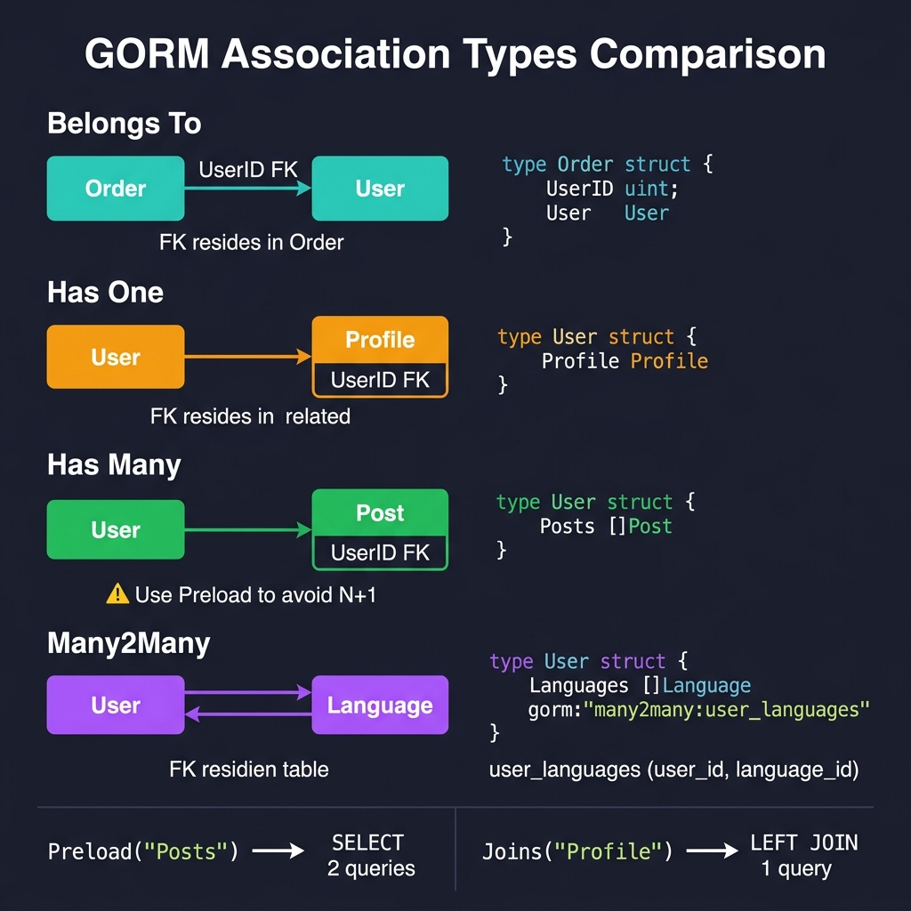

<!-- tags: golang -->
# 04 — Associations

> **Advanced Integration**: Implementing Has One, Has Many, Belongs To, Many2Many, nested Preloads, and targeted Joins.

📅 Created: 2026-03-20 · 🔄 Updated: 2026-04-19 · ⏱️ 15 min read

---

## 1. DEFINE

GORM supports four association types: Belongs To, Has One, Has Many, and Many2Many. The critical skill is not declaring them — it is loading them correctly. Without explicit `Preload` or `Joins`, GORM returns empty association fields, and naive loops trigger N+1 query storms that exhaust connection pools.

> *Executing a loop reading 5,000 user profiles without eager loading triggers 5,001 separate SQL queries, instantly exhausting connection pools.*

### 4 Association Types

| Association | Structural Relation | FK Location | Example Models |
| --- | --- | --- | --- |
| **Belongs To** | N:1 | Enclosed within current model | Order → User (Order embeds `UserID`) |
| **Has One** | 1:1 | Located within target model | User → Profile (Profile embeds `UserID`) |
| **Has Many**| 1:N | Located within target model | User → Orders (Order embeds `UserID`) |
| **Many2Many**| N:M | Generates junction tables | Order ↔ Products (via junction `order_products`) |

### Preloading Models

| Method | Execution Context | SQL Pattern Example |
| --- | --- | --- |
| **Preload** | Eager loading via 2 queries (prevents N+1) | `SELECT * FROM users; SELECT * FROM orders WHERE user_id IN (...)` |
| **Joins** | Single LEFT JOIN query (best for 1:1 relations) | `SELECT * FROM users LEFT JOIN profiles ON ...` |

### Failure Modes

| Failure | Root Cause | Fix |
| --- | --- | --- |
| **N+1 queries escalation** | Traversing mapped associations inside looping logic while omitting `Preload`. | Explictly append `Preload("Orders")` before executing `Find`. |
| **Circular routing** | Preloading nested self-referential bounds infinitely. | Constrain preloading targets utilizing explicit path bounds (e.g., `A.B`). |
| **FK mismatching** | Existing legacy column properties violate GORM naming models. | Define strict `foreignKey` tag overrides on the model struct. |

These failures appear minor. Yet a trap exists: N+1 structures remain dormant until production data scales massively, crashing systems outright. Furthermore, executing `Joins` over 1:N targets silently duplicates rows. This trap manifests deeply inside the PITFALLS section.

## 2. VISUAL



*Figure: Four association types with FK ownership — BelongsTo (FK in child), HasOne (FK in related), HasMany (FK in related, slice), Many2Many (junction table). Loading: Preload = 2 SELECTs, Joins = 1 LEFT JOIN.*

### Association Types Structure

```text
  Belongs To (FK resides here)           Has One (FK resides there)
  ┌─────────┐    FK    ┌───────┐    ┌───────┐   FK   ┌─────────┐
  │  Order  │──────────▶│ User │    │ User │◀─────────│ Profile │
  │ UserID  │           │      │    │      │          │ UserID  │
  └─────────┘           └───────┘   └───────┘         └─────────┘

Has Many (FK resides there)               Many2Many (junction table)
  ┌───────┐   FK    ┌─────────┐    ┌───────┐  ┌──────────┐  ┌─────────┐
  │ User │◀─────────│ Order   │    │ Order │◀▶│order_prod│◀▶│ Product │
  │      │          │ UserID  │    │       │  │order_id  │  │         │
  └───────┘         │ (many)  │    └───────┘  │product_id│  └─────────┘
                    └─────────┘               └──────────┘
```

## 3. CODE

### Example 1: Basic — Structuring fundamental associations

> **Goal**: Map architectural object relations constructing database layers securing complex schema querying behaviors.
> **Approach**: Define native `Belongs To`, structured `Has One`, mapped `Has Many`, and linked `Many2Many` components utilizing standard structural tags.
> **Complexity**: Basic

```go
package models

import "gorm.io/gorm"

// ━━━━━━━━━━━━━━━━━━━━━━━━━━━━━━━━━━━━━━━━━
// User model maps all primary baseline associations
// ━━━━━━━━━━━━━━━━━━━━━━━━━━━━━━━━━━━━━━━━━
type User struct {
    gorm.Model
    Name    string
    Email   string

    // Has One parameter: User <──1:1──> Profile
    Profile Profile

    // Has Many parameter: User <──1:N──> Orders
    Orders []Order

    // Many2Many mapping parameter: User <──N:M──> Roles
    // Constructs junction database table mapping: user_roles
    Roles []Role `gorm:"many2many:user_roles;"`
}

// ━━━━━━━━━━━━━━━━━━━━━━━━━━━━━━━━━━━━━━━━━
// Profile mapping logic: Belongs To nested User structure (1:1 constraint)
// ━━━━━━━━━━━━━━━━━━━━━━━━━━━━━━━━━━━━━━━━━
type Profile struct {
    gorm.Model
    UserID uint   // FK established here
    Bio    string 
    User   User   // Belongs To definition
}

// ━━━━━━━━━━━━━━━━━━━━━━━━━━━━━━━━━━━━━━━━━
// Order: Belongs To User (N:1 — FK lives in Order)
// ━━━━━━━━━━━━━━━━━━━━━━━━━━━━━━━━━━━━━━━━━
type Order struct {
    gorm.Model
    UserID      uint    
    OrderNumber string  

    User        User      // Belongs To component
    Items       []OrderItem // Has Many component
}

type OrderItem struct {
    gorm.Model
    OrderID   uint    
    ProductID uint    

    Order   Order
    Product Product
}

type Product struct {
    gorm.Model
    Name  string  
    Price float64 
}

// ━━━━━━━━━━━━━━━━━━━━━━━━━━━━━━━━━━━━━━━━━
// Role: Many2Many with User via junction table user_roles
// ━━━━━━━━━━━━━━━━━━━━━━━━━━━━━━━━━━━━━━━━━
type Role struct {
    gorm.Model
    Name  string 
    Users []User `gorm:"many2many:user_roles;"` // Connects inverse bounds
}
```

> **Why explicitly declare UserID within the struct?** (Why)
> Explicitly declaring the `UserID` uint field ensures you can assign relationships instantly using IDs without fetching and loading the entire massive `User` struct instance from the database first.

### Example 2: Intermediate — Configuring explicit Preload logic preventing N+1 queries

> **Goal**: Gather parent configurations capturing internal relational boundaries securely.
> **Approach**: Execute native `Preload` bindings mapping immediate relations, formulate nested patterns, and implement dynamic logical preload constraints.
> **Complexity**: Intermediate

```go
func demonstratePreload(db *gorm.DB) {
    var users []User

    // ━━━━━━━━━━━━━━━━━━━━━━━━━━━━━━━━━━━━━━━━━
    // ❌ Critical System Problem (N+1 query trigger)
    // ━━━━━━━━━━━━━━━━━━━━━━━━━━━━━━━━━━━━━━━━━
    db.Find(&users)
    for _, u := range users {
        // Individual access calls query database N times!
        fmt.Println(u.Name, "has orders:", len(u.Orders)) // Orders outputs empty structs magically!
    }

    // ━━━━━━━━━━━━━━━━━━━━━━━━━━━━━━━━━━━━━━━━━
    // ✅ Implemented Preload mapping 
    // ━━━━━━━━━━━━━━━━━━━━━━━━━━━━━━━━━━━━━━━━━
    db.Preload("Orders").Find(&users)
    // SQL 1: SELECT * FROM users
    // SQL 2: SELECT * FROM orders WHERE user_id IN (1,2,3...)

    // ━━━ Evaluate Nested Preloads ━━━
    db.Preload("Orders.Items.Product").Find(&users)

    // ━━━ Activate configured Preload constraints applying dynamic array bounds ━━━
    db.Preload("Orders", "status = ?", "pending").Find(&users)

    // ━━━ Preload with custom function for complex filters ━━━
    db.Preload("Orders", func(db *gorm.DB) *gorm.DB {
        return db.Where("total_amount > ?", 100000).Order("created_at DESC")
    }).Find(&users)

    // ━━━━━━━━━━━━━━━━━━━━━━━━━━━━━━━━━━━━━━━━━
    // Preload All variables — processes ALL attached associated mapped configurations
    // ⚠ Assess resulting performance carefully! 
    // ━━━━━━━━━━━━━━━━━━━━━━━━━━━━━━━━━━━━━━━━━
    db.Preload(clause.Associations).Find(&users)
}
```

> **Why does Preload emit two queries instead of one LEFT JOIN?** (Why)
> A `LEFT JOIN` on a Has Many relation duplicates parent rows — one parent row per child row. With 100 users and 10 orders each, that is 1,000 rows transmitted. Two separate queries (100 users + 1,000 orders) avoid this duplication and reduce memory overhead.

### Example 3: Advanced — Join preload and modifying mapped associations dynamically

> **Goal**: Evaluate execution constraints minimizing query generation latency cleanly.
> **Approach**: Utilize conditional explicitly mapped `Joins` tracking targets, replacing nested properties dynamically utilizing `Association()` syntax.
> **Complexity**: Advanced

```go
import "gorm.io/gorm/clause"

func demonstrateJoinsAndAssocMode(db *gorm.DB) {
    var users []User

    // ━━━━━━━━━━━━━━━━━━━━━━━━━━━━━━━━━━━━━━━━━
    // Bounded Joins Preloading targeting strict 1:1 associations safely
    // ━━━━━━━━━━━━━━━━━━━━━━━━━━━━━━━━━━━━━━━━━
    db.Joins("Profile").Find(&users)
    // SQL: SELECT ... FROM users LEFT JOIN profiles ON profiles.user_id = users.id

    // Bounded explicit Joins rendering specific internal where filters
    db.Joins("Profile", db.Where(&Profile{Bio: "Developer"})).Find(&users)

    // ━━━━━━━━━━━━━━━━━━━━━━━━━━━━━━━━━━━━━━━━━
    // Modifying relational array sets natively
    // ━━━━━━━━━━━━━━━━━━━━━━━━━━━━━━━━━━━━━━━━━
    var user User
    db.First(&user, 1)

    // Append operations linking distinct internal instances
    newOrder := Order{OrderNumber: "ORD-100", TotalAmount: 250000}
    db.Model(&user).Association("Orders").Append(&newOrder)

    // Replaces explicit sequences purging previous bounded junction definitions
    newRoles := []Role{{Name: "admin"}, {Name: "manager"}}
    db.Model(&user).Association("Roles").Replace(&newRoles)

    // Deletes particular bounded mapping properties specifically
    db.Model(&user).Association("Roles").Delete(&Role{Name: "manager"})

    // Eradicates ALL linked relations targeting this specific block permanently
    db.Model(&user).Association("Roles").Clear()

    // Evaluates database constraints executing direct remote counting metrics
    count := db.Model(&user).Association("Orders").Count()
    fmt.Printf("Order count: %d\n", count)
}
```

> **Why does Joins("Profile") succeed while Joins("Orders") corrupts mapped data?** (Why)
> Using `Joins` across a 1:1 (`Profile`) yields a clean output. Emitting `Joins` across a 1:N (`Orders`) generates cartesian database outputs mutating into redundant array allocations when mapped natively into Go structures.

## 4. PITFALLS

Association bugs are dormant in development and catastrophic at scale.

| # | Severity | Defect | Impact | Fix |
|---|----------|--------|--------|-----|
| 1 | 🔴 Fatal | Looping over associations without `Preload` | N+1 queries — 1 query per row | Add `db.Preload("Orders").Find(&users)` before the loop |
| 2 | 🟡 Common | Using `Joins` on Has Many (1:N) relations | Duplicate parent rows in result set | Use `Preload` for 1:N; reserve `Joins` for 1:1 |
| 3 | 🔵 Minor | Omitting `many2many` tag on the inverse side | AutoMigrate fails to create junction table | Add `gorm:"many2many:table_name"` on both structs |

## 5. REF

| Resource | Link |
| --- | --- |
| GORM — Associations | https://gorm.io/docs/associations.html |
| GORM — Has One | https://gorm.io/docs/has_one.html |
| GORM — Preloading | https://gorm.io/docs/preload.html |

## 6. RECOMMEND

With associations mapped, move into transactional integrity and query optimization.

| Extension | When to proceed | Rationale |
| --- | --- | --- |
| **05 — Transactions & Hooks** | When multi-model writes need atomicity | Learn nested transactions, SavePoint, and hook lifecycle |
| **03 — Querying** | When association filters get complex | Use Scopes and SubQueries to compose conditional Preloads |

---
