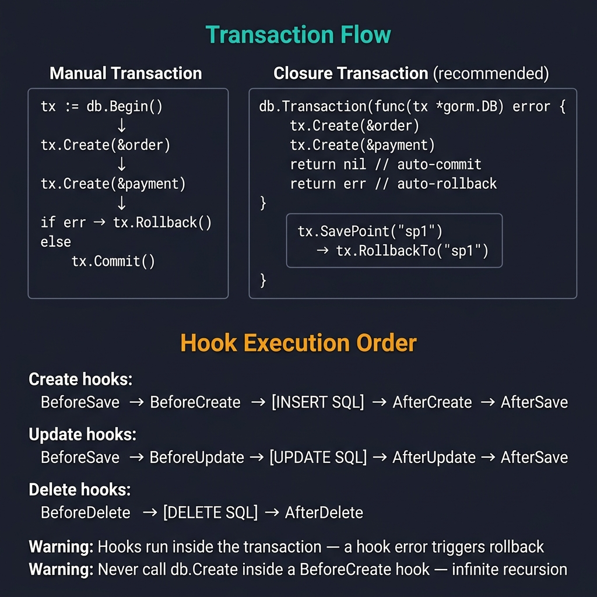

<!-- tags: golang -->
# 05 — Transactions & Hooks

> **Advanced Integration**: Implementing explicit transaction management protocols, nested savepoint boundaries, and executing deterministic lifecycle hooks.

📅 Created: 2026-03-20 · 🔄 Updated: 2026-04-19 · ⏱️ 15 min read

---

## 1. DEFINE

GORM wraps every write operation in an implicit transaction. For single-table inserts that is fine. For multi-table business logic — debiting an account, creating an order, and logging an audit trail — you need explicit transaction boundaries and an understanding of GORM’s hook lifecycle to avoid partial commits and infinite callback loops.

> *Updating user balances without transaction locks causes race conditions, enabling double-spend exploits instantly.*

### Transactions Overview

GORM wraps **every native write operation** (Create, Update, Delete) inside an implicit database transaction. Developers can disable this automatic wrapping for performance gains or establish rigid manual transaction boundaries for multi-table atomic operations.

| Method | Internal Description |
| --- | --- |
| `db.Transaction(func)` | Automatic commit/rollback logic — returning nil triggers sequence commit, returning error executes safe rollback. |
| `db.Begin()` | Manual mapping boundaries — requires explicit configured sequence operations (`Commit` or `Rollback`). |
| Nested `tx.Transaction` | Savepoint execution — inner rollback events bypass external isolated parent queries. |

### Hooks (Lifecycle Callbacks)

| Hook | Execution Sequence Timing | Use Case |
| --- | --- | --- |
| `BeforeCreate` | Preceding INSERT operations | Struct validation, password hashing sequences, UUID rendering. |
| `AfterCreate` | Following INSERT operations | Dispatch async jobs, audit map generation. |
| `BeforeUpdate` | Preceding UPDATE | Validate sequence parameters, timestamp overrides. |
| `AfterUpdate` | Following UPDATE | Replicate caching properties dynamically. |
| `AfterFind` | Following SELECT operations | Decrypt secure payload properties cleanly. |

### Failure Modes

| Failure | Root Cause | Fix |
| --- | --- | --- |
| **Partial updates** | Omitting explicit transaction wrappers across interdependent tables. | Wrap interrelated array parameters generating bound logic within `Transaction(func)`. |
| **Silent transaction escape** | Executing DB operations using the global `db` instance inside a transaction block instead of using `tx`. | Always specify `tx.Create()` inside transaction closures. |
| **Infinite hook loops** | Executing `Save` or `Update` parameters directly inside an `AfterSave` hook. | Use `tx.Session(&gorm.Session{SkipHooks: true}).Update()`. |

These failure modes seem straightforward. However, an operational trap exists: utilizing the global `db` variable inside an active transaction silently executes writes outside the safety boundary, instantly destroying ACID guarantees. This trap manifests deeply inside the PITFALLS section.

## 2. VISUAL



*Figure: Manual vs Closure transactions (closure recommended — auto rollback on error). Hook order: BeforeSave → BeforeCreate → INSERT → AfterCreate → AfterSave. Hooks run inside tx — error triggers rollback.*

### Hook Execution Ordering

```text
  db.Create(&user)

BeforeSave ──▶ BeforeCreate ──▶ native INSERT sequence ──▶ AfterCreate ──▶ AfterSave

db.Save(&user) (standard array update sequences)

BeforeSave ──▶ BeforeUpdate ──▶ generated UPDATE mapping ──▶ AfterUpdate ──▶ AfterSave
```

## 3. CODE

### Example 1: Basic — Implementing automatic closure transactions

> **Goal**: Combine numerous database configurations rendering integrated atomic units safely.
> **Approach**: Utilize the `db.Transaction(func(tx *gorm.DB) error { ... })` wrapper.
> **Complexity**: Basic

```go
package main

import (
    "fmt"

    "gorm.io/gorm"
)

type Order struct {
    ID          uint
    UserID      uint
    OrderNumber string
    TotalAmount float64
}

type Payment struct {
    ID      uint
    OrderID uint
    Amount  float64
}

type User struct {
    ID      uint
    Balance float64
}

func createOrderWithPayment(db *gorm.DB, userID uint, amount float64) error {
    // ━━━━━━━━━━━━━━━━━━━━━━━━━━━━━━━━━━━━━━━━━
    // db.Transaction evaluates block operations automatically:
    // - returning nil       → COMMITS transaction naturally.
    // - returning errors    → ROLLBACK sequence safely.
    // ⚠ Operate utilizing explicit 'tx' definitions ONLY!
    // ━━━━━━━━━━━━━━━━━━━━━━━━━━━━━━━━━━━━━━━━━
    return db.Transaction(func(tx *gorm.DB) error {
        
        // Step 1: Execute order mapping securely
        order := Order{
            UserID:      userID,
            OrderNumber: fmt.Sprintf("ORD-%d", userID),
            TotalAmount: amount,
        }
        if err := tx.Create(&order).Error; err != nil {
            return err // ← ACTIVATES ROLLBACK explicitly
        }

        // Step 2: Establish payment sequences safely
        payment := Payment{
            OrderID: order.ID,
            Amount:  amount,
        }
        if err := tx.Create(&payment).Error; err != nil {
            return err // ← COMMENCES FULL ROLLBACK
        }

        // Step 3: Manipulate user balances atomically
        if err := tx.Model(&User{}).Where("id = ?", userID).
            Update("balance", gorm.Expr("balance - ?", amount)).Error; err != nil {
            return err 
        }

        return nil // ← All three writes committed atomically
    })
}
```

> **Why avoid manual db.Begin() and tx.Commit() patterns?** (Why)
> The closure pattern `db.Transaction(func)` automatically catches panics internally and safely executes a rollback. Manual `db.Begin()` routines require complex nested `defer func()` blocks to catch panics reliably, increasing boilerplate cognitive load.

### Example 2: Intermediate — Nested transactions utilizing Savepoints

> **Goal**: Rollback targeted partial logic paths without destroying the outer parent sequence.
> **Approach**: Utilize nested `tx.Transaction(...)` targeting localized elements safely.
> **Complexity**: Intermediate

```go
func demonstrateNestedTx(db *gorm.DB) {
    db.Transaction(func(tx *gorm.DB) error {
        // ━━━ Parent Scope: process target user structures ━━━
        tx.Create(&User{Balance: 1000})

        // ━━━ Sub Scope 1: Failing task utilizing boundaries ━━━
        tx.Transaction(func(tx2 *gorm.DB) error {
            tx2.Create(&Order{OrderNumber: "ORD-FAIL"})
            return fmt.Errorf("rollback inner tx solely") // ← initiates isolated rollback cleanly
        })

        // ━━━ Sub Scope 2: Successful component tracking ━━━
        tx.Transaction(func(tx3 *gorm.DB) error {
            tx3.Create(&Payment{Amount: 50})
            return nil 
        })

        return nil // ← RESOLVES parent logic securing the primary User and Sub Scope 2 elements.
    })

    // ━━━━━━━━━━━━━━━━━━━━━━━━━━━━━━━━━━━━━━━━━
    // Manual Savepoint management
    // ━━━━━━━━━━━━━━━━━━━━━━━━━━━━━━━━━━━━━━━━━
    manualTx := db.Begin()
    manualTx.Create(&User{Balance: 500})

    manualTx.SavePoint("before_risky_order")
    manualTx.Create(&Order{OrderNumber: "ORD-RISKY"})
    manualTx.RollbackTo("before_risky_order") // ← tracks isolation parameters separating variables

    manualTx.Commit() // The primary user configuration remains secure.
}
```

> **Why configure SavePoints during extended transaction sequences?** (Why)
> Standard relational databases fail the entire transaction upon encountering a single query failure constraints. Savepoints configure explicit recovery milestones, preventing total atomic failure during complex processing pipelines.

### Example 3: Advanced — Implementing Lifecycle Hooks managing audit records

> **Goal**: Evaluate entity transformations tracking security boundaries natively.
> **Approach**: Configure condition string targets defining `BeforeCreate` bounds and generate automated `AfterCreate` async executions perfectly.
> **Complexity**: Advanced

```go
package models

import (
    "errors"
    "fmt"
    "strings"
    "time"

    "golang.org/x/crypto/bcrypt"
    "gorm.io/gorm"
)

type SecureUser struct {
    gorm.Model
    Email    string `gorm:"uniqueIndex"`
    Password string 
}

type AuditLog struct {
    gorm.Model
    Action    string
    EntityID  uint
    CreatedAt time.Time
}

// ━━━━━━━━━━━━━━━━━━━━━━━━━━━━━━━━━━━━━━━━━
// BeforeCreate definition validates mapping values defensively.
// ━━━━━━━━━━━━━━━━━━━━━━━━━━━━━━━━━━━━━━━━━
func (u *SecureUser) BeforeCreate(tx *gorm.DB) error {
    if !strings.Contains(u.Email, "@") {
        return errors.New("invalid email format")
    }

    if u.Password != "" {
        hashed, err := bcrypt.GenerateFromPassword([]byte(u.Password), bcrypt.DefaultCost)
        if err != nil {
            return fmt.Errorf("failed to hash password: %w", err)
        }
        u.Password = string(hashed)
    }

    u.Email = strings.ToLower(strings.TrimSpace(u.Email))
    return nil 
}

// ━━━━━━━━━━━━━━━━━━━━━━━━━━━━━━━━━━━━━━━━━
// AfterCreate mapping handles asynchronous auditing paths seamlessly.
// ━━━━━━━━━━━━━━━━━━━━━━━━━━━━━━━━━━━━━━━━━
func (u *SecureUser) AfterCreate(tx *gorm.DB) error {
    // Utilize the provided 'tx' variable explicitly avoiding isolated database connections!
    return tx.Create(&AuditLog{
        Action:    "user_created",
        EntityID:  u.ID,
        CreatedAt: time.Now(),
    }).Error
}

// ━━━━━━━━━━━━━━━━━━━━━━━━━━━━━━━━━━━━━━━━━
// AfterFind elements redact secure payload properties upon readout.
// ━━━━━━━━━━━━━━━━━━━━━━━━━━━━━━━━━━━━━━━━━
func (u *SecureUser) AfterFind(tx *gorm.DB) error {
    u.Password = "[REDACTED]"
    return nil
}
```

> **Why utilize the tx variable instead of global db inside hooks?** (Why)
> Executing the global `db` variable inside a hook initiates a distinct database connection ignoring the active transaction context completely. If the primary transaction rolls back subsequently, the nested hook operation remains committed permanently, causing massive sequence fragmentation.

## 4. PITFALLS

These traps silently break ACID guarantees.

| # | Severity | Defect | Impact | Fix |
|---|----------|--------|--------|-----|
| 1 | 🔴 Fatal | Using global `db` inside `Transaction(func)` closure | Writes bypass the transaction and persist on rollback | Always use the injected `tx` parameter |
| 2 | 🔴 Fatal | Calling `tx.Save()` inside an `AfterSave` hook | Infinite recursive loop | Use `tx.Session(&gorm.Session{SkipHooks: true}).Save()` |
| 3 | 🟡 Common | No panic recovery in manual `db.Begin()` | Connection leaked on panic | Use `db.Transaction(func)` or add `defer recover` with `tx.Rollback()` |

## 5. REF

| Resource | Link |
| --- | --- |
| GORM — Transactions | https://gorm.io/docs/transactions.html |
| GORM — Hooks | https://gorm.io/docs/hooks.html |

## 6. RECOMMEND

With transaction basics in place, scale into advanced locking and performance.

| Extension | When to proceed | Rationale |
| --- | --- | --- |
| **08 — Row Locking** | When concurrent writes on the same row cause race conditions | Learn `SELECT FOR UPDATE`, `NOWAIT`, and `SKIP LOCKED` patterns |
| **SkipDefaultTransaction** | When bulk inserts are slow | Disabling implicit transaction wrapping yields ~30% throughput gain |

---
