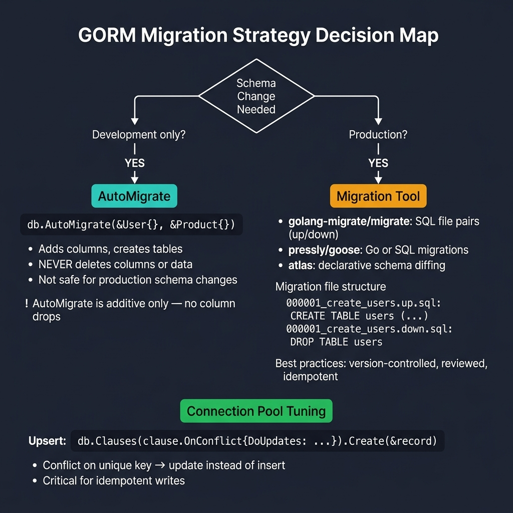

<!-- tags: golang -->
# 06 — Migration & Advanced

> **Advanced Integration**: Explaining AutoMigrate strategies versus manual migration tools, structuring connection pools safely, and executing Upsert boundaries.

📅 Created: 2026-03-20 · 🔄 Updated: 2026-04-19 · ⏱️ 15 min read

---

## 1. DEFINE

AutoMigrate is convenient for local development but dangerous in production — it adds columns but never removes them, cannot rename fields, and offers no rollback path. This article covers migration strategies (AutoMigrate vs golang-migrate vs goose vs Atlas), connection pool tuning, Upsert patterns, and row-level locking.

> *Using unoptimized connection pools guarantees connection exhaustion under high concurrency loads.*

### Migration Strategies

| Strategy | Use Case | Pros | Cons |
| --- | --- | --- | --- |
| **AutoMigrate** | Development prototypes | Zero configuration limits | Ignores column deletion and complex ALTER constraints |
| **golang-migrate** | Production models | Grants comprehensive DDL syntax control mechanisms | Introduces manual configuration complexity |
| **goose** | Production mapping | Applies standard Go-based variables generating concise API targets | Limits formatting configuration variables slightly |
| **Atlas** | Modern production schema | Applies declarative configuration syntax safely | Introduces complex theoretical learning curves |

### Performance Considerations

| Technique | System Impact | Implementation |
| --- | --- | --- |
| **SkipDefaultTransaction** | +30% sequence write execution speed | `gorm.Config{SkipDefaultTransaction: true}` |
| **PrepareStmt** | Caches prepared statement variables | `gorm.Config{PrepareStmt: true}` |
| **Connection Pool** | Prevents dormant connection leak occurrences | Execute `SetMaxOpenConns` and `SetMaxIdleConns` |
| **Batch operations** | Reduces sequence network round-trips | Use `CreateInBatches` or `FindInBatches` |

### Failure Modes

| Failure | Root Cause | Fix |
| --- | --- | --- |
| **Migration configuration drift** | Operating hybrid AutoMigrate logic combined with manual limits. | Establish a single discrete execution strategy completely. |
| **Connection limit exhaustion** | Structuring restricted connection pools executing extreme query durations. | Scale pool variables and configure optimized target indexes. |
| **Execution pattern Deadlocks** | Updating identical rows executing concurrent map boundaries. | Enforce row-level constraints accurately. |

These failure modes seem avoidable. Yet a trap exists: executing AutoMigrate functions within strict production boundaries prohibits rollback logic entirely, and deploying missing connection pool configurations guarantees invisible execution exhaustion faults.

## 2. VISUAL



*Figure: Dev → AutoMigrate (additive only, no column drops). Production → migration tools (golang-migrate, goose, atlas) with versioned SQL pairs. Upsert via clause.OnConflict for idempotent writes.*

### Connection Pool Mechanisms

```text
  Application Boundary
      │
      ├── goroutine 1 ──▶ ┌─────────────────────┐ ──▶ DB processing
      ├── goroutine 2 ──▶ │  Connection Pool    │ ──▶ DB processing
      ├── goroutine 3 ──▶ │   MaxOpen limit: 25 │ ──▶ DB processing
      ├── goroutine 4 ──▶ │   MaxIdle state: 10 │ ──▶ DB processing
      └── goroutine 5 ──▶ │   MaxLifetime: 5min │ ──▶ DB processing
                                 └─────────────────────┘
                                 ↑                     ↑
                         Idle pool variables    Active process boundaries
```

## 3. CODE

### Example 1: Basic — Structuring production-grade connection targets

> **Goal**: Establish connected DB arrays configuring robust pool attributes, tracking log mechanisms, and asserting explicit limits.
> **Approach**: Construct discrete DSN rules conditionally applying environment-based log functions and implement pool parameters securely.
> **Complexity**: Basic

```go
package database

import (
    "fmt"
    "log"
    "os"
    "time"

    "gorm.io/driver/postgres"
    "gorm.io/gorm"
    "gorm.io/gorm/logger"
)

type Config struct {
    Host     string
    Port     int
    User     string
    Password string
    DBName   string
    SSLMode  string
    TimeZone string
}

func NewConnection(cfg Config) (*gorm.DB, error) {
    dsn := fmt.Sprintf(
        "host=%s port=%d user=%s password=%s dbname=%s sslmode=%s TimeZone=%s",
        cfg.Host, cfg.Port, cfg.User, cfg.Password, cfg.DBName, cfg.SSLMode, cfg.TimeZone,
    )

    // Choose log level based on environment
    var logLevel logger.LogLevel
    if os.Getenv("APP_ENV") == "production" {
        logLevel = logger.Warn
    } else {
        logLevel = logger.Info
    }

    newLogger := logger.New(
        log.New(os.Stdout, "\r\n", log.LstdFlags),
        logger.Config{
            SlowThreshold:             200 * time.Millisecond,
            LogLevel:                  logLevel,
            IgnoreRecordNotFoundError: true,
            Colorful:                  true,
        },
    )

    db, err := gorm.Open(postgres.Open(dsn), &gorm.Config{
        Logger: newLogger,
        // Disable default transaction wrapping for pure speed (~30% boost).
        SkipDefaultTransaction: true,
        // Cache prepared statements efficiently (~15% boost).
        PrepareStmt: true,
    })
    if err != nil {
        return nil, fmt.Errorf("failed to connect database: %w", err)
    }

    sqlDB, err := db.DB()
    if err != nil {
        return nil, fmt.Errorf("failed to get underlying DB: %w", err)
    }

    // Cap total open connections to match DB's max_connections budget
    sqlDB.SetMaxOpenConns(25)
    
    // Keep idle connections warm for burst traffic
    sqlDB.SetMaxIdleConns(10)
    
    // Recycle connections to avoid stale TCP sessions
    sqlDB.SetConnMaxLifetime(5 * time.Minute)

    return db, nil
}
```

> **Why configure SetMaxOpenConns explicitly?** (Why)
> Without `SetMaxOpenConns`, Go spawns unbounded DB connections during traffic bursts, quickly overwhelming PostgreSQL's default `max_connections` (100) and crashing the database completely.

### Example 2: Intermediate — Formulate bounded Upsert sequences

> **Goal**: Process Idempotent logic bypassing parameter limits conditionally.
> **Approach**: Integrate `clause.OnConflict` array logic validating mappings explicitly.
> **Complexity**: Intermediate

```go
import "gorm.io/gorm/clause"

type User struct {
    ID    uint
    Email string `gorm:"unique"`
    Name  string
    Role  string
}

func demonstrateUpsert(db *gorm.DB) {
    // 1. Process mapping logic bypassing parameters doing nothing on conflict.
    db.Clauses(clause.OnConflict{DoNothing: true}).
        Create(&User{Email: "alice@example.com", Name: "Alice"})

    // 2. Track arrays formulating specific column updates upon conflict accurately.
    db.Clauses(clause.OnConflict{
        Columns:   []clause.Column{{Name: "email"}},
        DoUpdates: clause.AssignmentColumns([]string{"name", "role"}),
    }).Create(&User{
        Email: "alice@example.com",
        Name:  "Alice Updated",
        Role:  "admin",
    })
}
```

> **Why avoid manual Check and Update logic?** (Why)
> Performing a manual `Find` followed by an `Update` introduces a critical race condition. `ON CONFLICT` executes atomically inside the database engine natively.

### Example 3: Advanced — Implementing specific Row Locking

> **Goal**: Define limits setting lock constraint elements securely mapping attributes.
> **Approach**: Utilize `clause.Locking{Strength: "UPDATE"}` establishing row exclusions reliably.
> **Complexity**: Advanced

```go
func demonstrateLocking(db *gorm.DB) {
    db.Transaction(func(tx *gorm.DB) error {
        var user User
        // Execute SELECT FOR UPDATE establishing exclusive row locks defensively.
        tx.Clauses(clause.Locking{Strength: "UPDATE"}).
            First(&user, 1)

        user.Balance -= 100
        tx.Save(&user)

        return nil
    })

    db.Transaction(func(tx *gorm.DB) error {
        var user User
        // Execute NOWAIT preventing connection blocking entirely.
        err := tx.Clauses(clause.Locking{
            Strength: "UPDATE",
            Options:  "NOWAIT",
        }).First(&user, 1).Error
        
        if err != nil {
            return fmt.Errorf("row is locked concurrently: %w", err)
        }
        return nil
    })
}
```

> **Why utilize NOWAIT configurations?** (Why)
> Standard `FOR UPDATE` queries block indefinitely while waiting for previous transaction releases. `NOWAIT` instantly returns an error, freeing the application thread safely.

### Example 4: Expert — Repository pattern integrating Redis Caching

> **Goal**: Define caching limits preventing database overload resolving string boundaries cleanly.
> **Approach**: Utilize `singleflight.Group` eliminating cache stampede patterns natively.
> **Complexity**: Expert

```go
package repository

import (
    "context"
    "encoding/json"
    "fmt"
    "log"
    "time"

    "github.com/redis/go-redis/v9"
    "golang.org/x/sync/singleflight"
    "gorm.io/gorm"
)

type CachedRepository[T any] struct {
    db       *gorm.DB
    rdb      *redis.Client
    group    singleflight.Group
    prefix   string
    cacheTTL time.Duration
}

func NewCachedRepository[T any](db *gorm.DB, rdb *redis.Client, prefix string, ttl time.Duration) *CachedRepository[T] {
    return &CachedRepository[T]{
        db:       db,
        rdb:      rdb,
        prefix:   prefix,
        cacheTTL: ttl,
    }
}

func (r *CachedRepository[T]) cacheKey(id uint) string {
    return fmt.Sprintf("%s%d", r.prefix, id)
}

func (r *CachedRepository[T]) FindByID(ctx context.Context, id uint) (*T, error) {
    key := r.cacheKey(id)

    // Step 1: Read local cache elements directly.
    cached, err := r.rdb.Get(ctx, key).Result()
    if err == nil {
        var entity T
        if json.Unmarshal([]byte(cached), &entity) == nil {
            return &entity, nil 
        }
    }

    // Step 2: Utilize singleflight preventing thundering herd complications identically.
    val, err, shared := r.group.Do(key, func() (interface{}, error) {
        var entity T
        if err := r.db.WithContext(ctx).First(&entity, id).Error; err != nil {
            return nil, err
        }

        // Asynchronously populate cache sequences avoiding main thread blocking completely.
        go func() {
            data, _ := json.Marshal(entity)
            if err := r.rdb.Set(context.Background(), key, data, r.cacheTTL).Err(); err != nil {
                log.Printf("Cache set failed: %v", err)
            }
        }()

        return &entity, nil
    })

    if err != nil {
        return nil, err
    }

    if shared {
        log.Printf("Deduplicated DB query for %s", key)
    }

    return val.(*T), nil
}
```

> **Why integrate singleflight.Group parameters?** (Why)
> When cache expires for a highly requested item, thousands of concurrent requests will hit the database simultaneously. `singleflight.Group` ensures only one database query occurs, distributing the result to all awaiting clients flawlessly.

## 4. PITFALLS

These issues only manifest under production load.

| # | Severity | Defect | Fix |
|---|----------|--------|-----|
| 1 | 🔴 Fatal | Missing `SetMaxOpenConns` | Set `SetMaxOpenConns(25)` and `SetMaxIdleConns(10)` — defaults are unlimited |
| 2 | 🟡 Common | `PrepareStmt` not enabled | Add `PrepareStmt: true` in `gorm.Config` for ~15% query performance gain |
| 3 | 🟠 Warning | Running `AutoMigrate` in production | Use versioned migration tools (golang-migrate, goose) for reversible DDL |

## 5. REF

| Resource | Link |
| --- | --- |
| GORM — Performance | https://gorm.io/docs/performance.html |
| golang-migrate | https://github.com/golang-migrate/migrate |
| GORM — Clauses | https://gorm.io/docs/sql_builder.html |

## 6. RECOMMEND

With migration and performance basics covered, these are the natural next steps.

| Extension | When to proceed | Rationale |
| --- | --- | --- |
| **07 — Transaction Patterns** | When multi-table writes need atomicity and idempotency | Learn outbox pattern, unit-of-work, and idempotency keys |
| **12 — Performance Tuning** | When queries slow down at scale | Covers query analysis, index strategy, and observability setup |

---
