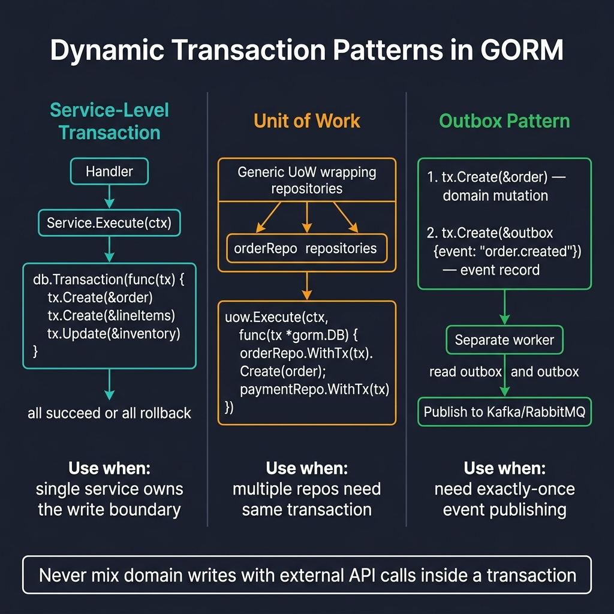

<!-- tags: golang -->
# 07 — Transaction Patterns

> **Advanced Integration**: Formulating strict transaction boundaries, implementing generic unit of work abstractions, isolating idempotent writes, and managing safe production service limits.

📅 Created: 2026-03-28 · 🔄 Updated: 2026-04-19 · ⏱️ 16 min read

---

## 1. DEFINE

Basic `db.Transaction()` works for simple cases. Production services demand more: idempotency keys to survive retries, transactional outbox to avoid dual-write problems, and unit-of-work wrappers to standardize logging and error handling across dozens of service methods.

> *Executing payment integrations directly inside database transactions guarantees connection exhaustion when the third-party gateway responds slowly.*

### Production Transaction Pattern Requirements

| Concern | Purpose |
| --- | --- |
| **Clear Boundary** | Define which code blocks require atomic execution. |
| **Idempotency** | Prevent duplicate writes when clients retry requests. |
| **Error Mapping** | Return precise errors that trigger correct rollback behavior. |
| **Side Effects** | Never publish events or call external APIs inside uncommitted transactions. |

### Failure Modes

| Failure | Root Cause | Fix |
| --- | --- | --- |
| **Duplicate processing** | Configuring retrying sequence requests lacking idempotency mapping logic. | Implement idempotency keys mapping natural unique target constraints natively. |
| **Transaction bloating** | Embedding external API routing logic evaluating inside uncommitted persistence blocks. | Restrict transaction operations executing rigid database mutations exclusively. |
| **Asymmetric side effects** | Bypassing commit gaps formatting asynchronous events directly. | Format transactional outbox logic defining deferred publish mappings safely. |

Reviewing standard failure modes predicts basic errors. A fatal operational trap exists: embedding external API HTTP calls inside active database bounds guarantees deadlock scaling limits immediately, and omitting idempotency logic processes duplicate business operations instantly.

## 2. VISUAL



*Figure: Three patterns — Service-Level (single service owns tx boundary), Unit of Work (multiple repos share tx via WithTx), Outbox (domain write + event record in same tx, worker publishes to Kafka). Never mix domain writes with external API calls in a tx.*

The correct flow separates domain mutation from side effects:

```text
Incoming request loop
   │
   ├── Validate domain command logic
   ├── Initialize transaction bounds
   ├── Mutate target schema rows
   ├── Write outbox constraints capturing target mappings
   └── Commit persistence limits
         │
         ▼
   Publish asynchronous side effect events
```

## 3. CODE

### Example 1: Basic — Establishing distinct service-level transaction boundaries

> **Goal**: Maintain related database mutation elements defining grouped atomic sequence operations safely.
> **Approach**: Configure explicit `db.Transaction(...)` evaluating debit limits mapping credit logic within grouped properties.
> **Complexity**: Basic

```go
// transaction_boundary.go — Keep related DB mutations inside one explicit service transaction
package ormadvanced

import (
    "context"
    "fmt"

    "gorm.io/gorm"
)

type Account struct {
    ID      uint
    Balance int64
}

func TransferBalance(ctx context.Context, db *gorm.DB, fromID, toID uint, amount int64) error {
    return db.WithContext(ctx).Transaction(func(tx *gorm.DB) error {
        
        // Execute debit subtraction locking target elements safely
        if err := tx.Model(&Account{}).
            Where("id = ?", fromID).
            Update("balance", gorm.Expr("balance - ?", amount)).Error; err != nil {
            return fmt.Errorf("debit source: %w", err) // ← Triggers full rollback
        }

        // Execute credit addition strictly resolving atomic pairs
        if err := tx.Model(&Account{}).
            Where("id = ?", toID).
            Update("balance", gorm.Expr("balance + ?", amount)).Error; err != nil {
            return fmt.Errorf("credit target: %w", err) // ← Triggers full rollback
        }

        return nil
    })
}
```

> **Why avoid embedding transactions within the Repository layer?** (Why)
> Repositories manage single aggregate entities. Transactions frequently span multiple aggregates (Accounts, Transactions, AuditLogs) requiring service-level coordination. Placing boundaries within repositories fragments atomic control guarantees completely.

### Example 2: Intermediate — Implementing idempotent transaction configuration models

> **Goal**: Block duplicate domain mutations capturing variable sequence parameters across retrying clients cleanly.
> **Approach**: Configure unique `idempotency_key` strings evaluating existing database target states masking creation properties.
> **Complexity**: Intermediate

```go
// idempotent_write.go — Prevent duplicate business writes across retries
package ormadvanced

import (
    "context"
    "errors"
    "fmt"

    "gorm.io/gorm"
)

type Payment struct {
    ID             uint
    IdempotencyKey string `gorm:"uniqueIndex"`
    Amount         int64
    Status         string
}

func CreatePayment(ctx context.Context, db *gorm.DB, key string, amount int64) error {
    return db.WithContext(ctx).Transaction(func(tx *gorm.DB) error {
        var existing Payment
        
        // Check exact mapped boundaries resolving idempotent keys safely
        if err := tx.Where("idempotency_key = ?", key).First(&existing).Error; err == nil {
            // ✅ Idempotency hit: Return nil bypassing duplicate creation silently.
            return nil
        } else if !errors.Is(err, gorm.ErrRecordNotFound) {
            return fmt.Errorf("lookup payment by key: %w", err)
        }

        payment := Payment{
            IdempotencyKey: key,
            Amount:         amount,
            Status:         "pending",
        }
        
        if err := tx.Create(&payment).Error; err != nil {
            return fmt.Errorf("create payment: %w", err)
        }
        return nil
    })
}
```

> **Why demand UNIQUE constraints after evaluating RecordNotFound?** (Why)
> Concurrent requests referencing identical idempotency keys easily bypass the read check simultaneously. Unique database constraints guarantee strict final consistency preventing duplicate creation physically.

### Example 3: Advanced — Formatting strict transaction outbox configuration variables

> **Goal**: Define domain condition mappings parsing integration target loops limiting lost data reliably.
> **Approach**: Structure target updates rendering database mutation states extracting outbox events atomically.
> **Complexity**: Advanced

```go
// outbox_transaction.go — Persist domain change and outbox event atomically
package ormadvanced

import (
    "context"
    "encoding/json"
    "fmt"

    "gorm.io/gorm"
)

type Order struct {
    ID     uint
    Status string
}

type OutboxEvent struct {
    ID          uint
    AggregateID uint
    Topic       string
    Payload     []byte
}

func MarkOrderPaid(ctx context.Context, db *gorm.DB, orderID uint) error {
    return db.WithContext(ctx).Transaction(func(tx *gorm.DB) error {
        
        // 1. Mutate application domain schema confidently
        if err := tx.Model(&Order{}).
            Where("id = ?", orderID).
            Update("status", "paid").Error; err != nil {
            return fmt.Errorf("update order: %w", err)
        }

        payload, err := json.Marshal(map[string]any{
            "order_id": orderID,
            "status":   "paid",
        })
        if err != nil {
            return fmt.Errorf("marshal outbox payload: %w", err)
        }

        // 2. Persist outbox event mapping identical transaction scopes directly
        event := OutboxEvent{
            AggregateID: orderID,
            Topic:       "order.paid",
            Payload:     payload,
        }
        
        if err := tx.Create(&event).Error; err != nil {
            return fmt.Errorf("insert outbox event: %w", err)
        }

        return nil
    })
}
```

> **Why avoid publishing RabbitMQ messages inside transactions?** (Why)
> Connecting external message brokers introduces asynchronous network latency deeply into database blocking structures. Pushing messages inside transactions severely limits concurrency throughput and guarantees rolling back database changes if RabbitMQ temporarily falters.

### Example 4: Expert — Unit-of-work abstractions defining business context

> **Goal**: Establish tracking element variables separating generic database connections standardizing lifecycle logging.
> **Approach**: Substitute mapping elements extracting paths wrapping execution functions returning generic boundaries efficiently.
> **Complexity**: Expert

```go
// tx_wrapper.go — Standardize transaction lifecycle and business-context logging
package ormadvanced

import (
    "context"
    "fmt"
    "log/slog"

    "gorm.io/gorm"
)

// WithTransaction wraps a database operation with structured logging and automatic rollback.
func WithTransaction(ctx context.Context, db *gorm.DB, operation string, fn func(*gorm.DB) error) error {
    return db.WithContext(ctx).Transaction(func(tx *gorm.DB) error {
        
        slog.Info("tx started", "operation", operation)
        
        if err := fn(tx); err != nil {
            slog.Error("tx failed", "operation", operation, "error", err)
            return fmt.Errorf("%s: %w", operation, err)
        }
        
        slog.Info("tx committed", "operation", operation)
        return nil
    })
}
```

> **Why construct explicit Wrapper patterns?** (Why)
> Manual transaction definitions fragment logging conventions uncontrollably across distinct service endpoints. Abstracting boundaries enforces unified context tracing evaluating telemetry structures perfectly.

## 4. PITFALLS

These patterns fail silently without proper safeguards.

| # | Severity | Defect | Fix |
|---|----------|--------|-----|
| 1 | 🔴 Fatal | HTTP/gRPC calls to external services inside a DB transaction | Move all external calls outside the transaction; use outbox pattern for event publishing |
| 2 | 🔴 Fatal | Missing idempotency key on retryable payment endpoints | Add `IdempotencyKey` with `uniqueIndex` — DB constraint is the final safety net |
| 3 | 🟡 Common | No context timeout on transaction closure | Use `db.WithContext(ctx).Transaction()` so cancellation propagates to the DB |

## 5. REF

| Resource | Link |
| --- | --- |
| GORM Transactions | https://gorm.io/docs/transactions.html |
| Transactional Outbox Pattern | https://microservices.io/patterns/data/transactional-outbox.html |

## 6. RECOMMEND

With transaction patterns established, scale into distributed coordination.

| Extension | When to proceed | Rationale |
| --- | --- | --- |
| **Outbox Worker** | When you need reliable event publishing after DB commits | Polls the outbox table and publishes to RabbitMQ/Kafka, solving dual-write |
| **Distributed Saga** | When a business operation spans multiple services | Orchestrates compensation logic across service boundaries without distributed locks |

---
