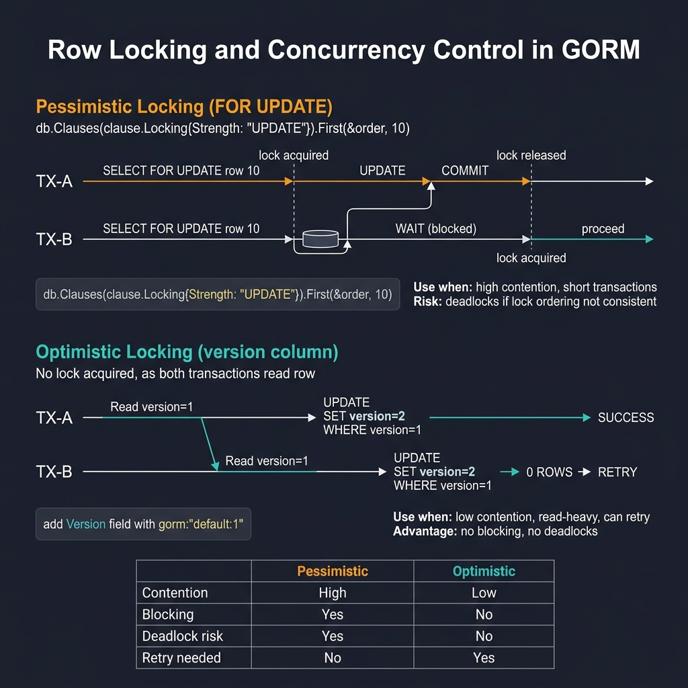

<!-- tags: golang -->
# 08 — Row Locking & Concurrency Control

> **Advanced Integration**: Resolving lost updates, executing double processing prevention models, mapping optimistic locking constraints, specifying production deadlock boundaries.

📅 Created: 2026-03-28 · 🔄 Updated: 2026-04-19 · ⏱️ 16 min read

---

## 1. DEFINE

A read-modify-write loop without locking silently loses updates under concurrency. This article covers pessimistic locking (`SELECT ... FOR UPDATE`), optimistic locking (version columns), worker job claiming with `SKIP LOCKED`, and deadlock prevention through consistent lock ordering.

> *Updating balances utilizing read-modify-write patterns natively guarantees silent data corruption under heavy concurrent loads.*

### Concurrency Control Usage Models

| Scenario                | Purpose                                                   |
| ----------------------- | --------------------------------------------------------- |
| **Inventory deduction** | Prevent oversold conditions mapping strict minimum bounds |
| **Balance transfers**   | Prevent missing update values tracking absolute integrity |
| **Queue processing**    | Prevent duplicate worker tasks executing identical records |

### Pessimistic vs Optimistic Logic

| Paradigm                        | Usage Condition                                                         |
| ------------------------------- | ----------------------------------------------------------------------- |
| **Pessimistic (`FOR UPDATE`)**  | Processing intense mapped contention limiting conflict tolerance        |
| **Optimistic (version fields)** | Processing marginal contention mapping elevated throughput requirements |

### Failure Modes

| Failure                     | Root Cause                                                                     | Fix                                                               |
| --------------------------- | ------------------------------------------------------------------------------ | ----------------------------------------------------------------- |
| **Deadlock generation**     | Routing mapped transaction locks analyzing staggered order constraints         | Configure consistent logic mapping lock sort ordering             |
| **Lost update operations**  | Processing read-modify-write loops lacking configuration validation structures | Implement `FOR UPDATE` properties tracking explicit version rules |
| **Duplicate worker limits** | Routing distinct select tracking condition updates                             | Execute database claim constraints mapping atomic statements      |

Reviewing standard failure models forecasts basic system properties. An implicit trap exists: evaluating read configurations processing subsequent updates triggers race conditions manifesting under elevated pressure loops, while extracting excessive row blocks forces unresolvable deadlock combinations safely.

## 2. VISUAL



*Figure: Pessimistic (FOR UPDATE) — TX-B blocks until TX-A commits, use for high contention. Optimistic (version column) — no blocking, TX-B retries on 0 rows affected, use for read-heavy. Comparison: contention, blocking, deadlock risk, retry needs.*

Evaluating **Row Locking** requires tracking timeline behaviors demonstrating sequence ordering boundaries predicting concurrent logic shifts.

```text
Sequence A execution                 Sequence B transaction
      │                                    │
      ├── lock target row 10 (FOR UPDATE)  ├── wait condition parsing row 10
      ├── update variable                  │
      └── commit mapping                   └── route continuous parameter processing immediately 
```

## 3. CODE

### Example 1: Basic — Structuring pessimistic target row locks

> **Goal**: Lock bound inventory definitions resolving decrement functions bypassing oversold race logic.
> **Approach**: Configure explicit `FOR UPDATE` targets applying `clause.Locking{Strength:"UPDATE"}` nested mapping transaction blocks.
> **Complexity**: Basic

```go
// for_update.go — Lock one row before applying a critical balance update
package ormadvanced

import (
    "context"
    "fmt"

    "gorm.io/gorm"
    "gorm.io/gorm/clause"
)

type InventoryItem struct {
    ID       uint
    Quantity int64
}

func ReserveStock(ctx context.Context, db *gorm.DB, itemID uint, amount int64) error {
    return db.WithContext(ctx).Transaction(func(tx *gorm.DB) error {
        var item InventoryItem
        
        // 1. Establish pessimistic lock preventing concurrent modification
        if err := tx.Clauses(clause.Locking{Strength: "UPDATE"}).
            First(&item, itemID).Error; err != nil {
            return fmt.Errorf("lock inventory row: %w", err)
        }

        // 2. Evaluate target constraints securely
        if item.Quantity < amount {
            return fmt.Errorf("insufficient stock")
        }

        // 3. Mutate specific value mapping isolated updates
        return tx.Model(&item).
            Update("quantity", item.Quantity-amount).Error
    })
}
```

> **Why demand Transactions defining FOR UPDATE logic?** (Why)
> Row locks persist strictly within active transaction lifecycles. Executing `FOR UPDATE` outside a transaction releases the lock instantly before subsequent updates occur, defeating the entire constraint logically.

### Example 2: Intermediate — Implementing mapping properties sorting optimistic conditions

> **Goal**: Reject conflicting mappings configuring version parameters bypassing extended target blocking.
> **Approach**: Structure conditional queries mapping `WHERE id=? AND version=?`; tracking `RowsAffected=0` identifies conflict modifications safely.
> **Complexity**: Intermediate

```go
// optimistic_lock.go — Reject conflicting updates when row version has changed
package ormadvanced

import (
    "context"
    "fmt"

    "gorm.io/gorm"
)

type Profile struct {
    ID      uint
    Name    string
    Version uint
}

func UpdateProfileName(ctx context.Context, db *gorm.DB, id uint, currentVersion uint, newName string) error {
    
    // Execute conditional update asserting exact mapped version limits natively
    result := db.WithContext(ctx).
        Model(&Profile{}).
        Where("id = ? AND version = ?", id, currentVersion).
        Updates(map[string]any{
            "name":    newName,
            "version": gorm.Expr("version + 1"), // ← Increment version securely
        })

    if result.Error != nil {
        return fmt.Errorf("update profile: %w", result.Error)
    }
    
    // Detect missing modifications exposing concurrent race resolutions accurately
    if result.RowsAffected == 0 {
        return fmt.Errorf("optimistic lock conflict: version modified currently")
    }
    
    return nil
}
```

> **Why does versioning outperform target updates for profiles?** (Why)
> Profile edits endure minimal collision probabilities compared to inventory decrements. Applying optimistic configuration models eliminates database locking overhead completely predicting maximum read throughput globally.

### Example 3: Advanced — Implementing specific worker job claims

> **Goal**: Assign single queue components distributing limits isolating concurrent worker selections exactly.
> **Approach**: Apply `clause.Locking{Strength: "UPDATE"}` selecting specific target arrays ordering items explicitly.
> **Complexity**: Advanced

```go
// job_claim.go — Claim one pending job without letting workers grab the same row
package ormadvanced

import (
    "context"
    "fmt"

    "gorm.io/gorm"
    "gorm.io/gorm/clause"
)

type Job struct {
    ID     uint
    Status string
}

func ClaimPendingJob(ctx context.Context, db *gorm.DB) (*Job, error) {
    var job Job

    err := db.WithContext(ctx).Transaction(func(tx *gorm.DB) error {
        
        // Execute explicit row reservations capturing unique queued models
        if err := tx.Clauses(clause.Locking{Strength: "UPDATE"}).
            Where("status = ?", "pending").
            Order("id ASC").
            First(&job).Error; err != nil {
            return err
        }

        // Mutate target state routing assignment tracking configurations correctly
        if err := tx.Model(&job).Update("status", "processing").Error; err != nil {
            return fmt.Errorf("mark job processing: %w", err)
        }

        return nil
    })
    
    if err != nil {
        return nil, err
    }
    return &job, nil
}
```

> **Why require explicit Order("id ASC") bounds?** (Why)
> Randomizing row locks generates catastrophic deadlock parameters routinely. Enforcing strict chronological identifier targets guarantees all concurrent transactions lock rows sequentially avoiding cyclic mapping deadlocks flawlessly.

### Example 4: Expert — Executing tracking skip locked queue paths

> **Goal**: Evaluate mapping attributes preventing multiple workers queuing behind identical locked properties endlessly.
> **Approach**: Map validation tracking integrating `FOR UPDATE SKIP LOCKED` navigating constraints bypassing locked targets.
> **Complexity**: Expert

```go
// skip_locked_claim.go — Let workers skip locked rows instead of waiting in line
package ormadvanced

import (
    "context"
    "fmt"

    "gorm.io/gorm"
    "gorm.io/gorm/clause"
)

type Job struct {
    ID     uint
    Status string
}

func ClaimPendingJobSkipLocked(ctx context.Context, db *gorm.DB) (*Job, error) {
    var job Job

    err := db.WithContext(ctx).Transaction(func(tx *gorm.DB) error {
        
        // Skip Locked bounds bypass active transactions scanning available items instantly
        if err := tx.Clauses(clause.Locking{
                Strength: "UPDATE", 
                Options: "SKIP LOCKED",
            }).
            Where("status = ?", "pending").
            Order("id ASC").
            First(&job).Error; err != nil {
            return err
        }

        if err := tx.Model(&job).Update("status", "processing").Error; err != nil {
            return fmt.Errorf("mark job processing: %w", err)
        }
        
        return nil
    })
    
    if err != nil {
        return nil, err
    }
    return &job, nil
}
```

> **Why does SKIP LOCKED represent the premier Queue pattern?** (Why)
> Standard `FOR UPDATE` blocking forces N workers evaluating sequentially reducing throughput parameters massively. `SKIP LOCKED` coordinates multiple queue pullers selecting independent targets simultaneously maximizing concurrent performance safely.

## 4. PITFALLS

These concurrency bugs only appear under production load.

| # | Severity | Defect | Fix |
|---|----------|--------|-----|
| 1 | 🔴 Fatal | Read-modify-write without row lock | Use `FOR UPDATE` inside a transaction to serialize access |
| 2 | 🔴 Fatal | Locking rows in random order across transactions | Always lock in consistent `ORDER BY id ASC` to prevent deadlocks |
| 3 | 🟡 Common | Using pessimistic locks for low-contention updates | Switch to optimistic locking (`WHERE version = ?`) for higher throughput |

## 5. REF

| Resource               | Link                                                          |
| ---------------------- | ------------------------------------------------------------- |
| GORM locking           | https://gorm.io/docs/advanced_query.html#Locking              |
| PostgreSQL row locking | https://www.postgresql.org/docs/current/explicit-locking.html |

## 6. RECOMMEND

With row-level concurrency control in place, scale into distributed patterns.

| Extension | When to proceed | Rationale |
| --- | --- | --- |
| **Redis Distributed Locks** | When locking spans multiple services or databases | `SKIP LOCKED` only works within a single PostgreSQL instance |
| **Message Queue Workers** | When job throughput exceeds DB-based queue capacity | Offload work claiming to RabbitMQ/Kafka for higher parallelism |

---
