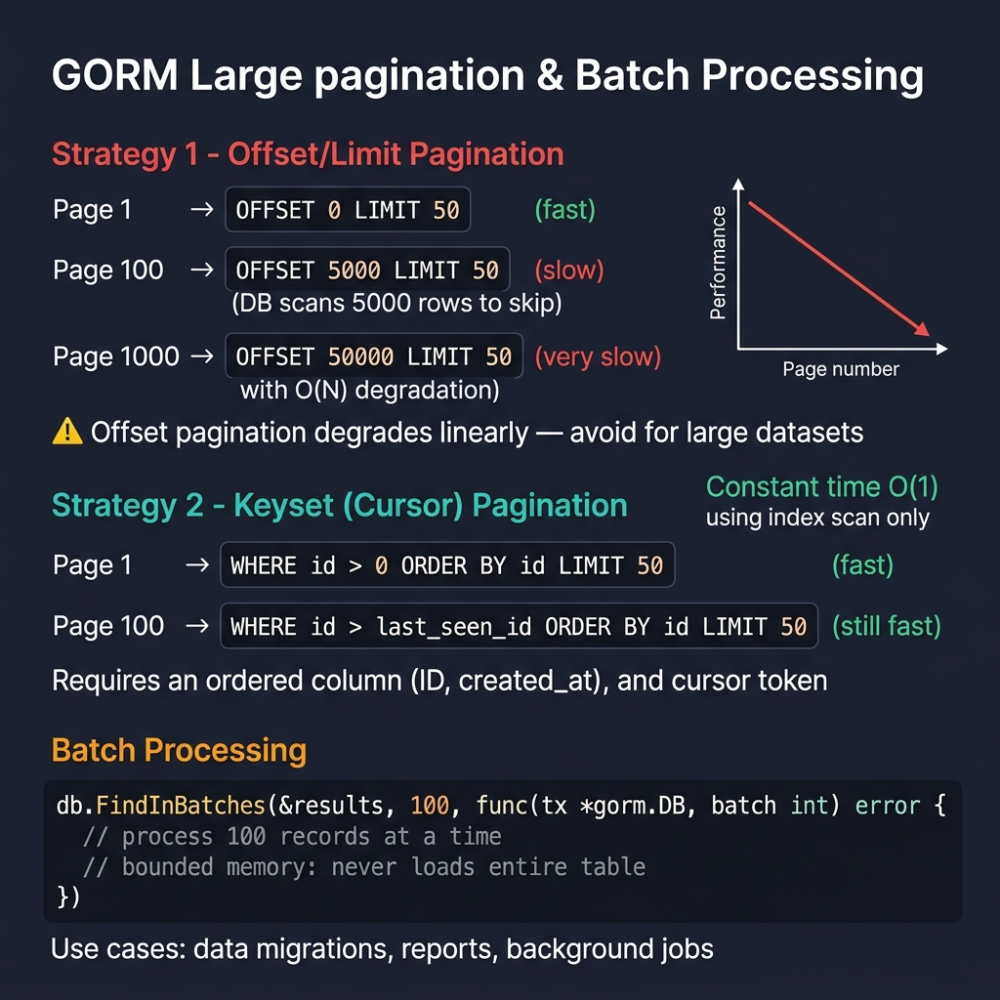

<!-- tags: golang -->
# 09 — Large Pagination & Batch Processing

> **Advanced Integration**: Parsing basic `OFFSET/LIMIT` bottlenecks matching dense data grids, structuring deterministic keyset pagination logic, implementing streaming batch iterations controlling bounded memory.

📅 Created: 2026-03-28 · 🔄 Updated: 2026-04-19 · ⏱️ 16 min read

---

## 1. DEFINE

`OFFSET 500000` forces PostgreSQL to scan and discard 500,000 rows before returning the 10 you actually want. This article covers three pagination strategies: basic offset (small tables only), keyset/cursor pagination (O(1) via index seek), and `FindInBatches` for memory-safe bulk processing of large exports.

> *Extracting 500,000 records utilizing basic OFFSET commands forces the database mapping sequential scans repeatedly, guaranteeing memory timeouts.*

### Pagination Abstraction Models

| Paradigm | Trade-Off Configuration |
| --- | --- |
| **Offset structures** | Simplifies queries matching minor limits tracking severe performance degradation across deep skips. |
| **Keyset cursors** | Stabilizes query times limiting arbitrary page navigation requirements scaling infinitely. |
| **Batch processing** | Optimizes export pipelines masking memory allocations preventing standard client pagination exhaustion. |

### Failure Modes

| Failure | Root Cause | Fix |
| --- | --- | --- |
| **Latency boundaries** | Parsing extreme offset conditions skipping unrendered results unnecessarily. | Execute keyset constraints bypassing offset loops completely. |
| **Asymmetric row logic** | Processing unstable record indexing causing pagination shifting arrays. | Implement unique ordering variables ensuring deterministic mapping bounds reliably. |
| **Memory extraction crashes** | Loading complete dataset tables within limited memory boundaries. | Configure targeted streaming extraction loops parsing batch boundaries safely. |

Reviewing standard failure modes predicts basic errors. A fatal operational trap exists: defining sorts omitting unique identification strings causes duplicate record shifting across page arrays, and injecting extreme offset parameters triggers unoptimized sequential map scans automatically.

## 2. VISUAL



*Figure: Offset/Limit degrades O(N) as page increases — avoid for large datasets. Keyset (cursor) pagination is O(1) using index scan. FindInBatches processes records in bounded chunks for migrations, reports, background jobs.*

Evaluating **Large Pagination & Batch Processing** demands tracking functional logic modeling distinct parameter sequences capturing specific variable conditions natively.

```text
Offset limit loops (O(N) degradation)
   page 1 -> skip 0     -> read 50 rows (fast)
   page 2 -> skip 50    -> read 50 rows (fast)
   page N -> skip 500k  -> sequentially scan 500k rows, render 50 rows (timeout)

Deterministic keyset loops (O(1) stability)
   last_seen_id = 120
           │
           ▼
   WHERE id > 120 ORDER BY id ASC LIMIT 50 (index scan executes instantly)
```

## 3. CODE

### Example 1: Basic — Structuring basic offset extraction logic

> **Goal**: Evaluate straightforward parameter loops defining compact target tables masking optimization complexities matching structural constraints securely.
> **Approach**: Configure structural bounds evaluating deterministic ordering mappings limiting simple offsets.
> **Complexity**: Basic

```go
// offset_pagination.go — Simple pagination suitable only for small or low-depth result sets
package ormadvanced

import "gorm.io/gorm"

type Customer struct {
    ID    uint
    Email string
}

func ListCustomersOffset(db *gorm.DB, page int, size int) ([]Customer, error) {
    var customers []Customer
    
    // Execute standard offset extraction sorting deterministic identifiers natively
    err := db.Order("id ASC").
        Offset((page - 1) * size).
        Limit(size).
        Find(&customers).Error
        
    return customers, err
}
```

> **Why demand Order("id ASC") alongside Offset formats?** (Why)
> Relational databases never guarantee default row ordering dynamically. Omitting explicit sorting causes records shifting unpredictably across pages during concurrent database insertions.

### Example 2: Intermediate — Structuring keyset variables controlling bounded limit loops

> **Goal**: Extract deep target sequences evaluating deterministic boundaries checking massive target formats smoothly.
> **Approach**: Configure structured rules bounding `WHERE id > ?` conditions tracking execution index pointers precisely.
> **Complexity**: Intermediate

```go
// keyset_pagination.go — Page by last seen ID for better performance on large tables
package ormadvanced

import "gorm.io/gorm"

type Customer struct {
    ID    uint
    Email string
}

func ListCustomersAfterID(db *gorm.DB, lastSeenID uint, size int) ([]Customer, error) {
    var customers []Customer
    
    query := db.Order("id ASC").Limit(size)
    
    // Configure keyset boundaries restricting target scans matching index definitions exactly
    if lastSeenID > 0 {
        query = query.Where("id > ?", lastSeenID)
    }

    err := query.Find(&customers).Error
    return customers, err
}
```

> **Why does Keyset pagination outperform Offset scaling massive arrays?** (Why)
> Standard `OFFSET 500000` instructs the database engine extracting and discarding 500,000 rows sequentially before returning the target 10 rows. `WHERE id > 500000` navigates the B-Tree index structure identifying the exact starting node instantly.

### Example 3: Advanced — Implementing streaming array properties substituting batch definitions

> **Goal**: Generate array validations extracting constraints processing massive background exports safely.
> **Approach**: Execute sequence mapping limit targets applying `FindInBatches` separating evaluation chunk sizes perfectly.
> **Complexity**: Advanced

```go
// batch_reader.go — Iterate large datasets in chunks without loading all rows at once
package ormadvanced

import (
    "context"
    "fmt"
    "log"

    "gorm.io/gorm"
)

type Customer struct {
    ID    uint
    Email string
}

func ProcessCustomersInBatches(ctx context.Context, db *gorm.DB, batchSize int, fn func([]Customer) error) error {
    
    // Utilize FindInBatches loading defined chunks preventing massive RAM allocation native crashes
    return db.WithContext(ctx).Order("id ASC").
        FindInBatches(&[]Customer{}, batchSize, func(tx *gorm.DB, batch int) error {
            
            // Extract batch elements securely mapping function closure logics
            customers := *tx.Statement.Dest.(*[]Customer)
            
            if err := fn(customers); err != nil {
                log.Printf("Batch %d extraction failed completely", batch)
                return fmt.Errorf("process batch %d: %w", batch, err)
            }
            
            return nil
        }).Error
}
```

> **Why avoid manual iterations implementing custom Offset formats?** (Why)
> Crafting custom loops introduces off-by-one boundary bugs routinely. GORM's native `FindInBatches` configures the primary key targeting iteration internally guaranteeing perfect keyset cursor performance automatically.

### Example 4: Expert — Encoding keyset cursor tokens hiding internal formats

> **Goal**: Extract mapping arrays defining API token formats masking underlying primary keys safely.
> **Approach**: Substitute mapping bounds defining base64 structure encoding `Cursor{LastID}` parameters cleanly.
> **Complexity**: Expert

```go
// cursor_token.go — Encode a simple keyset cursor for API consumers
package ormadvanced

import (
    "encoding/base64"
    "encoding/json"
)

type Cursor struct {
    LastID uint `json:"last_id"`
}

// EncodeCursor generates opaque API tokens hiding internal sorting logic sequences cleanly.
func EncodeCursor(lastID uint) (string, error) {
    payload, err := json.Marshal(Cursor{LastID: lastID})
    if err != nil {
        return "", err
    }
    
    // Apply RawURLEncoding producing web-safe token properties instantly
    return base64.RawURLEncoding.EncodeToString(payload), nil
}

// DecodeCursor validates opaque tokens recovering actual mapping query configurations properly.
func DecodeCursor(token string) (Cursor, error) {
    raw, err := base64.RawURLEncoding.DecodeString(token)
    if err != nil {
        return Cursor{}, err
    }
    
    var cursor Cursor
    if err := json.Unmarshal(raw, &cursor); err != nil {
        return Cursor{}, err
    }
    return cursor, nil
}
```

> **Why should APIs encode Cursors executing Base64 loops?** (Why)
> Exposing raw `last_id=150` tightly couples API clients predicting internal database schemas rigidly. An opaque token `eyJsYXN0X2lkIjoxNTB9` enables backend logic switching complex multi-column sorting parameters natively without breaking existing frontend implementation mappings.

## 4. PITFALLS

These patterns fail silently in development and explode at scale.

| # | Severity | Defect | Fix |
|---|----------|--------|-----|
| 1 | 🔴 Fatal | Loading entire tables with `Find()` for background exports | Use `FindInBatches()` to process in chunks and cap RAM usage |
| 2 | 🔴 Fatal | Using OFFSET for deep pagination (page 10,000+) | Switch to keyset pagination: `WHERE id > last_seen_id` |
| 3 | 🟡 Common | Sorting by non-unique column in cursor pagination | Add a unique tiebreaker: `ORDER BY created_at DESC, id DESC` |

## 5. REF

| Resource | Link |
| --- | --- |
| GORM Batch Query | https://gorm.io/docs/advanced_query.html#FindInBatches |
| Keyset Pagination | https://use-the-index-luke.com/no-offset |

## 6. RECOMMEND

With pagination patterns established, extend into API design and search.

| Extension | When to proceed | Rationale |
| --- | --- | --- |
| **Cursor-Based API Endpoints** | When building mobile infinite-scroll UIs | Opaque cursor tokens hide internal sort logic and survive concurrent inserts |
| **Elasticsearch Integration** | When relational LIKE/fulltext search becomes a bottleneck | Offload complex search to a dedicated indexing engine |

---
