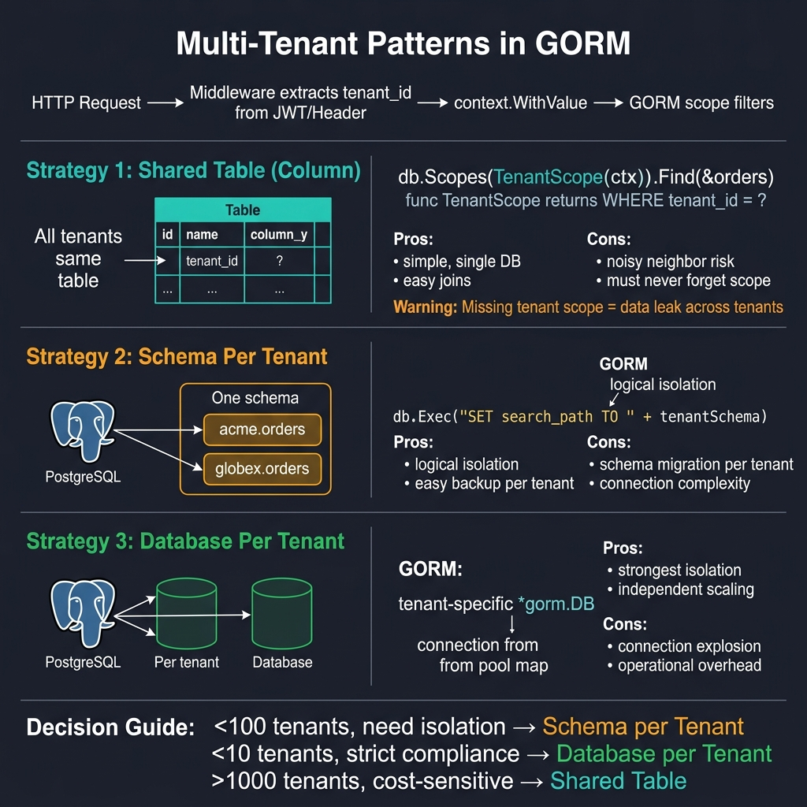

<!-- tags: golang -->
# 10 — Multi-tenant Patterns

> **Advanced Integration**: Scoping tenant parameters targeting shared-table architectures protecting data logic from cross-tenant information leaks safely.

📅 Created: 2026-03-28 · 🔄 Updated: 2026-04-19 · ⏱️ 16 min read

---

## 1. DEFINE

A missing `WHERE tenant_id = ?` clause serves one customer’s confidential data to a competing organization. This article covers the shared-table pattern with GORM Scopes, mandatory tenant-scoped repositories, composite unique constraints, and carrying tenant identity through async job payloads.

> *Executing queries omitting explicit tenant filters guarantees catastrophic data breaches serving one client's secure records directly to competing organizations.*

### Multi-tenant Architectural Models

| Architecture | Use Case |
| --- | --- |
| **Shared tables with `tenant_id`** | Maps standard integrations maintaining optimal cost configurations matching standard scalability natively. |
| **Schema per tenant** | Defines robust isolation limits introducing elevated operational complexity managing continuous database migrations. |
| **Database per tenant** | Configures absolute isolation mapping extreme infrastructure costs explicitly demanded by enterprise compliance securely. |

### Architecture Invariants

| Rule | Impact |
| --- | --- |
| **Bind query loops executing `tenant_id`** | Restricts information mapping generating cross-tenant data leaks completely. |
| **Target tenant scopes defining repository elements** | Resolves unmapped filters bypassing handler configurations safely. |
| **Isolate distinct admin query properties** | Prevents structural scope bypass errors executing global aggregations strictly. |

### Failure Modes

| Failure | Root Cause | Fix |
| --- | --- | --- |
| **Data leakage loops** | Omitting `WHERE tenant_id = ?` filter components evaluating specific domain targets. | Format bound repository guard mapping explicit schema logic natively. |
| **Performance index failures** | Missing mapped composite index properties checking tenant bounds sequentially. | Configure index constraints predicting `(tenant_id, business_key)` parameters correctly. |
| **Unmapped background workers** | Formatting execution contexts lacking distinct tenant properties completely. | Extract explicit tenant parameter values evaluating inbound execution payloads. |

Reviewing standard failure models forecasts basic system properties. An implicit trap exists: determining handler mappings omitting tenant filters causes cross-tenant configuration leaks instantly, and deploying schemas lacking composite indexes collapses query performance scaling massive arrays.

## 2. VISUAL



*Figure: Three isolation strategies — Shared Table (tenant_id column, simple, data leak risk), Schema Per Tenant (logical isolation, migration per tenant), Database Per Tenant (strongest isolation, connection explosion). Decision: >1000 tenants → shared, <100 → schema, <10 strict → database.*

Evaluating **Multi-tenant Patterns** demands tracking functional logic modeling distinct parameter sequences capturing specific variable conditions resolving mapping scopes reliably.

```text
Incoming Request Loop (API Layer)
   │ 1. HTTP Middleware extracts tenant_id from JWT/Header
   │ 2. Middleware injects context.WithValue(ctx, "tenant", "acme")
   ▼
Service Logic Boundary
   │ 3. Service extracts tenant mapping constraints explicitly
   ▼
Repository Filter Scopes (Database Layer)
   │ 4. Applies mandatory WHERE tenant_id = ? condition properties
   ▼
Tenant-Safe Persistence Queries executing isolated arrays safely.
```

## 3. CODE

### Example 1: Basic — Structuring scoped tenant properties mapping database models

> **Goal**: Map structured tenant filter parameter loops evaluating reusable boundaries parsing mapping arrays matching query configurations.
> **Approach**: Configure structured limit `Scopes(ScopeTenant(...))` constraints replacing hardcoded `tenant_id = ?` query fragments distributed completely across codebase components.
> **Complexity**: Basic

```go
// tenant_scope.go — Apply tenant filter centrally instead of repeating it by hand
package ormadvanced

import "gorm.io/gorm"

type Invoice struct {
    ID       uint
    TenantID string `gorm:"index"`
    Amount   int64
}

// ScopeTenant defines reusable boundaries capturing exact logic parameters securely.
func ScopeTenant(tenantID string) func(*gorm.DB) *gorm.DB {
    return func(db *gorm.DB) *gorm.DB {
        return db.Where("tenant_id = ?", tenantID)
    }
}
```

> **Why utilize Scopes instead of manual Where clauses?** (Why)
> Hardcoding `.Where("tenant_id = ?", id)` repeatedly guarantees human error omissions causing data leaks eventually. Scopes enforce central logic configurations parsing updates reliably across completely unified constraints.

### Example 2: Intermediate — Implementing mandatory repository sequence scopes

> **Goal**: Extract specific tenant variables bounding data queries encapsulating logic isolating handler components safely.
> **Approach**: Configure explicit `tenantID string` struct parameters bounding repository methods executing `Scopes` natively.
> **Complexity**: Intermediate

```go
// tenant_repository.go — Force tenant scoping inside repository methods
package ormadvanced

import (
    "context"

    "gorm.io/gorm"
)

type Invoice struct {
    ID       uint
    TenantID string
    Amount   int64
}

func ScopeTenant(tenantID string) func(*gorm.DB) *gorm.DB {
    return func(db *gorm.DB) *gorm.DB {
        return db.Where("tenant_id = ?", tenantID)
    }
}

type InvoiceRepository struct {
    db *gorm.DB
}

// ListByTenant executes parameter mappings requiring tenant scopes explicitly.
func (r *InvoiceRepository) ListByTenant(ctx context.Context, tenantID string) ([]Invoice, error) {
    var invoices []Invoice
    
    // Execute boundary limits injecting standard scopes confidently
    err := r.db.WithContext(ctx).
        Scopes(ScopeTenant(tenantID)).
        Order("id DESC").
        Find(&invoices).Error
        
    return invoices, err
}
```

> **Why mandate passing tenantID into repository definitions?** (Why)
> Optional parameters invite leakage completely. Forcing controllers supplying tenant identifiers physically guarantees developers cannot query database resources skipping isolation constraints accidentally.

### Example 3: Advanced — Combining tenant logic resolving lookup validation bounds

> **Goal**: Identify array validation constraints evaluating components matching specific domain models identifying secure database entries uniquely.
> **Approach**: Execute strict queries composing `Scopes` encapsulating natural external keys safely.
> **Complexity**: Advanced

```go
// tenant_lookup.go — Combine tenant scope with business lookup keys safely
package ormadvanced

import (
    "context"
    "fmt"

    "gorm.io/gorm"
)

type Invoice struct {
    ID         uint
    TenantID   string
    ExternalID string
    Amount     int64
}

func ScopeTenant(tenantID string) func(*gorm.DB) *gorm.DB {
    return func(db *gorm.DB) *gorm.DB {
        return db.Where("tenant_id = ?", tenantID)
    }
}

func FindInvoiceByExternalID(ctx context.Context, db *gorm.DB, tenantID string, externalID string) (*Invoice, error) {
    var invoice Invoice
    
    // Combine parameters evaluating specific properties isolating identical ExternalIDs securely
    if err := db.WithContext(ctx).
        Scopes(ScopeTenant(tenantID)).
        Where("external_id = ?", externalID).
        First(&invoice).Error; err != nil {
        return nil, fmt.Errorf("find invoice: %w", err)
    }
    
    return &invoice, nil
}
```

> **Why require Tenant scopes alongside external_id properties?** (Why)
> External identifiers generated outside the database frequently lack global uniqueness tracking mappings. Multiple tenants easily generate identical `external_id` (e.g., "INV-001"); omitting tenant boundaries returns incorrect corporate data violently.

### Example 4: Expert — Executing tenant configurations tracking async job boundaries

> **Goal**: Format specific domain loops replacing logic identifying tenant identities correctly inside background processors.
> **Approach**: Extract `TenantID` payloads matching external background task configurations executing distinct contextual lookups cleanly.
> **Complexity**: Expert

```go
// tenant_job.go — Carry tenant identity explicitly in async job payloads
package ormadvanced

import "context"

type Invoice struct {
    ID         uint
    TenantID   string
    ExternalID string
}

// TenantJobPayload defines serialized configuration structures storing tenant limits explicitly.
type TenantJobPayload struct {
    TenantID   string
    ExternalID string
}

type TenantAwareInvoiceRepository interface {
    FindInvoiceByExternalID(ctx context.Context, tenantID string, externalID string) (*Invoice, error)
}

func HandleTenantInvoiceSync(
    ctx context.Context,
    repo TenantAwareInvoiceRepository,
    payload TenantJobPayload,
) (*Invoice, error) {
    
    // Extract background context tracking limits configuring exact domain mappings
    return repo.FindInvoiceByExternalID(ctx, payload.TenantID, payload.ExternalID)
}
```

> **Why must Job Payloads embed TenantID explicitly?** (Why)
> HTTP middlewares typically inject tenant contexts correctly tracking synchronous routing definitions natively. Asynchronous Kafka workers bypass HTTP limits entirely; payloads omitting explicit tenant IDs cannot determine configuration limits accurately.

## 4. PITFALLS

Tenant leaks are silent, catastrophic, and legally actionable.

| # | Severity | Defect | Fix |
|---|----------|--------|-----|
| 1 | 🔴 Fatal | Queries missing tenant filter | Use `Scopes(ScopeTenant(id))` on every repository method |
| 2 | 🔴 Fatal | Unique constraints without tenant column | Use composite: `UNIQUE(tenant_id, business_key)` |
| 3 | 🟡 Common | Cache keys without tenant prefix | Prefix all cache keys: `{tenant}:{entity}:{id}` |

## 5. REF

| Resource | Link |
| --- | --- |
| GORM scopes | https://gorm.io/docs/scopes.html |
| Multi-tenant data isolation patterns | https://learn.microsoft.com/en-us/azure/architecture/guide/multitenant/considerations/data-isolation |

## 6. RECOMMEND

With application-level tenant isolation in place, evaluate database-level options.

| Extension | When to proceed | Rationale |
| --- | --- | --- |
| **Schema-per-Tenant** | When enterprise compliance demands physical isolation | Separate PostgreSQL schemas per tenant with dynamic `search_path` |
| **Row-Level Security (RLS)** | When you want DB-enforced isolation as a safety net | PostgreSQL RLS policies block cross-tenant queries even if app code forgets the filter |

---
