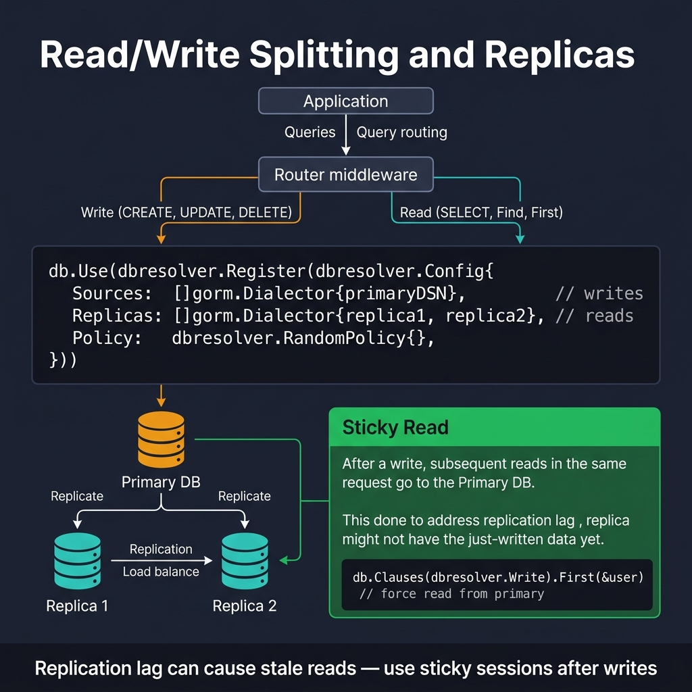

<!-- tags: golang -->
# 11 — Read/Write Splitting & Replicas

> **Advanced Integration**: Isolating read boundaries routing replica endpoints resolving primary database limits structuring sticky read semantics identifying connection pool allocations perfectly.

📅 Created: 2026-03-28 · 🔄 Updated: 2026-04-19 · ⏱️ 16 min read

---

## 1. DEFINE

Running analytics queries on the primary database blocks payment mutations waiting behind the same connection pool. This article covers explicit read/write connection splitting, sticky-read semantics to handle replication lag, and `ReadConsistency` enums that force callers to declare their freshness requirements.

> *Executing massive aggregation limits against primary nodes halts operational payment mutations waiting behind shared connection pools endlessly.*

### Connection Splitting Scenarios

| Concern | Purpose |
| --- | --- |
| **Primary limits** | Offloads analytic query loads shielding operational mutation paths completely. |
| **Read scaling** | Extends capacity routing unbounded replica clusters handling traffic securely. |
| **Workload isolation** | Dedicates background processing limits extracting massive domain exports natively. |

### Failure Modes

| Failure | Root Cause | Fix |
| --- | --- | --- |
| **Stale validation** | Reading replica logic resolving trailing replication windows immediately after writes. | Configure sticky session structures targeting primary connections matching trailing windows exactly. |
| **Silent drift** | Masking lag metrics bypassing operational alert bounds entirely. | Structure observability metrics tracking sync delay parameters executing automated alerts continuously. |
| **Routing faults** | Emitting write logic targeting replica databases accidentally. | Enforce connection routing boundaries mapping strict interface variables segregating endpoints. |

Reviewing standard failure modes forecasts basic errors. A fatal operational trap exists: combining connection parameters forces implicit routing resolving read-your-own-write anomalies incorrectly, and executing complex queries against primary nodes consumes locking capabilities terminating transaction availability.

## 2. VISUAL



*Figure: DBResolver routes writes to Primary, reads to Replicas (load balanced). Sticky Read pattern forces post-write reads to Primary to avoid stale data from replication lag. db.Clauses(dbresolver.Write) forces Primary.*

Evaluating **Read/Write Splitting** demands tracking functional routing configurations distributing workload parameters optimizing performance capacities natively.

```text
Database Connection Manager
       │
       ├── Writer Target (Primary)
       │       └── Serves strict domain mutations reliably.
       │       └── Evaluates critical sticky read conditions perfectly.
       │
       └── Reader Target (Replica Array)
               └── Serves distributed analytic query loads extensively.
               └── Accepts delayed consistency structures natively.
```

## 3. CODE

### Example 1: Basic — Isolating structural variables mapping read/write connections

> **Goal**: Evaluate mapping endpoints separating explicit connection parameters preventing accidental reads routing against write databases.
> **Approach**: Configure strict `Store{Writer, Reader}` structs encapsulating specific `*gorm.DB` parameters formatting explicit capabilities.
> **Complexity**: Basic

```go
// split_handles.go — Keep separate GORM handles for write-primary and read-replica traffic
package ormadvanced

import "gorm.io/gorm"

// Store separates primary limits configuring replica boundaries explicitly.
type Store struct {
    Writer *gorm.DB
    Reader *gorm.DB
}
```

> **Why avoid configuring automated gorm-dbresolver logic?** (Why)
> Automated resolver plugins obscure query paths rendering debugging difficult. Explicit struct boundaries force developers declaring their read/write intentions structurally during repository method definitions ensuring absolute clarity natively.

### Example 2: Intermediate — Implementing boundary tracking validating read/write distributions

> **Goal**: Extract distinct query operations matching primary database mutations separating high-volume reads explicitly.
> **Approach**: Execute explicit interface routing passing `r.store.Writer` evaluating creates matching `r.store.Reader` processing standard searches cleanly.
> **Complexity**: Intermediate

```go
// repository_split.go — Route writes to primary and non-critical reads to replica
package ormadvanced

import (
    "context"
    "fmt"

    "gorm.io/gorm"
)

type User struct {
    ID    uint
    Email string
}

type Store struct {
    Writer *gorm.DB
    Reader *gorm.DB
}

type UserRepository struct {
    store Store
}

// Create routes domain mutations targeting primary connection boundaries strictly.
func (r *UserRepository) Create(ctx context.Context, user *User) error {
    return r.store.Writer.WithContext(ctx).Create(user).Error
}

// FindByIDReplica distributes read traffic querying replica parameters natively.
func (r *UserRepository) FindByIDReplica(ctx context.Context, id uint) (*User, error) {
    var user User
    if err := r.store.Reader.WithContext(ctx).First(&user, id).Error; err != nil {
        return nil, fmt.Errorf("find user replica: %w", err)
    }
    return &user, nil
}

// FindByIDPrimary resolves critical read definitions extracting fresh limits reliably.
func (r *UserRepository) FindByIDPrimary(ctx context.Context, id uint) (*User, error) {
    var user User
    if err := r.store.Writer.WithContext(ctx).First(&user, id).Error; err != nil {
        return nil, fmt.Errorf("find user primary: %w", err)
    }
    return &user, nil
}
```

> **Why retain explicit FindByIDPrimary query endpoints?** (Why)
> Critical business logic defining password resets evaluates absolute strict consistency. Querying replicas risks reading stale definitions failing boundary constraint tracking completely.

### Example 3: Advanced — Implementing read-consistency enum evaluations routing parameters

> **Goal**: Generate strict interface signatures demanding callers predicting exact consistency boundaries processing queries accurately.
> **Approach**: Define explicit `ReadConsistency` enum values executing dynamic connection parameters enforcing boundaries flawlessly.
> **Complexity**: Advanced

```go
// read_your_write.go — Force a primary read when the caller requires freshest state
package ormadvanced

import "context"

type ReadConsistency string

const (
    ReadFromReplica ReadConsistency = "replica"
    ReadFromPrimary ReadConsistency = "primary"
)

// FindByID executes configured enum limits demanding connection awareness natively.
func (r *UserRepository) FindByID(ctx context.Context, id uint, consistency ReadConsistency) (*User, error) {
    
    // Evaluate explicit consistency enumerations resolving primary boundaries reliably.
    if consistency == ReadFromPrimary {
        return r.FindByIDPrimary(ctx, id)
    }
    
    // Default queries offload traffic evaluating identical replica properties strictly.
    return r.FindByIDReplica(ctx, id)
}
```

> **Why avoid simple usePrimary boolean flags?** (Why)
> Boolean arguments (`true`/`false`) lack context obscuring semantic intentions permanently. Explicit `ReadFromReplica` enumerations guarantee codebase readability preventing mistaken parameter placements reliably.

### Example 4: Expert — Structuring sticky read semantics bounding replication lags

> **Goal**: Extract deterministic rules mapping short time windows forcing primary reads immediately after user mutations preventing stale UX artifacts securely.
> **Approach**: Evaluate write timelines comparing current execution paths executing configuration routing `WithinWindow` parameters precisely.
> **Complexity**: Expert

```go
// stickiness_window.go — Keep critical reads on primary for a short time after a write
package ormadvanced

import "time"

// ReadPolicy defines tracking boundaries identifying recent state mutations accurately.
type ReadPolicy struct {
    LastWriteAt time.Time
    Window      time.Duration
}

// Consistency evaluates current time variables mapping strict parameter windows reliably.
func (p ReadPolicy) Consistency(now time.Time) ReadConsistency {
    
    // Fall back mapping primary components whenever tracking boundaries hit trailing lag limits.
    if !p.LastWriteAt.IsZero() && now.Sub(p.LastWriteAt) <= p.Window {
        return ReadFromPrimary
    }
    
    return ReadFromReplica
}
```

> **Why implement Windows addressing milli-second Data Replication?** (Why)
> Network perturbations frequently delay replication sequences causing intermittent 2-second lags randomly. A user editing their profile immediately tracking replica reads identifies unedited artifacts thinking their update failed mysteriously.

## 4. PITFALLS

Replica routing errors are invisible until a user reports stale data.

| # | Severity | Defect | Fix |
|---|----------|--------|-----|
| 1 | 🔴 Fatal | Reading from replica immediately after a write (stale data shown to user) | Implement `ReadPolicy` with a 5-second sticky window to primary |
| 2 | 🔴 Fatal | Running heavy `GROUP BY` analytics on the primary database | Route analytics to read replicas to protect write throughput |
| 3 | 🟡 Common | No alerting on replication lag | Set CloudWatch/Prometheus alerts when replica lag exceeds threshold |

## 5. REF

| Resource | Link |
| --- | --- |
| GORM DB Resolver | https://gorm.io/docs/dbresolver.html |
| Read replica consistency patterns | https://www.cockroachlabs.com/blog/follower-reads-stale-data/ |

## 6. RECOMMEND

With split connections established, add caching and automation.

| Extension | When to proceed | Rationale |
| --- | --- | --- |
| **GORM DBResolver Plugin** | When managing dozens of replica connections manually becomes unwieldy | Automates read/write routing based on query type |
| **Redis Cache-Aside** | When hot-path reads hammer replicas despite splitting | Serve scalar lookups from Redis, dropping DB reads entirely |

---
