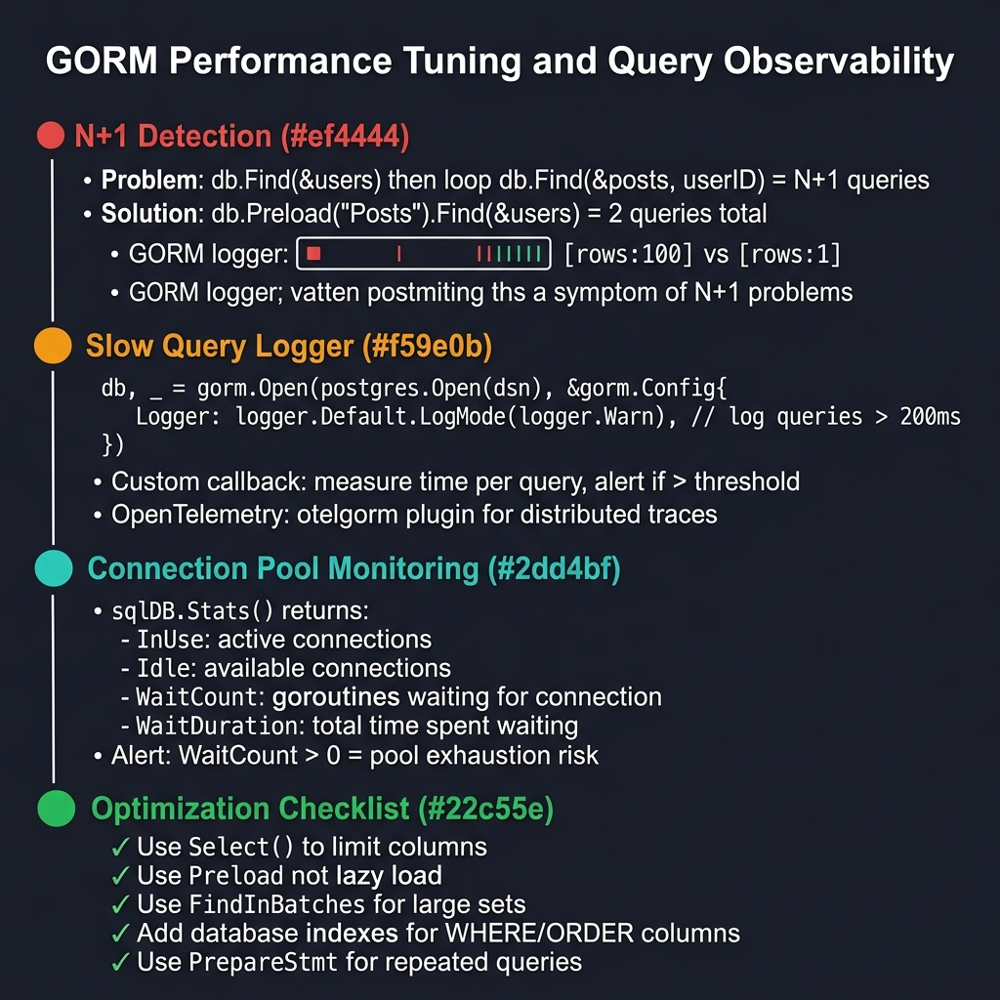

<!-- tags: golang -->
# 12 — Performance Tuning & Query Observability

> **Advanced Integration**: Isolating bottleneck metrics resolving slow execution traces, limiting excessive connection pools, predicting catastrophic N+1 query structures correctly.

📅 Created: 2026-03-28 · 🔄 Updated: 2026-04-19 · ⏱️ 17 min read

---

## 1. DEFINE

GORM hides the SQL it generates. Without explicit logging, slow-query tracing, and connection pool metrics, N+1 loops and unbounded connections silently degrade until the database crashes. This article covers GORM logger configuration, selective column loading, connection pool tuning, and Prometheus histogram instrumentation.

> *Configuring ORMs without explicit query profiling guarantees silent N+1 loops multiplying single API calls into hundreds of database hits automatically.*

### Orchestrating Tuning Targets

| Target Metric | Observability Goal |
| --- | --- |
| **Generated query shapes** | Exposes raw string executions decoupling hidden ORM mapping abstractions exactly. |
| **Query multiplicity logic** | Detects nested iterations triggering silent N+1 load cascading conditions. |
| **Connection configurations** | Identifies strict exhaustion parameters limiting connection scaling capabilities cleanly. |
| **Index hit validations** | Evaluates scan bounds checking sequential table iterations using EXPLAIN plans natively. |

### Failure Modes

| Failure | Root Cause | Fix |
| --- | --- | --- |
| **Invisible load saturation** | Masking execution times bypassing logging configurations completely. | Construct slow query trace metrics targeting static threshold boundaries aggressively. |
| **Cascading N+1 iterations** | Omitting explicit `Preload` configurations rendering associated child elements sequentially. | Emplace strict graph components defining isolated array preload limits preemptively. |
| **Connection exhaustion** | Omitting explicit `SetMaxOpenConns` constraints opening infinite database tracking sockets. | Configure bounded connection parameters mapping exact concurrent CPU scaling architectures. |

Reviewing standard failure models forecasts basic system properties. An implicit trap exists: evaluating graph components loading complete association boundaries (`Select *`) consumes extreme memory capacities, and leaving connection pools unbounded triggers memory exhaustion collapsing database nodes abruptly.

## 2. VISUAL



*Figure: Diagnostic pipeline — N+1 detection (Preload fixes), slow query logging (logger.Warn threshold), connection pool monitoring (sqlDB.Stats WaitCount), optimization checklist (Select, Preload, FindInBatches, indexes, PrepareStmt).*

Evaluating **Query Observability** demands extracting hidden ORM processes mapping string generation paths confirming exact sequential behaviors securely.

```text
Domain Logic Triggers
         │
         ▼
ORM Execution Generation
         │
         ├── Diagnostic Logging Interception (Slow logs > 200ms)
         ├── Query Shape Optimization (Preloads & Selects)
         └── Connection Bounds Validation (MaxOpen = 50)
               │
               ▼
Optimized Output generating predictable load profiles natively.
```

## 3. CODE

### Example 1: Basic — Structuring isolated execution traces parsing slow queries

> **Goal**: Evaluate query bounds tracking explicit time values filtering nominal logic reducing production log noises securely.
> **Approach**: Configure strict `logger.Config` parameters assigning specific `SlowThreshold` tracking rules evaluating strings cleanly.
> **Complexity**: Basic

```go
// gorm_logger.go — Surface slow queries without drowning production logs
package ormadvanced

import (
    "log"
    "os"
    "time"

    "gorm.io/gorm/logger"
)

// NewGORMLogger determines operational thresholds tracking slow components gracefully.
func NewGORMLogger() logger.Interface {
    return logger.New(
        log.New(os.Stdout, "\r\n", log.LstdFlags),
        logger.Config{
            SlowThreshold:             200 * time.Millisecond,
            LogLevel:                  logger.Warn,
            IgnoreRecordNotFoundError: true,
            Colorful:                  false,
        },
    )
}
```

> **Why hide RecordNotFoundError logs systematically?** (Why)
> Missing records evaluating `First()` execute naturally during validation handling limits routinely. Logging 404 queries as database errors generates massive false-positive alerts masking actual performance degradation problems completely.

### Example 2: Intermediate — Implementing boundary structures stripping excess network payloads

> **Goal**: Extract distinct query formats identifying specific target columns preventing massive `SELECT *` allocations safely.
> **Approach**: Configure explicit `Select()` parameters combining `Preload` configurations tracking constrained variables identically.
> **Complexity**: Intermediate

```go
// preload_tuning.go — Fetch only required columns and relations for listing endpoints
package ormadvanced

import "gorm.io/gorm"

type User struct {
    ID    uint
    Email string
}

type Order struct {
    ID       uint
    UserID   uint
    Amount   int64
    User     User
}

// ListOrdersForAdmin optimizes network payloads selecting exact target identifiers specifically.
func ListOrdersForAdmin(db *gorm.DB) ([]Order, error) {
    var orders []Order
    
    err := db.Select("id", "user_id", "amount").
        Preload("User", func(tx *gorm.DB) *gorm.DB {
            // Constrain associated entity extractions executing nested Select clauses reliably.
            return tx.Select("id", "email")
        }).
        Order("id DESC").
        Limit(100).
        Find(&orders).Error
        
    return orders, err
}
```

> **Why avoid Select * extracting text/json columns?** (Why)
> Bounding textual configurations tracking blobs consumes immense memory resources unpacking data. Extracting specific index parameters evaluates constraints 10x faster avoiding complete table-row decompressions entirely.

### Example 3: Advanced — Establishing explicit connection pool boundary metrics

> **Goal**: Assign specific connection thresholds resolving runaway application servers crushing database limits sequentially.
> **Approach**: Configure native `sql.DB` rules setting `MaxOpenConns` tracking fixed hardware parameters properly.
> **Complexity**: Advanced

```go
// pool_tuning.go — Tune database/sql pool behind Gorm explicitly
package ormadvanced

import (
    "fmt"
    "time"

    "gorm.io/gorm"
)

// TunePool structures connection variables preventing node capacity exhaustion firmly.
func TunePool(db *gorm.DB, maxOpen int, maxIdle int) error {
    sqlDB, err := db.DB()
    if err != nil {
        return fmt.Errorf("get sql db limits: %w", err)
    }

    // Identify strict socket bounds evaluating concurrent processing logic directly.
    sqlDB.SetMaxOpenConns(maxOpen)
    sqlDB.SetMaxIdleConns(maxIdle)
    sqlDB.SetConnMaxLifetime(5 * time.Minute)
    sqlDB.SetConnMaxIdleTime(1 * time.Minute)
    
    return nil
}
```

> **Why is SetConnMaxLifetime critically important?** (Why)
> Cloud load balancers terminate idle connections abruptly tracking 15-minute defaults natively. Configuring 5-minute database lifetimes ensures applications recycle connections safely before external network switches sever them violently.

### Example 4: Expert — Recording repository metrics tracking latency graphs

> **Goal**: Extract deterministic metrics integrating standard execution traces graphing performance variables seamlessly.
> **Approach**: Define Prometheus histograms mapping internal repository function limits capturing specific duration outputs directly.
> **Complexity**: Expert

```go
// query_metrics.go — Record query duration per repository operation
package ormadvanced

import (
    "time"

    "github.com/prometheus/client_golang/prometheus"
)

var queryDuration = prometheus.NewHistogramVec(
    prometheus.HistogramOpts{
        Name:    "gorm_query_duration_seconds",
        Help:    "Duration of ORM repository operations parsing specific sequences.",
        Buckets: []float64{0.01, 0.05, 0.1, 0.2, 0.5, 1, 2},
    },
    []string{"operation"},
)

// ObserveQuery records timing configurations tracking exact domain target queries cleanly.
func ObserveQuery(operation string, fn func() error) error {
    start := time.Now()
    
    err := fn()
    
    // Export timing variables calculating precise boundaries detecting latency spikes reliably.
    queryDuration.WithLabelValues(operation).Observe(time.Since(start).Seconds())
    return err
}
```

> **Why demand Histograms instead of calculating Averages?** (Why)
> Averages hide execution spikes masking catastrophic p99 anomalies flawlessly. Histograms bucket execution times identifying precise percentile variables locating specific outlier transactions tracking exact system stutters proactively.

## 4. PITFALLS

These performance issues are invisible without instrumentation.

| # | Severity | Defect | Fix |
|---|----------|--------|-----|
| 1 | 🔴 Fatal | No `SetMaxOpenConns` — Go opens unlimited DB connections | Set `SetMaxOpenConns(50)` to match your DB’s `max_connections` budget |
| 2 | 🔴 Fatal | N+1 queries from missing `Preload` | Add `Preload("Relation")` to batch child queries into a single `IN (ids)` |
| 3 | 🟡 Common | `SELECT *` on tables with large text/JSON columns | Use `Select("id", "status")` to fetch only needed columns |

## 5. REF

| Resource | Link |
| --- | --- |
| GORM performance tips | https://gorm.io/docs/performance.html |
| GORM logger | https://gorm.io/docs/logger.html |
| PostgreSQL EXPLAIN | https://www.postgresql.org/docs/current/using-explain.html |

## 6. RECOMMEND

With basic observability in place, go deeper into distributed tracing.

| Extension | When to proceed | Rationale |
| --- | --- | --- |
| **OpenTelemetry Integration** | When you need end-to-end trace correlation across services | Injects trace IDs into DB queries, correlating HTTP spans with SQL execution |
| **Automated EXPLAIN Plans** | When slow-query logs identify suspects but not root causes | Run `EXPLAIN ANALYZE` on flagged queries to find missing indexes |

---
