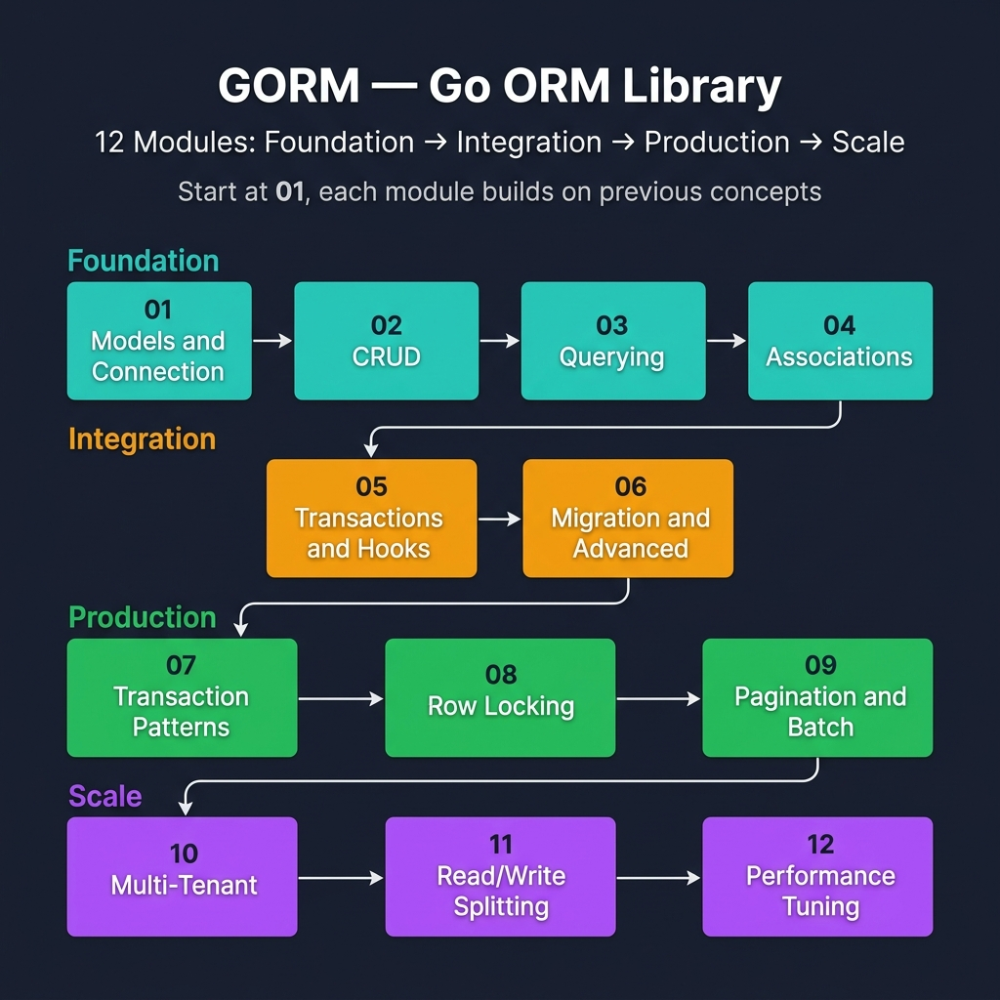

<!-- tags: golang, overview -->
# GORM — Go ORM Library

> **Purpose**: A comprehensive guide to utilizing GORM in Go, spanning from foundational concepts to advanced production techniques.

📅 Updated: 2026-04-19 · ⏱️ 6 min read

## 1. DEFINE

GORM maps Go structs to database tables, wraps SQL behind a chainable query builder, and handles migrations, hooks, and connection pooling. This hub routes you to the right article based on your immediate need — whether that is defining models, tuning queries, managing transactions, or scaling reads across replicas.

This hub refrains from acting as a static file list. It exists to assist you in selecting the correct entry point into the `orm` domain: defining where to begin, which modules connect sequentially, and which lane to prioritize when resolving a live incident.

### 1.1 Signals & Boundaries

- Access this hub when you navigate the `orm` cluster but remain uncertain about your initial reading path.
- The focus maps specific pain points directly to the correct documentation instead of replacing the details within individual modules.
- Bouncing continuously between random articles while remaining confused indicates you chose the wrong starting lane, not that the cluster lacks definitions.

### 1.2 Learning Lanes

- `01 — Models & Connection` serves as the natural entry point if you require a solid baseline before advancing.
- `02 — CRUD Operations` fits perfectly when extending from foundational knowledge into core production logic.
- Treat this hub as a navigational map: return here after finishing an article to deliberately select your next logical step.

## 2. VISUAL

At this stage, incorporating more definitions wastes effort. Instead, a clear diagram reveals exactly where your decision points reside. The visual below serves that precise function.



*Figure: 12-module learning path — Foundation (Models, CRUD, Querying, Associations) → Integration (Transactions, Migration) → Production (Patterns, Locking, Pagination) → Scale (Multi-Tenant, Replicas, Performance). Start at 01, each builds on previous.*

## 3. CODE

The conceptual flow stands clear. We now translate this routing logic into a distinct artifact a Go team can read, review, and utilize as an execution standard.

### Example 1: Router artifact — selecting paths by reading goal

> **Goal**: Transform this hub into an active navigation tool rather than a passive link board.
> **Approach**: Map learning goals or symptoms directly to the correct introductory file.
> **Example**: Select a lane based on concerns like fundamentals, framework mechanics, concurrency, or production operations.
> **Complexity**: O(1) routing overhead; the primary function involves selecting the correct entry point.

```go
// router.go — Conceptual mapping for hub navigation
package router

func ChooseLane(goal string) string {
    switch goal {
    case "models and connection":
        return "./01-models-and-connection.md"
    case "crud":
        return "./02-crud.md"
    case "querying":
        return "./03-querying.md"
    case "associations":
        return "./04-associations.md"
    case "transactions and hooks":
        return "./05-transactions-and-hooks.md"
    case "migration and advanced":
        return "./06-migration-and-advanced.md"
    default:
        return "./README.md"
    }
}
```

> **Takeaway**: This pseudo-router does not represent executable application code; it condenses the hub's navigational spirit into a brief artifact. Reading the hub with this exact mindset maintains an unbroken learning rhythm.

## 4. PITFALLS

The most dangerous element of the **GORM — Go ORM Library** rarely involves raw theory. Instead, a few small misjudgments drastically alter your technical outcome.

| # | Severity | Defect | Impact | Fix |
| --- | --- | --- | --- | --- |
| 1 | 🔴 Fatal | Utilizing the hub as a passive list for scanning | Learning fragments disconnectedly and picking the wrong entry points | Always initiate your path based on specific pain points or exact learning goals |
| 2 | 🟡 Common | Jumping directly into advanced modules without a foundational baseline | Misunderstanding terminology and applying concepts incorrectly | Select a fundamental entry point and follow the cluster rhythm |
| 3 | 🔵 Minor | Failing to return to the hub after completing an article | Losing the structural connection linking sequential articles | Return to the hub following each lane to determine the next deliberate step |

## 5. REF

| Resource | Link | Note |
| --- | --- | --- |
| GORM guides | [https://gorm.io/docs/](https://gorm.io/docs/) | Official guides covering CRUD, associations, transactions, and performance mechanics |
| GORM package docs | [https://pkg.go.dev/gorm.io/gorm](https://pkg.go.dev/gorm.io/gorm) | Core package-level API behaviors and interface types |

## 6. RECOMMEND

After absorbing this overview, the priority shifts from memorizing definitions to transitioning accurately into the correct related concepts.

| Extension | When to proceed | Rationale | File/Link |
| --- | --- | --- | --- |
| 01 — Models & Connection | When you demand a clear and structured entry point | Maintains an unbroken reading rhythm inside the cluster | [./01-models-and-connection.md](./01-models-and-connection.md) |
| 02 — CRUD Operations | When you intend to connect adjacent learning lanes | Drives sequential understanding through core patterns | [./02-crud.md](./02-crud.md) |
| Go Programming | When you must switch to a separate Go cluster | Returns you to the root router supporting a fresh domain | [../README.md](../README.md) |
