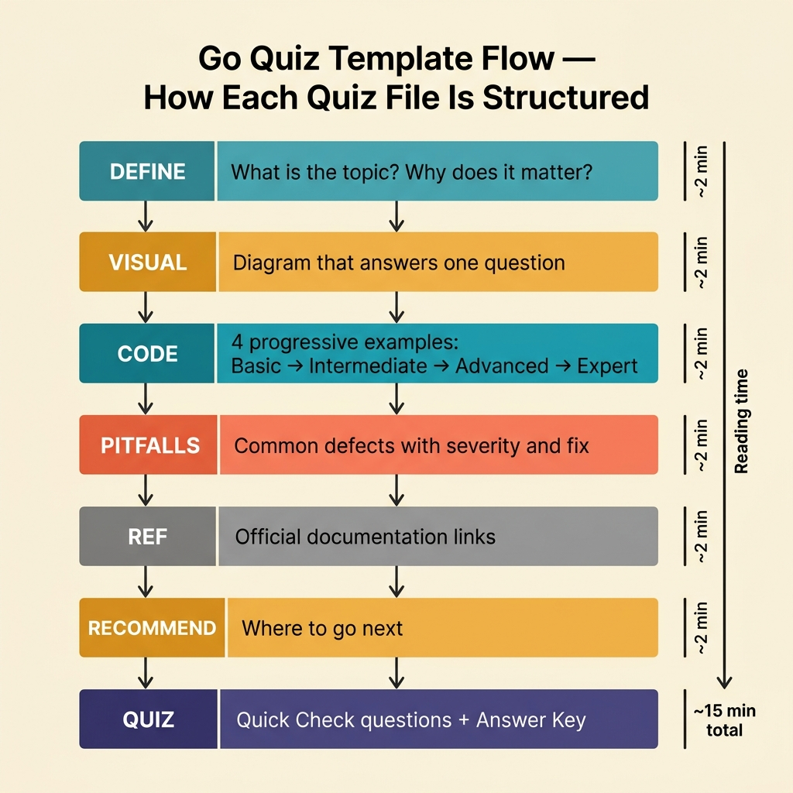

<!-- tags: golang, quiz, template -->
# Go Quiz Template

> Every quiz in this repo follows the same structure. Consistency removes friction so the reader focuses on reasoning, not navigation.

📅 Created: 2026-03-27 · 🔄 Updated: 2026-04-10 · ⏱️ 3 min read.

## 1. DEFINE

A quiz template enforces a consistent diagnostic structure. Without it, quiz authors drift — some add ten sections, others skip the answer key, and readers waste time decoding the format instead of testing their knowledge.

This template locks three things: section order, question format, and feedback loop rules.

> *If every quiz reads the same way, the reader's cognitive load drops to zero on structure and stays entirely on content.*

### Signals & Boundaries

- Every quiz starts with a DEFINE that frames what the quiz tests and why.
- Every quiz includes a VISUAL that maps the knowledge boundary being tested.
- Every quiz ends with an answer key that links wrong answers back to the source documentation.

## 2. VISUAL

The template defines a fixed section order. Authors fill in domain-specific content while the structure stays identical across all 36 quizzes.



*Figure: The template enforces DEFINE → VISUAL → CODE → PITFALLS → REF → RECOMMEND → QUIZ in every quiz file. Authors vary the content; the skeleton stays constant.*

## 3. CODE

The template skeleton below shows the exact sections every quiz must include.

### Example 1: Basic — Quiz skeleton

> **Goal**: Provide a copy-paste starting point for new quiz files.
> **Complexity**: Basic

```md
## 1. DEFINE

[Frame what the quiz tests. State the knowledge boundary.]

## 2. VISUAL

[Knowledge map or incident path diagram. Must answer one visual question.]

## 3. CODE

[One representative code example from the domain being tested.]

## 4. PITFALLS

[Common mistakes the quiz is designed to expose.]

## 5. REF

[External references — Go docs, blog posts, package docs.]

## 6. RECOMMEND

[Links to source documentation lanes and related quizzes.]

## 7. QUIZ

[8-15 questions for module quizzes. 5 scenarios for scenario quizzes.]

### Answer Key

[Every wrong answer links back to the exact source section.]
```

**Why?** A fixed skeleton means quiz authors never argue about format. Every new quiz starts from this file, fills in the blanks, and ships.

---

## 4. PITFALLS

| # | Severity | Defect | Impact | Fix |
|---|----------|--------|--------|-----|
| 1 | 🔴 Fatal | Skipping the answer key or providing one-word answers | Readers cannot self-correct; the feedback loop breaks | Every answer must explain *why* and link to the source |
| 2 | 🟡 Common | Writing generic VISUAL diagrams that apply to any quiz | Reader gains no spatial understanding of the domain | Each VISUAL must map the specific knowledge boundary being tested |
| 3 | 🟡 Common | Adding more than 15 questions per module quiz | Fatigue sets in; completion rate drops below 50% | Cap at 15 questions. Split into two quizzes if needed |

## 5. REF

| Resource | Link | Note |
| --- | --- | --- |
| Effective Go | [https://go.dev/doc/effective_go](https://go.dev/doc/effective_go) | Primary reference for idiomatic Go quiz content |
| Go Blog | [https://go.dev/blog/](https://go.dev/blog/) | Deep dives used as source material for scenario quizzes |
| Markdown Guide | [https://www.markdownguide.org/basic-syntax/](https://www.markdownguide.org/basic-syntax/) | Formatting reference for quiz file authoring |

## 6. RECOMMEND

| Extension | When to proceed | Rationale | File/Link |
| --- | --- | --- | --- |
| Quiz Hub | After understanding the template structure | Navigate to the right quiz mode | [./README.md](./README.md) |
| Module Quizzes | When authoring a new concept-recall quiz | See live examples of the template in action | [./module/README.md](./module/README.md) |
| Scenario Quizzes | When authoring a new incident-reasoning quiz | See how scenarios adapt the template for pressure-based testing | [./scenario/README.md](./scenario/README.md) |

---
