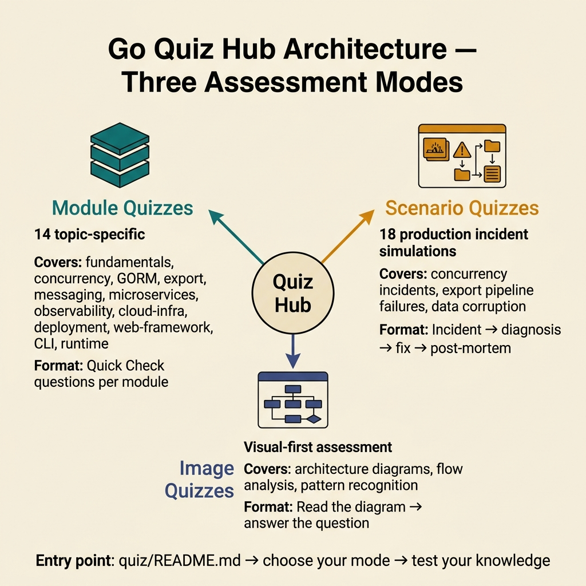
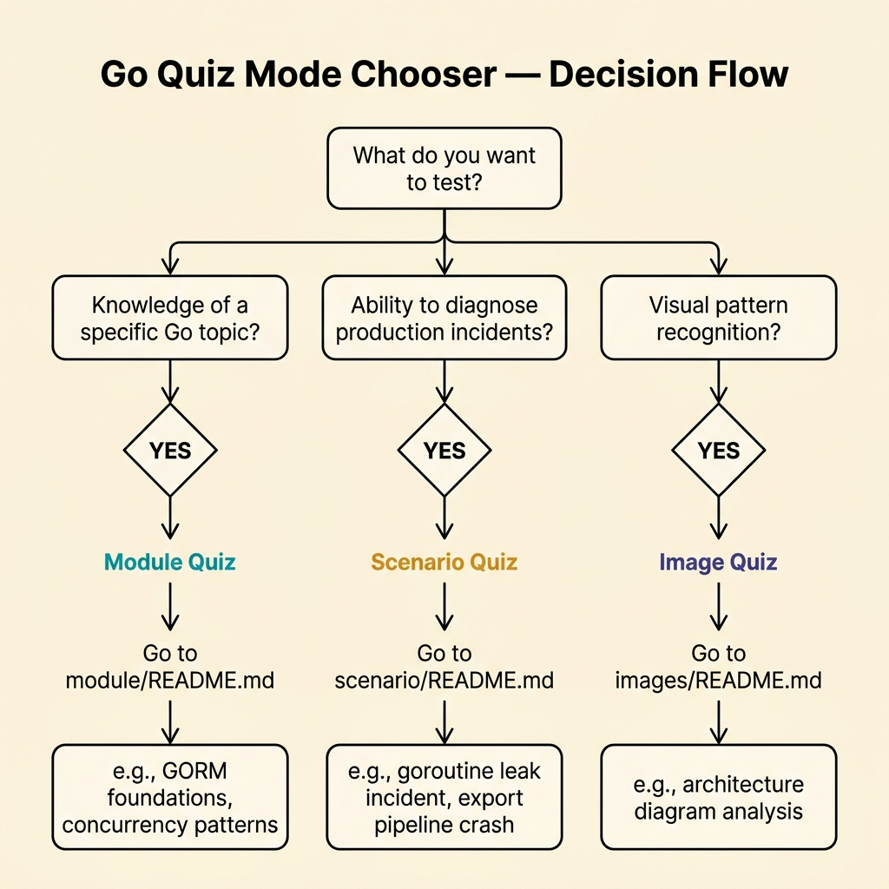
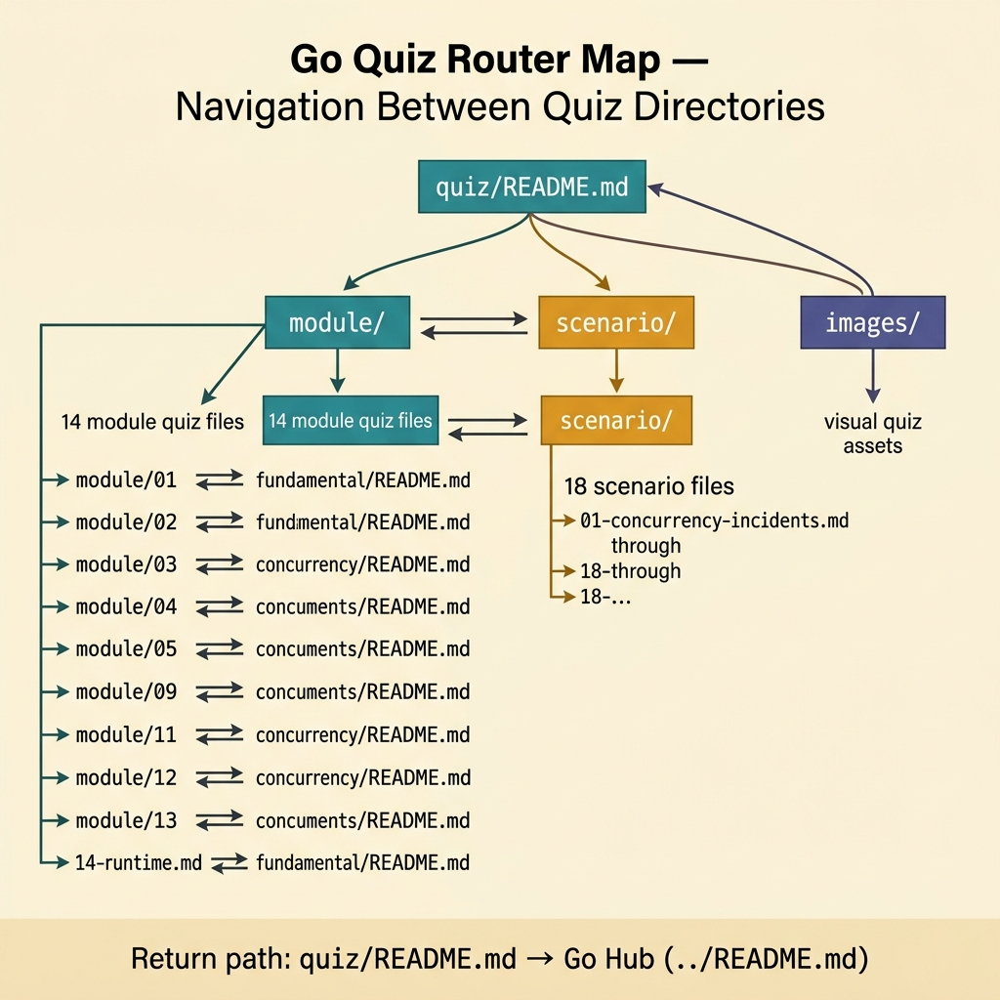
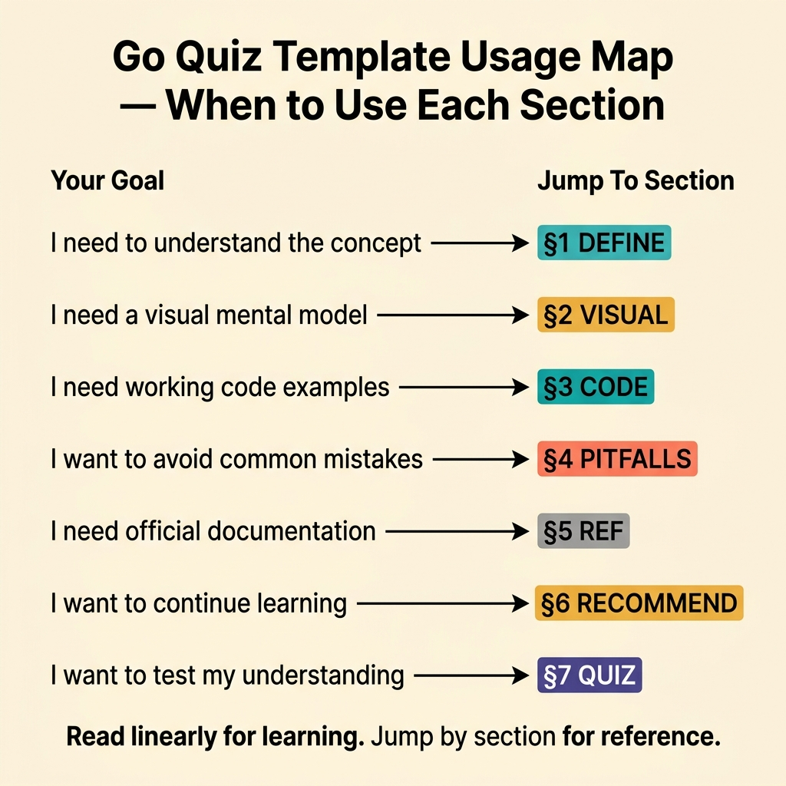

<!-- tags: golang, quiz, overview -->
# Go Quiz Hub

> A wrong answer on paper costs nothing. A wrong assumption in production costs everything.

📅 Created: 2026-03-27 · 🔄 Updated: 2026-04-10 · ⏱️ 7 min read.

---

## 1. DEFINE

Most developers finish a documentation lane and think they understand it. The quiz layer exists to prove that belief wrong — fast, safely, and before production does it for them.

This hub routes you to two distinct diagnostic modes:

- **Module quizzes** test concept recall. Each module quiz maps to one documentation cluster. You just read about interfaces? Prove you can spot a nil-interface panic without re-reading the article.
- **Scenario quizzes** test production reasoning. Each scenario quiz drops you into a simulated incident — a goroutine leak, a broken saga, a silent data loss — and asks: *what is your first move?*

### Assessment Boundaries

- Module quizzes cover syntax, types, interfaces, errors, testing, and standard library patterns.
- Scenario quizzes cover concurrency incidents, export pipeline failures, microservices faults, and infrastructure breakdowns.
- Both modes send you back to the source lane when you miss a question. Do not memorize the answer key.

### When to Use Each Mode

| Signal | Go to |
|--------|-------|
| Just finished reading a lane | `module/` — recall check |
| Preparing for on-call or incident drill | `scenario/` — first-response reasoning |
| Scored < 70% on a module quiz | Re-read the source lane, then retry |
| Scored < 70% on a scenario quiz | Study the referenced incident docs first |

## 2. VISUAL

The quiz hub splits into two lanes. Module quizzes run as lightweight recall checks after each documentation cluster. Scenario quizzes simulate production incidents that force you to reason under pressure.



*Figure: Module quizzes validate what you read. Scenario quizzes validate what you would do. Both lanes loop back to the source documentation on failure.*



*Figure: Choose your lane based on learning objective — concept recall routes to module quizzes, incident triage routes to scenario quizzes.*



*Figure: The quiz directory structure and cross-reference paths between module, scenario, and image quiz assets.*



*Figure: Jump to the right section based on your goal — read linearly for learning, jump by section for reference.*

## 3. CODE

The routing logic is simple: your learning objective determines the lane.

### Example 1: Basic — Quiz lane router

> **Goal**: Route the reader to the correct quiz mode based on their intent.
> **Complexity**: Basic

```go
// quiz_router.go — Directs readers to the right diagnostic mode.
package quiz

func ChooseLane(objective string) string {
	switch objective {
	case "checkpoint", "concept-recall", "post-reading":
		return "./module/README.md"
	case "incident-rehearsal", "production-reasoning", "first-response":
		return "./scenario/README.md"
	default:
		return "./README.md"
	}
}
```

**Why?** A single `switch` keeps the routing transparent. Every case maps to a documented learning objective — no ambiguity about which lane to enter.

---

## 4. PITFALLS

| # | Severity | Defect | Impact | Fix |
|---|----------|--------|--------|-----|
| 1 | 🔴 Fatal | Memorizing answer keys instead of reasoning | Quiz becomes useless; production gaps remain hidden | Re-read the source lane, then retake without notes |
| 2 | 🟡 Common | Skipping scenario quizzes because module scores are high | Recall ≠ reasoning; module quizzes do not test incident triage | Complete at least one scenario quiz per domain |
| 3 | 🟡 Common | Not returning to the source lane after a wrong answer | Gaps persist across future quizzes | Follow the link in the answer key back to the exact section |

## 5. REF

| Resource | Link | Description |
| --- | --- | --- |
| Effective Go | [https://go.dev/doc/effective_go](https://go.dev/doc/effective_go) | The foundational reference for all module quiz content |
| Go FAQ | [https://go.dev/doc/faq](https://go.dev/doc/faq) | Answers to common misconceptions tested in quizzes |
| Go Blog | [https://go.dev/blog/](https://go.dev/blog/) | Deep dives on concurrency, context, and error handling |

## 6. RECOMMEND

| Extension | When to proceed | Rationale | File/Link |
| --- | --- | --- | --- |
| Module Quizzes | After finishing any documentation lane | Tests concept recall on that specific cluster | [./module/README.md](./module/README.md) |
| Scenario Quizzes | Before on-call rotation or after module mastery | Tests first-response reasoning under incident pressure | [./scenario/README.md](./scenario/README.md) |
| Go Programming Hub | When quiz results reveal fundamental gaps | Return to the source documentation to rebuild understanding | [../README.md](../README.md) |
