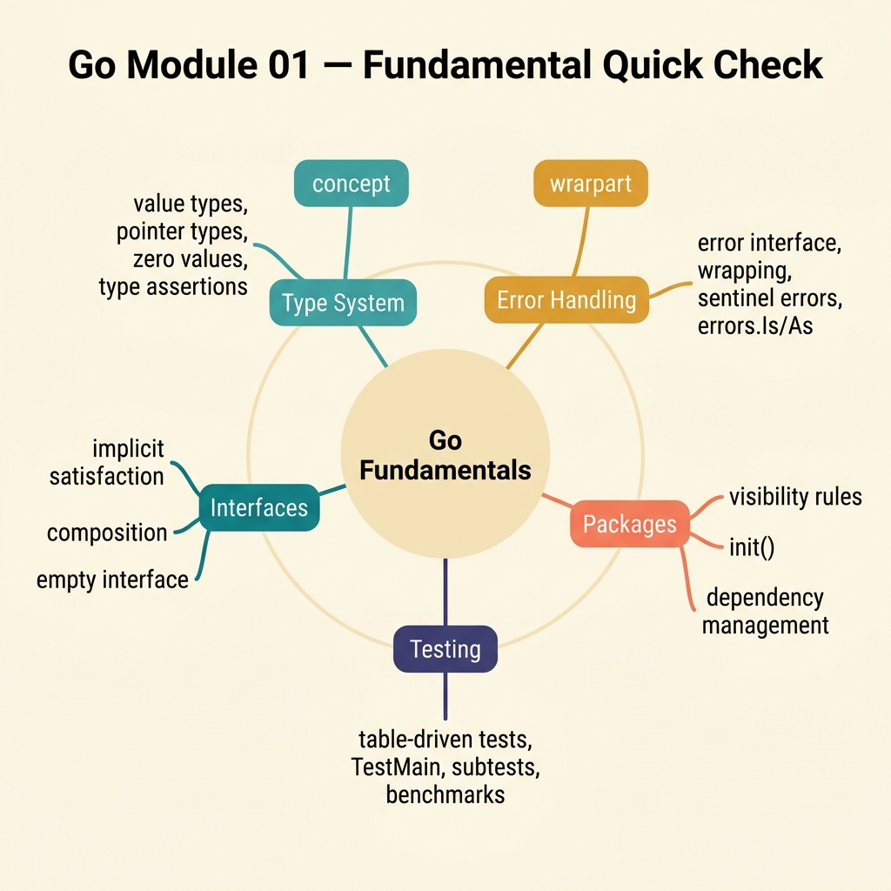

<!-- tags: golang, quiz -->
# 01 — Go Module Quiz: Fundamental Quick Check

> **Diagnostic Assessment**: Eight questions that expose whether you actually internalized Go's type system, error handling, and testing idioms — or just read past them.

📅 Created: 2026-03-27 · 🔄 Updated: 2026-04-10 · ⏱️ 8 min read.

| Aspect | Detail |
| --- | --- |
| **Level** | Basic → Intermediate |
| **Coverage** | Syntax shadowing, zero values, interfaces, error wrapping, table-driven tests, `context.Context` |
| **Format** | 8 multiple-choice questions |

---

## 1. DEFINE

Go's fundamentals feel simple until you ship code that shadows a variable inside a loop, panics on a nil interface, or silently drops a wrapped error. This quiz targets the exact boundaries where "I understand Go" breaks down.

Every question maps to a real production mistake. If you get one wrong, the answer key links back to the source lane — not so you memorize the answer, but so you re-read the reasoning you missed the first time.

### Assessment Boundaries

- Variable shadowing inside `if`, `for`, and short-declaration blocks.
- Zero-value behavior for structs, slices, maps, and interfaces.
- Implicit interface satisfaction and nil-interface panics.
- Error wrapping with `%w`, `errors.Is`, and `errors.As`.
- Table-driven test structure and `go test -race` detection.
- `context.Context` propagation and cancellation chains.

## 2. VISUAL

The quiz covers three knowledge clusters. Each cluster maps to a family of production mistakes.



*Figure: Three knowledge clusters — language core (shadowing, zero values), interface contracts (nil panics, composition), and error/testing (wrapping, race detection). Miss one cluster and the quiz sends you back to the fundamentals lane.*

```text
Fundamental Knowledge Map
├── Syntax & Types
│   ├── Shadowing Traps
│   └── Zero Value Behaviors
├── Interface Contracts
│   ├── Nil Interface Panics
│   └── Composition Boundaries
└── Error & Testing
    ├── Wrapped Errors (%w)
    └── Table-Driven Tests
```

*Figure: Three pillars of Go fundamentals — each pillar maps to 2-3 quiz questions.*

## 3. CODE

One representative example from the domain this quiz tests: interfaces and error wrapping.

### Example 1: Basic — Interface + error wrapping pattern

> **Goal**: Demonstrate the `Notifier` interface pattern with proper error wrapping.
> **Complexity**: Basic

```go
// fundamental_quick_check.go — Interface + wrapped error pattern
package fundamental

import (
	"errors"
	"fmt"
)

type Notifier interface {
	Notify(msg string) error
}

func SendWelcome(n Notifier, name string) error {
	if name == "" {
		return errors.New("name is empty")
	}
	if err := n.Notify("welcome " + name); err != nil {
		return fmt.Errorf("notify welcome: %w", err)
	}
	return nil
}
```

**Why?** This function uses three patterns the quiz tests: implicit interface satisfaction (any struct with `Notify(string) error` qualifies), sentinel error creation (`errors.New`), and error wrapping (`%w`). If you cannot trace how `errors.Is` would unwrap this chain, question 5 will catch you.

## 4. PITFALLS

| # | Severity | Defect | Impact | Fix |
| --- | --- | --- | --- | --- |
| 1 | 🔴 Fatal | Calling a method on a nil interface value | Runtime panic with no compile-time warning | Check for nil before invoking interface methods |
| 2 | 🟡 Common | Shadowing `err` inside a nested `if` block | The outer `err` retains its old value; bugs go silent | Use `=` instead of `:=` when the variable already exists |
| 3 | 🟡 Common | Wrapping errors without `%w` (using `%v` instead) | `errors.Is` and `errors.As` cannot unwrap the chain | Always use `%w` when the caller needs to inspect the cause |

## 5. REF

| Resource | Link | Note |
| --- | --- | --- |
| Effective Go | [https://go.dev/doc/effective_go](https://go.dev/doc/effective_go) | Canonical reference for interfaces, error handling, and naming |
| Go FAQ | [https://go.dev/doc/faq](https://go.dev/doc/faq) | Explains implicit interfaces and nil-interface behavior |
| testing package | [https://pkg.go.dev/testing](https://pkg.go.dev/testing) | Official docs for table-driven tests and `-race` flag |

## 6. RECOMMEND

| Extension | When to proceed | Rationale | File/Link |
| --- | --- | --- | --- |
| Go Fundamentals Lane | If you scored < 70% on this quiz | Re-read the source material before retaking | [../../fundamental/README.md](../../fundamental/README.md) |
| Module Quiz Hub | To browse other module quizzes | Choose the next domain to test | [./README.md](./README.md) |
| Concurrency Foundations Quiz | After passing this quiz | Concurrency builds on the fundamentals tested here | [./03-concurrency-foundations.md](./03-concurrency-foundations.md) |

## 7. QUIZ

Scan the knowledge map above. Then answer each question without looking back at the documentation.

### Quick Check

1. What is the primary advantage of table-driven tests?
   - A. They bypass benchmark compilation.
   - B. They unify multiple test cases into a single loop with consistent assertion logic.
   - C. They generate automated runtime mocks.
   - D. They replace fuzz testing configurations.

2. What is Go's idiomatic error-handling pattern?
   - A. Panic on every failure and recover at the top level.
   - B. Return `(value, error)` and wrap errors with `%w` for chain inspection.
   - C. Return boolean flags to signal success or failure.
   - D. Log the error and continue execution.

3. How does Go determine whether a struct satisfies an interface?
   - A. The struct must include an explicit `implements` declaration.
   - B. The struct must be registered with the interface at init time.
   - C. The compiler checks that the struct's method set matches the interface's method set.
   - D. The struct must embed the interface type.

4. When should you use a pointer receiver instead of a value receiver?
   - A. When the method needs to mutate the receiver's state or the struct is large enough that copying is expensive.
   - B. When the method only reads primitive fields.
   - C. When you need to satisfy a nil-safe interface.
   - D. When the struct has no exported fields.

5. When should you use `errors.Join` instead of `fmt.Errorf`?
   - A. To replace `fmt.Println` for error logging.
   - B. To aggregate multiple independent errors while preserving each error's identity for `errors.Is`.
   - C. To convert an error to a string representation.
   - D. To mask internal error details from callers.

6. What is the primary purpose of passing `context.Context` through function chains?
   - A. To cache frequently accessed variables across requests.
   - B. To carry deadlines, cancellation signals, and request-scoped values through the call chain.
   - C. To create isolated goroutine-local storage.
   - D. To wrap HTTP request parameters for middleware.

7. Why does idiomatic Go favor small interfaces (1-2 methods)?
   - A. To force all implementations into single-file packages.
   - B. To make testing easier — small interfaces are trivial to mock and verify.
   - C. To work around the compiler's method set size limit.
   - D. To avoid the need for generics.

8. What type of defect does `go test -race` detect?
   - A. Memory allocation failures under high load.
   - B. Concurrent access to shared variables without proper synchronization.
   - C. Generic type constraint violations.
   - D. Database connection pool exhaustion.

### Answer Key

1. **B**. Table-driven tests execute a slice of test cases through a single `for` loop. Each case specifies input, expected output, and a name for failure reporting. This eliminates duplicated assertion logic across test functions.

2. **B**. Go functions return `(value, error)` tuples. The caller checks `err != nil` before using the value. Wrapping with `%w` preserves the original error so `errors.Is` and `errors.As` can inspect the chain. See [fundamentals: error handling](../../fundamental/basics/README.md).

3. **C**. Go interfaces are satisfied implicitly. If a struct has all the methods an interface requires (with matching signatures), the compiler accepts it. No `implements` keyword exists. See [fundamentals: interfaces](../../fundamental/basics/README.md).

4. **A**. Pointer receivers allow the method to modify the struct's fields in place. They also avoid copying large structs on every method call. Value receivers create a copy, so mutations are lost. See [fundamentals: methods](../../fundamental/basics/README.md).

5. **B**. `errors.Join` combines multiple errors into a single error value. Unlike `fmt.Errorf` with `%w` (which wraps one error), `errors.Join` preserves each error's identity so `errors.Is` works on any of them. See [fundamentals: error wrapping](../../fundamental/basics/README.md).

6. **B**. `context.Context` propagates deadlines, cancellation signals, and request-scoped values (like trace IDs) through function call chains. When a parent context is cancelled, all child contexts cancel too. See [fundamentals: context](../../fundamental/basics/README.md).

7. **B**. Small interfaces are easy to implement, easy to mock in tests, and easy to compose. A `Reader` interface with one `Read` method can be satisfied by files, network connections, buffers, and test doubles. See [fundamentals: interface design](../../fundamental/basics/README.md).

8. **B**. The race detector instruments memory accesses at runtime. When two goroutines access the same variable concurrently and at least one access is a write, the detector reports the race with stack traces for both accesses. See [fundamentals: testing](../../fundamental/basics/README.md).

---
