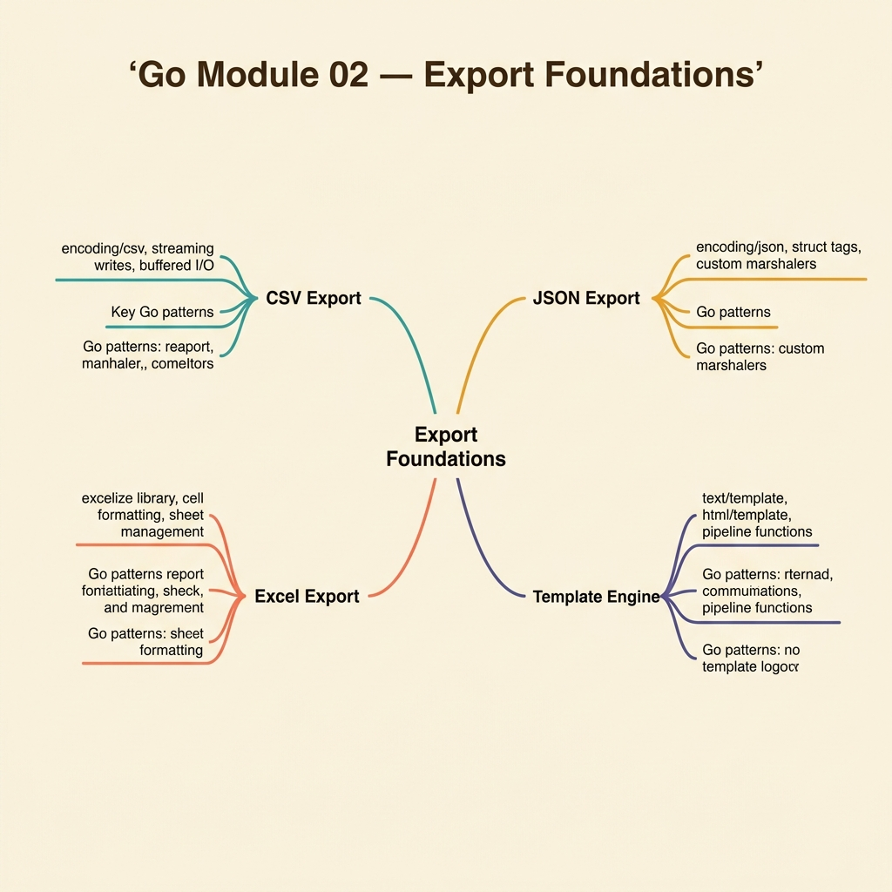

<!-- tags: golang, quiz -->
# 02 — Go Module Quiz: Export Foundations

> **Diagnostic Assessment**: Eight questions testing whether you understand Go's export pipeline — from CSV streaming to signed URL delivery — well enough to avoid the memory and timeout traps that kill production exports.

📅 Created: 2026-03-27 · 🔄 Updated: 2026-04-10 · ⏱️ 8 min read.

| Aspect | Detail |
| --- | --- |
| **Level** | Intermediate |
| **Coverage** | CSV streaming, Excel generation, PDF layout, signed URLs, background jobs |
| **Format** | 8 multiple-choice questions |

---

## 1. DEFINE

Export features look simple until a user exports 500,000 rows and your service OOMs because you loaded the entire dataset into memory before writing. This quiz targets the boundary between "it works on my machine" and "it works with real data."

The questions cover five export domains: CSV streaming, Excel multi-sheet generation, PDF report layout, object storage with signed URLs, and background job orchestration.

### Assessment Boundaries

- Memory-safe streaming: writing rows as they arrive instead of buffering entire datasets.
- CSV vs Excel vs PDF: when each format fits and what each costs in memory and CPU.
- Signed URLs: time-bounded, pre-authenticated download links from object storage.
- Background jobs: queue-based export with progress tracking and retry on failure.
- `context.Context` in export loops: cancellation, deadline propagation, and graceful shutdown.

## 2. VISUAL

The export pipeline flows through three layers: format selection, delivery mode, and background orchestration.



*Figure: Three export layers — file formats (CSV, Excel, PDF), delivery modes (sync HTTP vs async signed URL), and background worker processing. Each layer maps to 2-3 quiz questions.*

```text
Export Foundation Knowledge Map
├── File Formats & Structures
│   ├── CSV Streaming (memory-safe)
│   └── Excel Buffered Generation
├── Delivery Sequences
│   ├── Synchronous HTTP Response
│   └── Asynchronous Signed URL (S3/GCS)
└── Background Worker Processing
    ├── Context Deadlines
    └── Retry & Progress Tracking
```

*Figure: Export knowledge boundary — miss any layer and the quiz sends you back to the export lane.*

## 3. CODE

One representative example: streaming CSV rows from a channel to avoid holding the full dataset in memory.

### Example 1: Basic — Streaming CSV writer with context cancellation

> **Goal**: Write CSV rows one at a time from a channel, cancelling cleanly on context timeout.
> **Complexity**: Basic

```go
// export_foundations.go — Stream rows to CSV without keeping the whole dataset in RAM
package exportquiz

import (
	"context"
	"encoding/csv"
	"io"
)

func WriteCSV(ctx context.Context, w io.Writer, rows <-chan []string) error {
	writer := csv.NewWriter(w)
	defer writer.Flush()

	for row := range rows {
		select {
		case <-ctx.Done():
			return ctx.Err()
		default:
		}
		if err := writer.Write(row); err != nil {
			return err
		}
	}
	return writer.Error()
}
```

**Why?** The `for row := range rows` loop processes one row at a time from the channel. Memory usage stays constant regardless of dataset size. The `select` on `ctx.Done()` ensures the export stops cleanly when the client disconnects or the deadline expires.

## 4. PITFALLS

| # | Severity | Defect | Impact | Fix |
| --- | --- | --- | --- | --- |
| 1 | 🔴 Fatal | Loading entire dataset into memory before writing | OOM crash on large exports (500K+ rows) | Stream rows through a channel or iterator |
| 2 | 🟡 Common | Ignoring `context.Context` in export loops | Export runs past client disconnect, wasting CPU and I/O | Check `ctx.Done()` on every iteration |
| 3 | 🟡 Common | Using sync HTTP response for exports exceeding 30 seconds | Gateway timeout kills the download mid-stream | Switch to background job + signed URL for large exports |

## 5. REF

| Resource | Link | Note |
| --- | --- | --- |
| `encoding/csv` | [https://pkg.go.dev/encoding/csv](https://pkg.go.dev/encoding/csv) | Standard library CSV writer with buffered output |
| Excelize | [https://xuri.me/excelize/en/](https://xuri.me/excelize/en/) | Go library for reading and writing Excel files |
| AWS Signed URLs | [https://docs.aws.amazon.com/AmazonS3/latest/userguide/using-presigned-url.html](https://docs.aws.amazon.com/AmazonS3/latest/userguide/using-presigned-url.html) | Pre-authenticated download links with time-bounded access |

## 6. RECOMMEND

| Extension | When to proceed | Rationale | File/Link |
| --- | --- | --- | --- |
| Export Documentation Lane | If you scored < 70% on this quiz | Re-read the export pipeline source material | [../../export/README.md](../../export/README.md) |
| Export Pipeline Incidents | After passing this quiz | Practice incident triage on export failures | [../scenario/02-export-pipeline-incidents.md](../scenario/02-export-pipeline-incidents.md) |
| Module Quiz Hub | To choose another domain | Browse the full quiz roster | [./README.md](./README.md) |

## 7. QUIZ

Scan the knowledge map above. Then answer without looking back at the documentation.

### Quick Check

1. What prevents memory saturation when exporting large datasets?
   - A. Loading all rows into a slice, then writing them at once.
   - B. Streaming rows through a channel and writing each row as it arrives.
   - C. Encoding the dataset as JSON and compressing it in memory.
   - D. Increasing the server's RAM allocation.

2. When should you choose CSV over Excel or PDF?
   - A. When the output needs complex formatting and charts.
   - B. When the consumer needs simple tabular data that imports into any spreadsheet or database.
   - C. When the file must be encrypted at rest.
   - D. When the output requires pixel-perfect page layout.

3. What optimization reduces memory pressure for large Excel exports?
   - A. Disabling all cell styling to reduce overhead.
   - B. Writing rows in streaming mode so the library flushes each sheet incrementally.
   - C. Opening multiple concurrent writers to parallelize output.
   - D. Skipping error checks to write faster.

4. What problem do signed URLs solve for file delivery?
   - A. They route files through a CDN for caching.
   - B. They grant time-bounded, pre-authenticated access to objects in cloud storage without exposing credentials.
   - C. They validate file checksums on download.
   - D. They compress files before transfer.

5. When should an export run as a background job instead of a synchronous HTTP response?
   - A. When the export takes less than one second.
   - B. When the export exceeds the HTTP gateway timeout, needs progress tracking, or must retry on failure.
   - C. When the export produces a PDF document.
   - D. When the client requests JSON format.

6. Why does `context.Context` matter in export stream loops?
   - A. It sets the CSV delimiter character.
   - B. It carries cancellation signals so the loop stops when the client disconnects or the deadline expires.
   - C. It configures the output writer's buffer size.
   - D. It determines the file encoding format.

7. What metric signals that a synchronous export must switch to streaming?
   - A. When the response body exceeds an arbitrary size threshold.
   - B. When memory usage grows linearly with dataset size because the entire result set is buffered.
   - C. When the export takes more than 100 milliseconds.
   - D. When the CSV has more than 10 columns.

8. What production requirement pushes a basic file download into background job territory?
   - A. The file is in CSV format.
   - B. The export needs progress updates, retry on failure, or produces files that take minutes to generate.
   - C. The client uses a mobile browser.
   - D. The export result is cached.

### Answer Key

1. **B**. Streaming writes each row as it arrives from the data source (channel, cursor, iterator). Memory stays constant regardless of dataset size. Loading all rows first (option A) scales linearly with data volume and will OOM on large exports. See [export: CSV streaming](../../export/csv/01-csv-stream-writer-http-download.md).

2. **B**. CSV is the simplest tabular format. Any spreadsheet, database import tool, or scripting language can parse it. Choose Excel when you need multiple sheets, cell styling, or formulas. Choose PDF when you need fixed page layout. See [export: format selection](../../export/README.md).

3. **B**. Libraries like Excelize support streaming mode where rows are flushed to disk incrementally. This prevents the library from holding the entire workbook in memory. See [export: Excel](../../export/excel/01-excelize-multi-sheet-styling.md).

4. **B**. A signed URL is a pre-authenticated link to an object in S3 or GCS. It expires after a set duration (e.g., 15 minutes). The client downloads directly from storage without routing through your application server. See [export: signed URLs](../../export/storage-delivery/01-object-storage-signed-url-background-jobs.md).

5. **B**. Background jobs decouple the export from the HTTP request lifecycle. The client gets a job ID immediately, polls for progress, and downloads the result via signed URL when ready. This avoids gateway timeouts and supports retry. See [export: background jobs](../../export/background-jobs/01-queue-progress-retry.md).

6. **B**. `context.Context` propagates cancellation from the HTTP handler down to the export loop. When the client disconnects, `ctx.Done()` fires and the loop exits. Without this check, the export continues burning CPU and I/O after nobody is waiting for the result. See [export: streaming](../../export/streaming/01-stream-pipeline-large-export.md).

7. **B**. If memory usage grows proportionally with dataset size, the export is buffering everything before writing. Streaming mode keeps memory flat. The trigger is the memory growth pattern, not an arbitrary size threshold. See [export: streaming](../../export/streaming/01-stream-pipeline-large-export.md).

8. **B**. Background jobs are necessary when exports take minutes to generate, need progress bars for the user, or must retry on transient failures (network, storage). A fast, small export can stay synchronous. See [export: background jobs](../../export/background-jobs/01-queue-progress-retry.md).

---
