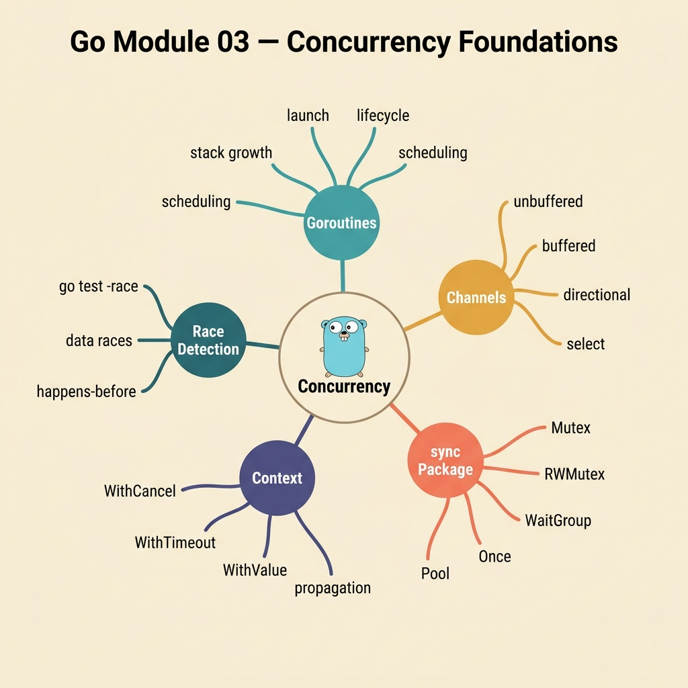

<!-- tags: golang, quiz -->
# 03 — Go Module Quiz: Concurrency Foundations

> **Diagnostic Assessment**: Eight questions that test whether you can reason about goroutine lifecycles, channel semantics, and synchronization patterns — the skills that separate "it passes on CI" from "it survives production traffic."

📅 Created: 2026-03-27 · 🔄 Updated: 2026-04-10 · ⏱️ 8 min read.

| Aspect | Detail |
| --- | --- |
| **Level** | Intermediate → Advanced |
| **Coverage** | Goroutines, channels, `sync.Mutex`, `context.Context`, pipelines, semaphores |
| **Format** | 8 multiple-choice questions |

---

## 1. DEFINE

Concurrency in Go is easy to start and hard to get right. You can launch a goroutine in one line, but that goroutine can leak memory for hours if nobody cancels it. You can send data through a channel, but a missing receiver creates a silent deadlock.

This quiz targets the exact boundaries where concurrency bugs hide: goroutine lifecycle management, channel direction and buffering, mutex contention, context propagation, pipeline backpressure, and semaphore-based concurrency limiting.

### Assessment Boundaries

- Goroutine lifecycle: launching, waiting, and cancelling goroutines cleanly.
- Channel semantics: buffered vs unbuffered, directional types, closing rules.
- `sync.Mutex` and `sync.RWMutex`: when locking is necessary and when it creates contention.
- `context.Context`: deadline propagation, cancellation chains, and value scoping.
- Pipeline patterns: fan-out, fan-in, and stage-by-stage processing.
- Semaphore patterns: bounding concurrency with buffered channels.

## 2. VISUAL

The quiz covers three concurrency domains. Each domain maps to a class of production bugs.



*Figure: Three concurrency pillars — synchronization (mutex, race detection), communication (channels, deadlocks), and coordination (context cancellation, semaphores). Each pillar maps to 2-3 quiz questions.*

```text
Concurrency Foundation Knowledge Map
├── Synchronization
│   ├── Mutex / RWMutex
│   └── Race Condition Detection
├── Communication
│   ├── Channel Direction & Buffering
│   └── Deadlock Patterns
└── Coordination
    ├── Context Cancellation
    └── Semaphore Concurrency Limiting
```

## 3. CODE

One representative example: a bounded worker pool that respects context cancellation.

### Example 1: Intermediate — Semaphore-bounded job runner

> **Goal**: Run jobs concurrently with a hard limit on parallelism, cancelling cleanly on context timeout.
> **Complexity**: Intermediate

```go
// concurrency_foundations.go — Bound concurrency and respect cancellation
package concurrencyquiz

import (
	"context"
	"sync"
)

func RunJobs(ctx context.Context, jobs []func() error, limit int) error {
	sem := make(chan struct{}, limit)
	var wg sync.WaitGroup

	for _, job := range jobs {
		select {
		case <-ctx.Done():
			return ctx.Err()
		case sem <- struct{}{}:
		}

		wg.Add(1)
		go func(job func() error) {
			defer wg.Done()
			defer func() { <-sem }()
			_ = job()
		}(job)
	}

	wg.Wait()
	return ctx.Err()
}
```

**Why?** The buffered channel `sem` acts as a counting semaphore — at most `limit` goroutines run simultaneously. The `select` on `ctx.Done()` ensures new jobs are not launched after cancellation. `wg.Wait()` blocks until all running jobs finish, preventing goroutine leaks.

## 4. PITFALLS

| # | Severity | Defect | Impact | Fix |
| --- | --- | --- | --- | --- |
| 1 | 🔴 Fatal | Launching goroutines without a `WaitGroup` or cancellation mechanism | Goroutine leak — memory grows until OOM | Always pair `go func()` with `wg.Add(1)` / `wg.Done()` or context cancellation |
| 2 | 🔴 Fatal | Reading and writing a shared map from multiple goroutines without a mutex | Data race — silent corruption or runtime panic | Protect shared state with `sync.Mutex` or use `sync.Map` |
| 3 | 🟡 Common | Sending to an unbuffered channel with no receiver ready | Deadlock — the sending goroutine blocks forever | Ensure a receiver exists before sending, or use a buffered channel |

## 5. REF

| Resource | Link | Note |
| --- | --- | --- |
| Go Blog: Context | [https://go.dev/blog/context](https://go.dev/blog/context) | Canonical guide to context propagation and cancellation |
| Go Blog: Pipelines | [https://go.dev/blog/pipelines](https://go.dev/blog/pipelines) | Fan-out/fan-in patterns and stage cancellation |
| Race Detector | [https://go.dev/doc/articles/race_detector](https://go.dev/doc/articles/race_detector) | How `go test -race` instruments memory accesses |

## 6. RECOMMEND

| Extension | When to proceed | Rationale | File/Link |
| --- | --- | --- | --- |
| Concurrency Documentation Lane | If you scored < 70% on this quiz | Re-read the concurrency source material | [../../concurrency/README.md](../../concurrency/README.md) |
| Concurrency Incidents Scenario | After passing this quiz | Practice incident triage on goroutine leaks and race conditions | [../scenario/01-concurrency-incidents.md](../scenario/01-concurrency-incidents.md) |
| Module Quiz Hub | To choose another domain | Browse the full quiz roster | [./README.md](./README.md) |

## 7. QUIZ

Scan the knowledge map above. Then answer each question without looking back at the documentation.

### Quick Check

1. What is the primary role of `context.Context` in concurrent Go programs?
   - A. To store database connection pools for reuse across goroutines.
   - B. To propagate deadlines, cancellation signals, and request-scoped values through goroutine call chains.
   - C. To increase the maximum number of OS threads available to the runtime.
   - D. To provide mutual exclusion for shared variables.

2. What defines a goroutine leak?
   - A. A goroutine that allocates more than 1 MB of stack space.
   - B. A goroutine that outlives the request or function that spawned it, consuming memory indefinitely.
   - C. A goroutine that completes before its parent function returns.
   - D. A goroutine that logs too many messages to stdout.

3. When must you protect a shared variable with a mutex?
   - A. When multiple goroutines read the variable but none write to it.
   - B. When at least one goroutine writes to the variable while other goroutines read or write concurrently.
   - C. When the variable is a local variable inside a single function.
   - D. When the variable is passed as an argument to a goroutine.

4. What does a buffered channel with capacity N provide?
   - A. Automatic retry of failed sends up to N times.
   - B. Up to N sends that proceed without blocking, even when no receiver is ready.
   - C. N parallel goroutines that process messages simultaneously.
   - D. A FIFO queue that persists messages to disk.

5. What is the idiomatic Go pattern for waiting until all goroutines in a group have finished?
   - A. Call `runtime.Goexit()` in the main goroutine.
   - B. Use `sync.WaitGroup` — call `Add` before launching, `Done` inside each goroutine, and `Wait` in the parent.
   - C. Sleep for a fixed duration in the parent function.
   - D. Use a global boolean flag that each goroutine sets to true.

6. How does a buffered channel act as a counting semaphore?
   - A. Each send reserves a slot; each receive releases it. The buffer capacity limits maximum concurrency.
   - B. The channel counts the number of errors returned by goroutines.
   - C. The channel buffers log messages for later processing.
   - D. The channel stores mutex lock tokens.

7. What happens when you send to a closed channel?
   - A. The send blocks until a receiver arrives.
   - B. The runtime panics immediately.
   - C. The send succeeds silently and the value is discarded.
   - D. The channel reopens automatically.

8. Why should `wg.Add(1)` be called in the parent goroutine, not inside the child goroutine?
   - A. To reduce memory allocation in the child goroutine.
   - B. To guarantee the counter increments before `wg.Wait()` checks it — preventing a race between Add and Wait.
   - C. To allow the child goroutine to skip the Done call.
   - D. To enable garbage collection of the WaitGroup sooner.

### Answer Key

1. **B**. `context.Context` carries deadlines, cancellation signals, and request-scoped values (like trace IDs) through the call chain. When a parent context is cancelled, all derived child contexts cancel too, enabling clean goroutine shutdown. See [concurrency: context](../../concurrency/README.md).

2. **B**. A goroutine leak occurs when a goroutine blocks forever (e.g., waiting on a channel with no sender) after the function that launched it has returned. The leaked goroutine's stack memory is never reclaimed, causing gradual memory growth. See [concurrency: goroutine lifecycle](../../concurrency/README.md).

3. **B**. The Go memory model requires synchronization when at least one goroutine writes to a variable that other goroutines access concurrently. Read-only access from multiple goroutines is safe without a mutex. See [concurrency: mutex](../../concurrency/README.md).

4. **B**. A buffered channel allows up to N values to be sent without blocking. The sender blocks only when the buffer is full. This decouples producers from consumers, smoothing bursty workloads. See [concurrency: channels](../../concurrency/README.md).

5. **B**. `sync.WaitGroup` is the standard mechanism. `Add(n)` increments the counter, `Done()` decrements it, and `Wait()` blocks until the counter reaches zero. Sleeping for a fixed duration (option C) is fragile and non-deterministic. See [concurrency: WaitGroup](../../concurrency/README.md).

6. **A**. A buffered channel of capacity N allows exactly N goroutines to hold a slot simultaneously. Sending acquires a slot (blocks when full); receiving releases a slot. This is the idiomatic Go semaphore pattern. See [concurrency: semaphore](../../concurrency/README.md).

7. **B**. Sending to a closed channel causes a runtime panic. This is by design — closing a channel signals "no more values." Receivers should use the two-value form `v, ok := <-ch` to detect closure. See [concurrency: channel closing](../../concurrency/README.md).

8. **B**. If `wg.Add(1)` runs inside the child goroutine, the parent's `wg.Wait()` might execute before the child goroutine starts, finding a zero counter and returning immediately. The parent must increment the counter before the child launches to prevent this race. See [concurrency: WaitGroup](../../concurrency/README.md).

---
