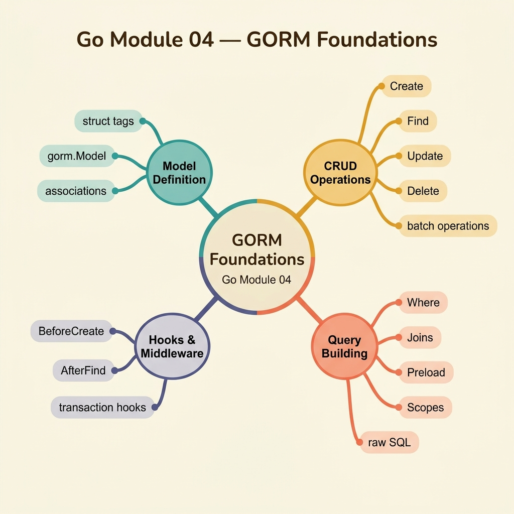

<!-- tags: golang, quiz -->
# 04 — Go Module Quiz: GORM Foundations

> **Diagnostic Assessment**: Eight questions testing whether you understand GORM's transaction model, hook lifecycle, connection pooling, and soft-delete semantics well enough to avoid the data corruption traps that hide behind simple CRUD operations.

📅 Created: 2026-03-27 · 🔄 Updated: 2026-04-10 · ⏱️ 8 min read.

| Aspect | Detail |
| --- | --- |
| **Level** | Intermediate |
| **Coverage** | Transactions, hooks, connection pooling, associations, soft delete, query scoping |
| **Format** | 8 multiple-choice questions |

---

## 1. DEFINE

GORM makes database operations feel easy until you discover that your auto-migrate silently dropped a column, your hooks fired in the wrong order, or your soft-delete query returned "deleted" records because you forgot the default scope.

This quiz targets the boundaries where GORM's convenience becomes a liability: transactions, hook ordering, connection pool exhaustion, association loading, and soft-delete semantics.

### Assessment Boundaries

- Transactions: `db.Transaction()` scope, rollback behavior, nested savepoints.
- Hooks: `BeforeCreate`, `AfterUpdate` — execution order and error propagation.
- Connection pooling: `SetMaxOpenConns`, `SetMaxIdleConns`, `SetConnMaxLifetime`.
- Associations: `Preload` vs `Joins`, N+1 query detection.
- Soft delete: `gorm.DeletedAt`, `Unscoped()`, default query filtering.
- Query scoping: chaining `Where`, `Select`, `Order` without side effects.

## 2. VISUAL



*Figure: Four GORM knowledge domains — transactions (atomicity), hooks (lifecycle), connection pool (resource management), and query patterns (associations, soft delete). Each domain maps to 2 quiz questions.*

```text
GORM Foundation Knowledge Map
├── Transaction Model
│   ├── Atomic Scope (commit / rollback)
│   └── Nested Savepoints
├── Hook Lifecycle
│   ├── Before/After Create/Update/Delete
│   └── Error Propagation in Hooks
├── Connection Pool
│   ├── MaxOpenConns / MaxIdleConns
│   └── ConnMaxLifetime
└── Query Patterns
    ├── Preload vs Joins (N+1)
    └── Soft Delete Semantics
```

## 3. CODE

One representative example: a GORM transaction that transfers funds between accounts atomically.

### Example 1: Intermediate — Atomic balance transfer

> **Goal**: Debit one account and credit another inside a single transaction. Any failure rolls back both operations.
> **Complexity**: Intermediate

```go
// gorm_foundations.go — Keep related writes inside one transaction
package gormquiz

import "gorm.io/gorm"

type Account struct {
	ID      uint
	Balance int64
}

func Transfer(db *gorm.DB, fromID, toID uint, amount int64) error {
	return db.Transaction(func(tx *gorm.DB) error {
		if err := tx.Model(&Account{}).Where("id = ?", fromID).
			Update("balance", gorm.Expr("balance - ?", amount)).Error; err != nil {
			return err
		}
		return tx.Model(&Account{}).Where("id = ?", toID).
			Update("balance", gorm.Expr("balance + ?", amount)).Error
	})
}
```

**Why?** Returning a non-nil error inside the callback triggers an automatic rollback. Both balance updates succeed or neither does. Using `gorm.Expr` for arithmetic prevents race conditions compared to read-modify-write in application code.

## 4. PITFALLS

| # | Severity | Defect | Impact | Fix |
| --- | --- | --- | --- | --- |
| 1 | 🔴 Fatal | Using `db` instead of `tx` inside a transaction callback | Operations bypass the transaction — partial writes on failure | Always use the `tx` parameter passed to the callback |
| 2 | 🟡 Common | Calling `Preload` on every query without checking N+1 impact | Hundreds of extra SQL queries for deeply nested associations | Use `Joins` for required associations; profile with query logging |
| 3 | 🟡 Common | Forgetting that soft-deleted records are excluded by default | Queries silently miss "deleted" records; `Unscoped()` required for audits | Use `Unscoped()` explicitly when you need all records |

## 5. REF

| Resource | Link | Note |
| --- | --- | --- |
| GORM Docs: Transactions | [https://gorm.io/docs/transactions.html](https://gorm.io/docs/transactions.html) | Transaction scope, savepoints, and manual commit |
| GORM Docs: Hooks | [https://gorm.io/docs/hooks.html](https://gorm.io/docs/hooks.html) | Hook execution order and error behavior |
| GORM Docs: Connection Pool | [https://gorm.io/docs/connecting_to_the_database.html](https://gorm.io/docs/connecting_to_the_database.html) | Pool configuration parameters |

## 6. RECOMMEND

| Extension | When to proceed | Rationale | File/Link |
| --- | --- | --- | --- |
| GORM Documentation Lane | If you scored < 70% on this quiz | Re-read the GORM source material | [../../gorm/README.md](../../gorm/README.md) |
| GORM Production Incidents | After passing this quiz | Practice incident triage on N+1 queries and connection exhaustion | [../scenario/16-gorm-production-incidents.md](../scenario/16-gorm-production-incidents.md) |
| Module Quiz Hub | To choose another domain | Browse the full quiz roster | [./README.md](./README.md) |

## 7. QUIZ

### Quick Check

1. What happens when you return a non-nil error inside a `db.Transaction()` callback?
   - A. GORM logs the error and continues with the next statement.
   - B. GORM automatically rolls back all operations within the transaction.
   - C. GORM retries the transaction up to three times.
   - D. GORM commits the transaction and returns the error to the caller.

2. Why should you use `tx` (the callback parameter) instead of `db` inside a GORM transaction?
   - A. `tx` is faster because it skips connection pool checks.
   - B. `tx` executes operations within the transaction scope; `db` bypasses it, causing partial writes on failure.
   - C. `tx` automatically retries failed queries.
   - D. `tx` disables hooks for performance.

3. What is the default behavior of GORM queries on models with `gorm.DeletedAt`?
   - A. GORM returns all records including soft-deleted ones.
   - B. GORM filters out soft-deleted records automatically by adding `WHERE deleted_at IS NULL`.
   - C. GORM permanently deletes records on any `Delete` call.
   - D. GORM throws an error if `deleted_at` is not null.

4. What problem does `Preload` solve, and what risk does it introduce?
   - A. It caches query results — risk is stale data.
   - B. It loads associated records in separate queries — risk is N+1 queries on deeply nested associations.
   - C. It encrypts sensitive fields — risk is performance overhead.
   - D. It validates schema migrations — risk is data loss.

5. What do `SetMaxOpenConns` and `SetMaxIdleConns` control?
   - A. The number of tables GORM can access simultaneously.
   - B. The maximum number of open and idle database connections in the pool.
   - C. The number of concurrent transactions GORM allows.
   - D. The size of the query result cache.

6. In which order do GORM create hooks execute?
   - A. `AfterCreate` → `BeforeCreate` → `AfterSave` → `BeforeSave`.
   - B. `BeforeSave` → `BeforeCreate` → (SQL INSERT) → `AfterCreate` → `AfterSave`.
   - C. `BeforeCreate` → `BeforeSave` → (SQL INSERT) → `AfterSave` → `AfterCreate`.
   - D. Hooks execute in random order based on goroutine scheduling.

7. What does `gorm.Expr("balance - ?", amount)` prevent compared to reading the balance in Go code and writing back?
   - A. It prevents SQL injection by parameterizing the value.
   - B. It performs the arithmetic atomically in SQL, preventing a read-modify-write race condition.
   - C. It converts the amount to the database's native numeric type.
   - D. It disables the `BeforeUpdate` hook.

8. When should you use `Joins` instead of `Preload` for loading associations?
   - A. When you want to load associations lazily on first access.
   - B. When you need to filter or sort by the associated table's columns in the same SQL query.
   - C. When the association has more than 1,000 records.
   - D. When the model does not have a foreign key defined.

### Answer Key

1. **B**. GORM wraps the callback in `BEGIN` / `COMMIT`. If the callback returns a non-nil error, GORM issues `ROLLBACK` instead of `COMMIT`, undoing all operations within the transaction. See [gorm: transactions](../../gorm/README.md).

2. **B**. The `tx` parameter is bound to the active transaction. Using `db` directly executes queries outside the transaction, so they commit immediately and are not rolled back on failure. This causes partial writes — the most dangerous ORM bug. See [gorm: transactions](../../gorm/README.md).

3. **B**. GORM's soft-delete mechanism adds a default scope: `WHERE deleted_at IS NULL`. This means soft-deleted records are invisible to normal queries. Use `db.Unscoped()` to include them. See [gorm: soft delete](../../gorm/README.md).

4. **B**. `Preload` loads associations in separate SQL queries (one per association level). On deeply nested models, this creates N+1 query patterns where hundreds of queries fire for a single record set. Use `Joins` for flat associations where a single SQL JOIN suffices. See [gorm: preload vs joins](../../gorm/README.md).

5. **B**. `SetMaxOpenConns` limits total connections (active + idle). `SetMaxIdleConns` limits connections held open when not in use. Misconfiguration causes either connection exhaustion (too few) or wasted resources (too many). See [gorm: connection pool](../../gorm/README.md).

6. **B**. GORM executes hooks in a defined order: `BeforeSave` → `BeforeCreate` → SQL INSERT → `AfterCreate` → `AfterSave`. If any `Before` hook returns an error, the operation is aborted. See [gorm: hooks](../../gorm/README.md).

7. **B**. `gorm.Expr` pushes the arithmetic into the SQL statement (`UPDATE SET balance = balance - ?`). This executes atomically in the database. Reading the balance into Go code and writing back creates a TOCTOU race — two concurrent transfers can read the same balance and overwrite each other. See [gorm: expressions](../../gorm/README.md).

8. **B**. `Joins` produces a SQL JOIN, so you can add `WHERE`, `ORDER BY`, or `GROUP BY` on columns from the joined table in the same query. `Preload` uses a separate query and cannot filter the parent by association columns. See [gorm: joins](../../gorm/README.md).

---
