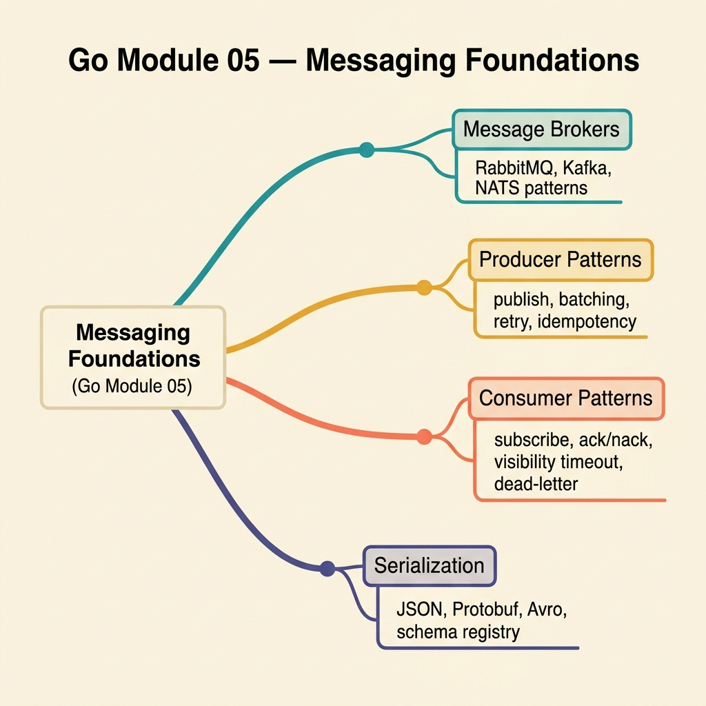

<!-- tags: golang, quiz -->
# 05 — Go Module Quiz: Messaging Foundations

> **Diagnostic Assessment**: Eight questions on message broker patterns — commit ordering, dead-letter queues, retry, and idempotency.

📅 Created: 2026-03-27 · 🔄 Updated: 2026-04-10 · ⏱️ 8 min read.

| Aspect | Detail |
| --- | --- |
| **Level** | Intermediate |
| **Coverage** | Kafka/RabbitMQ consumers, commit ordering, DLQ, retry, idempotency |
| **Format** | 8 multiple-choice questions |

---

## 1. DEFINE

Message brokers feel reliable until a consumer commits an offset before processing succeeds, and the message vanishes forever. This quiz targets commit ordering, consumer rebalancing, dead-letter routing, retry backoff, and idempotency keys.

### Assessment Boundaries

- Commit ordering: process first, commit second.
- Dead-letter queues: routing poison messages, monitoring DLQ depth.
- Retry patterns: exponential backoff with jitter, max retry limits.
- Idempotency keys: deduplicating messages across retries.
- Context propagation: cancellation and timeout in message handlers.

## 2. VISUAL



```text
Messaging Foundation Knowledge Map
├── Consumer Lifecycle
│   ├── Commit Ordering
│   └── Group Rebalancing
├── Error Routing
│   ├── Dead-Letter Queues
│   └── Poison Message Detection
└── Reliability Patterns
    ├── Retry with Backoff
    └── Idempotency Keys
```

## 3. CODE

### Example 1: Basic — Commit-after-process pattern

> **Goal**: Commit the offset only after the handler succeeds.
> **Complexity**: Basic

```go
package messagingquiz

import (
	"context"
	"github.com/segmentio/kafka-go"
)

func HandleAndCommit(ctx context.Context, reader *kafka.Reader, msg kafka.Message, handle func(context.Context, kafka.Message) error) error {
	if err := handle(ctx, msg); err != nil {
		return err
	}
	return reader.CommitMessages(ctx, msg)
}
```

**Why?** If `handle` fails, the offset is not committed. The broker redelivers the message on the next poll.

## 4. PITFALLS

| # | Severity | Defect | Impact | Fix |
| --- | --- | --- | --- | --- |
| 1 | 🔴 Fatal | Committing offset before handler finishes | Message lost if handler crashes | Commit after successful processing |
| 2 | 🟡 Common | No idempotency key | Retries create duplicate side effects | Deduplicate with unique message ID |
| 3 | 🟡 Common | Retry without backoff | Retry storms overwhelm downstream | Use exponential backoff with jitter |

## 5. REF

| Resource | Link | Note |
| --- | --- | --- |
| Kafka Consumer Configs | [https://kafka.apache.org/documentation/#consumerconfigs](https://kafka.apache.org/documentation/#consumerconfigs) | Official consumer reference |
| RabbitMQ Dead Lettering | [https://www.rabbitmq.com/dlx.html](https://www.rabbitmq.com/dlx.html) | DLX configuration and routing |

## 6. RECOMMEND

| Extension | When to proceed | Rationale | File/Link |
| --- | --- | --- | --- |
| Messaging Lane | If you scored < 70% | Re-read source material | [../../messaging/README.md](../../messaging/README.md) |
| Broker DLQ Incidents | After passing | Practice DLQ triage | [../scenario/07-broker-dead-letter-incidents.md](../scenario/07-broker-dead-letter-incidents.md) |

## 7. QUIZ

### Quick Check

1. Why must a consumer commit the offset after processing, not before?
   - A. Committing first improves throughput.
   - B. Committing first means the message is lost if the handler crashes.
   - C. Committing first triggers a rebalance.
   - D. Committing first duplicates the message in the DLQ.

2. What is the purpose of a dead-letter queue?
   - A. To cache frequently accessed messages.
   - B. To isolate messages that repeatedly fail so they do not block the main queue.
   - C. To encrypt messages at rest.
   - D. To replicate messages across broker nodes.

3. Why are idempotency keys critical in message processing?
   - A. They compress payloads.
   - B. They let the handler detect and skip duplicate messages from redelivery.
   - C. They authenticate the producer.
   - D. They set message TTL.

4. What does exponential backoff with jitter solve?
   - A. Reduces payload size per retry.
   - B. Spreads retry attempts over time, preventing thundering herd on downstream services.
   - C. Increases partition count automatically.
   - D. Converts sync calls to async.

5. What happens during a Kafka consumer group rebalance?
   - A. All topic messages are deleted.
   - B. Partitions are redistributed; in-flight messages may be redelivered.
   - C. All producers pause.
   - D. Offsets reset to topic beginning.

6. When should a message go to the DLQ instead of being retried?
   - A. After one retry attempt.
   - B. When the message is a poison message or the retry limit is exhausted.
   - C. When consumer memory exceeds 80%.
   - D. When broker disk is half full.

7. How does `context.Context` apply to message handlers?
   - A. Stores partition and offset.
   - B. Carries deadlines and cancellation for clean shutdown during rebalance.
   - C. Determines consumer group membership.
   - D. Configures broker auth credentials.

8. What is the risk of auto-commit mode in Kafka?
   - A. Increases network latency.
   - B. Commits offsets on a timer regardless of processing, so unfinished messages are lost.
   - C. Disables group coordination.
   - D. Forces synchronous processing.

### Answer Key

1. **B**. Committing tells the broker "done." If the handler crashed, the message will not be redelivered.
2. **B**. A DLQ captures messages that fail after all retries, preventing queue blockage.
3. **B**. At-least-once delivery means duplicates are expected. Idempotency keys let handlers skip duplicates.
4. **B**. Jitter adds randomness to delays, spreading retries and reducing synchronized spikes.
5. **B**. Rebalancing reassigns partitions; in-flight messages may be delivered to a new consumer.
6. **B**. Poison messages (malformed payload) will never succeed. Route to DLQ after max retries.
7. **B**. Context enables graceful shutdown — SIGTERM cancels the parent context, handlers exit cleanly.
8. **B**. Auto-commit fires on a timer. Slow handlers lose messages; crashed handlers cause duplicates.

---
