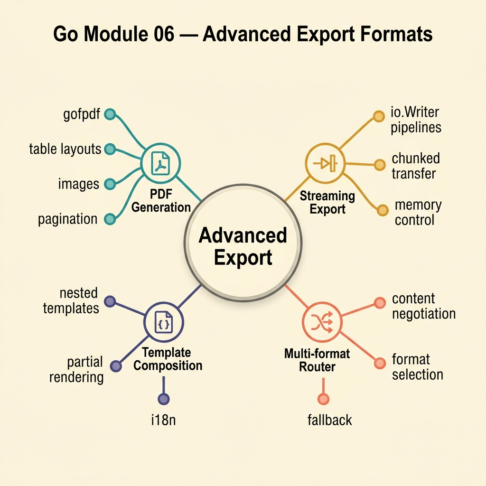

<!-- tags: golang, quiz -->
# 06 — Go Module Quiz: Advanced Export Formats

> **Diagnostic Assessment**: Eight questions on choosing and implementing export formats — CSV vs Excel vs PDF — based on data characteristics and delivery requirements.

📅 Created: 2026-03-27 · 🔄 Updated: 2026-04-10 · ⏱️ 8 min read.

| Aspect | Detail |
| --- | --- |
| **Level** | Intermediate |
| **Coverage** | CSV streaming, Excel multi-sheet styling, PDF layout, format selection logic |
| **Format** | 8 multiple-choice questions |

---

## 1. DEFINE

Every export format has a cost. CSV is cheap in memory but cannot express styling. Excel supports styling and multiple sheets but consumes more memory. PDF provides pixel-perfect layout but requires a rendering engine. Choosing the wrong format wastes resources or delivers a poor user experience.

### Assessment Boundaries

- Format selection criteria: data shape, styling needs, read-only vs editable.
- CSV: streaming writes, delimiter handling, large dataset performance.
- Excel: multi-sheet layout, cell styling, Excelize streaming mode.
- PDF: page layout, table rendering, memory pressure on large reports.

## 2. VISUAL



```text
Export Format Decision Tree
├── Needs page layout? → PDF
├── Needs styling or multiple sheets? → Excel
└── Simple tabular data? → CSV
```

## 3. CODE

### Example 1: Basic — Format selection router

> **Goal**: Choose the export format based on report characteristics.
> **Complexity**: Basic

```go
package exportquiz

type ExportFormat string

const (
	FormatCSV   ExportFormat = "csv"
	FormatExcel ExportFormat = "excel"
	FormatPDF   ExportFormat = "pdf"
)

func ChooseFormat(needsStyling, needsMultipleSheets, readOnlyLayout bool) ExportFormat {
	switch {
	case readOnlyLayout:
		return FormatPDF
	case needsMultipleSheets || needsStyling:
		return FormatExcel
	default:
		return FormatCSV
	}
}
```

**Why?** The `switch` makes the decision tree explicit. PDF wins when layout is fixed, Excel when styling or sheets matter, CSV for everything else.

## 4. PITFALLS

| # | Severity | Defect | Impact | Fix |
| --- | --- | --- | --- | --- |
| 1 | 🔴 Fatal | Using Excel for datasets > 1M rows without streaming mode | OOM — Excelize buffers entire workbook | Enable `StreamWriter` for large datasets |
| 2 | 🟡 Common | Defaulting to PDF for tabular data without layout needs | Slow rendering, high memory, no user editing | Use CSV or Excel unless fixed layout is required |
| 3 | 🟡 Common | Ignoring delimiter conflicts in CSV (commas in data) | Malformed CSV output | Use `encoding/csv` which handles quoting automatically |

## 5. REF

| Resource | Link | Note |
| --- | --- | --- |
| `encoding/csv` | [https://pkg.go.dev/encoding/csv](https://pkg.go.dev/encoding/csv) | Standard library CSV writer |
| Excelize | [https://xuri.me/excelize/en/](https://xuri.me/excelize/en/) | Excel file generation in Go |
| go-pdf | [https://github.com/signintech/gopdf](https://github.com/signintech/gopdf) | PDF generation library |

## 6. RECOMMEND

| Extension | When to proceed | Rationale | File/Link |
| --- | --- | --- | --- |
| Export Lane | If you scored < 70% | Re-read export format docs | [../../export/README.md](../../export/README.md) |
| Export Pipeline Incidents | After passing | Triage export failures | [../scenario/02-export-pipeline-incidents.md](../scenario/02-export-pipeline-incidents.md) |

## 7. QUIZ

### Quick Check

1. When should you choose CSV over Excel?
   - A. When the output needs cell styling and formulas.
   - B. When the data is simple tabular content and the consumer needs maximum compatibility.
   - C. When the report requires multiple sheets.
   - D. When the output must be read-only with fixed page layout.

2. What triggers the need for Excel's streaming write mode?
   - A. When the workbook has more than 3 sheets.
   - B. When the row count is large enough that buffering the full workbook causes OOM.
   - C. When cells need conditional formatting.
   - D. When the file is uploaded to cloud storage.

3. When is PDF the correct export format?
   - A. When the user needs to edit the data in a spreadsheet.
   - B. When the report requires fixed page layout (headers, footers, page breaks) for printing or archiving.
   - C. When the dataset exceeds 100,000 rows.
   - D. When the data needs to be imported into a database.

4. What does `encoding/csv` handle automatically that naive string concatenation does not?
   - A. Compression of the output file.
   - B. Proper quoting of fields that contain commas, newlines, or double quotes.
   - C. Conversion of dates to ISO format.
   - D. Encryption of sensitive fields.

5. What is the memory cost difference between CSV streaming and full Excel generation?
   - A. CSV streaming uses more memory because it reads the full file.
   - B. CSV streaming uses constant memory (one row at a time); full Excel buffers the entire workbook.
   - C. Both use the same amount of memory.
   - D. Excel uses less memory due to binary compression.

6. Why should export format selection be a function, not a hardcoded config?
   - A. To enable runtime A/B testing of formats.
   - B. To make the decision testable, explicit, and adaptable when new formats are added.
   - C. To bypass the file system entirely.
   - D. To reduce the binary size.

7. What happens when Excelize's `StreamWriter` is used with cell styling?
   - A. Styling is ignored completely in streaming mode.
   - B. Basic styling works, but some features (merged cells, charts) are limited or unavailable.
   - C. Styling doubles the memory usage compared to non-streaming mode.
   - D. Styling is applied only to the first sheet.

8. What delivery method should pair with a long-running PDF export?
   - A. Synchronous HTTP response with a 60-second timeout.
   - B. Background job that generates the PDF and provides a signed URL for download when complete.
   - C. WebSocket stream of PDF bytes.
   - D. Email attachment sent inline during the request.

### Answer Key

1. **B**. CSV is the most portable format — every tool reads it. Use it when data is flat and styling is unnecessary.
2. **B**. Excelize's default mode buffers the workbook in memory. For large datasets, `StreamWriter` flushes rows incrementally.
3. **B**. PDF provides fixed layout for print and archival. It is not editable and expensive to render at scale.
4. **B**. `encoding/csv` follows RFC 4180 — it quotes fields containing special characters automatically.
5. **B**. CSV streaming writes one row and moves on. Excel generation typically buffers sheets in memory.
6. **B**. A function makes the decision logic explicit, testable, and easy to extend without changing callers.
7. **B**. StreamWriter supports basic styling but restricts some features that require random access to cells.
8. **B**. Long-running exports should run as background jobs. The user polls for progress and downloads via signed URL.

---
