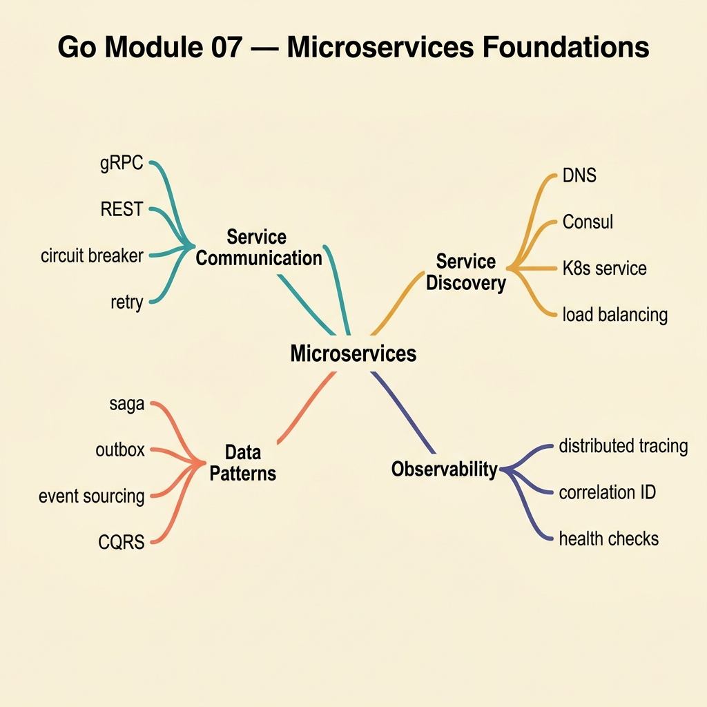

<!-- tags: golang, quiz -->
# 07 — Go Module Quiz: Microservices Foundations

> **Diagnostic Assessment**: Eight questions on microservices communication — gRPC, service discovery, circuit breakers, and saga/outbox — testing whether you can design resilient inter-service calls.

📅 Created: 2026-03-27 · 🔄 Updated: 2026-04-10 · ⏱️ 8 min read.

| Aspect | Detail |
| --- | --- |
| **Level** | Intermediate → Advanced |
| **Coverage** | gRPC, service discovery, circuit breakers, saga pattern, outbox pattern |
| **Format** | 8 multiple-choice questions |

---

## 1. DEFINE

Microservices split complexity across network boundaries. Every inter-service call introduces latency, partial failure, and serialization overhead that monoliths avoid. This quiz targets the patterns that make distributed systems work: gRPC for typed communication, service discovery for routing, circuit breakers for fault isolation, and saga/outbox for distributed transactions.

### Assessment Boundaries

- gRPC: Protobuf contracts, unary vs streaming calls, deadline propagation.
- Service discovery: registry-based vs DNS-based, health checking.
- Circuit breaker: open/half-open/closed states, failure threshold, recovery.
- Saga pattern: choreography vs orchestration, compensating transactions.
- Outbox pattern: transactional outbox for reliable event publishing.

## 2. VISUAL



```text
Microservices Foundation Knowledge Map
├── Communication
│   ├── gRPC + Protobuf
│   └── Deadline Propagation
├── Routing
│   ├── Service Discovery
│   └── Health Checking
└── Resilience
    ├── Circuit Breaker
    └── Saga / Outbox
```

## 3. CODE

### Example 1: Basic — Downstream call with timeout

> **Goal**: Call a downstream service with an explicit timeout using `context.WithTimeout`.
> **Complexity**: Basic

```go
package microquiz

import (
	"context"
	"time"
)

type Client interface {
	Call(ctx context.Context, target string) error
}

func CallWithTimeout(ctx context.Context, client Client, target string) error {
	ctx, cancel := context.WithTimeout(ctx, 2*time.Second)
	defer cancel()
	return client.Call(ctx, target)
}
```

**Why?** Without an explicit timeout, a downstream service hang blocks the caller indefinitely. `context.WithTimeout` caps the wait to 2 seconds.

## 4. PITFALLS

| # | Severity | Defect | Impact | Fix |
| --- | --- | --- | --- | --- |
| 1 | 🔴 Fatal | No timeout on downstream calls | One slow service blocks the entire request chain | Always use `context.WithTimeout` or gRPC deadlines |
| 2 | 🟡 Common | No circuit breaker on unreliable dependencies | Cascading failures when a dependency goes down | Wrap calls with a circuit breaker (e.g., `sony/gobreaker`) |
| 3 | 🟡 Common | Publishing events outside the database transaction | Events publish but the DB write fails, causing inconsistency | Use the outbox pattern: write events to an outbox table in the same transaction |

## 5. REF

| Resource | Link | Note |
| --- | --- | --- |
| gRPC Go | [https://grpc.io/docs/languages/go/](https://grpc.io/docs/languages/go/) | Official gRPC-Go documentation |
| Protobuf | [https://protobuf.dev/](https://protobuf.dev/) | Protocol Buffers language guide |
| Saga Pattern | [https://microservices.io/patterns/data/saga.html](https://microservices.io/patterns/data/saga.html) | Distributed transaction pattern |

## 6. RECOMMEND

| Extension | When to proceed | Rationale | File/Link |
| --- | --- | --- | --- |
| Microservices Lane | If you scored < 70% | Re-read microservices docs | [../../microservices/README.md](../../microservices/README.md) |
| Saga/Outbox Incidents | After passing | Practice saga failure triage | [../scenario/05-saga-outbox-incidents.md](../scenario/05-saga-outbox-incidents.md) |

## 7. QUIZ

### Quick Check

1. What is the primary advantage of gRPC over REST for inter-service communication?
   - A. gRPC uses human-readable JSON payloads.
   - B. gRPC uses Protobuf for typed, binary-serialized contracts with code generation and streaming support.
   - C. gRPC works without any network connection.
   - D. gRPC automatically retries failed calls.

2. Why must every downstream call have an explicit timeout?
   - A. Timeouts improve serialization performance.
   - B. Without a timeout, a hung downstream service blocks the caller indefinitely, consuming resources.
   - C. Timeouts prevent DNS resolution failures.
   - D. Timeouts are required by the HTTP/2 spec.

3. What does a circuit breaker do when its failure threshold is exceeded?
   - A. It retries the call with exponential backoff.
   - B. It opens the circuit — subsequent calls fail immediately without reaching the downstream service.
   - C. It logs the failure and continues normal operation.
   - D. It restarts the downstream service.

4. What is the difference between saga choreography and orchestration?
   - A. Choreography uses a central coordinator; orchestration uses events.
   - B. Choreography uses events between services (decentralized); orchestration uses a central coordinator that drives the steps.
   - C. Choreography is synchronous; orchestration is asynchronous.
   - D. There is no difference — they are synonyms.

5. What problem does the outbox pattern solve?
   - A. It compresses event payloads before publishing.
   - B. It ensures events are published reliably by writing them to an outbox table in the same database transaction as the business data.
   - C. It caches events for faster reads.
   - D. It encrypts events in transit.

6. How does service discovery enable resilient routing?
   - A. It hardcodes service addresses in configuration files.
   - B. It maintains a registry of healthy service instances, allowing clients to route to available targets dynamically.
   - C. It replaces DNS with static IP addresses.
   - D. It eliminates the need for load balancers.

7. What happens in the half-open state of a circuit breaker?
   - A. All calls are blocked permanently.
   - B. A limited number of probe calls are allowed through to test if the downstream service has recovered.
   - C. The circuit breaker resets its failure counter to zero.
   - D. The circuit breaker switches to a different downstream service.

8. What is a compensating transaction in a saga?
   - A. A transaction that runs faster to compensate for slow steps.
   - B. A reverse operation that undoes a previously completed step when a later step fails.
   - C. A transaction that duplicates data for redundancy.
   - D. A transaction that skips validation for speed.

### Answer Key

1. **B**. gRPC uses Protobuf for strongly typed, binary-serialized contracts. Code generation produces client/server stubs. Streaming RPCs handle large payloads efficiently.
2. **B**. Without a timeout, one slow dependency can block the entire request chain, exhausting threads/goroutines and causing cascading failures.
3. **B**. When open, the circuit breaker short-circuits calls — returning an error immediately. This prevents wasting resources on a known-failing service.
4. **B**. Choreography relies on events — each service reacts to events from others. Orchestration uses a central saga coordinator that explicitly calls each step.
5. **B**. The outbox pattern writes events to a database table inside the same transaction as the business write. A separate process reads the outbox and publishes to the broker.
6. **B**. Service discovery tracks healthy instances via health checks. Clients query the registry for available targets instead of using static addresses.
7. **B**. Half-open allows a small number of trial calls. If they succeed, the circuit closes (normal operation resumes). If they fail, it reopens.
8. **B**. A compensating transaction reverses a completed step. For example, if step 3 fails after steps 1 and 2 succeeded, compensating transactions undo steps 2 and 1 in reverse order.

---
