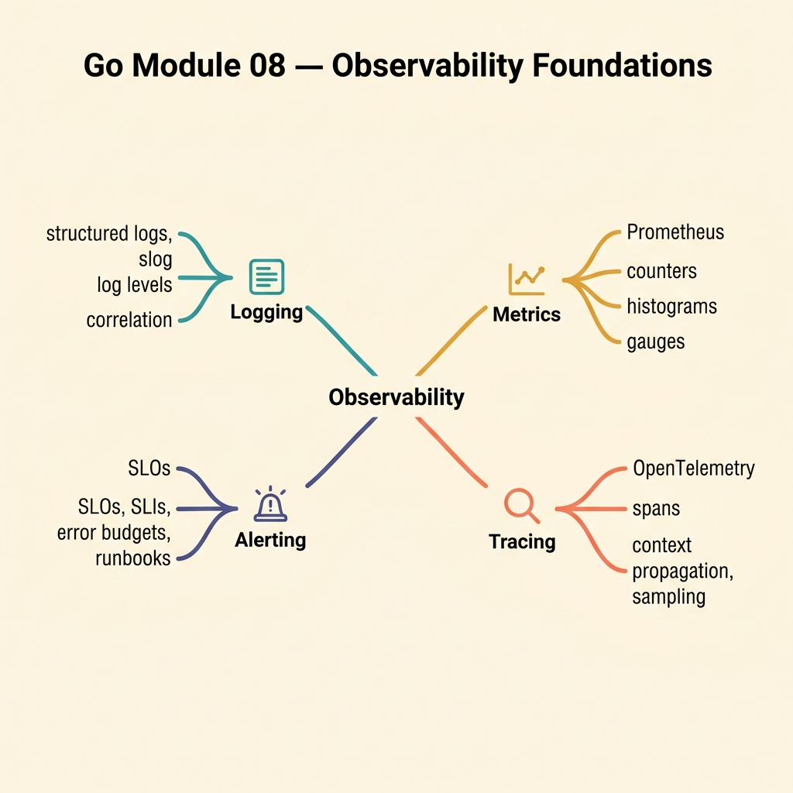

<!-- tags: golang, quiz -->
# 08 — Go Module Quiz: Observability Foundations

> **Diagnostic Assessment**: Eight questions on structured logging, distributed tracing, metrics, and alerting — the tools that tell you what your system is doing when you cannot attach a debugger.

📅 Created: 2026-03-27 · 🔄 Updated: 2026-04-10 · ⏱️ 8 min read.

| Aspect | Detail |
| --- | --- |
| **Level** | Intermediate |
| **Coverage** | Structured logging, distributed tracing, metrics (RED/USE), alerting |
| **Format** | 8 multiple-choice questions |

---

## 1. DEFINE

Observability is the ability to understand a system's internal state from its external outputs. Logs tell you what happened. Traces tell you where it happened across services. Metrics tell you how often and how fast. Without all three, production debugging becomes guesswork.

### Assessment Boundaries

- Structured logging: key-value pairs, log levels, correlation IDs.
- Distributed tracing: spans, trace context propagation, OpenTelemetry.
- Metrics: RED method (Rate, Errors, Duration), USE method (Utilization, Saturation, Errors).
- Alerting: SLI/SLO-based alerts, alert fatigue, burn-rate windows.

## 2. VISUAL



```text
Observability Knowledge Map
├── Logging
│   ├── Structured Key-Value Pairs
│   └── Correlation IDs
├── Tracing
│   ├── Span Hierarchy
│   └── Context Propagation
└── Metrics & Alerting
    ├── RED / USE Methods
    └── SLI / SLO Alerting
```

## 3. CODE

### Example 1: Basic — Duration measurement

> **Goal**: Record how long an operation takes for metric emission.
> **Complexity**: Basic

```go
package observabilityquiz

import "time"

func Measure(start time.Time) time.Duration {
	return time.Since(start)
}
```

**Why?** Call `defer log(Measure(time.Now()))` at the top of any function to emit duration metrics without cluttering the function body.

## 4. PITFALLS

| # | Severity | Defect | Impact | Fix |
| --- | --- | --- | --- | --- |
| 1 | 🔴 Fatal | Using `fmt.Println` instead of structured logging | Logs are unparseable; grep is your only tool | Use `slog` or `zerolog` with key-value pairs |
| 2 | 🟡 Common | High-cardinality metric labels (e.g., user ID) | Metric storage explodes; dashboards fail | Use bounded labels: status code, endpoint, method |
| 3 | 🟡 Common | Alerting on every error instead of SLO burn rate | Alert fatigue; real incidents get ignored | Alert on error budget burn rate over a time window |

## 5. REF

| Resource | Link | Note |
| --- | --- | --- |
| OpenTelemetry Go | [https://opentelemetry.io/docs/languages/go/](https://opentelemetry.io/docs/languages/go/) | Tracing and metrics SDK |
| Google SRE Book | [https://sre.google/sre-book/monitoring-distributed-systems/](https://sre.google/sre-book/monitoring-distributed-systems/) | SLI/SLO monitoring |

## 6. RECOMMEND

| Extension | When to proceed | Rationale | File/Link |
| --- | --- | --- | --- |
| Observability Lane | If you scored < 70% | Re-read source material | [../../observability/README.md](../../observability/README.md) |
| Observability Incidents | After passing | Triage missing traces | [../scenario/12-observability-incidents.md](../scenario/12-observability-incidents.md) |

## 7. QUIZ

### Quick Check

1. What are the three pillars of observability?
   - A. CPU, memory, and disk metrics.
   - B. Logs, traces, and metrics.
   - C. Alerts, dashboards, and runbooks.
   - D. Unit tests, integration tests, and load tests.

2. Why is structured logging preferred over plain-text logs?
   - A. Structured logs are smaller in size.
   - B. Structured logs emit key-value pairs that log aggregation tools can parse, filter, and query.
   - C. Structured logs are encrypted by default.
   - D. Structured logs bypass the file system.

3. What does a trace span represent?
   - A. A single log line emitted by a service.
   - B. A unit of work within a trace — bounded by start time, end time, and metadata.
   - C. A metric data point.
   - D. A database query result.

4. What does the RED method measure?
   - A. Resource utilization, error count, and disk I/O.
   - B. Rate (requests/sec), Errors (failed requests), and Duration (latency distribution).
   - C. Read operations, edit operations, and delete operations.
   - D. Retry count, exception count, and deadlock count.

5. Why are high-cardinality labels dangerous for metrics?
   - A. They slow down the application's main loop.
   - B. They cause the metrics backend to store an explosion of unique time series, increasing cost and query latency.
   - C. They make dashboards more colorful.
   - D. They duplicate log entries.

6. What is an SLO (Service Level Objective)?
   - A. A server configuration file.
   - B. A target for the proportion of valid requests that meet a latency or availability threshold over a time window.
   - C. A deployment strategy.
   - D. A testing framework.

7. What is trace context propagation?
   - A. Sending log files between services.
   - B. Passing trace IDs and span IDs across service boundaries so distributed spans are linked into one trace.
   - C. Copying environment variables between containers.
   - D. Replicating metrics across regions.

8. What problem does `time.Since(start)` solve in Go observability?
   - A. It converts time zones.
   - B. It measures elapsed duration from `start` to now — used for latency metrics and log timing.
   - C. It formats timestamps for log output.
   - D. It schedules future operations.

### Answer Key

1. **B**. Logs, traces, and metrics are the three pillars. Each provides a different view of system behavior.
2. **B**. Key-value pairs enable tools like Elasticsearch, Loki, or Datadog to parse and query logs programmatically.
3. **B**. A span is a named, timed operation within a trace. Parent-child spans form a tree that shows the request path.
4. **B**. RED stands for Rate, Errors, Duration — the three signals that describe request-based systems.
5. **B**. Each unique label combination creates a new time series. Labels like user ID create millions of series, overwhelming storage.
6. **B**. An SLO defines "99.9% of requests complete in < 200ms over 30 days." Alerting triggers when the error budget burns too fast.
7. **B**. Trace context (trace ID, span ID) passes via HTTP headers or gRPC metadata so all spans across services link to one trace.
8. **B**. `time.Since(start)` returns the duration since `start`. Used with `defer`, it measures function execution time for metrics.

---
