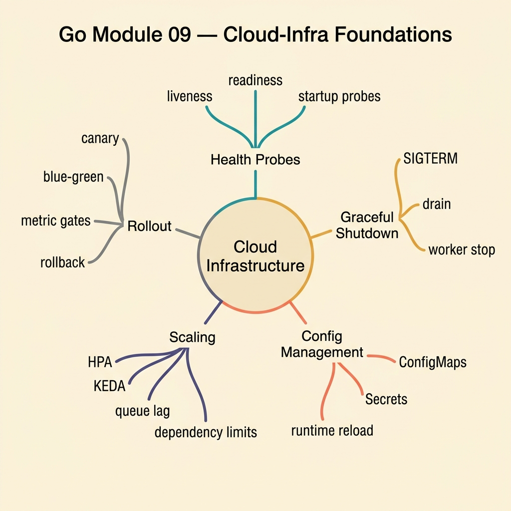

<!-- tags: golang, quiz -->
# 09 — Go Module Quiz: Cloud Infrastructure Foundations

> **Diagnostic Assessment**: Eight questions on containers, orchestration, and infrastructure-as-code — the layer between your Go binary and production traffic.

📅 Created: 2026-03-27 · 🔄 Updated: 2026-04-10 · ⏱️ 8 min read.

| Aspect | Detail |
| --- | --- |
| **Level** | Intermediate |
| **Coverage** | Docker, Kubernetes, Terraform, readiness/liveness probes, resource limits |
| **Format** | 8 multiple-choice questions |

---

## 1. DEFINE

Your Go binary runs on infrastructure. If the Dockerfile copies unnecessary build tools, the image is 10x larger than needed. If Kubernetes has no readiness probe, traffic hits a container that has not finished booting. If Terraform has no state lock, two engineers apply conflicting changes simultaneously.

### Assessment Boundaries

- Docker: multi-stage builds, `scratch`/`distroless` base images, layer caching.
- Kubernetes: Pods, Deployments, Services, readiness/liveness probes, resource requests/limits.
- Terraform: state management, plan/apply workflow, drift detection.
- Helm: chart structure, values override, release management.

## 2. VISUAL



```text
Cloud Infrastructure Knowledge Map
├── Containerization
│   ├── Multi-Stage Docker Builds
│   └── Minimal Base Images
├── Orchestration
│   ├── Readiness / Liveness Probes
│   └── Resource Requests / Limits
└── Infrastructure as Code
    ├── Terraform State
    └── Helm Charts
```

## 3. CODE

### Example 1: Basic — Readiness check logic

> **Goal**: Determine if a service should receive traffic.
> **Complexity**: Basic

```go
package cloudinfraquiz

func IsReady(bootOK bool, draining bool) bool {
	return bootOK && !draining
}
```

**Why?** A readiness probe returns `true` only when boot is complete and the service is not draining. Kubernetes routes traffic away when readiness fails.

## 4. PITFALLS

| # | Severity | Defect | Impact | Fix |
| --- | --- | --- | --- | --- |
| 1 | 🔴 Fatal | No readiness probe configured | Traffic hits containers before they finish booting | Add an HTTP readiness endpoint |
| 2 | 🟡 Common | Using `:latest` tag in production deployments | Non-deterministic — different nodes pull different images | Pin image tags to Git SHA or semantic version |
| 3 | 🟡 Common | No resource limits on Kubernetes pods | One pod consumes all node resources, starving neighbors | Set CPU and memory requests/limits |

## 5. REF

| Resource | Link | Note |
| --- | --- | --- |
| Kubernetes Probes | [https://kubernetes.io/docs/tasks/configure-pod-container/configure-liveness-readiness-startup-probes/](https://kubernetes.io/docs/tasks/configure-pod-container/configure-liveness-readiness-startup-probes/) | Probe types and config |
| Terraform Docs | [https://developer.hashicorp.com/terraform/docs](https://developer.hashicorp.com/terraform/docs) | State, plan, apply |

## 6. RECOMMEND

| Extension | When to proceed | Rationale | File/Link |
| --- | --- | --- | --- |
| Infrastructure Lane | If you scored < 70% | Re-read infra docs | [../../deployment/README.md](../../deployment/README.md) |
| Cloud Infra Incidents | After passing | Triage OOM and node pressure | [../scenario/13-cloud-infra-incidents.md](../scenario/13-cloud-infra-incidents.md) |

## 7. QUIZ

### Quick Check

1. Why should production Docker images use multi-stage builds?
   - A. Multi-stage builds make containers run faster.
   - B. They separate the build environment from the runtime image, producing a minimal final image without build tools.
   - C. They enable hot-reloading in production.
   - D. They automatically scale container instances.

2. What does a Kubernetes readiness probe determine?
   - A. Whether the container should be restarted.
   - B. Whether the container is ready to receive traffic — failing readiness removes it from the Service load balancer.
   - C. Whether the container has enough CPU.
   - D. Whether the container's logs should be forwarded.

3. What is the difference between a liveness probe and a readiness probe?
   - A. There is no difference.
   - B. Liveness checks if the container is alive (restart on failure); readiness checks if it can handle traffic (remove from LB on failure).
   - C. Liveness runs once; readiness runs continuously.
   - D. Liveness checks memory; readiness checks CPU.

4. What happens when a Kubernetes pod has no resource limits?
   - A. Kubernetes assigns default limits automatically.
   - B. The pod can consume unlimited node resources, starving other pods on the same node.
   - C. The pod is immediately evicted.
   - D. The pod runs in privileged mode.

5. Why should you avoid using the `:latest` tag in production deployments?
   - A. `:latest` images are always larger.
   - B. `:latest` is non-deterministic — different nodes may pull different image versions, causing inconsistent behavior.
   - C. `:latest` disables caching.
   - D. `:latest` images cannot be scanned for vulnerabilities.

6. What does Terraform state track?
   - A. Application source code changes.
   - B. The mapping between Terraform resources and their real-world infrastructure counterparts.
   - C. Kubernetes pod logs.
   - D. Docker image layer hashes.

7. What is Terraform drift?
   - A. A slow network connection to the Terraform backend.
   - B. A divergence between the infrastructure's actual state and what Terraform state records.
   - C. A Terraform plugin version mismatch.
   - D. A configuration syntax error.

8. What does a Helm values file override?
   - A. The Kubernetes API server configuration.
   - B. Default template values in a Helm chart — environment-specific settings like image tags, replicas, and resource limits.
   - C. The Docker build context.
   - D. The Terraform state file.

### Answer Key

1. **B**. Multi-stage builds compile in a large image (with Go toolchain) and copy only the binary to a minimal base. The final image is often < 20 MB.
2. **B**. Readiness probes gate traffic routing. A failing probe removes the pod from the Service endpoints — no traffic reaches it.
3. **B**. Liveness restarts a stuck container. Readiness removes a container from the load balancer. Different failure modes, different responses.
4. **B**. Without limits, a misbehaving pod (memory leak, CPU spin) consumes all node resources, causing eviction of other pods.
5. **B**. `:latest` is a mutable tag. Two pulls at different times may get different images. Pin to an immutable tag for reproducibility.
6. **B**. Terraform state maps resource blocks (e.g., `aws_instance.web`) to real infrastructure IDs. Without state, Terraform cannot plan updates.
7. **B**. Drift occurs when someone manually changes infrastructure outside Terraform. `terraform plan` detects drift by comparing state to reality.
8. **B**. Values files override chart defaults for specific environments: staging uses 1 replica, production uses 3.

---
