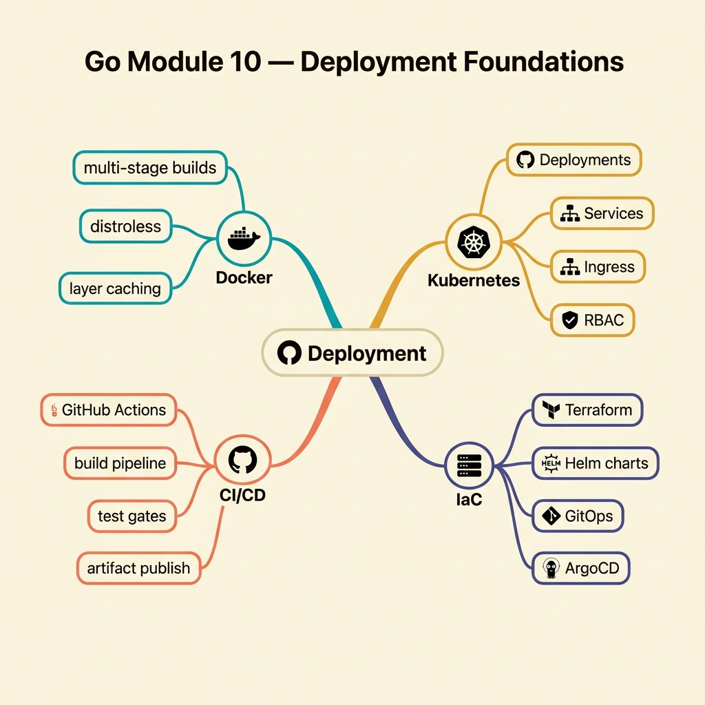

<!-- tags: golang, quiz -->
# 10 — Go Module Quiz: Deployment Foundations

> **Diagnostic Assessment**: Eight questions on deployment strategies, CI/CD pipelines, and release management for Go services.

📅 Created: 2026-03-27 · 🔄 Updated: 2026-04-10 · ⏱️ 8 min read.

| Aspect | Detail |
| --- | --- |
| **Level** | Intermediate |
| **Coverage** | Rolling updates, blue-green, canary, CI/CD, release tagging |
| **Format** | 8 multiple-choice questions |

---

## 1. DEFINE

Deploying a Go binary to production involves more than `go build && scp`. Rolling updates must drain connections. Blue-green deployments must switch traffic atomically. Canary releases must limit blast radius. This quiz tests deployment strategy selection and release management.

### Assessment Boundaries

- Rolling update: pod-by-pod replacement, readiness gates, connection draining.
- Blue-green: parallel environments, atomic traffic switch, instant rollback.
- Canary: gradual traffic shift, metric monitoring, automated rollback.
- CI/CD: build → test → deploy pipeline, artifact versioning.
- Release tagging: Git SHA, semantic versioning, build metadata injection.

## 2. VISUAL



```text
Deployment Knowledge Map
├── Strategies
│   ├── Rolling Update
│   ├── Blue-Green
│   └── Canary
├── CI/CD Pipeline
│   ├── Build → Test → Deploy
│   └── Artifact Versioning
└── Release Management
    ├── Semantic Versioning
    └── Build Metadata (Git SHA)
```

## 3. CODE

### Example 1: Basic — Release identifier

> **Goal**: Build a release identifier from version and commit hash.
> **Complexity**: Basic

```go
package deploymentquiz

func ReleaseID(version string, commit string) string {
	if version == "" {
		version = "dev"
	}
	if commit == "" {
		commit = "local"
	}
	return version + "@" + commit
}
```

**Why?** Injecting `version` and `commit` via `-ldflags` at build time lets runtime logs and health endpoints report exactly which code is running.

## 4. PITFALLS

| # | Severity | Defect | Impact | Fix |
| --- | --- | --- | --- | --- |
| 1 | 🔴 Fatal | No readiness gate on rolling update | Traffic hits pods before boot completes | Configure readiness probe + `minReadySeconds` |
| 2 | 🟡 Common | No rollback plan for failed deployment | Broken release stays live while team scrambles | Automate rollback on health check failure |
| 3 | 🟡 Common | Deploying without build metadata | Cannot identify which commit is running in production | Inject Git SHA via `-ldflags` at build time |

## 5. REF

| Resource | Link | Note |
| --- | --- | --- |
| K8s Rolling Updates | [https://kubernetes.io/docs/concepts/workloads/controllers/deployment/](https://kubernetes.io/docs/concepts/workloads/controllers/deployment/) | Strategy config |
| Semantic Versioning | [https://semver.org/](https://semver.org/) | Version numbering standard |

## 6. RECOMMEND

| Extension | When to proceed | Rationale | File/Link |
| --- | --- | --- | --- |
| Deployment Lane | If you scored < 70% | Re-read deployment docs | [../../deployment/README.md](../../deployment/README.md) |
| Deployment Incidents | After passing | Triage rolling update failures | [../scenario/14-deployment-runtime-incidents.md](../scenario/14-deployment-runtime-incidents.md) |

## 7. QUIZ

### Quick Check

1. What is the primary advantage of a rolling update over a recreate deployment?
   - A. Rolling updates use less disk space.
   - B. Rolling updates replace pods incrementally, maintaining availability during deployment.
   - C. Rolling updates skip the build step.
   - D. Rolling updates disable health checks.

2. What makes blue-green deployment enable instant rollback?
   - A. It caches the old binary in memory.
   - B. Both old and new environments run simultaneously — switching traffic back is a single routing change.
   - C. It stores deployment logs in a separate database.
   - D. It uses a faster network protocol.

3. What is the purpose of a canary deployment?
   - A. To deploy to all servers simultaneously.
   - B. To route a small percentage of traffic to the new version, monitoring for errors before full rollout.
   - C. To skip integration tests.
   - D. To deploy only to development environments.

4. Why should build artifacts include the Git commit SHA?
   - A. To reduce the binary size.
   - B. To identify exactly which code is running in production for debugging and audit.
   - C. To encrypt the binary.
   - D. To enable hot-reloading.

5. What does `minReadySeconds` control in a Kubernetes Deployment?
   - A. The minimum number of replicas.
   - B. The minimum time a new pod must pass readiness checks before it is considered available.
   - C. The minimum CPU allocation.
   - D. The minimum log retention period.

6. What should a CI/CD pipeline do when a test stage fails?
   - A. Deploy anyway and fix later.
   - B. Halt the pipeline and prevent the artifact from reaching production.
   - C. Skip the test and move to the next stage.
   - D. Retry the test indefinitely.

7. What is connection draining during a rolling update?
   - A. Closing all database connections immediately.
   - B. Allowing in-flight requests to complete before shutting down the old pod.
   - C. Redirecting all traffic to a single pod.
   - D. Compressing network packets.

8. What does semantic versioning communicate about `v2.0.0` vs `v1.3.0`?
   - A. `v2.0.0` is twice as fast.
   - B. `v2.0.0` contains a breaking API change; `v1.3.0` adds features without breaking compatibility.
   - C. `v2.0.0` has fewer bugs.
   - D. `v2.0.0` uses a different programming language.

### Answer Key

1. **B**. Rolling updates replace pods one at a time. At least some pods serve traffic throughout the deployment.
2. **B**. Blue-green maintains two identical environments. Traffic switches via load balancer. Rollback is flipping the switch back.
3. **B**. Canary sends a small traffic slice (e.g., 5%) to the new version. If error rates spike, rollback affects only that slice.
4. **B**. The commit SHA links the running binary to the exact source code. Essential for post-incident debugging.
5. **B**. `minReadySeconds` prevents Kubernetes from killing old pods too soon — the new pod must stay healthy for N seconds first.
6. **B**. A failing test stage should block deployment. Deploying untested code is the #1 cause of preventable production incidents.
7. **B**. Connection draining waits for in-flight requests to finish before the pod shuts down, preventing dropped connections.
8. **B**. Semantic versioning: MAJOR = breaking changes, MINOR = backward-compatible features, PATCH = bug fixes.

---
