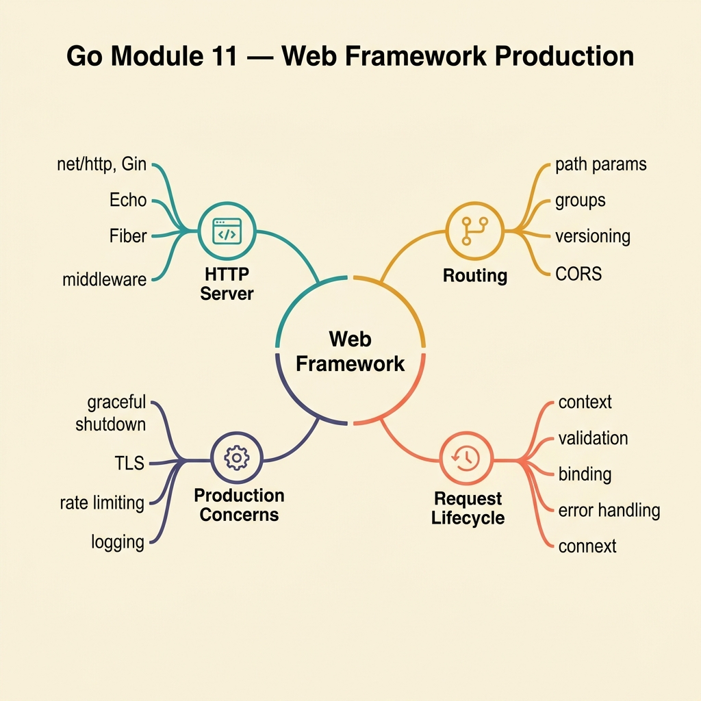

<!-- tags: golang, quiz -->
# 11 — Go Module Quiz: Web Framework Production

> **Diagnostic Assessment**: Eight questions on Gin/Echo middleware ordering, request binding, panic recovery, rate limiting, and WebSocket decision-making.

📅 Created: 2026-03-27 · 🔄 Updated: 2026-04-10 · ⏱️ 8 min read.

| Aspect | Detail |
| --- | --- |
| **Level** | Intermediate |
| **Coverage** | Middleware, request binding, validation, panic recovery, rate limiting, WebSocket |
| **Format** | 8 multiple-choice questions |

---

## 1. DEFINE

Web frameworks abstract HTTP plumbing, but the abstraction leaks when middleware runs in the wrong order, binding silently drops unknown fields, or a panic crashes the entire server instead of just one request.

### Assessment Boundaries

- Middleware ordering: auth before handler, logging wraps everything, recovery at the top.
- Request binding and validation: struct tags, `ShouldBind` vs `MustBind`.
- Panic recovery: middleware that converts panics to 500 responses.
- Rate limiting: token bucket, sliding window, per-client vs global.
- WebSocket: when bidirectional communication is required vs SSE.

## 2. VISUAL



```text
Web Framework Knowledge Map
├── Middleware Pipeline
│   ├── Ordering (recovery → logging → auth → handler)
│   └── Error Propagation
├── Request Handling
│   ├── Binding & Validation
│   └── Response Formatting
└── Advanced Patterns
    ├── Rate Limiting
    └── WebSocket vs SSE
```

## 3. CODE

### Example 1: Basic — WebSocket decision

> **Goal**: Determine if a feature needs bidirectional transport.
> **Complexity**: Basic

```go
package webframeworkquiz

func NeedWebSocket(bidirectional bool) bool {
	return bidirectional
}
```

**Why?** SSE (Server-Sent Events) handles server→client push. WebSocket is needed only when the client also pushes data back to the server.

## 4. PITFALLS

| # | Severity | Defect | Impact | Fix |
| --- | --- | --- | --- | --- |
| 1 | 🔴 Fatal | No panic recovery middleware | One panic crashes the entire server process | Add recovery middleware at the top of the stack |
| 2 | 🟡 Common | Auth middleware placed after the handler | Request processes without authentication | Place auth middleware before route handlers |
| 3 | 🟡 Common | Using `MustBind` (aborts on error) instead of `ShouldBind` | Invalid requests return an unhelpful 400 with no error details | Use `ShouldBind` and return custom error responses |

## 5. REF

| Resource | Link | Note |
| --- | --- | --- |
| Gin Framework | [https://gin-gonic.com/docs/](https://gin-gonic.com/docs/) | Middleware, binding, routing |
| Echo Framework | [https://echo.labstack.com/docs](https://echo.labstack.com/docs) | Alternative Go web framework |

## 6. RECOMMEND

| Extension | When to proceed | Rationale | File/Link |
| --- | --- | --- | --- |
| Web Framework Lane | If you scored < 70% | Re-read web framework docs | [../../web-framework/README.md](../../web-framework/README.md) |
| Web Framework Incidents | After passing | Triage middleware ordering bugs | [../scenario/03-web-framework-incidents.md](../scenario/03-web-framework-incidents.md) |

## 7. QUIZ

### Quick Check

1. What is the correct middleware ordering in a Go web framework?
   - A. Handler → Auth → Logging → Recovery.
   - B. Recovery → Logging → Auth → Handler (outermost to innermost).
   - C. Auth → Handler → Recovery → Logging.
   - D. Logging → Handler → Auth → Recovery.

2. What does panic recovery middleware do?
   - A. It retries failed requests automatically.
   - B. It catches panics, converts them to 500 responses, and prevents the server from crashing.
   - C. It validates request bodies.
   - D. It compresses response payloads.

3. When should you choose WebSocket over Server-Sent Events (SSE)?
   - A. When only the server sends updates to the client.
   - B. When the client and server both need to send messages — bidirectional communication.
   - C. When the server sends large files.
   - D. When the client uses HTTP/1.0.

4. What is the difference between `ShouldBind` and `MustBind` in Gin?
   - A. `ShouldBind` is slower.
   - B. `ShouldBind` returns an error for the handler to process; `MustBind` aborts the request with a 400 automatically.
   - C. `MustBind` supports JSON only.
   - D. `ShouldBind` skips validation.

5. Why is rate limiting per-client rather than global more effective?
   - A. Per-client limits are easier to implement.
   - B. Per-client limits prevent one abusive client from exhausting the rate limit for all users.
   - C. Per-client limits reduce server memory.
   - D. Per-client limits disable logging.

6. What happens if auth middleware runs after the handler?
   - A. The request is authenticated twice.
   - B. The handler processes the request without authentication — a security vulnerability.
   - C. The response is encrypted.
   - D. The request is logged twice.

7. What HTTP status code should a rate limiter return?
   - A. 200 OK.
   - B. 429 Too Many Requests — with a `Retry-After` header.
   - C. 500 Internal Server Error.
   - D. 302 Found.

8. What struct tag validates that a field is required and within a length range?
   - A. `json:"name" validate:"required,min=1,max=100"`.
   - B. `json:"name" bind:"optional"`.
   - C. `json:"name" format:"string"`.
   - D. `json:"name" type:"varchar"`.

### Answer Key

1. **B**. Recovery is outermost (catches panics from everything inside). Logging wraps auth and handler. Auth gates the handler.
2. **B**. Recovery middleware wraps the handler in a `recover()` call, catching panics and returning 500 instead of crashing the process.
3. **B**. SSE is unidirectional (server → client). WebSocket enables full-duplex communication. Use WebSocket only when the client sends data back.
4. **B**. `ShouldBind` lets you control the error response. `MustBind` aborts with a generic 400, giving the client no useful information.
5. **B**. Global limits let one client exhaust the budget for everyone. Per-client limits (by IP, API key) isolate abuse.
6. **B**. Middleware runs in order. If auth is after the handler, the handler has already processed the unauthenticated request.
7. **B**. RFC 6585 defines 429 for rate limiting. The `Retry-After` header tells the client when to retry.
8. **A**. The `validate` tag uses validator library syntax. `required` ensures the field is present; `min`/`max` bound the length.

---
