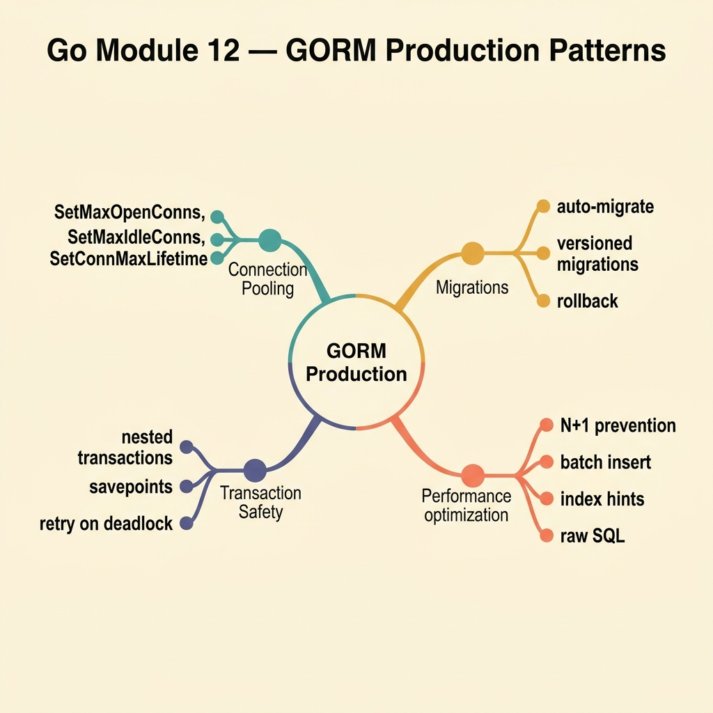

<!-- tags: golang, quiz -->
# 12 — Go Module Quiz: GORM Production Patterns

> **Diagnostic Assessment**: Eight questions on GORM patterns that matter in production — read replicas, connection exhaustion, N+1 detection, and query scoping.

📅 Created: 2026-03-27 · 🔄 Updated: 2026-04-10 · ⏱️ 8 min read.

| Aspect | Detail |
| --- | --- |
| **Level** | Advanced |
| **Coverage** | Read replicas, connection pool tuning, N+1 queries, query scoping, soft delete in production |
| **Format** | 8 multiple-choice questions |

---

## 1. DEFINE

Module 04 covered GORM basics. This quiz tests the production patterns that only matter under load: routing reads to replicas, detecting N+1 queries before they saturate the connection pool, and scoping queries to prevent accidental data exposure.

### Assessment Boundaries

- Read replica routing: primary for writes, replica for reads, read-after-write consistency.
- Connection pool exhaustion: symptoms, monitoring, pool size tuning.
- N+1 query detection: query logging, profiling, `Preload` vs `Joins`.
- Query scoping: reusable `Scopes` for multi-tenant filtering.
- Soft delete in production: unscoped audits, cascading soft deletes.

## 2. VISUAL



```text
GORM Production Knowledge Map
├── Read Strategy
│   ├── Primary vs Replica Routing
│   └── Read-After-Write Consistency
├── Connection Health
│   ├── Pool Exhaustion Detection
│   └── Pool Size Tuning
└── Query Safety
    ├── N+1 Detection
    └── Scoped Queries
```

## 3. CODE

### Example 1: Basic — Read-after-write routing

> **Goal**: Route reads to primary when the caller just performed a write.
> **Complexity**: Basic

```go
package gormquiz

type Consistency string

const (
	Replica Consistency = "replica"
	Primary Consistency = "primary"
)

func NeedsPrimaryRead(afterWrite bool) Consistency {
	if afterWrite {
		return Primary
	}
	return Replica
}
```

**Why?** Replicas have replication lag. Reading from a replica immediately after a write may return stale data. Route to primary when freshness matters.

## 4. PITFALLS

| # | Severity | Defect | Impact | Fix |
| --- | --- | --- | --- | --- |
| 1 | 🔴 Fatal | Connection pool too small for traffic | Request queue grows; timeouts cascade | Monitor active connections; tune `MaxOpenConns` |
| 2 | 🟡 Common | Reading from replica after write | User sees stale data (own changes missing) | Route to primary for read-after-write |
| 3 | 🟡 Common | No query logging in staging | N+1 queries go undetected until production | Enable GORM's logger at Info level in staging |

## 5. REF

| Resource | Link | Note |
| --- | --- | --- |
| GORM DBResolver | [https://gorm.io/docs/dbresolver.html](https://gorm.io/docs/dbresolver.html) | Multi-DB and read/write splitting |
| GORM Logger | [https://gorm.io/docs/logger.html](https://gorm.io/docs/logger.html) | Query logging for N+1 detection |

## 6. RECOMMEND

| Extension | When to proceed | Rationale | File/Link |
| --- | --- | --- | --- |
| GORM Lane | If you scored < 70% | Re-read GORM docs | [../../gorm/README.md](../../gorm/README.md) |
| GORM Production Incidents | After passing | Triage N+1 and pool exhaustion | [../scenario/16-gorm-production-incidents.md](../scenario/16-gorm-production-incidents.md) |

## 7. QUIZ

### Quick Check

1. When should a read be routed to the primary database instead of a replica?
   - A. When the query uses an aggregate function.
   - B. When the caller just performed a write and needs to see fresh data immediately.
   - C. When the query returns more than 100 rows.
   - D. When the replica has more CPU available.

2. What are the symptoms of connection pool exhaustion?
   - A. Queries return incorrect results.
   - B. New queries block or timeout waiting for an available connection, while existing queries complete normally.
   - C. The database server crashes.
   - D. Log files stop writing.

3. How do you detect N+1 queries in a GORM application?
   - A. By checking the binary size.
   - B. By enabling GORM's query logger and looking for repeated SELECT statements with different WHERE values.
   - C. By monitoring CPU usage.
   - D. By running `go vet`.

4. What is a GORM `Scope` and why use it?
   - A. A Scope limits the number of rows returned.
   - B. A Scope is a reusable query modifier (e.g., `WHERE tenant_id = ?`) that can be chained onto any query.
   - C. A Scope disables logging.
   - D. A Scope creates a database index.

5. What does `SetConnMaxLifetime` prevent?
   - A. Queries from running longer than a time limit.
   - B. Connections from being held open indefinitely — stale connections are recycled after the lifetime expires.
   - C. New connections from being created.
   - D. Transactions from exceeding a size limit.

6. How does `Unscoped()` change a GORM query?
   - A. It removes all WHERE clauses.
   - B. It removes the default soft-delete filter (`WHERE deleted_at IS NULL`), returning all records including deleted ones.
   - C. It bypasses authentication.
   - D. It disables foreign key checks.

7. What is the risk of not setting `SetMaxIdleConns`?
   - A. The application cannot connect to the database.
   - B. Too many idle connections waste memory and file descriptors; too few cause frequent reconnection overhead.
   - C. Queries return duplicate rows.
   - D. Transactions auto-commit.

8. How do you fix an N+1 query pattern in GORM?
   - A. Add more replicas.
   - B. Replace individual `SELECT` calls with `Preload` (batch query) or `Joins` (single SQL JOIN) to load associations efficiently.
   - C. Increase `MaxOpenConns`.
   - D. Disable query caching.

### Answer Key

1. **B**. Replicas have replication lag. Reading right after a write may miss the new data. Route to primary for consistency.
2. **B**. Pool exhaustion means all connections are in use. New queries wait in a queue. Timeouts cascade through the application.
3. **B**. N+1 manifests as repeated identical queries with different parameter values. GORM's logger shows each SQL statement.
4. **B**. Scopes encapsulate query logic (e.g., tenant filtering) that applies to multiple queries. They keep code DRY and consistent.
5. **B**. Database servers and load balancers may close idle connections. `ConnMaxLifetime` ensures the pool recycles connections before they go stale.
6. **B**. GORM's soft-delete default scope filters out records where `deleted_at IS NOT NULL`. `Unscoped()` removes this filter.
7. **B**. Idle connections stay open for reuse but consume resources. The setting balances reuse benefit against resource cost.
8. **B**. `Preload` batches association loading into a single query per association level. `Joins` merges them into one SQL JOIN.

---
