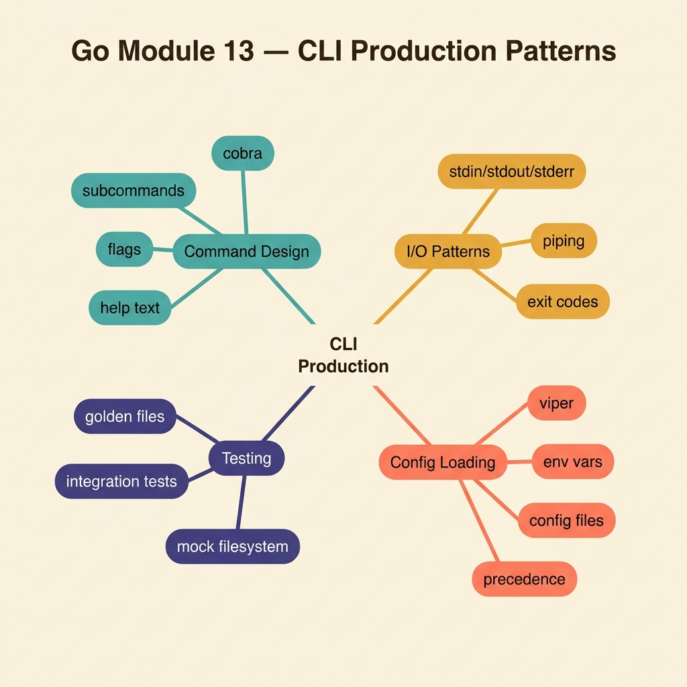

<!-- tags: golang, quiz -->
# 13 — Go Module Quiz: CLI Production Patterns

> **Diagnostic Assessment**: Eight questions on Go CLI design — flag parsing, signal handling, graceful shutdown, and configuration precedence.

📅 Created: 2026-03-27 · 🔄 Updated: 2026-04-10 · ⏱️ 8 min read.

| Aspect | Detail |
| --- | --- |
| **Level** | Intermediate |
| **Coverage** | Flag parsing, signal handling, graceful shutdown, config precedence, exit codes |
| **Format** | 8 multiple-choice questions |

---

## 1. DEFINE

CLI tools are the glue between humans and systems. A badly designed CLI swallows errors, ignores SIGTERM, or makes the user guess which flag overrides which environment variable.

### Assessment Boundaries

- Flag parsing: `flag` package, `cobra`/`pflag`, positional vs named args.
- Signal handling: `os.Signal`, `signal.NotifyContext`, graceful shutdown.
- Config precedence: flag > env > config file > default.
- Exit codes: 0 = success, 1 = general error, 2 = usage error.
- Structured output: JSON output mode for machine consumption.

## 2. VISUAL



```text
CLI Production Knowledge Map
├── Input
│   ├── Flag Parsing
│   └── Config Precedence
├── Lifecycle
│   ├── Signal Handling (SIGTERM/SIGINT)
│   └── Graceful Shutdown
└── Output
    ├── Exit Codes
    └── Structured Output (JSON)
```

## 3. CODE

### Example 1: Basic — Flag override decision

> **Goal**: Determine whether a CLI config value should come from an explicit flag.
> **Complexity**: Basic

```go
package cliquiz

func PreferFlag(override bool) bool {
	return override
}
```

**Why?** When a flag is explicitly set, it takes precedence over environment variables and config files.

## 4. PITFALLS

| # | Severity | Defect | Impact | Fix |
| --- | --- | --- | --- | --- |
| 1 | 🔴 Fatal | Ignoring SIGTERM in a long-running CLI | Process is force-killed; cleanup (temp files, locks) is skipped | Use `signal.NotifyContext` for clean shutdown |
| 2 | 🟡 Common | Exiting with code 0 on failure | Scripts and CI treat the run as successful | Return non-zero exit codes on error |
| 3 | 🟡 Common | Mixing human-readable and machine-readable output | Parsing breaks when log messages appear in stdout | Use `--output=json` for machines; stderr for logs |

## 5. REF

| Resource | Link | Note |
| --- | --- | --- |
| Go flag package | [https://pkg.go.dev/flag](https://pkg.go.dev/flag) | Standard library flag parsing |
| Cobra CLI | [https://cobra.dev/](https://cobra.dev/) | Popular CLI framework for Go |

## 6. RECOMMEND

| Extension | When to proceed | Rationale | File/Link |
| --- | --- | --- | --- |
| CLI Lane | If you scored < 70% | Re-read CLI docs | [../../cli/README.md](../../cli/README.md) |
| CLI Ops Incidents | After passing | Triage signal handling bugs | [../scenario/17-cli-ops-incidents.md](../scenario/17-cli-ops-incidents.md) |

## 7. QUIZ

### Quick Check

1. What is the correct config precedence in a well-designed CLI?
   - A. Config file > env > flag > default.
   - B. Flag > environment variable > config file > default value.
   - C. Default > flag > env > config file.
   - D. Environment variable > flag > default > config file.

2. Why must a CLI handle SIGTERM?
   - A. SIGTERM improves performance.
   - B. SIGTERM is the standard signal for graceful shutdown — ignoring it leads to force-kill after a timeout.
   - C. SIGTERM deletes temporary files automatically.
   - D. SIGTERM is only sent in development mode.

3. What exit code should a CLI return on success?
   - A. 1.
   - B. 0.
   - C. -1.
   - D. 255.

4. Why should structured output (JSON) go to stdout and logs to stderr?
   - A. It makes the output colorful.
   - B. It allows piping structured data to other tools without log messages corrupting the stream.
   - C. It reduces the file size.
   - D. It enables encryption.

5. What Go function enables context-aware signal handling?
   - A. `os.Exit()`.
   - B. `signal.NotifyContext()` — returns a context that cancels when the signal is received.
   - C. `fmt.Println()`.
   - D. `runtime.Goexit()`.

6. What is the difference between positional arguments and flags?
   - A. There is no difference.
   - B. Positional arguments are identified by position (e.g., `cp src dest`); flags are named (e.g., `--verbose`).
   - C. Positional arguments are always optional.
   - D. Flags cannot have values.

7. What should a CLI do when it receives an unknown flag?
   - A. Ignore it silently.
   - B. Print a usage message and exit with code 2 (usage error).
   - C. Use the flag as a positional argument.
   - D. Retry with the flag removed.

8. How do you make a CLI idempotent?
   - A. By disabling all flags.
   - B. By ensuring that running the same command twice produces the same result — check state before modifying it.
   - C. By logging every operation.
   - D. By requiring user confirmation.

### Answer Key

1. **B**. Flag > env > config > default. The most explicit input wins. Users set flags intentionally; defaults are fallbacks.
2. **B**. Kubernetes and systemd send SIGTERM before force-killing. The CLI should release resources (temp files, locks, connections) in the handler.
3. **B**. Exit code 0 signals success. Non-zero signals failure. CI/CD pipelines and shell scripts depend on this convention.
4. **B**. `stdout` is the data channel. `stderr` is the diagnostic channel. Piping (`|`) and redirection (`>`) rely on this separation.
5. **B**. `signal.NotifyContext` returns a `context.Context` that cancels on SIGTERM/SIGINT, enabling idiomatic shutdown.
6. **B**. Positional args depend on order. Flags are named and can appear in any order.
7. **B**. Unknown flags indicate a user mistake. Exit code 2 is the convention for usage errors.
8. **B**. Idempotent CLIs check current state (e.g., "does the file already exist?") before acting, avoiding duplicate operations.

---
